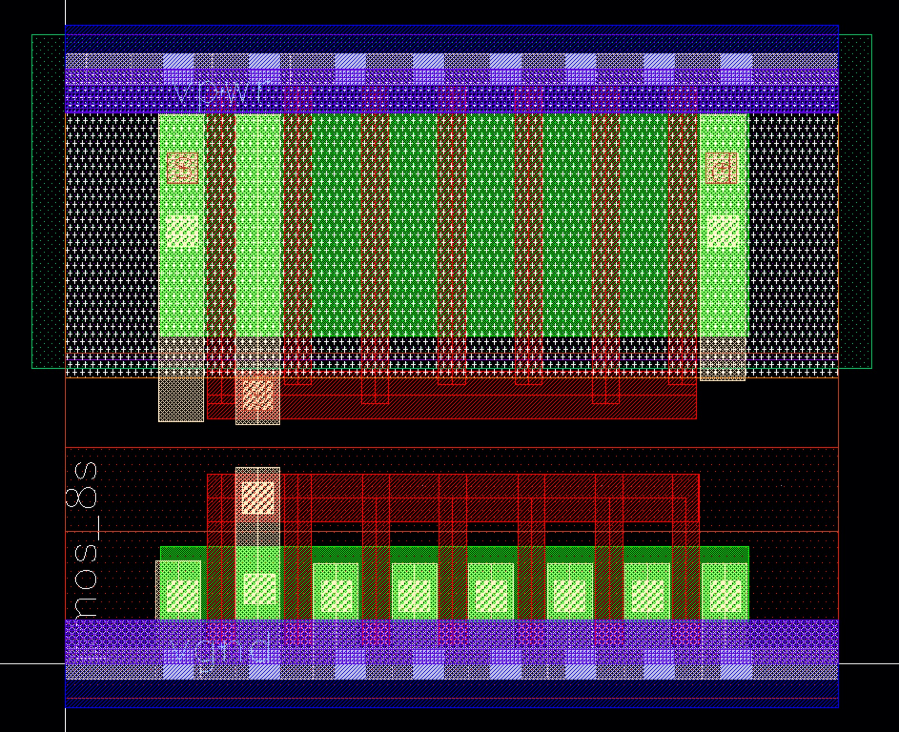

# Some kinda intro to the whole problem

* This is about integrated circuits
* Particularly the analog parts
* The whole conceptual layer-cake on which they get designed

Integrated circuits are "integrated" in the sense that more than one - and often in current practice, more than ten orders of magnitude more than one - circuit component is integrated in a single silicon die. 

The most detailed representation of these circuits, and the sole representation sufficiently detailed for fabrication, is commonly called _layout_. IC layout is a chip's physical blueprint. The nature of silicon manufacturing allows for representing these blueprints in "2.5D" terms. Each silicon wafer is extremely uniform in one of its three axes. This axis extends into and out of the plane of the die surface, and is commonly referred to as the z-axis. This z-axis is typically split into a discrete number of _layers_. These layers refer to a variety of physical features, such as metal connections, insulators there-between, ion injections which form transistor junctions, etc. The IC "x" and "y" dimensions, in constast, span the surface of the die, and are much more free-form to be specified by the IC designer. These two axes typically allow for nearly free-form closed 2D polygons. An IC blueprint is therefore comprised of a list of such polygons, each affixed with a z-axis layer annotation. 

While layout is the sole language comprehensible for IC fabrication, it is generally far too detailed for much of IC design. The silicon design and closely related electronic design automation (EDA) fields have, over time, produced a substantial stack of software, concepts, and practices which allow for IC-design at far more abstract levels than that of physical layout. Different subsets of the IC field have proven more and less amenable to these things.

* Something about how verification works, ie. logic sim vs spice
* Netlists/ schematics as the "assembly"
* RTL/ HDL code as the "C"
* Whatever we wanna say about "high level" stuff
* Table of that stuff

FIXME: table

One of two paradigms produce essentially all modern IC "blueprints". These two models .... 

In the first model, commonly paired with digital circuits, an optimizing "layout compiler" produces an ultimate blueprint from a combination of an RTL-level circuit design and a set of physical constraints and/or goals. These two designer-inputs are fed to a compilation pipeline, generally comprising a combination of logic synthesis which translates RTL to gate-level netlists, and "place and route" (PnR) layout compilation. We refer to this paradigm as "the digital model" or "the compiled model". 

In the second model, there is no compiler. The designer directly dictates the IC's physical blueprint, generally through graphical means. This approach is generally paired with analog circuits, for which many of the successful methods used in digital layout compilers tend to break down. We refer to this paradigm as "the analog model" or "the custom model". 


Analog and custom circuits such as memory have long been acknowledged as a bottleneck in the IC design process. In the author's anecdotal experience, analog efforts tend to produce transistor-counts per effort (e.g. designer-months) on the order of 100-1000x lower than their digital peers.

Several recent research efforts including ALIGN [@kunal2019align], MAGICAL [@chen2020magical], and BAG [@chang2018bag2] have taken a variety of approaches to improve the state of the field. These and similar research efforts can be grouped into two large categories: 

* 1. _Constraint-based_ systems, which expose an API or language for setting constraints and/ or goals for a _layout solver_. In essence these systems map the digital layout-compilation pipeline onto analog circuits. 
* 2. _Programmed custom_ systems, notably including BAG, which instead expose an elaborate API to directly manipulate _layout content_. The essence of such systems is to replace the conventionally graphical interations - adding a polygon to a layout, setting a parameter, invoking a simulation - with API calls. 

None of these projects nor their underlying methods have broken through to widespread adoption. 

# IC Design Databases

IC design data is commonly represented in "design databases". These formats and their access software generally look much like the low layers of a relational database management system (RDMS). They include a binary format for storing and packing records, and a API for querying and writing those records. Their central goal is to enable efficient offloading between memory and disk, especially for designs too large to reasonably fit in memory. This goal is near entirely driven by one application: digital PnR layout compilation. For common digital circuits including millions of gates and associated metadata, the optimization makes sense. Optimal PnR, and even "good enough" PnR, remains an NP-complete problem which commonly requires industrial-scale resources and days of runtime. Without such optimizations, large compilations often fail to complete. 

Analog circuits differ in several respects. First and perhaps most importantly: they are much smaller. Rarely if ever 

Second, analog circuits demand to be designed and laid out hierarchically for another reason: their verification is hierarchical. Their necessary mode of evaluation - the SPICE-class simulation - is far too slow, and scales far too poorly, to evaluate compound circuits in useful runtimes. Compound analog circuits such as RF transceivers, wireline SERDES transceivers, data converters, and PLLs are commonly comprised of subsystems whose simulation-based verification is far more tractable than that of the complete system. 

## Protocol Buffers

The 21st century advent of 

These projects begin with the cloud-scale data center operators. such operations require hundreds of cooperating server-side programs cooperating and exchanging data. these programs are commonly designed by hundreds of disparate, largely independent teams, comprising thousands (or tens of thousands) of engineers. they have no chance at aligning a tall stack of libraries, versions, operating system requirments, and other dependencies which would be required to run on a single machine, in a single program. Moreover many of these "datacenter programs" subsystems have vastly different resources needs, and different prospects for *scaling* across usage. Some require specialty compute resources such as machine learning acceleration, either via graphics processors or special-purpose silicon. Others, e.g. for data caching, benefit from little compute but unusually large memory systems. Others "scale-out", requiring little compute, memory, or other resources per task, but needing tremendous numbers of copies of that task, benefitting from near-perfect scaling via hardware parallelism. These subcomponents are then broken into sub-programs, each of which executes on appropriate hardware, and in tailored execution environments. Communication between these components occurs via the datacenter network. 

Protocol buffers were introduced first internally to google and then as open source software to meet these needs of communication between diverse programs exchanging rich structured data. The ProtoBuf system principally includes three components: 

1. An efficient binary "wire format"
2. A data schema description language (SDL), and 
3. A paired binding code-compiler

Several similar, generally related follow-on projects including CapnProto, FlatBuffers, and FlexBuffers each take similar high-level approaches. 
Meta-programs using protobuf begin by "prgramming" datatypes in its SDL. This operates much like a programming language in which only struct-definitions are allowed. The core protobuf structure-type `message` indicates its intended usage in communication. The protobuf compiler then accepts this SDL as input, and transforms it into typed "bindings" in a diverse set of programming languages. 

```protobuf
message Person {
   optional string name = 1;
   optional int32 id = 2;
   optional string email = 3;
}
```

Maybe: 

* More on features?
* Some kinda perf thing?
* Comparison to the alternatives, Capn in particular
* JSON, YAML etc, the need for the binary-ness. Maybe in the next section


## The VLSIR Design Database Schema


[VLSIR's core design database](https://github.com/vlsir/vlsir) is defined in the open-source [Protocol Buffers](https://github.com/protocolbuffers/protobuf) schema description language (SDL). Protocol Buffers were originally designed as an efficient binary data format for exchange between programs running in isolated, often mutually-incompatible container environments. Given a data schema, an associated compiler generates interface code in a variety of popular programming languages. A simplified excerpt from the VLSIR schema, defining the `layout.Instance` type, is included below. 


```protobuf
// # Layout Instance
message Instance {
  string name = 1;     // Instance Name
  Ref cell = 3;        // Cell Reference
  
  Point origin = 4;    // Origin location 
  bool reflect = 6;    // Reflection 
  int32 rotation = 7;  // Rotation (deg)
}
```

The VLSIR schema defines such types for circuits, layout, spice-class simulation input and output, and process technology. 
The schema format serves as a core exchange medium for a variety of programs and libraries written in a variety of languages, with varying trade-offs between designer productivity and performance. 

# The Analog Religion's Sacred Cow

The primary high-productivity interface to producing VLSIR circuits and simulations is the [Hdl21](https://github.com/dan-fritchman/Hdl21) hardware description library. Hdl21's central goal is enabling "circuit programming" by circuit designers with little programming experience. Hdl21 exposes the field's most familiar core concepts  - instances of circuit elements, modular combinations thereof, signals and ports, simulations and their results - as Python objects. The core circuit-reuse element `hdl21.Module`, analogous to the Verilog `module` or Spice `subckt`, is typically defined through a class-body full of element declarations. 

```python
@h.module
class MyModule:
   """"# An example Module """
   i = h.Input()
   o = h.Output(width=8)
   s = h.Signal()
   a = AnotherModule(a=i, b=s, c=o)
```

Hdl21 *generators* are functions which return modules. 

```python
@h.generator
def MyGen(params: MyParams) -> h.Module:
   """"# An example generator """
   m = h.Module()
   m.i = h.Input(width=params.w)
   if params.has_reset:
       m.reset = h.Input()
   return m
```

While Hdl21 includes features for common analog circuit use-cases such as differential pairs, arrays of instances, process technologies, and PVT corners, these two concepts - the module as a data structure, and generators as functions which create them - are sufficient for designers to produce powerful, parametric hardware. 


## The _Hdl21_ Analog Hardware Description Library

Hdl21 is a [hardware description library](https://en.wikipedia.org/wiki/Hardware_description_language) embedded in Python. It is targeted and optimized for analog and custom integrated circuits, and for maximum productivity with minimum fancy-programming skill.

Hdl21 generates hardware databases in the [VLSIR](https://github.com/Vlsir/Vlsir) interchange formats, defined through [Google Protocol Buffers](https://developers.google.com/protocol-buffers/). Through [VLSIR's Python tools](https://pypi.org/project/vlsirtools/) Hdl21 also includes drivers for popular industry-standard data formats and popular spice-class simulation engines.

## Modules

Hdl21's primary unit of hardware reuse is the `Module`. Think of it as Verilog's `module`, or VHDL's `entity`, or SPICE's `subckt`. Better yet if you are used to graphical schematics, think of it as the content of a schematic. Hdl21 `Modules` are containers of a handful of `hdl21` types. Think of them as including:

- Instances of other `Modules`
- Connections between them, defined by `Signals` and `Ports`
- Fancy combinations thereof, covered later

An example `Module`:

```python
import hdl21 as h

m = h.Module(name="MyModule")
m.i = h.Input()
m.o = h.Output(width=8)
m.s = h.Signal()
m.a = AnotherModule()
```

In addition to the procedural-syntax shown above, `Modules` can also be defined through a `class`-based syntax by applying the `hdl21.module` decorator to a class-definition.

```python
import hdl21 as h

@h.module
class MyModule:
    i = h.Input()
    o = h.Output(width=8)
    s = h.Signal()
    a = AnotherModule()
```

This class-based syntax produces identical results to the procedural code-block above. Its declarative style can be much more natural and expressive in many contexts, especially for designers familiar with popular HDLs.

Creation of `Module` signal-attributes is generally performed by the built-in `Signal`, `Port`, `Input`, and `Output` constructors. Each comes with a "plural version" (`Input*s*` etc.) which creates several identical objects at once:

```python
import hdl21 as h

@h.module
class MyModule:
    a, b = h.Inputs(2)
    c, d, e = h.Outputs(3, width=16)
    z, y, x, w = h.Signals(4)
```

## Signals

Hdl21's primary connection type is `Signal`. Think of it as Verilog's `wire`, or a node in that schematic. Each `Signal` has an integer-valued bus `width` field, and can be connected to any other equal-width `Port`.

A subset of `Signals` are exposed outside their parent `Module`. These externally-connectable signals are referred to as `Ports`. Hdl21 provides four port constructors: `Input`, `Output`, `Inout`, and `Port`. The last creates a directionless (or direction unspecified) port akin to those of common spice-level languages.

## Connections

Popular HDLs generally feature one of two forms of connection semantics. Verilog, VHDL, and most dedicated HDLs use "connect by call" semantics, in which signal-objects are first declared, then passed as function-call-style arguments to instances of other modules.

```verilog
module my_module();
  logic a, b, c;                              // Declare signals
  another_module i1 (a, b, c);                // Create an instance
  another_module i2 (.a(a), .b(b), .c(c));    // Another instance, connected by-name
endmodule
```

Chisel, in contrast, uses "connection by assignment" - more literally using the walrus `:=` operator. Instances of child modules are created first, and their ports are directly walrus-connected to one another. No local-signal objects ever need be declared in the instantiating parent module.

```scala
class MyModule extends Module {
  // Create Module Instances
  val i1 = Module(new AnotherModule)
  val i2 = Module(new AnotherModule)
  // Wire them directly to one another
  i1.io.a := i2.io.a
  i1.io.b := i2.io.b
  i1.io.c := i2.io.c
}
```

Each can be more concise and expressive depending on context. Hdl21 `Modules` support **both** connect-by-call and connect-by-assignment forms.

Connections by assignment are performed by assigning either a `Signal` or another instance's `Port` to an attribute of a Module-Instance.

```python
# Create a module
m = h.Module()
# Create its internal Signals
m.a, m.b, m.c = h.Signals(3)
# Create an Instance
m.i1 = AnotherModule()
# And wire them up
m.i1.a = m.a
m.i1.b = m.b
m.i1.c = m.c
```

This also works without the parent-module `Signals`:

```python
# Create a module
m = h.Module()
# Create the Instances
m.i1 = AnotherModule()
m.i2 = AnotherModule()
# And wire them up
m.i1.a = m.i2.a
m.i1.b = m.i2.b
m.i1.c = m.i2.c
```

Instances can instead be connected by call:

```python
# Create a module
m = h.Module()
# Create the Instances
m.i1 = AnotherModule()
m.i2 = AnotherModule()
# Call one to connect them
m.i1(a=m.i2.a, b=m.i2.b, c=m.i2.c)
```

These connection-calls can also be performed inline, as the instances are being created.

```python
# Create a module
m = h.Module()
# Create the Instance `i1`
m.i1 = AnotherModule()
# Create another Instance `i2`, and connect to `i1`
m.i2 = AnotherModule(a=m.i1.a, b=m.i1.b, c=m.i1.c)
```

## Generators

Hdl21 `Modules` are "plain old data". They require no runtime or execution environment. They can be (and are!) fully represented in markup languages such as ProtoBuf, JSON, and YAML. The power of embedding `Modules` in a general-purpose programming language lies in allowing code to create and manipulate them. Hdl21's `Generators` are functions which produce `Modules`, and have a number of built-in features to aid embedding in a hierarchical hardware tree.

In other words:

- `Modules` are "structs". `Generator`s are _functions_ which return `Modules`.
- `Generators` are code. `Modules` are data.
- `Generators` require a runtime environment. `Modules` do not.

Creating a generator just requires applying the `@hdl21.generator` decorator to a Python function:

```python
import hdl21 as h

@h.generator
def MyFirstGenerator(params: MyParams) -> h.Module:
    # A very exciting first generator function
    m = h.Module()
    m.i = h.Input(width=params.w)
    return m
```

The generator-function body can define a `Module` however it likes - procedurally or via the class-style syntax.

```python
@h.generator
def MySecondGenerator(params: MyParams) -> h.Module:
    # A very exciting (second) generator function
    @h.module
    class MySecondGen:
        i = h.Input(width=params.w)
    return MySecondGen
```

Or any combination of the two:

```python
@h.generator
def MyThirdGenerator(params: MyParams) -> h.Module:
    # Create an internal Module
    @h.module
    class Inner:
        i = h.Input(width=params.w)

    # Manipulate it a bit
    Inner.o = h.Output(width=2 * Inner.i.width)

    # Instantiate that in another Module
    @h.module
    class Outer:
        inner = Inner()

    # And manipulate that some more too
    Outer.inp = h.Input(width=params.w)
    return Outer
```

## Parameters

`Generators` must take a single argument `params` which is a collection of `hdl21.Params`. Generator parameters are strongly type-checked at runtime. Each requires a data-type `dtype` and description-string `desc`. Optional parameters include a default-value, which must be an instance of `dtype`.

```python
# Example parameter:
npar = h.Param(dtype=int, desc="Number of parallel fingers", default=1)
```

The collections of these parameters used by `Generators` are called param-classes, and are typically formed by applying the `hdl21.paramclass` decorator to a class-body-full of `hdl21.Params`:

```python
import hdl21 as h

@h.paramclass
class MyParams:
    # Required
    width = h.Param(dtype=int, desc="Width. Required")
    # Optional - including a default value
    text = h.Param(dtype=str, desc="Optional string", default="My Favorite Module")
```

Each param-class is defined similarly to the Python standard-library's `dataclass`. The `paramclass` decorator converts these class-definitions into type-checked `dataclasses`, with fields using the `dtype` of each parameter.

```python
p = MyParams(width=8, text="Your Favorite Module")
assert p.width == 8  # Passes. Note this is an `int`, not a `Param`
assert p.text == "Your Favorite Module"  # Also passes
```

Similar to `dataclasses`, param-class constructors use the field-order defined in the class body. Note Python's function-argument rules dictate that all required arguments be declared first, and all optional arguments come last.

Param-classes can be nested, and can be converted to (potentially nested) dictionaries via `dataclasses.asdict`. The same conversion applies in reverse - (potentially nested) dictionaries can be expanded to serve as param-class constructor arguments:

```python
import hdl21 as h
from dataclasses import asdict

@h.paramclass
class Inner:
    i = h.Param(dtype=int, desc="Inner int-field")

@h.paramclass
class Outer:
    inner = h.Param(dtype=Inner, desc="Inner fields")
    f = h.Param(dtype=float, desc="A float", default=3.14159)

# Create from a (nested) dictionary literal
d1 = {"inner": {"i": 11}, "f": 22.2}
o = Outer(**d1)
# Convert back to another dictionary
d2 = asdict(o)
# And check they line up
assert d1 == d2
```

## A Note on Parametrization

Hdl21 `Generators` have parameters. `Modules` do not.

This is a deliberate decision, which in this sense makes `hdl21.Module` less feature-rich than the analogous `module` concepts in existing HDLs (Verilog, VHDL, and even SPICE). These languages support what might be called "static parameters" - relatively simple relationships between parent and child-module parameterization. Setting, for example, the width of a signal or number of instances in an array is straightforward. But more elaborate parametrization-cases are either highly cumbersome or altogether impossible to create. (As an example, try using Verilog parametrization to make a programmable-depth binary tree.) Hdl21, in contrast, exposes all parametrization to the full Python-power of its generators.

## `Prefixed` Numeric Parameters

Hdl21 provides an [SI prefixed](https://www.nist.gov/pml/owm/metric-si-prefixes) numeric type `Prefixed`, which is especially common for physical generator parameters. Each `Prefixed` value is a combination of the Python standard library's `Decimal` and an enumerated SI `Prefix`:

```python
@dataclass
class Prefixed:
    number: Decimal  # Numeric Portion
    prefix: Prefix   # Enumerated SI Prefix
```

Most of Hdl21's built-in `Generators` and `Primitives` use `Prefixed` extensively, for a key reason: floating-point rounding. It is commonplace for physical parameter values - e.g. the physical width of a transistor - to have _allowed_ and _disallowed_ values. And those values do not necessarily land on IEEE floating-point values! Hdl21 generators are often used to produce legacy-HDL netlists and other code, which must convert these values to strings. `Prefixed` ensures a way to do this at arbitrary scale without the possibility of rounding error.

`Prefixed` values rarely need to be instantiated directly. Instead Hdl21 exposes a set of common prefixes via their typical single-character names:

```python
f = FEMTO = Prefix.FEMTO
p = PICO = Prefix.PICO
n = NANO = Prefix.NANO
µ = MICRO = Prefix.MICRO
m = MILLI = Prefix.MILLI
K = KILO = Prefix.KILO
M = MEGA = Prefix.MEGA
G = GIGA = Prefix.GIGA
T = TERA = Prefix.TERA
P = PETA = Prefix.PETA
UNIT = Prefix.UNIT
```

Multiplying by these values produces a `Prefixed` value.

```python
from hdl21.prefix import µ, n, f

# Create a few parameter values using them
Mos.Params(
    w=1 * µ,
    l=20 * n,
)
Capacitor.Params(
    c=1 * f,
)
```

These multiplications are the easiest and most common way to create `Prefixed` parameter values.
Note the single-character identifiers `µ`, `n`, `f`, et al _are not_ exported by star-exports (`from hdl21 import *`). They must be imported explicitly from `hdl21.prefix`.

`hdl21.prefix` also exposes an `e()` function, which produces a prefix from an integer exponent value:

```python
from hdl21.prefix import e, µ

11 * e(-6) == 11 * µ  # True
```

These `e()` values are also most common in multiplication expressions,
to create `Prefixed` values in "floating point" style such as `11 * e(-9)`.

## Exporting and Importing

Hdl21's primary import/ export format is [VLSIR](https://github.com/Vlsir/Vlsir). VLSIR is a binary ProtoBuf-based format with support for a variety of industry-standard formats and tools. The `hdl21.to_proto()` function converts an Hdl21 `Module` or group of `Modules` into VLSIR `Package`. The `hdl21.from_proto()` function similarly imports a VLSIR `Package` into a namespace of Hdl21 `Modules`.

Exporting to industry-standard netlist formats is a particularly common operation for Hdl21 users. The `hdl21.netlist()` function uses VLSIR to export any of its supported netlist formats.

```python
import sys
import hdl21 as h

@h.module
class Rlc:
    p, n = h.Ports(2)

    res = h.Res(r=1e3)(p=p, n=n)
    cap = h.Cap(c=1e3)(p=p, n=n)
    ind = h.Ind(l=1e-9)(p=p, n=n)

# Write a spice-format netlist to stdout
h.netlist(Rlc, sys.stdout, fmt="spice")
```

`hdl21.netlist` takes a second destination argument `dest`, which is commonly either an open file-handle or `sys.stdout`. All its remaining arguments are passed to `vlsirtools.netlist`.

## Spice-Class Simulation

Hdl21 includes drivers for popular spice-class simulation engines commonly used to evaluate analog circuits.
The `hdl21.sim` package includes a wide variety of spice-class simulation constructs, including:

- DC, AC, Transient, Operating-Point, Noise, Monte-Carlo, Parameter-Sweep and Custom (per netlist language) Analyses
- Control elements for saving signals (`Save`), simulation options (`Options`), including external files and contents (`Include`, `Lib`), measurements (`Meas`), simulation parameters (`Param`), and literal netlist commands (`Literal`)

The entrypoint to Hdl21-driven simulation is the simulation-input type `hdl21.sim.Sim`. Each `Sim` includes:

- A testbench Module `tb`, and
- A list of unordered simulation attributes (`attrs`), including any and all of the analyses, controls, and related elements listed above.

Example:

```python
import hdl21 as h
from hdl21.sim import *

@h.module
class MyModulesTestbench:
    # ... Testbench content ...

# Create simulation input
s = Sim(
    tb=MyModulesTestbench,
    attrs=[
        Param(name="x", val=5),
        Dc(var="x", sweep=PointSweep([1]), name="mydc"),
        Ac(sweep=LogSweep(1e1, 1e10, 10), name="myac"),
        Tran(tstop=11 * h.prefix.p, name="mytran"),
        SweepAnalysis(
            inner=[Tran(tstop=1, name="swptran")],
            var="x",
            sweep=LinearSweep(0, 1, 2),
            name="mysweep",
        ),
        MonteCarlo(
            inner=[Dc(var="y", sweep=PointSweep([1]), name="swpdc")],
            npts=11,
            name="mymc",
        ),
        Save(SaveMode.ALL),
        Meas(analysis="mytr", name="a_delay", expr="trig_targ_something"),
        Include("/home/models"),
        Lib(path="/home/models", section="fast"),
        Options(reltol=1e-9),
    ],
)

# And run it!
sim.run()
```

`Sim` also includes a class-based syntax similar to `Module` and `Bundle`, in which simulation attributes are named based on their class attribute name:

```python
import hdl21 as h
from hdl21.sim import *

@sim
class MySim:
    tb = MyModulesTestbench

    x = Param(5)
    y = Param(6)
    mydc = Dc(var=x, sweep=PointSweep([1]))
    myac = Ac(sweep=LogSweep(1e1, 1e10, 10))
    mytran = Tran(tstop=11 * h.prefix.PICO)
    mysweep = SweepAnalysis(
        inner=[mytran],
        var=x,
        sweep=LinearSweep(0, 1, 2),
    )
    mymc = MonteCarlo(inner=[Dc(var="y", sweep=PointSweep([1]), name="swpdc")], npts=11)
    delay = Meas(analysis=mytran, expr="trig_targ_something")
    opts = Options(reltol=1e-9)

    save_all = Save(SaveMode.ALL)
    a_path = "/home/models"
    include_that_path = Include(a_path)
    fast_lib = Lib(path=a_path, section="fast")

MySim.run()
```

Note that in these class-based definitions, attributes whose names don't really matter such as `save_all` above can be _named_ anything, but must be _assigned_ into the class, not just constructed.

Class-based `Sim` definitions retain all class members which are `SimAttr`s and drop all others. Non-`SimAttr`-valued fields can nonetheless be handy for defining intermediate values upon which the ultimate SimAttrs depend, such as the `a_path` field in the example above.

Classes decoratated by `sim` a single special required field: a `tb` attribute which sets the simulation testbench. A handful of names are disallowed in `sim` class-definitions, generally corresponding to the names of the `Sim` class's fields and methods such as `attrs` and `run`.

Each `sim` also includes a set of methods to add simulation attributes from their keyword constructor arguments. These methods use the same names as the simulation attributes (`Dc`, `Meas`, etc.) but incorporating the python language convention that functions and methods be lowercase (`dc`, `meas`, etc.). Example:

```python
# Create a `Sim`
s = Sim(tb=MyTb)

# Add all the same attributes as above
p = s.param(name="x", val=5)
dc = s.dc(var=p, sweep=PointSweep([1]), name="mydc")
ac = s.ac(sweep=LogSweep(1e1, 1e10, 10), name="myac")
tr = s.tran(tstop=11 * h.prefix.p, name="mytran")
noise = s.noise(
    output=MyTb.p,
    input_source=MyTb.v,
    sweep=LogSweep(1e1, 1e10, 10),
    name="mynoise",
)
sw = s.sweepanalysis(inner=[tr], var=p, sweep=LinearSweep(0, 1, 2), name="mysweep")
mc = s.montecarlo(
    inner=[Dc(var="y", sweep=PointSweep([1]), name="swpdc"),], npts=11, name="mymc",
)
s.save(SaveMode.ALL)
s.meas(analysis=tr, name="a_delay", expr="trig_targ_something")
s.include("/home/models")
s.lib(path="/home/models", section="fast")
s.options(reltol=1e-9)

# And run it!
s.run()
```

## Primitives and External Modules

The leaf-nodes of each hierarchical Hdl21 circuit are generally defined in one of two places:

- `Primitive` elements, defined in the `hdl21.primitives` package. These include transistors, resistors, capacitors, and other irreducible components. Simulation-level behavior of these elements is typically defined _inside of_ simulation tools and other EDA software.
- `ExternalModules`, defined outside Hdl21. Such "module wrappers", which might alternately be called "black boxes", are common for including circuits from other HDLs.

### `Primitives`

Hdl21 `Primitives` come in _ideal_ and _physical_ flavors. The difference is most frequently relevant for passive elements, which can for example represent either (a) technology-specific passives, e.g. a MIM or MOS capacitor, or (b) an _ideal_ capacitor. Some element-types have solely physical implementations, some are solely ideal, and others include both.

### The `hdl21.primitives` Library

The `Primitive` type and all its valid values are defined by the `hdl21.primitives` package. A summary of the `hdl21.primitives` library content:

| Name                           | Description                       | Type     | Aliases                               | Ports        |
| ------------------------------ | --------------------------------- | -------- | ------------------------------------- | ------------ |
| Mos                            | Mos Transistor                    | PHYSICAL | MOS                                   | d, g, s, b   |
| IdealResistor                  | Ideal Resistor                    | IDEAL    | R, Res, Resistor, IdealR, IdealRes    | p, n         |
| PhysicalResistor               | Physical Resistor                 | PHYSICAL | PhyR, PhyRes, ResPhy, PhyResistor     | p, n         |
| ThreeTerminalResistor          | Three Terminal Resistor           | PHYSICAL | Res3, PhyRes3, ResPhy3, PhyResistor3  | p, n, b      |
| IdealCapacitor                 | Ideal Capacitor                   | IDEAL    | C, Cap, Capacitor, IdealC, IdealCap   | p, n         |
| PhysicalCapacitor              | Physical Capacitor                | PHYSICAL | PhyC, PhyCap, CapPhy, PhyCapacitor    | p, n         |
| ThreeTerminalCapacitor         | Three Terminal Capacitor          | PHYSICAL | Cap3, PhyCap3, CapPhy3, PhyCapacitor3 | p, n, b      |
| IdealInductor                  | Ideal Inductor                    | IDEAL    | L, Ind, Inductor, IdealL, IdealInd    | p, n         |
| PhysicalInductor               | Physical Inductor                 | PHYSICAL | PhyL, PhyInd, IndPhy, PhyInductor     | p, n         |
| ThreeTerminalInductor          | Three Terminal Inductor           | PHYSICAL | Ind3, PhyInd3, IndPhy3, PhyInductor3  | p, n, b      |
| PhysicalShort                  | Short-Circuit/ Net-Tie            | PHYSICAL | Short                                 | p, n         |
| DcVoltageSource                | DC Voltage Source                 | IDEAL    | V, Vdc, Vsrc                          | p, n         |
| PulseVoltageSource             | Pulse Voltage Source              | IDEAL    | Vpu, Vpulse                           | p, n         |
| CurrentSource                  | Ideal DC Current Source           | IDEAL    | I, Idc, Isrc                          | p, n         |
| VoltageControlledVoltageSource | Voltage Controlled Voltage Source | IDEAL    | Vcvs, VCVS                            | p, n, cp, cn |
| CurrentControlledVoltageSource | Current Controlled Voltage Source | IDEAL    | Ccvs, CCVS                            | p, n, cp, cn |
| VoltageControlledCurrentSource | Voltage Controlled Current Source | IDEAL    | Vccs, VCCS                            | p, n, cp, cn |
| CurrentControlledCurrentSource | Current Controlled Current Source | IDEAL    | Cccs, CCCS                            | p, n, cp, cn |
| Bipolar                        | Bipolar Transistor                | PHYSICAL | Bjt, BJT                              | c, b, e      |
| Diode                          | Diode                             | PHYSICAL | D                                     | p, n         |

Each primitive is available in the `hdl21.primitives` namespace, either through its full name or any of its aliases. Most primitives have fairly verbose names (e.g. `VoltageControlledCurrentSource`, `IdealResistor`), but also expose short-form aliases (e.g. `Vcvs`, `R`). Each of the aliases in Table 1 above refer to _the same_ Python object, i.e.

```python
from hdl21.primitives import R, Res, IdealResistor

R is Res            # evaluates to True
R is IdealResistor  # also evaluates to True
```

### `ExternalModules`

Alternately Hdl21 includes an `ExternalModule` type which defines the interface to a module-implementation outside Hdl21. These external definitions are common for instantiating technology-specific modules and libraries. Other popular modern HDLs refer to these as module _black boxes_. An example `ExternalModule`:

```python
import hdl21 as h
from hdl21.prefix import µ
from hdl21.primitives import Diode

@h.paramclass
class BandGapParams:
    self_destruct = h.Param(
        dtype=bool,
        desc="Whether to include the self-destruction feature",
        default=True,
    )

BandGap = h.ExternalModule(
    name="BandGap",
    desc="Example ExternalModule, defined outside Hdl21",
    port_list=[h.Port(name="vref"), h.Port(name="enable")],
    paramtype=BandGapParams,
)
```

Both `Primitives` and `ExternalModules` have names, ordered `Ports`, and a few other pieces of metadata, but no internal implementation: no internal signals, and no instances of other modules. Unlike `Modules`, both _do_ have parameters. `Primitives` each have an associated `paramclass`, while `ExternalModules` can optionally declare one via their `paramtype` attribute. Their parameter-types are limited to a small subset of those possible for `Generators` - scalar numeric types (`int`, `float`) and `str` - primarily limited by the need to need to provide them to legacy HDLs.

`Primitives` and `ExternalModules` can be instantiated and connected in all the same styles as `Modules`:

```python
# Continuing from the snippet above:
params = BandGapParams(self_destruct=False)  # Watch out there!

@h.module
class BandGapPlus:
    vref, enable = h.Signals(2)
    # Instantiate the `ExternalModule` defined above
    bg = BandGap(params)(vref=vref, enable=enable)
    # ...Anything else...

@h.module
class DiodePlus:
    p, n = h.Signals(2)
    # Parameterize, instantiate, and connect a `primitives.Diode`
    d = Diode(w=1 * µ, l=1 * µ)(p=p, n=n)
    # ... Everything else ...
```

## Process Technologies

Designing for a specific implementation technology (or "process development kit", or PDK) with Hdl21 can use either of (or a combination of) two routes:

- Instantiate `ExternalModules` corresponding to the target technology. These would commonly include its process-specific transistor and passive modules, and potentially larger cells, for example from a cell library. Such external modules are frequently defined as part of a PDK (python) package, but can also be defined anywhere else, including inline among Hdl21 generator code.
- Use `hdl21.Primitives`, each of which is designed to be a technology-independent representation of a primitive component. Moving to a particular technology then generally requires passing the design through an `hdl21.pdk` converter.

Hdl21 PDKs are Python packages which generally include two primary elements:

- (a) A library `ExternalModules` describing the technology's cells, and
- (b) A `compile` conversion-method which transforms a hierarchical Hdl21 tree, mapping generic `hdl21.Primitives` into the tech-specific `ExternalModules`.

Since PDKs are python packages, using them is as simple as importing them. Hdl21 includes two built-in PDKs: the academic predicitive [ASAP7](https://pypi.org/project/asap7-hdl21/) technology, and the open-source [SkyWater 130nm](https://pypi.org/project/sky130-hdl21/) technology.

```python
import hdl21 as h
import sky130

@h.module
class SkyInv:
    """ An inverter, demonstrating using PDK modules """

    # Create some IO
    i, o, VDD, VSS = h.Ports(4)

    # And create some transistors!
    ps = sky130.modules.sky130_fd_pr__pfet_01v8(w=1, l=1)(d=o, g=i, s=VDD, b=VDD)
    ns = sky130.modules.sky130_fd_pr__nfet_01v8(w=1, l=1)(d=o, g=i, s=VSS, b=VSS)
```

Process-portable modules instead use Hdl21 `Primitives`, which can be compiled to a target technology:

```python
import hdl21 as h
from hdl21.prefix import µ
from hdl21.primitives import Nmos, Pmos, MosVth

@h.module
class Inv:
    """ An inverter, demonstrating instantiating PDK modules """

    # Create some IO
    i, o, VDD, VSS = h.Ports(4)

    # And now create some generic transistors!
    ps = Pmos(w=1*µ, l=1*µ, vth=MosVth.STD)(d=o, g=i, s=VDD, b=VDD)
    ns = Nmos(w=1*µ, l=1*µ, vth=MosVth.STD)(d=o, g=i, s=VSS, b=VSS)
```

Compiling the generic devices to a target PDK then just requires a pass through the PDK's `compile()` method:

```python
import hdl21 as h
import sky130

sky130.compile(Inv) # Produces the same content as `SkyInv` above
```

Hdl21 includes an `hdl21.pdk` subpackage which tracks the available in-memory PDKs. If there is a single PDK available, it need not be explicitly imported: `hdl21.pdk.compile()` will use it by default.

```python
import hdl21 as h
import sky130  # Note this import can be elsewhere in the program, i.e. in a configuration layer.

h.pdk.compile(Inv)  # With `sky130` in memory, this does the same thing as above.
```

### PDK Corners

The `hdl21.pdk` package inclues a three-valued `Corner` enumerated type and related classes for describing common process-corner variations. In pseudo [type-union](https://peps.python.org/pep-0604/) code:

```
Corner = TYP | SLOW | FAST
```

Typical technologies includes several quantities which undergo such variations. Values of the `Corner` enum can mean either the variations in a particular quantity, e.g. the "slow" versus "fast" variations of a poly resistor, or can just as oftern refer to a set of such variations within a given technology. In the latter case `Corner` values are often expanded by PDK-level code to include each constituent device variation. For example `my.pdk.corner(Corner.FAST)` may expand to definitions of "fast" Cmos transistors, resistors, and capacitors.

Quantities which can be varied are often keyed by a `CornerType`. In similar pseudo-code:

```
CornerType = MOS | CMOS | RES | CAP | ...
```

A particularly common such use case pairs NMOS and PMOS transistors into a `CmosCornerPair`. CMOS circuits are then commonly evauated at its four extremes, plus their typical case. These five conditions are enumerated in the `CmosCorner` type:

```python
@dataclass
class CmosCornerPair:
    nmos: Corner
    pmos: Corner
```

```
CmosCorner = TT | FF | SS | SF | FS
```

Hdl21 exposes each of these corner-types as Python enumerations and combinations thereof. Each PDK package then defines its mapping from these `Corner` types to the content they include, typically in the form of external files.

### PDK Installations and Sites

Much of the content of a typical process technology - even the subset that Hdl21 cares about - is not defined in Python. Transistor models and SPICE "library" files, such as those defining the `_nfet` and `_pfet` above, are common examples pertinent to Hdl21. Tech-files, layout libraries, and the like are similarly necessary for related pieces of EDA software. These PDK contents are commonly stored in a technology-specific arrangement of interdependent files. Hdl21 PDK packages structure this external content as a `PdkInstallation` type.

Each `PdkInstallation` is a runtime type-checked Python `dataclass` which extends the base `hdl21.pdk.PdkInstallation` type. Installations are free to define arbitrary fields and methods, which will be type-validated for each `Install` instance. Example:

```python
""" A sample PDK package with an `Install` type """

from pydantic.dataclasses import dataclass
from hdl21.pdk import PdkInstallation

@dataclass
class Install(PdkInstallation):
    """Sample Pdk Installation Data"""

    model_lib: Path  # Filesystem `Path` to transistor models
```

The name of each PDK's installation-type is by convention `Install` with a capital I. PDK packages which include an installation-type also conventionally include an `Install` instance named `install`, with a lower-case i. Code using the PDK package can then refer to the PDK's `install` attribute. Extending the example above:

```python
""" A sample PDK package with an `Install` type """

@dataclass
class Install(PdkInstallation):
    """Sample Pdk Installation Data"""

    model_lib: Path  # Filesystem `Path` to transistor models

install: Optional[Install] = None  # The active installation, if any
```

The content of this installation data varies from site to site. To enable "site-portable" code to use the PDK installation, Hdl21 PDK users conventionally define a "site-specific" module or package which:

- Imports the target PDK module
- Creates an instance of its `PdkInstallation` subtype
- Affixes that instance to the PDK package's `install` attribute

For example:

```python
# In "sitepdks.py" or similar
import mypdk

mypdk.install = mypdk.Install(
    models = "/path/to/models",
    path2 = "/path/2",
    # etc.
)
```

These "site packages" are named `sitepdks` by convention. They can often be shared among several PDKs on a given filesystem. Hdl21 includes one built-in example such site-package, [SampleSitePdks](./SampleSitePdks/), which demonstrates setting up both built-in PDKs, Sky130 and ASAP7:

```python
# The built-in sample `sitepdks` package
from pathlib import Path

import sky130
sky130.install = sky130.Install(model_lib=Path("pdks") / "sky130" / ... / "sky130.lib.spice")

import asap7
asap7.install = asap7.Install(model_lib=Path("pdks") / "asap7" / ... / "TT.pm")
```

"Site-portable" code requiring external PDK content can then refer to the PDK package's `install`, without being directly aware of its contents.
An example simulation using `mypdk`'s models with the `sitepdk`s defined above:

```python
# sim_my_pdk.py
import hdl21 as h
from hdl21.sim import Lib
import sitepdks as _ # <= This sets up `mypdk.install`
import mypdk

@h.sim
class SimMyPdk:
    # A set of simulation input using `mypdk`'s installation
    tb = MyTestBench()
    models = Lib(
        path=mypdk.install.models, # <- Here
        section="ss"
    )

# And run it!
SimMyPdk.run()
```

Note that `sim_my_pdk.py` need not necessarily import or directly depend upon `sitepdks` itself. So long as `sitepdks` is imported and configures the PDK installation anywhere in the Python program, further code will be able to refer to the PDK's `install` fields.

## Examples Library

Hdl21's source tree includes a built-in [examples](./examples/) library. Each is designed to be a straightforward but realistic use-case, and is a self-contained Python program which can be run directly, e.g. with:

```bash
python examples/rdac.py
```

Reading, copying, or cloning these example programs is generally among the best ways to get started.  
And adding an example is a **highly** encouraged form of [pull request](https://github.com/dan-fritchman/Hdl21/pulls)!

## Why Use Python?

Custom IC design is a complicated field. Its practitioners have to know (a lot of stuff), independent of any programming background. Many have little or no programming experience at all. Python is reknowned for its accessibility to new programmers, largely attributable to its concise syntax, prototyping-friendly execution model, and thriving community. Moreover, Python has also become a hotbed for many of the tasks hardware designers otherwise learn programming for: numerical analysis, data visualization, machine learning, and the like.

Hdl21 exposes the ideas they're used to - `Modules`, `Ports`, `Signals` - via as simple of a Python interface as it can. `Generators` are just functions. For many, this fact alone is enough to create powerfully reusable hardware.

## Why _Not_ Use {X}?

We know you have plenty of choice when you fly, and appreciate you choosing Hdl21.  
A few alternatives and how they compare:

### Schematics

Graphical schematics have been the lingua franca of the custom-circuit field for, well, as long as it's been around. Most practitioners are most comfortable in this graphical form. (For plenty of circuits, so are Hdl21's authors.) Their most obvious limitation is the lack of capacity for programmable manipulation via something like Hdl21 `Generators`. Some schematic-GUI programs attempt to include "embedded scripting", perhaps even in Hdl21's own language (Python). We see those GUIs as entombing your programs in their badness. Hdl21 is instead a library, designed to be used by any Python program you like, sharable and runnable by anyone who has Python. (Which is everyone.)

### Netlists (Spice et al)

Take all of the shortcomings listed for schematics above, and add to them an under-expressive, under-specified, ill-formed, incomplete suite of "programming languages", and you've got netlists. Their primary redeeming quality: existing EDA CAD tools take them as direct input. So Hdl21 Modules export netlists of most popular formats instead.

### (System)Verilog, VHDL, other Existing Dedicated HDLs

The industry's primary, 80s-born digital HDLs Verilog and VHDL have more of the good stuff we want here - notably an open, text-based format, and a more reasonable level of parametrization. And they have the desirable trait of being primary input to the EDA industry's core tools. They nonetheless lack the levels of programmability present here. And they generally require one of those EDA tools to execute and do, well, much of anything. Parsing and manipulating them is well-reknowned for requiring a high pain tolerance. Again Hdl21 sees these as export formats.

### Chisel

Explicitly designed for digital-circuit generators at the same home as Hdl21 (UC Berkeley), Chisel encodes RTL-level hardware in Scala-language classes. It's the closest of the alternatives in spirit to Hdl21. (And it's aways more mature.) If you want big, custom, RTL-level circuits - processors, full SoCs, and the like - you should probably turn to Chisel instead. Chisel makes a number of decisions that make it less desirable for custom circuits, and have accordingly kept their designers' hands-off.

The Chisel library's primary goal is producing a compiler-style intermediate representation (FIRRTL) to be manipulated by a series of compiler-style passes. We like the compiler-style IR (and may some day output FIRRTL). But custom circuits really don't want that compiler. The point of designing custom circuits is dictating exactly what comes out - the compiler _output_. The compiler is, at best, in the way.

Next, Chisel targets _RTL-level_ hardware. This includes lots of things that would need something like a logic-synthesis tool to resolve to the structural circuits targeted by Hdl21. For example in Chisel (as well as Verilog and VHDL), it's semantically valid to perform an operation like `Signal + Signal`. In custom-circuit-land, it's much harder to say what that addition-operator would mean. Should it infer a digital adder? Short two currents together? Stick two capacitors in series?
Many custom-circuit primitives such as individual transistors actively fight the signal-flow/RTL modeling style assumed by the Chisel semantics and compiler. Again, it's in the way. Perhaps more important, many of Chisel's abstractions actively hide much of the detail custom circuits are designed to explicitly create. Implicit clock and reset signals serve as prominent examples.

Above all - Chisel is embedded in Scala. It's niche, it's complicated, it's subtle, it requires dragging around a JVM. It's not a language anyone would recommend to expert-designer/ novice-programmers for any reason other than using Chisel. For Hdl21's goals, Scala itself is Chisel's biggest burden.

### Other Fancy Modern HDLs

There are lots of other very cool hardware-description projects out there which take Hdl21's big-picture approach - embedding hardware idioms as a library in a modern programming languare. All focus on logical and/or RTL-level descriptions, unlike Hdl21's structural/ custom/ analog focus. We recommend checking them out:

- [SpinalHDL](https://github.com/SpinalHDL/SpinalHDL)
- [MyHDL](http://www.myhdl.org/)
- [Migen](https://github.com/m-labs/migen) / [nMigen](https://github.com/m-labs/nmigen)
- [Magma](https://github.com/phanrahan/magma)
- [PyMtl](https://github.com/cornell-brg/pymtl) / [PyMtl3](https://github.com/pymtl/pymtl3)
- [Clash](https://clash-lang.org/)

---


Note: Hdl21 is commonly co-developed with the [VLSIR](https://github.com/Vlsir/Vlsir) interchange formats.
The [scripts](./scripts) folder includes two short installation scripts which install VLSIR from either PyPi or GitHub. Tweaks to PyPi-released versions Hdl21 may be able to use the PyPi versions of VLSIR. Most Hdl21 development cannot, and should clone VLSIR from GitHub. The `install-dev` script will install VLSIR alongside `Hdl21/`, i.e. in the parent directory of the Hdl21 clone.


# Web-Native Schematics 


Hdl21 is largely designed to replace graphical schematics. A central thesis is that most schematics would be better as code. We nonetheless find for a small subset of schematics - the ones containing elements that any designer would recognize - the pictorial schematic remains the most intuitive mode. Hdl21 includes a [paired schematic system](https://github.com/vlsir/Hdl21Schematics) in which each schematic is both a web-native SVG image and is directly executable as an Hdl21 Python generator. 

Each Hdl21 schematic is accordingly a single SVG file, requiring no external dependencies to be read. Linking with implementation technologies occur in code, upon execution of the schematic as an Hdl21 generator. Hdl21 schematics capitalize on the extension capabilities of Hdl21's embedded language, Python, which include custom expansion of its module-importing mechanisms, to include schematics solely with the language's built-in `import` keyword. 


# Hdl21 Schematics

SVG based integrated circuit schematics that seamlessly import and run as [Hdl21](https://github.com/dan-fritchman/Hdl21)'s Python circuit generators.

_Jump to [Installation](#installation)_ | _[Development](#dev-quickstart)_

---

[Schematics](https://en.wikipedia.org/wiki/Circuit_diagram) are graphical representations of electronic circuits. In integrated circuit (IC, silicon, chip) design they the _lingua franca_ for analog circuits, and also commonly used for transistor-level digital circuits.

In short: a schematic is two things -

1. A Circuit
2. A Picture

## Hdl21 Schematics are SVG Images

[Scalable Vector Graphics (SVG)](https://developer.mozilla.org/en-US/docs/Web/SVG) is the W3C's open web-standard for two dimensional vector graphics. SVG is an XML-based markup language which all modern browsers natively render, and includes the capacity for semi-custom content structure and metadata.

Hdl21 schematics are not _like_ SVGs.  
They are not _exportable to_ or _convertable to_ SVGs.  
They **are** SVGs.  
So:

- Each schematic is a _single file_. No dependencies, no linked "database".
- Anyone can read them.
- GitHub can read them.
- GitLab can read them.
- Grandma's copy of Internet Explorer can read them.

[This inverter](./docs/inverter.sch.svg is a valid schematic:

\includesvg[width=\textwidth]{fig/inverter.sch.svg}


And [the same inverter](./fig/inverter_mind_blown.sch.svg) with [OpenMoji's mind-blown emoji](https://openmoji.org/library/emoji-1F92F/) is also a valid schematic:


This is the first, probably biggest, difference between Hdl21 schematics and any other you've likely encountered. Instead of defining a custom schematic format and needing custom software to read it, Hdl21 schematics are general-purpose images. Any remotely modern web browser or OS can read them.

Embedding in SVG also allows for rich, arbitrary annotations and metadata, such as:

- Any other custom vector-graphics, e.g. block diagrams
- Layout intent, e.g. how to position and/or route elements
- Links to external content, e.g. testbenches, related schematics, etc.

SVG is an XML-based schema and allows for semi-custom strucutre and metadata.
This structure and metadata, detailed [later in this document](#the-svg-schematic-schema), is what makes an SVG a schematic.

While _reading_ schematics just requires any old computer, _writing_ them is best done with custom software. The primary Hdl21 schematics graphical editor runs in three primary contexts:

- As a standalone desktop application
- As a VsCode Extension
- Coming soon: on the web

SVG schematics by convention have a sub-file-extension of `.sch.svg`. The editor application and VsCode Extension use this convention to identify schematics and automatically launch in schematic-edit mode.


## The Element Library

Schematics consist of:

- Instances of circuit elements,
- Ports, and
- Wire connections there-between

The element-library holds similar content to that of SPICE: transistors, resistors, capacitors, voltage sources, and the like. It is designed in concert with Hdl21's [primitive element library](https://github.com/dan-fritchman/Hdl21#primitives-and-external-modules).

The complete element library:


Symbols are technology agnostic. They do not correspond to a particular device from a particular PDK. Nor to a particular device-name in an eventual netlist. Symbols solely dictate:

- How the element looks in the "schematic picture"
- Its port list

Each instance includes two string-valued fields: `name` and `of`.

The `name` string sets the instance name. This is a per-instance unique identifier, directly analogous to those in Verilog, SPICE, Virtuoso, and most other hardware description formats. It must be of nonzero length, and for successful Python import it must be a valid Python-language identifier.

The `of` string determines the type of device. In Python, the `of` field is executed as code. It will often contain parameter values and expressions thereof.

Examples of valid `of`-strings for the NMOS symbol:

```python
# In the code prelude:
from hdl21.prefix import µ, n
from hdl21.primitives import Nmos
# Of-string:
Nmos(w=1*µ, l=20*n)

# In the code prelude:
from asap7 import nmos as my_asap7_nmos
# Of-string:
my_asap7_nmos(l=7e-9, w=1e-6)
```

This is probably the second biggest difference between Hdl21 schematics and most other schematic systems. There is no backing "database", no "links" to out-of-source libraries. The types of all devices are dictated by code-strings, interpreted by programs ingesting the schematic.

For a schematic to produce a valid Hdl21 generator, the result of evaluating each instance's `of` field must be:

- An Hdl21 `Instantiable`, and
- Include the same ports as the symbol

## Schematics as Circuits: Hdl21 Generators

[Hdl21](https://github.com/dan-fritchman/Hdl21) is a high-productivity analog hardware description library (HDL) embedded in Python. Hdl21's `Generator`s are Python functions which produce circuit `Module`s. Hdl21 schematics are designed to seamlessly import into Hdl21-based Python programs, as a kind of "graphical Python module".

The inverter pictured above (with or without the emoji) roughly translates to the following Python code:

```python
# A code-prelude, covered shortly, executes here.

@h.generator
def inverter(params: Params) -> h.Module:
  inverter = h.Module()
  inverter.n0 = Nmos(params)(...)
  inverter.p0 = Pmos(params)(...)
  return inverter

# Both "..."s are where connections, not covered yet, will go.
```

Each schematic includes a _code prelude_: a text section which precedes the schematic content. Typically this code-block imports anything the schematic is to use. The prelude is stored in text form as a (non-rendered) SVG element.

An example prelude:

```python
# An example code-prelude
from hdl21.primitives import Nmos, Pmos
```

This minimal prelude imports the `Nmos` and `Pmos` devices from the Hdl21 primitive-element library.

Schematic code-preludes are executed as Python code. All of the language's semantics are available, and any module-imports available in the executing environment are available.

The call signature for an Hdl21 generator function is `def <name>(params: Params) -> h.Module:`. To link their code-sections and picture-sections together, Hdl21 schematics require special treatment for each of this signature's identifiers: `name`, `params`, `Params`, and `h`.

- The argument type is named `Params` with a capital `P`.
  - If the identifier `Params` is not defined in the code prelude, the generator will default to having no parameters.
  - `Params` must be an Hdl21 `paramclass`, or will generate an import-time `TypeError`.
- The argument value is named `params` with a lower-case `p`.
- If a string-valued `name` attribute is defined in the code-prelude, the generator function's name is set to this string.
  - If not, the generator function's name is set to that of the schematic SVG file.
  - Defining a `name` which is not a string or is not a valid Python identifier will generate an import-time `Exception`.
- The identifier `h` must refer to the Hdl21 pacakge.
  - Think of a "pre-prelude" as running `import hdl21 as h` before the schematic's own code-prelude.
  - Overwriting the `h` identifier will produce an import-time Python error.
  - Re-importing `hdl21 as h` is fine, as is importing `hdl21` by any additional names.

An example code-prelude with a custom `Params` type:

```python
# An example code-prelude, using devices from PDK-package `mypdk`
import hdl21 as h
from mypdk import Nmos, Pmos

@h.paramclass
class Params:
  w = h.Param(dtype=int, desc="Width")
  l = h.Param(dtype=int, desc="Length")
```


## Importing into Python

Hdl21 schematics are designed to seamlessly integrate into Python programs using Hdl21. They are essentially "graphical Python modules". The `hdl21schematicimporter` Python package makes this as simple as:

```python
import hdl21schematicimporter

# Given a schematic file `schematic.sch.svg`, this "just works":
from . import schematic # <= This is the schematic
```

Schematics with `.sch.svg` extensions can be `import`ed like any other Python module. The `hdl21schematicimporter` package uses Python's [importlib override machinery](https://docs.python.org/3/library/importlib.html) to load their content.

An example use-case, given a schematic named `inverter.sch.svg`:

```python
# Example of using a schematic
import hdl21 as h
from .inverter import inverter # <= This is the schematic

@h.module
class Ring:
  a, b, c, VDD, VSS = h.Signals(5)
  ia = inverter()(inp=a, out=b, VDD=VDD, VSS=VSS)
  ib = inverter()(inp=b, out=c, VDD=VDD, VSS=VSS)
  ic = inverter()(inp=c, out=a, VDD=VDD, VSS=VSS)
```

For schematic files with extensions other than `.sch.svg`, or those outside the Python source tree, or if (for whatever reason) the `import`-override method seems too spooky, `hdl21schematicimporter.import_schematic()` performs the same activity, with a filesystem `Path` to the schematic as its sole argument:

```python
def import_schematic(path: Path) -> SimpleNamespace
```

Both `import_schematic` and the `import` keyword override return a standard-library `SimpleNamespace` representing the "schematic module". A central attribute of this module is the generator function, which often has the same name as the schematic file. The `Params` type and all other identifiers defined or imported by the schematic's code-prelude are also available as attributes in this namespace.

---


### On Hierarchy

The experienced schematic-author may by now be wondering: how does one make _hierarchical_ Hdl21 schematics, with custom subcircuit cells and symbols?

The answer is simple: you don't.  
**Write HDL code instead.**

There are no custom symbols. On purpose. **And there never will be.**

---


## Installation

Reading SVG schematics requires no special software or installation: if your web browser can display SVG (and [it can](https://caniuse.com/svg)), you can read schematics. Double-click on them or open them with the OS-native method of your choice. Or borrow grandma's copy of Internet Explorer and open it with that. Voila.

Editing schematics can, in principle, be done with general-purpose SVG editing software. [InkScape](https://inkscape.org) and [Boxy SVG](https://boxy-svg.com) are popular examples. Or even with a general-purpose text editor. This requires diligently sticking to the [schematic schema](#the-svg-schematic-schema) described below. Many an SVG editor will make this very hard to do, particularly with respect to element hierarchy and grouping. The dedicated schematic editor is highly recommended instead.

### Installing the Python Importer Package

The Python schematic-importer package is named `hdl21schematicimporter`. It is distributed via PyPi at [pypi.org/project/hdl21schematicimporter](https://pypi.org/project/hdl21schematicimporter/). To install the Python importer: 

```
pip install hdl21schematicimporter
```

To install the Python importer from source, see the [development quickstart](#dev-quickstart).


### Building & Installing the Schematic Editor GUI 
### (from source, don't worry, we promise it's not hard)

The schematic editor uses a popular web-technologies stack. It is written in [TypeScript](https://www.typescriptlang.org/) and its peripheral components use the [React](https://reactjs.org/) UI framework. The desktop app uses the cross-platform [Electron](https://www.electronjs.org/) framework. All of this is very popular, very well-supported, and very easy to get started with.

The schematic editor has a sole dependency: the JavaScript package manager [Yarn](https://classic.yarnpkg.com/en/docs/install).

- On MacOS [Homebrew](https://brew.sh/) makes this particularly easy to [install](https://formulae.brew.sh/formula/yarn)
- On Debian, Ubuntu, and similar Linux:
  - Install `npm` and `node` through `apt`: `sudo apt install nodejs npm`
  - Update `node` through `npm`: `sudo npm install -g n && sudo n stable`

### Building the Desktop App from Source

- `cd Hdl21Schematics/Hdl21SchematicEditor/packages/EditorApp`
- `yarn` to install dependencies
- `yarn make` to build

This will produce a platform-specific app in the `out` directory.

### Building the VsCode Extension from Source

- `cd Hdl21SchematicEditor/packages/VsCodePlugin/`
- `yarn` to install dependencies
- `yarn package` to build
- `code --install-extension hdl21-schematic-editor-0.0.1.vsix` to install

For development-mode installations see the [development quickstart](#dev-quickstart).

### Coming Soon: Installing the GUI from Pre-Packaged Bundles

---

## The SVG Schematic Schema

SVG schematics are commonly interpreted by two categories of programs:

- (1) General-purpose image viewer/ editors such as Google Chrome, Firefox, and InkScape, which comprehend schematics _as pictures_.
- (2) Special-purpose programs which comprehend schematics _as circuits_. This category notably includes the primary Python importer.

This section serves as the specification for (2). The schema which dictates the content of _schematic circuits_ is dictated through SVG structure and element attributes. While some of this schema also dictates how schematics appear _as pictures_, overlap between the two use-cases is incomplete. Valid schematic importers must adhere to the schema defined herein and no more.

Note the graphical schematic _editor_ is a special case which combines _both_ use-cases. It simultaneously renders schematics as pictures while being drawn and dictates their content as circuits. The graphical editor holds a number of additional pieces of non-schema information about schematics and how they are intended to be rendered as pictures, including their style attributes, design of the element symbols, and locations of text annotations. This information _is not_ part of the schematic schema. Any valid SVG value for these attributes is to be treated as valid by schematic importers.

### `Schematic`

#### SVG Root Element

Each `Schematic` is represented by an SVG element beginning with `<svg>` and ending with `</svg>`, commonly stored in a file with the `.sch.svg` extension.

Many popular SVG renderers expect `?xml` prelude definitions and `xmlns` (XML namespace) attributes to properly render SVG. SVG schematics therefore begin and end with:

```svg
<?xml version="1.0" encoding="utf-8"?>
<svg width="1600" height="800" xmlns="http://www.w3.org/2000/svg">
  <!-- Content -->
</svg>
```

These XML preludes _are not_ part of the schematic schema, but _are_ included by the graphical editor.

#### Size

Schematics are always rectangular. Each schematic's size is dictated by its `svg` element's `width` and `height` attributes. If either the width or height are not provided or invalid, the schematic shall be interpreted as having the default size of 1600x800.

#### Schematic and Non-Schematic SVG Elements

SVG schematics allow for inclusion of arbitrary _non-schematic_ SVG elements. These might include annotations describing design intent, links to related documents, logos and other graphical documentation, or any other vector graphics content.

These elements _are not_ part of the schematic content. Circuit importers must (a) categorize each element as being either schematic or not, and (b) ignore all elements which are non-schematic content.

#### Header Content

SVG schematics include a number of header elements which aid in their rendering as pictures. These elements _are not_ part of the schematic schema, and are to be ignored by schematic importers. They include:

- An SVG definitions (`<defs>`) element with the id `hdl21-schematic-defs`
  - These definitions include the code-prelude, extracted circuit, and other metadata elements.
- An SVG style (`<style>`) with the id `hdl21-schematic-style`
- An SVG rectangle (`<rect`>), of the same size as the root SVG element, with the id `hdl21-schematic-background`. This element supplies the background grid and color.

#### Coordinates

SVG schematics use the SVG and web standards for their coordinate system. The origin is at the top-left corner of the schematic, with the x-axis increasing to the right and the y-axis increasing downward.

All schematic coordinates are stored in SVG pixel values. Schematics elements are placed on a coarse grid of 10x10 pixels. All locations of each element within a schematic must be placed on this grid. Any element placed off-grid shall be interpreted as a `SchematicError`.

#### Orientation

All schematic elements operate on a "Manhattan style" orthogonal grid. Orient-able elements such as `Instance`s and `Port`s are similarly allowed rotation solely in 90 degree increments. Such elements may thus be oriented in a total of _eight_ distinct orientations: four 90 degree rotations, with an optional vertical reflection. Reflection and rotation of these elements are both applied about their origin locations. Note rotation and reflection are not commutative. If both a reflection and a nonzero rotation are applied to an element, the reflection is applied first.

These orientations are translated to and from SVG `transform` attributes. SVG schematics use the `matrix` transform to capture the combination of orientation and location. SVG `matrix` transforms are [specified in six values](https://developer.mozilla.org/en-US/docs/Web/SVG/Attribute/transform#matrix) defining a 3x3 matrix. Transforming by `matrix(a,b,c,d,e,f)` is equivalent to multiplying a vector `(x, y, 1)` by the matrix:

```
a c e
b d f
0 0 1
```

Note that this is also equivalent to a multiplication and addition of the vector two-dimensional vector `(x,y)`:

```
| a c | | x | + | e |
| b d | | y |   | f |
```

In the schematic Manhattan coordinate system, the vector-location `(e,f)` may be any grid-valid point. The 2x2 matrix `(a,b,c,d)`, however, is highly constrained, to eight possible values which correspond to the eight possible orientations. These eight values are:

| a   | b   | c   | d   | Rotation | Reflection |
| --- | --- | --- | --- | -------- | ---------- |
| 1   | 0   | 0   | 1   | 0°       | No         |
| 0   | 1   | -1  | 0   | 90°      | No         |
| -1  | 0   | 0   | -1  | 180°     | No         |
| 0   | -1  | 1   | 0   | 270°     | No         |
| 1   | 0   | 0   | -1  | 0°       | Yes        |
| 0   | 1   | 1   | 0   | 90°      | Yes        |
| -1  | 0   | 0   | 1   | 180°     | Yes        |
| 0   | -1  | -1  | 0   | 270°     | Yes        |

Any schematic element with an SVG `matrix` with `(a,b,c,d)` values from outside this set shall generate a `SchematicError`.

#### Schematic Content

Each `Schematic` is comprised of collections of four types of elements:

- `Instance`s of circuit elements
- `Wire`s connecting them
- `Port` annotations
- `Dot`s indicating located connections

These collections are not ordered or keyed. No element refers to any other by any means, e.g. name, ID, or other "pointer".

### `Instance`

Each `Instance` includes:

- A string instance `name`
- A string `of`, which dictates the type of element to be instantiated
- A `kind` value from the enumerated `Elements` list, which serves as pointer to the `Element` dictating its pictorial symbol and port list.
- A `location` dictating the position of its origin in schematic coordinates.
- An `orientation` dictating its reflection and rotation.

In SVG, each instance is represented by a group (`<g>`) element. Instance groups are identified by their use of the `hdl21-instance` SVG class. The location and orientation of each instance is stored in its instance-group's `transform` attribute.

Each instance-group holds three ordered child elements:

- Another group (`<g>`) holding the instance's pictorial symbol.
  - The SVG `class` of this symbol-group serves as indication of the `kind` of the instance.
  - The _content_ of the symbol-group is not part of the schematic schema. Any valid SVG content is allowed. The schema dictates only that the `class` attribute indicate the `kind` of the instance.
- A `<text>` element with class `hdl21-instance-name` holding the instance's name.
- A `<text>` element with class `hdl21-instance-of` holding the instance's `of` string.

An example `Instance`:

```svg
<g class="hdl21-instance" transform="matrix(1 0 0 1 X Y)">
    <g class="hdl21-elements-nmos">
        <!-- Content of the symbol-picture -->
    </g>
    <text x="10" y="0" class="hdl21-instance-name">inst_name</text>
    <text x="10" y="80" class="hdl21-instance-of">inst_of</text>
</g>
```

The three child elements are required to be stored in the order (symbol, name, of). The lack of valid values for any of the three child elements shall generate a `SchematicError`. The presence of any additional children shall also generate a `SchematicError`.

### Circuit Elements

SVG schematics instantiate circuit elements from a library of pre-defined symbols. A schematic importer must be aware of this libray's contents, as it dictates much of the schematic's connectivity.

The `kind` field of each `Instance` serves as a reference to a `Element` type. Each `Element` consists of:

- The symbol "picture", and
- A list of named, located ports

An example `Element`, defined in JavaScript syntax:

```js
Element({
  kind: ElementKind.Nmos, // The enumerated `kind`
  ports: [
    // Its ordered, located port list
    new Port({ name: "d", loc: point(0, 0) }),
    new Port({ name: "g", loc: point(70, 40) }),
    new Port({ name: "s", loc: point(0, 80) }),
    new Port({ name: "b", loc: point(-20, 40) }),
  ],
});
```

Notably each element _does not_ dictate what device appears in an ultimate circuit or netlist. The `of` string of each `Instance` dictates these choices. The element solely dictates its two fields: the pictorial symbol and the port list.

The complete list of elements is defined in [the circuit element library documentation](#the-element-library). The content of the element library - particularly the kinds of elements and their port lists - _is_ part of the schematic schema, and must be adhered to by any schematic importer.

### `Wire`

Schematic wires consist of orthogonal Manhattan paths. They are represented by SVG group (`<g>`) elements, principally including an internal `<path>` element. Wire groups are indicated by their use of the `hdl21-wire` SVG class. Each wire group has two child elements:

- The `path` element dictating the wire's shape.
- A `text` element dictating its wire/ net name.

An example `Wire`:

```svg
<g class="hdl21-wire">
    <path class="hdl21-wire" d="M 100 150 L 100 350 L 200 350" />
    <text class="hdl21-wire-name">net1</text>
</g>
```

Wire vertices are dictated by the SVG `path`'s `d` attributes. Each wire vertex must be located on the schematic's 10x10 pixel grid. Each wire segment must meet "Manhattan" orthogonal routing style, i.e. each point must have either an x or y coordinate equal to that of the previous point. Wire paths are _open_ in the SVG sense; there is no implicit segment from the final point back to the first.

Wire-names serve as the mechanism for schematic "connections by name". Any two wires with the same name shall be considered connected. There is one special `wire-name` value: the empty string, which implies that (a) the wire's is not explicitly set, and (b) importers shall assign it a net-name consistent with any other connected element, e.g. a `Port` or another `Wire`.

### `Port`

Schematic `Port`s appear similar to `Instance`s in both pictorial representation and in SVG content. Unlike instances they do not add hardware to the circuit represented by the schematic, but annotate particular `Wire`s as being exposed externally.

Each `Port` has the following fields:

- A string `name`
- A `kind` value from the enumerated `PortKind` list
- A `location` dictating the position of its origin in schematic coordinates.
- An `orientation` dictating its reflection and rotation.

Note these fields are identical to those of `Instance`, but for the removal of the `of` string-field. The semantic content of a schematic `Port` is dicated fully by its `Kind` field, which also dictates its pictorial representation.

In SVG, each `Port` is represented by a group (`<g>`) element. Port groups are identified by their use of the `hdl21-port` SVG class. The location and orientation of each instance is stored in its port-group's `transform` attribute.

Each port-group holds two ordered child elements:

- Another group (`<g>`) holding the port's pictorial symbol.
  - The SVG `class` of this symbol-group serves as indication of the `kind` of the port.
  - The _content_ of the symbol-group is not part of the schematic schema. Any valid SVG content is allowed. The schema dictates only that the `class` attribute indicate the `kind` of the port.
- A `<text>` element with class `hdl21-port-name` holding the port's name.

An example `Port`:

```svg
<g class="hdl21-port" transform="matrix(1 0 0 1 X Y)">
    <g class="hdl21-ports-input">
        <!-- Content of the symbol -->
    </g>
    <text x="10" y="-15" class="hdl21-port-name">portname</text>
</g>
```

Valid port names must be non-zero length. All wires connected to a port shall be assigned a net-name equal to the port's name. Any such connected wire with a conflicting net-name shall generate a `SchematicError`. Any wire or connected combination of wires which are connected to more than on port shall generate a `SchematicError`.

### Connection `Dot`

Schematic dots indicate connectivity between wires and ports where connections might otherwise be ambiguous. The inclusion of a `Dot` at any location in a schematic implies that all `Wire`s passing through that point are connected. The lack of a `Dot` at an intersection between wires conversely implies that the two _are not_ connected, and instead "fly" over one another.

`Dot`s are represented in SVG by `<circle>` elements centered at the dot location. Dot locations must land on the 10x10 pixel schematic grid. Dot-circles are identified by their use of the `hdl21-dot` SVG class.

An example `Dot`:

```svg
<circle cx="-20" cy="40" class="hdl21-dot" />
```

The center location dictating `cx` and `cy` attributes are the sole schema-relevant attributes of a dot-circle. All other attributes such as the radius `r` are not part of the schema, and may be any valid SVG value.

While powerful visual aids and a notional part of the schematic-schema, `Dot`s _do not_ have semantic meaning in schematics. They are entirely a visual aid. Schematic importers _shall not_ imbue them with meaning. I.e. any valid schematic with any combination of `Dot`s yields an identical circuit with _any other_ combination of `Dot`s.

The primary editor application infers `Dot`s at load time, and uses those stored in SVG as a check. This process includes:

- Running "dot inference" from the schematic's wires, instances, and ports
- Comparing the inferred dot locations with those stored in the SVG
- If the two differ, reporting a warning to the user

Differences between the inferred and stored dot locations are logged and reported. They _shall not_ generate a `SchematicError`.

---

Note: SVG includes a definitions (`<defs>`) section, which in principle can serve as a place to hold the element symbol definitions. Doing so would save space in the hypertext content. But we have very quickly found that popular platforms we'd like to have render schematics (ahem, GitHub) do not support the `<defs>` and corresponsing `<use>` elements.

---

## Development

The Hdl21 schematic system largely breaks into two interdependent pieces of software:

- The core schematic-schema and editor, located in [Hdl21SchematicEditor](./[Hdl21SchematicEditor]), and
- The Python importer, located in [Hdl21SchematicImporter](./[Hdl21SchematicImporter]).

One notable difference between the two: their programming language. The editor uses a TypeScript-based web-stack, and the importer is pure Python. The two require different toolchains (`yarn` and `pip`), both of which are highly accessible and easy to install.

### Dev Quickstart

To debug the desktop application:

- `cd Hdl21Schematics/Hdl21SchematicEditor/packages/EditorApp`
- `yarn` to install dependencies
- `yarn start` to start the application

To debug the VsCode Extension:

- `cd Hdl21Schematics/Hdl21SchematicEditor/packages/VsCodePlugin/`
- `yarn` to install dependencies
- `yarn watch` to build the extension and watch for changes
- `F5` to start the VsCode Extension in debug mode

To dev-install the Python importer:

- `cd Hdl21SchematicImporter`
- `pip install -e ".[dev]"` to install in dev mode
- `pytest` to run the test suite

### Editor Dev

[Hdl21SchematicEditor](./Hdl21SchematicEditor/) is broken in several components, organized as JavaScript packages:

- [EditorCore](./Hdl21SchematicEditor/packages/EditorCore/) provides the core editor functionality. This is where the overwhelming majority of the action happens.
- [EditorApp](./Hdl21SchematicEditor/packages/EditorApp/) exposes the editor as a standalone desktop application, using the Electron framework.
- [VsCodePlugin](./Hdl21SchematicEditor/packages/VsCodePlugin/) exposes the editor as a VS Code plug-in.
- [PlatformInterface](./Hdl21SchematicEditor/packages/PlatformInterface/) defines the interface between `EditorCore` and its underlying "platforms", i.e. the other packages.
- A web-based "platform" is also possible, [and is TBC](https://github.com/Vlsir/Hdl21Schematics/issues/10).
- A command-line utility for schematic checking, exporting, schema migration, and the like is also possible, [and is TBC](https://github.com/Vlsir/Hdl21Schematics/issues/21).


# Programming Models for IC Layout

What makes digital circuits so amenable to layout compilation, and analog circuits so poor? 

synchronous
static timing 
easily computable surrogates therefore, such as wirelength

in this sense the anaogy between the digital layout pipeline and the tupical programming language compiler breaks down. Digital pnr does nore than compile a hardware circuit, and does more than thr good faith optimization attrmpts allowed by most optimizing compilers. instead it wraps this compilation in an optimization layer, in which tje optimization objectives (a) are met by design, or the process is deemed jnsuccessful, and (b) are user programmable. the most common and prominent example such metric is the shnchronous clock frwquency. pnr users comminly secify such a frwquenxy or peiord as their sole input constraint. the process is analogous to a c compiler with user inputs dictating its maximum instruction count or memory usage in executing its main program. while such efforts may exist in research or in specialty contexts, they are not the primary use model for popular compolers such as gcc or LLVM/ clang. the term "optikizing compiler" is commonly used to describe these projexts; it would more accurately be applied to digital PnR, in which compilation is wrapped in an optikizing layer rich with goals and constraints. 

analog circuits lack the generalizavle criteria dornsuccess or failure afforded by static timing analysis. each analogncircuit typically 


## the two most tried and failed models


# Programmed-Custom Layout 


Code-based "programming" of (digital) circuits has been commonplace since the introduction of the still-popular hardware description languages in the 1980s. Successful programming models for semi-custom layout have proven more elusive. Most research efforts can be grouped into two large categories: 

* 1. _Constraint-based_ systems, which expose an API or language for setting constraints and/ or goals for a _layout solver_.
* 2. _Programmed custom_ systems, notably including BAG, which instead expose an elaborate API to directly manipulate _layout content_.

While we believe VLSIR's modular design enables both approaches, its applications to date have focused on approach (2). Like the overall framework, layout programming with VLSIR is both modular and layered. The lowest-abstraction, most-detailed layout-programming layer directly manipulates geometric objects and hierarchical instances thereof. This "raw" layer is the basis of open-source generators for SRAM and FPGAs. 

A more abstract "tetris" layer operates on rectilinear blocks in regular grid. Placement is performed through a relative-locations API, while routing is performed through the assignment of circuit nets to intersections between routing tracks on adjacent layers. Underlying "tetris blocks" are designed through conventional graphical means, similar to the design process commonly depolyed for digital standard cells. In a co-designed circuit style, all unit MOS devices are of a single geometry. Parameterization consists of two integer parameters: (a) the number of unit devices stacked in series, and (b) the number of such stacks arrayed in parallel. The core stacked-MOS cells are physically designed similar to digital standard cells, including both the active device stack and a complementary dummy device. This enables placement alongside and directly adjacent to core logic cells, and makes each analog layout amenable to PnR-style automation. 



# Compiled Layout 

tbd 

# the ml part

tbd 

# Applications

tbd 

# H1 creates a chapter

this one is here at the end for examples of all the content types

## H2 creates a section

Include a figure with a caption: 


Refer to that figure:

Figure~\ref{fig:homer} shows (blah blah blah).  

## Another Sub-Section

* Bullet
* List
* Without insane Latex nerdery

A horizontal bar (not that we make those):  

---

Code:

```verilog
module WHY #( /* ... */ ); 
  generate
  for (k=0; k<WIDTH; k=k+1) begin
    fa i_fa( /* ... */ );
  end
  endgenerate 
endmodule
```

Citations: 

* Latex [@latexcompanion]
* BAG [@chang2018bag2]
* MAGICAL [@chen2020magical]
* ALIGN [@kunal2019align]


Inline code: `print("...")`  

Link: [overleaf.com](https://www.overleaf.com)  

