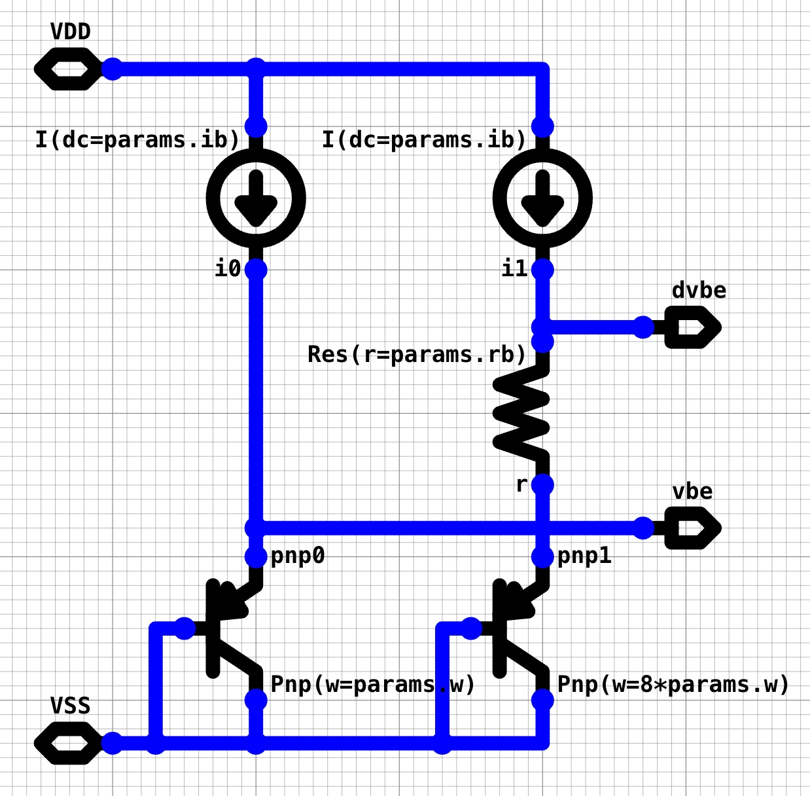
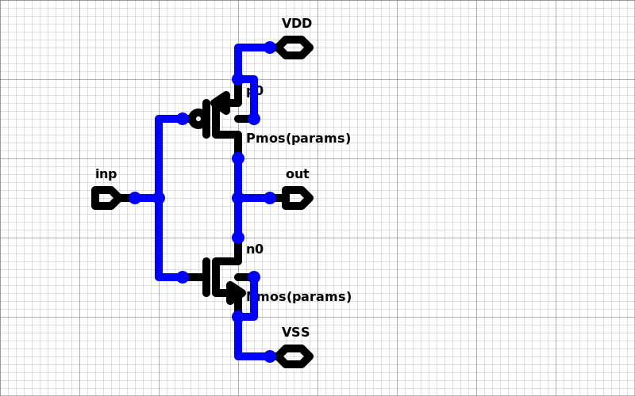
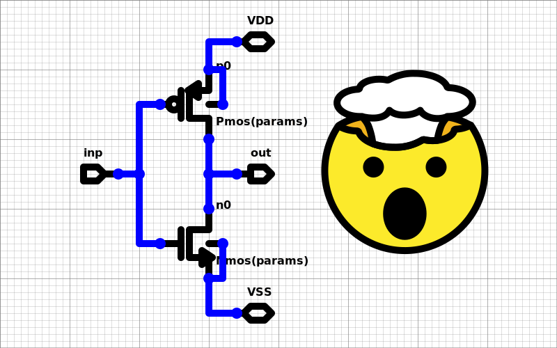
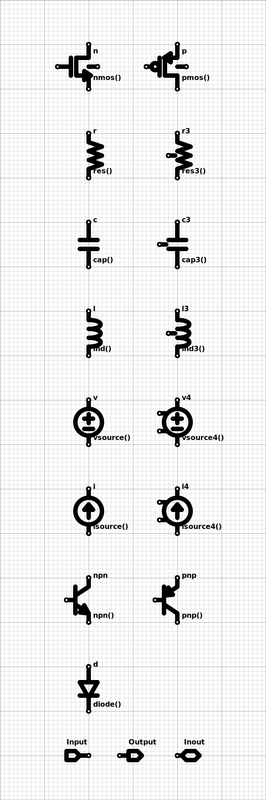
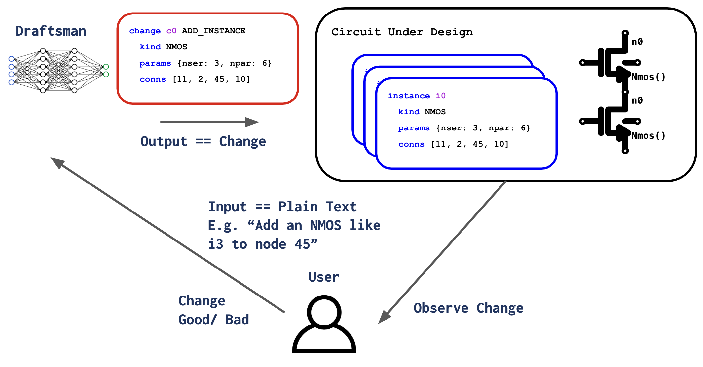

\setkeys{Gin}{width=.75\linewidth}

# Introduction

FIXME: for the outline for now. 

Sub-outline: 

* This is about integrated circuits
* A section on the importance of making more
  * Like with some end of Moore's Law stuff
* Particularly the analog parts
* The whole conceptual layer-cake on which they get designed

## The IC Design Process 

FIXME: write 

## The Need for More

FIXME: write 


Integrated circuits are "integrated" in the sense that more than one - and often in current practice, more than ten orders of magnitude more than one - circuit component is integrated in a single silicon die. 


The most detailed representation of these circuits, and the sole representation sufficiently detailed for fabrication, is commonly called _layout_. IC layout is a chip's physical blueprint. The nature of silicon manufacturing allows for representing these blueprints in "2.5D" terms. Each silicon wafer is extremely uniform in one of its three axes. This axis extends into and out of the plane of the die surface, and is commonly referred to as the z-axis. This z-axis is typically split into a discrete number of _layers_. These layers refer to a variety of physical features, such as metal connections, insulators there-between, ion injections which form transistor junctions, etc. The IC "x" and "y" dimensions, in constast, span the surface of the die, and are much more free-form to be specified by the IC designer. These two axes typically allow for nearly free-form closed 2D polygons. An IC blueprint is therefore comprised of a list of such polygons, each affixed with a z-axis layer annotation. Figures ~\ref{fig:layout2d} and ~\ref{fig:layout3d} depicts a typical IC layout visualization and the three-dimensional structure that it represents.


While layout is the sole language comprehensible for IC fabrication, it is generally far too detailed for much of IC design. The silicon design and closely related electronic design automation (EDA) fields have, over time, produced a substantial stack of software, concepts, and practices which allow for IC-design at far more abstract levels than that of physical layout. Different subsets of the IC field have proven more and less amenable to these things.

* Something about how verification works, ie. logic sim vs spice
* Netlists/ schematics as the "assembly"
* RTL/ HDL code as the "C"
* Whatever we wanna say about "high level" stuff
* Table of that stuff

FIXME: table

One of two paradigms produce essentially all modern IC "blueprints". These two models .... 

In the first model, commonly paired with digital circuits, an optimizing "layout compiler" produces an ultimate blueprint from a combination of an RTL-level circuit design and a set of physical constraints and/or goals. These two designer-inputs are fed to a compilation pipeline, generally comprising a combination of logic synthesis which translates RTL to gate-level netlists, and "place and route" (PnR) layout compilation. We refer to this paradigm as "the digital model" or "the compiled model". 

In the second model, there is no compiler. The designer directly dictates the IC's physical blueprint, generally through graphical means. This approach is generally paired with analog circuits, for which many of the successful methods used in digital layout compilers tend to break down. We refer to this paradigm as "the analog model" or "the custom model". 


Analog and custom circuits such as memory have long been acknowledged as a bottleneck in the IC design process. In the author's anecdotal experience, analog efforts tend to produce transistor-counts per effort (e.g. designer-months) on the order of 100-1000x lower than their digital peers.

Several recent research efforts including ALIGN [@kunal2019align], MAGICAL [@chen2020magical], and BAG [@chang2018bag2] have taken a variety of approaches to improve the state of the field. These and similar research efforts can be grouped into two large categories: 

* 1. _Constraint-based_ systems, which expose an API or language for setting constraints and/ or goals for a _layout solver_. In essence these systems map the digital layout-compilation pipeline onto analog circuits. 
* 2. _Programmed custom_ systems, notably including BAG, which instead expose an elaborate API to directly manipulate _layout content_. The essence of such systems is to replace the conventionally graphical interations - adding a polygon to a layout, setting a parameter, invoking a simulation - with API calls. 

None of these projects nor their underlying methods have broken through to widespread adoption. 

This thesis doesn't have the answer. It catalogues what I believe are valuable contributions to the technology of producing circuits, particularly custom and analog ones, including their physical layouts. And it attempts to point out a number of what I believe have been dead ends. One sub-thesis is that many such projects suffer from insisting on attempting to reinvent the entirety of our industry, each and every time over. I fear this work has not entirely avoided this trap. One virtue, as defined by its author, is the underlying work's modularity. While I am deeply grateful for all of this work's collaborators both inside and outside of UC Berkeley, the sheer effort involved pales in comparison to the 75 year history of the IC and EDA industries, or even their analog sub-fields. This modularity goal has proven valuable for the several research, corporate, and start-up users who bravely enjoined their fate to this work, while it was still on the runway. Many have picked up this effort's pieces; to my knowledge, no two have adopted the same set. 

A further sub-thesis: making the next rounds of progress will require taking a few steps back. Particularly, several long-worn ideas need a rethink. We will cover:

- The core data model used to represent IC design content, commonly referred to as the *design database*, and VLSIR's cloud-era substitute
- The primary design-entry mechanisms for custom and analog circuits. For most of their history these have been pictures. This thesis argues for, and introduces methods to, make them better with code instead.
- A re-do of those graphical pictures, for the (smaller number of) cases where we agree they provide value. Emphasis is placed on *portability* and *sharing*.
- A survey of both historical research attempts to, and first-person software attempts to, rethink the custom layout process. Several are tried here to varying effect. My primary answer to what works best remains "it depends".
- An introduction to "ML for X", where "X" becomes circuits. What does it require for machine learning techniques to make real contributions to the production of circuits, layouts, or the software that aids them? 

## Lessons of the “Generator Era” 

Or, rambling thoughts on:

- (a) Sharing of design content, and
- (b) Amenability to automatic design-generation

in three related domains:

- Software
- Integrated circuits (ICs)
- System-level hardware, i.e. that comprised of printed circuit boards (PCBs) and combinations thereof

I often remark that of all the software, tools, and practices prevalent in hardware design, at least 99% were in place by around 1990. Much of this treatment is framed in terms of the changes in the software space over the roughly 30 year span since.

### Software

Over those 30 years, two changes in software-sharing stand out as most impactful: the open-source movement, and the emergence of the SaaS model overhauling how most commercial software is distributed.

In 1990, integrating commercial library-level generally required buying a license from its author, and being shipped physical disks-full of two kinds of content: executable binaries, and interface-files telling application code how to call them. The source/ header file split of the C/C++ family was particularly well-paired with this model. While the binary-ness of the primary executable programs is notionally for sake of program-size and ease of installation, it has a material side-benefit: binaries have generally been sufficiently inscrutable to generally evade reverse-engineering and (too much) piracy. Whether for "security" or not, the binary/ header split patterns an abstract vs implementation separation. Integrators of such libraries work against abstract versions (the headers), without needing details of their implementation (the binaries).

Later the internet enabled the "as a service" software-sharing model, in which library-level code is not distributed as a binary, but as network-based API calls to a library-author-managed server. Distribution as-a-service added benefits in its ease-of-update, both to its author and to its users. Binary distribution still pervades high-performance environments, such as the physics engines which power advanced 3D games.

Software distribution and development have also been overhauled by the emergence of open-source development. Open-source software is prevalent at all levels of the software-stack, but particularly for library-level building blocks: languages, compilers, runtimes, frameworks, and the like. Sharing and designing open-source software have essentially merged into a single activity, facilitated by public hubs such as GitHub. The integration of git's popular revision-control and development meta-material such as bug-tracking, access control, testing, and documentation publication have made these hubs functional one-stop shops for the development of these projects.

While GitHub has become the face of open-source software _development_, it is almost certainly not where or how most open-source software is shared to be _used_. Instead each coherent community, commonly either a programming language or operating system, generally defines a package manager abstraction. These managers generally comprise two parts: (a) a database of published, versioned, documented designs, and (b) a suite of user-tools co-designed with their package-format, which comprehends how to incorporate, compile, or integrate modules from the database. The combination enables reuse among users with faint awareness of the combined system at work, e.g. via simple installation or compilation commands such as "pip install numpy".

### Integrated Circuits

The integrated circuit (IC) space essentially cleaves in two camps: digital circuits, which benefit from several software-like factors, and analog/custom circuits (including memory), which generally do not.

Digital IC design has primarily lived in C-ish-level hardware-description languages since their advent in the 1980s. Popular digital HDLs are then commonly "compiled" (although often not called this) to one of two targets: simulation-targeted binary executables, and implementation process technologies. The two most prominent HDLs, (System)Verilog and VHDL, are both open IEEE standards. HDL code written in these languages is (in principle) technology-portable. Designs using either language are (again, in principle) shareable as open-source software. Increasingly many are shared through public hubs such as GitHub, although usage of these in larger systems remains harder to gauge, and likely highly limited.

The HDL "simulation compiler" transforms an HDL "program" into a binary executable on an evaluation machine, often the same machine on which it is being designed. These logic-level simulations are often used for much (or most) of a digital-IC design process, until it needs to be mapped into a target technology.

The latter "implementation compiler" targets a realizable chip-blueprint, or "layout". This compilation commonly occurs in two steps: logic synthesis first transforms a "hardware program" into a set of logic-gate-level primitives available in the target technology. Most commonly these primitives are either (a) standard logic cells in ASIC targets, or (b) LUTs in FPGA targets. The second stage, "place and route" (PnR), maps these gates into a physical layout, choosing locations for each and geometries for wiring between them. PnR is generally iterative: it guesses a candidate layout, evaluates one or more quality metrics, and updates that layout based on its observed quality. Closure is reached in fixed-point style, when iterations cease to produce material changes. The original circuit is often modified inline by these programs, changing their relative drive strengths, splitting or combining logic gates, and/or inserting and removing logically equivalent networks, i.e. by inserting logic buffers. Much as the binary output of a C compiler is generally unrecognizable to its C-language author, the gate-level netlists produced by auto-PnR are generally unrecognizable by their HDL authors. Complex state machines are (necessarily) broken into individual bit-level gates, and (frequently) heavily rearranged to reduce area or power.

These synthesized layouts are commonly optimized for one or more of (a) total wire length, which is often found proportional to delay and power consumption, (b) closure of timing constraints (in "timing driven" optimizers), or (c) power consumption itself. Two important delineations enable a layout optimizer to make thousands of layout-iterations and evaluations of these metrics:

- First is the separation between behavior and timing. Layout-compilation programs do not, for example, evaluate whether a design continues to correctly execute its target instruction-set between iterations. This is instead broken in two verification steps. First, logical simulation determines whether a candidate design behaves as intended, assuming synchronous timing constraints are met. Static timing analysis then determines whether those constraints are in fact met. Transformations made during layout synthesis maintain this behavior by ensuring that the network's logical function is unchanged; only timing is modified.
- Second, while evaluation of static timing closure is itself costly, it has several quickly evaluatable surrogates. Total wirelength (for all nets) has long served as a primary in-situ metric for layout compilation.

Several classes of digital circuits are also amenable to "high-level" synthesis, generally from procedural programs. These programs typically accept a C or C++ program, which may or may not be multi-threaded, as input, and produce as output an RTL-level circuit which efficiently "executes" the input program. This allows for designers to operate in the typically more human-intuitive procedural mode, while allowing the compiler to produce inherently parallel-executing hardware. HLS has been most successful for circuits with highly regular data-paths, such as those for digital signal processing. Circuits more-prominently dominated by control logic have proven less amenable.

### Analog & Custom IC Content

Analog and custom circuits (hereon referred to as "analog", but notably including very-digital custom things such as SRAM and IOs) have escaped nearly all these productivity-enhancing pieces of software. These circuits often have performance metrics or design methods which evade the technology-portable hardware-description concepts. They are typically designed in and for a specific implementation technology. Automated design and layout of these circuits has long been an academic pursuit, but one with little industrial adoption. Notably these circuits escape the behavior/ timing layout-quality-evaluation dichotomy. Checking whether the layout of, say, a comparator, meets a set of specifications amounts to fully evaluating whether the circuit behaves as a comparator. These evaluation times are further (greatly) exacerbated in modern technologies by the injection of layout-parasitic circuit elements, which for accurate evaluation often outnumber intentional circuit elements by orders of magnitude. Iterative layout is therefore rendered order of magnitude slower than for digital circuits, which itself can often incur runtimes of several days.

### Sharing of IC Content via "Silicon IP"

The sharing of IC-level circuits is materially affected by several practical considerations. Both the underlying implementation technologies and commercial software tools are strenuously guarded by their owners. Access to even trailing-edge (much less leading-edge) IC technology requires substantial legal and commercial agreement, and has increasingly become the target of international public policy. These agreements are generally designed per institution. Sharing design-data using Foundry-X between (design) Company-A and Company-B generally requires the permission of Foundry-X. Accordingly only the largest institutions with sufficient commercial benefit or scale to amortize these agreements participate. Commercial EDA software, such as that used for layout PnR or simulation, uses a similar per-institution licensing model, generally limited to the institution's on-premise physical machines. These EDA programs are also prohibitively costly for all but the largest institutions to license, often totaling in millions of USD per designer-year.

Despite these constraints. commercial "sharing" of these IC-level circuits is a common practice, typically known as silicon IP. "IP" is a term of art in the silicon space. In context it means something fairly different from in the rest of the world. Silicon "IPs" might be more descriptively called "virtual sub-chips": they consist of the design-files for IC sub-circuits. These IP-blocks can be distributed at several levels of detail (e.g. "soft" HDL code, vs "hardened" physical layout). Probably the most successful company in silicon-IP's history has been ARM, the designer-licensor of the overwhelming majority of the world's embedded processors. While one commonly refers to these devices as containing "ARM chips", even industry-insiders often forget that ARM does not make chips at all. They make virtual sub-chips, licensed by and integrated into the chips of a wide range of IC companies.

### System-Level Hardware

System-level circuits have unique constraints, but among the previously examined cases, look most like analog IC design. Designers typically "program" their hardware in graphical schematics, comprised of symbolic physical components and connections there-between. Simulation plays a much smaller role than for IC-level circuits. Automatic design and/or layout generation is essentially nonexistent, largely attributable to the lack of reusable, quickly evaluatable quality metrics.

Sharing of PCB circuits is aided by their implementation technology: PCBs and discrete physical components. Unlike silicon process technologies and silicon IP, the required information to integrate discrete components is generally publicly available. These "component abstracts" commonly include physical footprints and specification documents. (Automatic interpretation of these documents is of course much more limited.) Publicly-available components generally have publicly-available such information.

Sharing of these component-descriptions has however remained largely ad-hoc. While millions of such part-descriptions are shared on several public distribution hubs such as DigiKey, designs using them commonly self-vendor design-files and relevant information for their integration. At large (and even small) hardware companies, integration into enterprise-level software databases, e.g. those for inventory and sales projections, are as important as their technical content. These substantial databases therefore remain siloed within each institution.

PCBs are also widely available without substantial overhead (e.g. NDA agreements with a PCB fab). Their z-axis cross-section, commonly called a stack-up, is highly customizable by most fabs and for most boards.

PCB circuit-level sharing is far less common. While PCB-level circuits are (in principle) "virtual sub-PCBs" in the same sense that silicon IPs are "virtual sub-chips", nothing resembling the silicon IP ecosystem has emerged at this layer of the stack. Silicon's primary "IP-ization" technologies are those which abstract an underlying circuit, allowing an integrator to make use of an abstract representation without internalizing the details of its implementation. For such abstract descriptions to be sufficiently comprehensive, they typically must include more than one view of the underlying design. Logical and physical views are common examples for silicon IP, which generally map to schematics and layouts on PCBs.

Re-use of PCB layout is often hindered by the very flexibility of their implementation technology: the z-axis stack-ups of PCBs, and the varying capacities of PCB fabs and PCBA assemblers. Analogizing to the silicon space, PCBs have a functionally infinite number of "process technologies".

### On "Generators", Programs That Make Hardware

The IC community, particularly its outpost here at UC Berkeley, has spent much of the past decade promoting the role of "generators" as the future's design-mechanism. Just what this term means varies wildly among proponents. One common thread cuts through seemingly all definitions: generators are (at least) _procedural code that executes and produces hardware descriptions_. At what level of detail, and on what factors are included, opinions vary widely.

Two prominent Berkeley-originated projects, Chisel and BAG, serve as prime examples. Chisel is a "hardware construction library" embedded in the Scala programming language, targeting generation of RTL-level circuits. Conceptually one can think of it as a high-powered replacement for the popular HDLs' parametric and behavioral constructs. BAG, in contrast, uses the same term generator to refer to programs which map process-portable custom circuits into (hopefully) arbitrary implementation technologies, generally requiring lengthy simulation-based optimizations (hours or days) along the way.

Utopia for the most dedicated generator-ists seems to be along the lines of "put ten spec-numbers in, get some complicated circuit out". (Said "complicated circuit" might be an RF transceiver, a single-board computer, or anything else.) Setting aside how achievable that end might be, I don't find it a great mission-statement to begin with.

To start by analogizing back to the field we so badly wish we had - open-source software - this is clearly not what has happened. There is no "put ten numbers in, get a {compiler, operating system, etc.} out" program-generator. (There are likely such things somewhere in academia, but not useful ones.) There's a test I often offer these projects: what proportion of the expertise required to actually design the output-target is required to just use the (even theoretically-ideal) "automatic generator software" - and crucially, to have confidence in the results. For many cases, I think that ratio is quite high, perhaps near 100%. Just knowing the parameter-space of what's good and bad can be quite a lot. There's too much expertise to be had, and not enough time in the day, to even convey the trade-offs in profitably twiddling those "ten numbers". The "ten numbers in" program helps a worldview in which there are bazillions of distinct {circuits, compilers, OSes}, and correspondingly many users putting those ten numbers in. And again, that's not really what successful software has done. Instead, experts design in their expert-domain, and (crucially) share the results.

The design-idioms that have actually worked, in contrast, tend to be much more atomic. Functions, structs, classes, (and more recently) packages in software-space. Modules, transistors, gates, ports, etc for hardware.

### What Holds Us Back

While hardware generation and compilation remain invaluable technologies, the prior section's thesis drives a change in focus, away from "how can we most quickly generate any hardware imaginable", and toward "what is stopping the best-designed hardware from being widely shared". Primary answers vary between IC and system levels.

Silicon content-sharing is primarily limited by commercial and legal hurdles placed directly by foundries and EDA software, and in the former case indirectly placed by public policy. While limited efforts at lowering or removing these barriers (primarily Google + SkyWater) are ongoing, we expect they will remain the field's norm for the foreseeable future. Facilitating design-sharing therefore requires a system with buy-in from at least one of these gate-keepers (foundry and/or EDA). Of the two, EDA seems vastly more likely (and preferable) to be driven out by open-source and/or more commercially-economical software, perhaps initially at a detriment in performance.

System-level circuit-sharing generally lacks these commercial and legal hurdles. Based on technical principle it should already be happening today. The primary limitations have generally been (a) the lack of technologies for abstracting designs to their required interfaces, (b) the diversity of PCB implementation-technologies, and relatedly (c) lack of automatic mapping of circuits onto these technologies. Failure to share component-data has likewise contributed, but does not seem due to technical limitations.

While these system and IC contexts generate different hurdles, they also have several in common. Designers are (rationally) predisposed to circuits which have been real-world verified (no matter how relevant that verification is to their use-case). "Tape-out proven" is a common such description of silicon IP. System-level circuits derive similar confidence from having been fabricated and tested. Lacking technical tools for tracking and automatically verifying that such real-world testing has occurred, the next-best substitute would seem to be a community/ reputation-based model, in which designers and  users and verifiers are encouraged to share test data and experiences.

Lastly, each of these fields lacks the re-use power of the package manager abstraction commonly deployed throughout popular open-source programming languages. The package concept primarily requires the two components described in our software-section, namely the published database and coherent user-side tooling which comprehends its content.

### Where To Go

An outline of a system-design software-suite realizing these ideas:

- A design platform connected to:
  - (a) A central component database, and
  - (b) A design-package manager similar to those prominent for popular open-source software languages (PyPI, NPM, Cargo, etc), and, 
  - (c) An execution environment for system-hardware design-generators
  - (Think a web-app for simple design, and connected dedicated app or IDE plug-in for more complicated ones.)
- Formats and software for system-level sub-design abstraction, particularly including physical design (layout).
- Best-practices from IC design generators (e.g. programmatic design elaboration, structured hierarchical connections), designed for construction of system-level circuits.
- A standard set of commonly-used PCB stack-ups.
- Generation/ compilation to those standard PCB stack-ups, and potentially to arbitrary others.


# IC Design Databases

## "Databases" (Ahem) 101

IC design data is commonly represented in "design databases". These formats and their access software generally look much like the low layers of a relational database management system (RDMS). They include a binary format for storing and packing records, and a API for querying and writing those records. Their central goal is to enable efficient offloading between memory and disk, especially for designs too large to reasonably fit in memory. This goal is near entirely driven by one application: digital PnR layout compilation. For common digital circuits including millions of gates and associated metadata, the optimization makes sense. Optimal PnR, and even "good enough" PnR, remains an NP-complete problem which commonly requires industrial-scale resources and days of runtime. Without such optimizations, large compilations often fail to complete. 

Analog circuits differ in several respects. First and perhaps most importantly: they are much smaller. Rarely if ever 

Second, analog circuits demand to be designed and laid out hierarchically for another reason: their verification is hierarchical. Their necessary mode of evaluation - the SPICE-class simulation - is far too slow, and scales far too poorly, to evaluate compound circuits in useful runtimes. Compound analog circuits such as RF transceivers, wireline SERDES transceivers, data converters, and PLLs are commonly comprised of subsystems whose simulation-based verification is far more tractable than that of the complete system. 

## ProtoBuf 101

The 21st century advent of 

These projects begin with the cloud-scale data center operators. such operations require hundreds of cooperating server-side programs cooperating and exchanging data. these programs are commonly designed by hundreds of disparate, largely independent teams, comprising thousands (or tens of thousands) of engineers. they have no chance at aligning a tall stack of libraries, versions, operating system requirments, and other dependencies which would be required to run on a single machine, in a single program. Moreover many of these "datacenter programs" subsystems have vastly different resources needs, and different prospects for *scaling* across usage. Some require specialty compute resources such as machine learning acceleration, either via graphics processors or special-purpose silicon. Others, e.g. for data caching, benefit from little compute but unusually large memory systems. Others "scale-out", requiring little compute, memory, or other resources per task, but needing tremendous numbers of copies of that task, benefitting from near-perfect scaling via hardware parallelism. These subcomponents are then broken into sub-programs, each of which executes on appropriate hardware, and in tailored execution environments. Communication between these components occurs via the datacenter network. 

Protocol buffers were introduced first internally to google and then as open source software to meet these needs of communication between diverse programs exchanging rich structured data. The ProtoBuf system principally includes three components: 

1. An efficient binary "wire format"
2. A data schema description language (SDL), and 
3. A paired binding code-compiler

Several similar, generally related follow-on projects including CapnProto, FlatBuffers, and FlexBuffers each take similar high-level approaches. 
Meta-programs using protobuf begin by "prgramming" datatypes in its SDL. This operates much like a programming language in which only struct-definitions are allowed. The core protobuf structure-type `message` indicates its intended usage in communication. The protobuf compiler then accepts this SDL as input, and transforms it into typed "bindings" in a diverse set of programming languages. 

```protobuf
message Person {
   optional string name = 1;
   optional int32 id = 2;
   optional string email = 3;
}
```

Maybe: 

* More on features?
* Some kinda perf thing?
* Comparison to the alternatives, Capn in particular
* JSON, YAML etc, the need for the binary-ness. Maybe in the next section


## The `VLSIR` Design Database Schema

[VLSIR's core design database](https://github.com/vlsir/vlsir) is defined in the open-source [Protocol Buffers](https://github.com/protocolbuffers/protobuf) schema description language (SDL). Protocol Buffers were originally designed as an efficient binary data format for exchange between programs running in isolated, often mutually-incompatible container environments. Given a data schema, an associated compiler generates interface code in a variety of popular programming languages. A simplified excerpt from the VLSIR schema, defining the `layout.Instance` type, is included below. 


```protobuf
// # Layout Instance
message Instance {
  string name = 1;     // Instance Name
  Ref cell = 3;        // Cell Reference
  
  Point origin = 4;    // Origin location 
  bool reflect = 6;    // Reflection 
  int32 rotation = 7;  // Rotation (deg)
}
```

The VLSIR schema defines such types for circuits, layout, spice-class simulation input and output, and process technology. 
The schema format serves as a core exchange medium for a variety of programs and libraries written in a variety of languages, with varying trade-offs between designer productivity and performance. 


## Design of the `VLSIR` Software System

FIXME: write

# The Analog Religion's Sacred Cow

## The limitations of life in pictures

FIXME: Write

## The `Hdl21` Analog Hardware Description Library

FIXME: this short intro was from a conference talk; 
The primary high-productivity interface to producing VLSIR circuits and simulations is the [Hdl21](https://github.com/dan-fritchman/Hdl21) hardware description library. Hdl21's central goal is enabling "circuit programming" by circuit designers with little programming experience. Hdl21 exposes the field's most familiar core concepts  - instances of circuit elements, modular combinations thereof, signals and ports, simulations and their results - as Python objects. The core circuit-reuse element `hdl21.Module`, analogous to the Verilog `module` or Spice `subckt`, is typically defined through a class-body full of element declarations. 

```python
@h.module
class MyModule:
   """"# An example Module """
   i = h.Input()
   o = h.Output(width=8)
   s = h.Signal()
   a = AnotherModule(a=i, b=s, c=o)
```

Hdl21 *generators* are functions which return modules. 

```python
@h.generator
def MyGen(params: MyParams) -> h.Module:
   """"# An example generator """
   m = h.Module()
   m.i = h.Input(width=params.w)
   if params.has_reset:
       m.reset = h.Input()
   return m
```

While Hdl21 includes features for common analog circuit use-cases such as differential pairs, arrays of instances, process technologies, and PVT corners, these two concepts - the module as a data structure, and generators as functions which create them - are sufficient for designers to produce powerful, parametric hardware. 


## A (Somewhat) Brief Intro to `Hdl21`

Hdl21 is a [hardware description library](https://en.wikipedia.org/wiki/Hardware_description_language) embedded in Python. It is targeted and optimized for analog and custom integrated circuits, and for maximum productivity with minimum fancy-programming skill.

Hdl21 generates hardware databases in the [VLSIR](https://github.com/Vlsir/Vlsir) interchange formats, defined through [Google Protocol Buffers](https://developers.google.com/protocol-buffers/). Through [VLSIR's Python tools](https://pypi.org/project/vlsirtools/) Hdl21 also includes drivers for popular industry-standard data formats and popular spice-class simulation engines.

### Modules

Hdl21's primary unit of hardware reuse is the `Module`. Think of it as Verilog's `module`, or VHDL's `entity`, or SPICE's `subckt`. Better yet if you are used to graphical schematics, think of it as the content of a schematic. Hdl21 `Modules` are containers of a handful of `hdl21` types. Think of them as including:

- Instances of other `Modules`
- Connections between them, defined by `Signals` and `Ports`
- Fancy combinations thereof, covered later

An example `Module`:

```python
import hdl21 as h

m = h.Module(name="MyModule")
m.i = h.Input()
m.o = h.Output(width=8)
m.s = h.Signal()
m.a = AnotherModule()
```

In addition to the procedural-syntax shown above, `Modules` can also be defined through a `class`-based syntax by applying the `hdl21.module` decorator to a class-definition.

```python
import hdl21 as h

@h.module
class MyModule:
    i = h.Input()
    o = h.Output(width=8)
    s = h.Signal()
    a = AnotherModule()
```

This class-based syntax produces identical results to the procedural code-block above. Its declarative style can be much more natural and expressive in many contexts, especially for designers familiar with popular HDLs.

Creation of `Module` signal-attributes is generally performed by the built-in `Signal`, `Port`, `Input`, and `Output` constructors. Each comes with a "plural version" (`Input*s*` etc.) which creates several identical objects at once:

```python
import hdl21 as h

@h.module
class MyModule:
    a, b = h.Inputs(2)
    c, d, e = h.Outputs(3, width=16)
    z, y, x, w = h.Signals(4)
```

### Signals

Hdl21's primary connection type is `Signal`. Think of it as Verilog's `wire`, or a node in that schematic. Each `Signal` has an integer-valued bus `width` field, and can be connected to any other equal-width `Port`.

A subset of `Signals` are exposed outside their parent `Module`. These externally-connectable signals are referred to as `Ports`. Hdl21 provides four port constructors: `Input`, `Output`, `Inout`, and `Port`. The last creates a directionless (or direction unspecified) port akin to those of common spice-level languages.

### Connections

Popular HDLs generally feature one of two forms of connection semantics. Verilog, VHDL, and most dedicated HDLs use "connect by call" semantics, in which signal-objects are first declared, then passed as function-call-style arguments to instances of other modules.

```verilog
module my_module();
  logic a, b, c;                              // Declare signals
  another_module i1 (a, b, c);                // Create an instance
  another_module i2 (.a(a), .b(b), .c(c));    // Another instance, connected by-name
endmodule
```

Chisel, in contrast, uses "connection by assignment" - more literally using the walrus `:=` operator. Instances of child modules are created first, and their ports are directly walrus-connected to one another. No local-signal objects ever need be declared in the instantiating parent module.

```scala
class MyModule extends Module {
  // Create Module Instances
  val i1 = Module(new AnotherModule)
  val i2 = Module(new AnotherModule)
  // Wire them directly to one another
  i1.io.a := i2.io.a
  i1.io.b := i2.io.b
  i1.io.c := i2.io.c
}
```

Each can be more concise and expressive depending on context. Hdl21 `Modules` support **both** connect-by-call and connect-by-assignment forms.

Connections by assignment are performed by assigning either a `Signal` or another instance's `Port` to an attribute of a Module-Instance.

```python
# Create a module
m = h.Module()
# Create its internal Signals
m.a, m.b, m.c = h.Signals(3)
# Create an Instance
m.i1 = AnotherModule()
# And wire them up
m.i1.a = m.a
m.i1.b = m.b
m.i1.c = m.c
```

This also works without the parent-module `Signals`:

```python
# Create a module
m = h.Module()
# Create the Instances
m.i1 = AnotherModule()
m.i2 = AnotherModule()
# And wire them up
m.i1.a = m.i2.a
m.i1.b = m.i2.b
m.i1.c = m.i2.c
```

Instances can instead be connected by call:

```python
# Create a module
m = h.Module()
# Create the Instances
m.i1 = AnotherModule()
m.i2 = AnotherModule()
# Call one to connect them
m.i1(a=m.i2.a, b=m.i2.b, c=m.i2.c)
```

These connection-calls can also be performed inline, as the instances are being created.

```python
# Create a module
m = h.Module()
# Create the Instance `i1`
m.i1 = AnotherModule()
# Create another Instance `i2`, and connect to `i1`
m.i2 = AnotherModule(a=m.i1.a, b=m.i1.b, c=m.i1.c)
```

### Generators

Hdl21 `Modules` are "plain old data". They require no runtime or execution environment. They can be (and are!) fully represented in markup languages such as ProtoBuf, JSON, and YAML. The power of embedding `Modules` in a general-purpose programming language lies in allowing code to create and manipulate them. Hdl21's `Generators` are functions which produce `Modules`, and have a number of built-in features to aid embedding in a hierarchical hardware tree.

In other words:

- `Modules` are "structs". `Generator`s are _functions_ which return `Modules`.
- `Generators` are code. `Modules` are data.
- `Generators` require a runtime environment. `Modules` do not.

Creating a generator just requires applying the `@hdl21.generator` decorator to a Python function:

```python
import hdl21 as h

@h.generator
def MyFirstGenerator(params: MyParams) -> h.Module:
    # A very exciting first generator function
    m = h.Module()
    m.i = h.Input(width=params.w)
    return m
```

The generator-function body can define a `Module` however it likes - procedurally or via the class-style syntax.

```python
@h.generator
def MySecondGenerator(params: MyParams) -> h.Module:
    # A very exciting (second) generator function
    @h.module
    class MySecondGen:
        i = h.Input(width=params.w)
    return MySecondGen
```

Or any combination of the two:

```python
@h.generator
def MyThirdGenerator(params: MyParams) -> h.Module:
    # Create an internal Module
    @h.module
    class Inner:
        i = h.Input(width=params.w)

    # Manipulate it a bit
    Inner.o = h.Output(width=2 * Inner.i.width)

    # Instantiate that in another Module
    @h.module
    class Outer:
        inner = Inner()

    # And manipulate that some more too
    Outer.inp = h.Input(width=params.w)
    return Outer
```

### Parameters

`Generators` must take a single argument `params` which is a collection of `hdl21.Params`. Generator parameters are strongly type-checked at runtime. Each requires a data-type `dtype` and description-string `desc`. Optional parameters include a default-value, which must be an instance of `dtype`.

```python
# Example parameter:
npar = h.Param(dtype=int, desc="Number of parallel fingers", default=1)
```

The collections of these parameters used by `Generators` are called param-classes, and are typically formed by applying the `hdl21.paramclass` decorator to a class-body-full of `hdl21.Params`:

```python
import hdl21 as h

@h.paramclass
class MyParams:
    # Required
    width = h.Param(dtype=int, desc="Width. Required")
    # Optional - including a default value
    text = h.Param(dtype=str, desc="Optional string", default="My Favorite Module")
```

Each param-class is defined similarly to the Python standard-library's `dataclass`. The `paramclass` decorator converts these class-definitions into type-checked `dataclasses`, with fields using the `dtype` of each parameter.

```python
p = MyParams(width=8, text="Your Favorite Module")
assert p.width == 8  # Passes. Note this is an `int`, not a `Param`
assert p.text == "Your Favorite Module"  # Also passes
```

Similar to `dataclasses`, param-class constructors use the field-order defined in the class body. Note Python's function-argument rules dictate that all required arguments be declared first, and all optional arguments come last.

Param-classes can be nested, and can be converted to (potentially nested) dictionaries via `dataclasses.asdict`. The same conversion applies in reverse - (potentially nested) dictionaries can be expanded to serve as param-class constructor arguments:

```python
import hdl21 as h
from dataclasses import asdict

@h.paramclass
class Inner:
    i = h.Param(dtype=int, desc="Inner int-field")

@h.paramclass
class Outer:
    inner = h.Param(dtype=Inner, desc="Inner fields")
    f = h.Param(dtype=float, desc="A float", default=3.14159)

# Create from a (nested) dictionary literal
d1 = {"inner": {"i": 11}, "f": 22.2}
o = Outer(**d1)
# Convert back to another dictionary
d2 = asdict(o)
# And check they line up
assert d1 == d2
```

### A Note on Parametrization

Hdl21 `Generators` have parameters. `Modules` do not.

This is a deliberate decision, which in this sense makes `hdl21.Module` less feature-rich than the analogous `module` concepts in existing HDLs (Verilog, VHDL, and even SPICE). These languages support what might be called "static parameters" - relatively simple relationships between parent and child-module parameterization. Setting, for example, the width of a signal or number of instances in an array is straightforward. But more elaborate parametrization-cases are either highly cumbersome or altogether impossible to create. (As an example, try using Verilog parametrization to make a programmable-depth binary tree.) Hdl21, in contrast, exposes all parametrization to the full Python-power of its generators.

### `Prefixed` Numeric Parameters

Hdl21 provides an [SI prefixed](https://www.nist.gov/pml/owm/metric-si-prefixes) numeric type `Prefixed`, which is especially common for physical generator parameters. Each `Prefixed` value is a combination of the Python standard library's `Decimal` and an enumerated SI `Prefix`:

```python
@dataclass
class Prefixed:
    number: Decimal  # Numeric Portion
    prefix: Prefix   # Enumerated SI Prefix
```

Most of Hdl21's built-in `Generators` and `Primitives` use `Prefixed` extensively, for a key reason: floating-point rounding. It is commonplace for physical parameter values - e.g. the physical width of a transistor - to have _allowed_ and _disallowed_ values. And those values do not necessarily land on IEEE floating-point values! Hdl21 generators are often used to produce legacy-HDL netlists and other code, which must convert these values to strings. `Prefixed` ensures a way to do this at arbitrary scale without the possibility of rounding error.

`Prefixed` values rarely need to be instantiated directly. Instead Hdl21 exposes a set of common prefixes via their typical single-character names:

```python
f = FEMTO = Prefix.FEMTO
p = PICO = Prefix.PICO
n = NANO = Prefix.NANO
µ = MICRO = Prefix.MICRO
m = MILLI = Prefix.MILLI
K = KILO = Prefix.KILO
M = MEGA = Prefix.MEGA
G = GIGA = Prefix.GIGA
T = TERA = Prefix.TERA
P = PETA = Prefix.PETA
UNIT = Prefix.UNIT
```

Multiplying by these values produces a `Prefixed` value.

```python
from hdl21.prefix import µ, n, f

# Create a few parameter values using them
Mos.Params(
    w=1 * µ,
    l=20 * n,
)
Capacitor.Params(
    c=1 * f,
)
```

These multiplications are the easiest and most common way to create `Prefixed` parameter values.
Note the single-character identifiers `µ`, `n`, `f`, et al _are not_ exported by star-exports (`from hdl21 import *`). They must be imported explicitly from `hdl21.prefix`.

`hdl21.prefix` also exposes an `e()` function, which produces a prefix from an integer exponent value:

```python
from hdl21.prefix import e, µ

11 * e(-6) == 11 * µ  # True
```

These `e()` values are also most common in multiplication expressions,
to create `Prefixed` values in "floating point" style such as `11 * e(-9)`.

### Exporting and Importing

Hdl21's primary import/ export format is [VLSIR](https://github.com/Vlsir/Vlsir). VLSIR is a binary ProtoBuf-based format with support for a variety of industry-standard formats and tools. The `hdl21.to_proto()` function converts an Hdl21 `Module` or group of `Modules` into VLSIR `Package`. The `hdl21.from_proto()` function similarly imports a VLSIR `Package` into a namespace of Hdl21 `Modules`.

Exporting to industry-standard netlist formats is a particularly common operation for Hdl21 users. The `hdl21.netlist()` function uses VLSIR to export any of its supported netlist formats.

```python
import sys
import hdl21 as h

@h.module
class Rlc:
    p, n = h.Ports(2)

    res = h.Res(r=1e3)(p=p, n=n)
    cap = h.Cap(c=1e3)(p=p, n=n)
    ind = h.Ind(l=1e-9)(p=p, n=n)

# Write a spice-format netlist to stdout
h.netlist(Rlc, sys.stdout, fmt="spice")
```

`hdl21.netlist` takes a second destination argument `dest`, which is commonly either an open file-handle or `sys.stdout`. All its remaining arguments are passed to `vlsirtools.netlist`.

### Spice-Class Simulation

Hdl21 includes drivers for popular spice-class simulation engines commonly used to evaluate analog circuits.
The `hdl21.sim` package includes a wide variety of spice-class simulation constructs, including:

- DC, AC, Transient, Operating-Point, Noise, Monte-Carlo, Parameter-Sweep and Custom (per netlist language) Analyses
- Control elements for saving signals (`Save`), simulation options (`Options`), including external files and contents (`Include`, `Lib`), measurements (`Meas`), simulation parameters (`Param`), and literal netlist commands (`Literal`)

The entrypoint to Hdl21-driven simulation is the simulation-input type `hdl21.sim.Sim`. Each `Sim` includes:

- A testbench Module `tb`, and
- A list of unordered simulation attributes (`attrs`), including any and all of the analyses, controls, and related elements listed above.

Example:

```python
import hdl21 as h
from hdl21.sim import *

@h.module
class MyModulesTestbench:
    # ... Testbench content ...

# Create simulation input
s = Sim(
    tb=MyModulesTestbench,
    attrs=[
        Param(name="x", val=5),
        Dc(var="x", sweep=PointSweep([1]), name="mydc"),
        Ac(sweep=LogSweep(1e1, 1e10, 10), name="myac"),
        Tran(tstop=11 * h.prefix.p, name="mytran"),
        SweepAnalysis(
            inner=[Tran(tstop=1, name="swptran")],
            var="x",
            sweep=LinearSweep(0, 1, 2),
            name="mysweep",
        ),
        MonteCarlo(
            inner=[Dc(var="y", sweep=PointSweep([1]), name="swpdc")],
            npts=11,
            name="mymc",
        ),
        Save(SaveMode.ALL),
        Meas(analysis="mytr", name="a_delay", expr="trig_targ_something"),
        Include("/home/models"),
        Lib(path="/home/models", section="fast"),
        Options(reltol=1e-9),
    ],
)

# And run it!
sim.run()
```

`Sim` also includes a class-based syntax similar to `Module` and `Bundle`, in which simulation attributes are named based on their class attribute name:

```python
import hdl21 as h
from hdl21.sim import *

@sim
class MySim:
    tb = MyModulesTestbench

    x = Param(5)
    y = Param(6)
    mydc = Dc(var=x, sweep=PointSweep([1]))
    myac = Ac(sweep=LogSweep(1e1, 1e10, 10))
    mytran = Tran(tstop=11 * h.prefix.PICO)
    mysweep = SweepAnalysis(
        inner=[mytran],
        var=x,
        sweep=LinearSweep(0, 1, 2),
    )
    mymc = MonteCarlo(inner=[Dc(var="y", sweep=PointSweep([1]), name="swpdc")], npts=11)
    delay = Meas(analysis=mytran, expr="trig_targ_something")
    opts = Options(reltol=1e-9)

    save_all = Save(SaveMode.ALL)
    a_path = "/home/models"
    include_that_path = Include(a_path)
    fast_lib = Lib(path=a_path, section="fast")

MySim.run()
```

Note that in these class-based definitions, attributes whose names don't really matter such as `save_all` above can be _named_ anything, but must be _assigned_ into the class, not just constructed.

Class-based `Sim` definitions retain all class members which are `SimAttr`s and drop all others. Non-`SimAttr`-valued fields can nonetheless be handy for defining intermediate values upon which the ultimate SimAttrs depend, such as the `a_path` field in the example above.

Classes decoratated by `sim` a single special required field: a `tb` attribute which sets the simulation testbench. A handful of names are disallowed in `sim` class-definitions, generally corresponding to the names of the `Sim` class's fields and methods such as `attrs` and `run`.

Each `sim` also includes a set of methods to add simulation attributes from their keyword constructor arguments. These methods use the same names as the simulation attributes (`Dc`, `Meas`, etc.) but incorporating the python language convention that functions and methods be lowercase (`dc`, `meas`, etc.). Example:

```python
# Create a `Sim`
s = Sim(tb=MyTb)

# Add all the same attributes as above
p = s.param(name="x", val=5)
dc = s.dc(var=p, sweep=PointSweep([1]), name="mydc")
ac = s.ac(sweep=LogSweep(1e1, 1e10, 10), name="myac")
tr = s.tran(tstop=11 * h.prefix.p, name="mytran")
noise = s.noise(
    output=MyTb.p,
    input_source=MyTb.v,
    sweep=LogSweep(1e1, 1e10, 10),
    name="mynoise",
)
sw = s.sweepanalysis(inner=[tr], var=p, sweep=LinearSweep(0, 1, 2), name="mysweep")
mc = s.montecarlo(
    inner=[Dc(var="y", sweep=PointSweep([1]), name="swpdc"),], npts=11, name="mymc",
)
s.save(SaveMode.ALL)
s.meas(analysis=tr, name="a_delay", expr="trig_targ_something")
s.include("/home/models")
s.lib(path="/home/models", section="fast")
s.options(reltol=1e-9)

# And run it!
s.run()
```

### Primitives and External Modules

The leaf-nodes of each hierarchical Hdl21 circuit are generally defined in one of two places:

- `Primitive` elements, defined in the `hdl21.primitives` package. These include transistors, resistors, capacitors, and other irreducible components. Simulation-level behavior of these elements is typically defined _inside of_ simulation tools and other EDA software.
- `ExternalModules`, defined outside Hdl21. Such "module wrappers", which might alternately be called "black boxes", are common for including circuits from other HDLs.

### `Primitives`

Hdl21 `Primitives` come in _ideal_ and _physical_ flavors. The difference is most frequently relevant for passive elements, which can for example represent either (a) technology-specific passives, e.g. a MIM or MOS capacitor, or (b) an _ideal_ capacitor. Some element-types have solely physical implementations, some are solely ideal, and others include both.

### The `hdl21.primitives` Library

The `Primitive` type and all its valid values are defined by the `hdl21.primitives` package. A summary of the `hdl21.primitives` library content:

| Name                           | Description                       | Type     | Aliases                               | Ports        |
| ------------------------------ | --------------------------------- | -------- | ------------------------------------- | ------------ |
| Mos                            | Mos Transistor                    | PHYSICAL | MOS                                   | d, g, s, b   |
| IdealResistor                  | Ideal Resistor                    | IDEAL    | R, Res, Resistor, IdealR, IdealRes    | p, n         |
| PhysicalResistor               | Physical Resistor                 | PHYSICAL | PhyR, PhyRes, ResPhy, PhyResistor     | p, n         |
| ThreeTerminalResistor          | Three Terminal Resistor           | PHYSICAL | Res3, PhyRes3, ResPhy3, PhyResistor3  | p, n, b      |
| IdealCapacitor                 | Ideal Capacitor                   | IDEAL    | C, Cap, Capacitor, IdealC, IdealCap   | p, n         |
| PhysicalCapacitor              | Physical Capacitor                | PHYSICAL | PhyC, PhyCap, CapPhy, PhyCapacitor    | p, n         |
| ThreeTerminalCapacitor         | Three Terminal Capacitor          | PHYSICAL | Cap3, PhyCap3, CapPhy3, PhyCapacitor3 | p, n, b      |
| IdealInductor                  | Ideal Inductor                    | IDEAL    | L, Ind, Inductor, IdealL, IdealInd    | p, n         |
| PhysicalInductor               | Physical Inductor                 | PHYSICAL | PhyL, PhyInd, IndPhy, PhyInductor     | p, n         |
| ThreeTerminalInductor          | Three Terminal Inductor           | PHYSICAL | Ind3, PhyInd3, IndPhy3, PhyInductor3  | p, n, b      |
| PhysicalShort                  | Short-Circuit/ Net-Tie            | PHYSICAL | Short                                 | p, n         |
| DcVoltageSource                | DC Voltage Source                 | IDEAL    | V, Vdc, Vsrc                          | p, n         |
| PulseVoltageSource             | Pulse Voltage Source              | IDEAL    | Vpu, Vpulse                           | p, n         |
| CurrentSource                  | Ideal DC Current Source           | IDEAL    | I, Idc, Isrc                          | p, n         |
| VoltageControlledVoltageSource | Voltage Controlled Voltage Source | IDEAL    | Vcvs, VCVS                            | p, n, cp, cn |
| CurrentControlledVoltageSource | Current Controlled Voltage Source | IDEAL    | Ccvs, CCVS                            | p, n, cp, cn |
| VoltageControlledCurrentSource | Voltage Controlled Current Source | IDEAL    | Vccs, VCCS                            | p, n, cp, cn |
| CurrentControlledCurrentSource | Current Controlled Current Source | IDEAL    | Cccs, CCCS                            | p, n, cp, cn |
| Bipolar                        | Bipolar Transistor                | PHYSICAL | Bjt, BJT                              | c, b, e      |
| Diode                          | Diode                             | PHYSICAL | D                                     | p, n         |

Each primitive is available in the `hdl21.primitives` namespace, either through its full name or any of its aliases. Most primitives have fairly verbose names (e.g. `VoltageControlledCurrentSource`, `IdealResistor`), but also expose short-form aliases (e.g. `Vcvs`, `R`). Each of the aliases in Table 1 above refer to _the same_ Python object, i.e.

```python
from hdl21.primitives import R, Res, IdealResistor

R is Res            # evaluates to True
R is IdealResistor  # also evaluates to True
```

### `ExternalModules`

Alternately Hdl21 includes an `ExternalModule` type which defines the interface to a module-implementation outside Hdl21. These external definitions are common for instantiating technology-specific modules and libraries. Other popular modern HDLs refer to these as module _black boxes_. An example `ExternalModule`:

```python
import hdl21 as h
from hdl21.prefix import µ
from hdl21.primitives import Diode

@h.paramclass
class BandGapParams:
    self_destruct = h.Param(
        dtype=bool,
        desc="Whether to include the self-destruction feature",
        default=True,
    )

BandGap = h.ExternalModule(
    name="BandGap",
    desc="Example ExternalModule, defined outside Hdl21",
    port_list=[h.Port(name="vref"), h.Port(name="enable")],
    paramtype=BandGapParams,
)
```

Both `Primitives` and `ExternalModules` have names, ordered `Ports`, and a few other pieces of metadata, but no internal implementation: no internal signals, and no instances of other modules. Unlike `Modules`, both _do_ have parameters. `Primitives` each have an associated `paramclass`, while `ExternalModules` can optionally declare one via their `paramtype` attribute. Their parameter-types are limited to a small subset of those possible for `Generators` - scalar numeric types (`int`, `float`) and `str` - primarily limited by the need to need to provide them to legacy HDLs.

`Primitives` and `ExternalModules` can be instantiated and connected in all the same styles as `Modules`:

```python
# Continuing from the snippet above:
params = BandGapParams(self_destruct=False)  # Watch out there!

@h.module
class BandGapPlus:
    vref, enable = h.Signals(2)
    # Instantiate the `ExternalModule` defined above
    bg = BandGap(params)(vref=vref, enable=enable)
    # ...Anything else...

@h.module
class DiodePlus:
    p, n = h.Signals(2)
    # Parameterize, instantiate, and connect a `primitives.Diode`
    d = Diode(w=1 * µ, l=1 * µ)(p=p, n=n)
    # ... Everything else ...
```

### Process Technologies

Designing for a specific implementation technology (or "process development kit", or PDK) with Hdl21 can use either of (or a combination of) two routes:

- Instantiate `ExternalModules` corresponding to the target technology. These would commonly include its process-specific transistor and passive modules, and potentially larger cells, for example from a cell library. Such external modules are frequently defined as part of a PDK (python) package, but can also be defined anywhere else, including inline among Hdl21 generator code.
- Use `hdl21.Primitives`, each of which is designed to be a technology-independent representation of a primitive component. Moving to a particular technology then generally requires passing the design through an `hdl21.pdk` converter.

Hdl21 PDKs are Python packages which generally include two primary elements:

- (a) A library `ExternalModules` describing the technology's cells, and
- (b) A `compile` conversion-method which transforms a hierarchical Hdl21 tree, mapping generic `hdl21.Primitives` into the tech-specific `ExternalModules`.

Since PDKs are python packages, using them is as simple as importing them. Hdl21 includes two built-in PDKs: the academic predicitive [ASAP7](https://pypi.org/project/asap7-hdl21/) technology, and the open-source [SkyWater 130nm](https://pypi.org/project/sky130-hdl21/) technology.

```python
import hdl21 as h
import sky130

@h.module
class SkyInv:
    """ An inverter, demonstrating using PDK modules """

    # Create some IO
    i, o, VDD, VSS = h.Ports(4)

    # And create some transistors!
    ps = sky130.modules.sky130_fd_pr__pfet_01v8(w=1, l=1)(d=o, g=i, s=VDD, b=VDD)
    ns = sky130.modules.sky130_fd_pr__nfet_01v8(w=1, l=1)(d=o, g=i, s=VSS, b=VSS)
```

Process-portable modules instead use Hdl21 `Primitives`, which can be compiled to a target technology:

```python
import hdl21 as h
from hdl21.prefix import µ
from hdl21.primitives import Nmos, Pmos, MosVth

@h.module
class Inv:
    """ An inverter, demonstrating instantiating PDK modules """

    # Create some IO
    i, o, VDD, VSS = h.Ports(4)

    # And now create some generic transistors!
    ps = Pmos(w=1*µ, l=1*µ, vth=MosVth.STD)(d=o, g=i, s=VDD, b=VDD)
    ns = Nmos(w=1*µ, l=1*µ, vth=MosVth.STD)(d=o, g=i, s=VSS, b=VSS)
```

Compiling the generic devices to a target PDK then just requires a pass through the PDK's `compile()` method:

```python
import hdl21 as h
import sky130

sky130.compile(Inv) # Produces the same content as `SkyInv` above
```

Hdl21 includes an `hdl21.pdk` subpackage which tracks the available in-memory PDKs. If there is a single PDK available, it need not be explicitly imported: `hdl21.pdk.compile()` will use it by default.

```python
import hdl21 as h
import sky130  # Note this import can be elsewhere in the program, i.e. in a configuration layer.

h.pdk.compile(Inv)  # With `sky130` in memory, this does the same thing as above.
```

### PDK Corners

The `hdl21.pdk` package inclues a three-valued `Corner` enumerated type and related classes for describing common process-corner variations. In pseudo [type-union](https://peps.python.org/pep-0604/) code:

```
Corner = TYP | SLOW | FAST
```

Typical technologies includes several quantities which undergo such variations. Values of the `Corner` enum can mean either the variations in a particular quantity, e.g. the "slow" versus "fast" variations of a poly resistor, or can just as oftern refer to a set of such variations within a given technology. In the latter case `Corner` values are often expanded by PDK-level code to include each constituent device variation. For example `my.pdk.corner(Corner.FAST)` may expand to definitions of "fast" Cmos transistors, resistors, and capacitors.

Quantities which can be varied are often keyed by a `CornerType`. In similar pseudo-code:

```
CornerType = MOS | CMOS | RES | CAP | ...
```

A particularly common such use case pairs NMOS and PMOS transistors into a `CmosCornerPair`. CMOS circuits are then commonly evauated at its four extremes, plus their typical case. These five conditions are enumerated in the `CmosCorner` type:

```python
@dataclass
class CmosCornerPair:
    nmos: Corner
    pmos: Corner
```

```
CmosCorner = TT | FF | SS | SF | FS
```

Hdl21 exposes each of these corner-types as Python enumerations and combinations thereof. Each PDK package then defines its mapping from these `Corner` types to the content they include, typically in the form of external files.

#### PDK Installations and Sites

Much of the content of a typical process technology - even the subset that Hdl21 cares about - is not defined in Python. Transistor models and SPICE "library" files, such as those defining the `_nfet` and `_pfet` above, are common examples pertinent to Hdl21. Tech-files, layout libraries, and the like are similarly necessary for related pieces of EDA software. These PDK contents are commonly stored in a technology-specific arrangement of interdependent files. Hdl21 PDK packages structure this external content as a `PdkInstallation` type.

Each `PdkInstallation` is a runtime type-checked Python `dataclass` which extends the base `hdl21.pdk.PdkInstallation` type. Installations are free to define arbitrary fields and methods, which will be type-validated for each `Install` instance. Example:

```python
""" A sample PDK package with an `Install` type """

from pydantic.dataclasses import dataclass
from hdl21.pdk import PdkInstallation

@dataclass
class Install(PdkInstallation):
    """Sample Pdk Installation Data"""

    model_lib: Path  # Filesystem `Path` to transistor models
```

The name of each PDK's installation-type is by convention `Install` with a capital I. PDK packages which include an installation-type also conventionally include an `Install` instance named `install`, with a lower-case i. Code using the PDK package can then refer to the PDK's `install` attribute. Extending the example above:

```python
""" A sample PDK package with an `Install` type """

@dataclass
class Install(PdkInstallation):
    """Sample Pdk Installation Data"""

    model_lib: Path  # Filesystem `Path` to transistor models

install: Optional[Install] = None  # The active installation, if any
```

The content of this installation data varies from site to site. To enable "site-portable" code to use the PDK installation, Hdl21 PDK users conventionally define a "site-specific" module or package which:

- Imports the target PDK module
- Creates an instance of its `PdkInstallation` subtype
- Affixes that instance to the PDK package's `install` attribute

For example:

```python
# In "sitepdks.py" or similar
import mypdk

mypdk.install = mypdk.Install(
    models = "/path/to/models",
    path2 = "/path/2",
    # etc.
)
```

These "site packages" are named `sitepdks` by convention. They can often be shared among several PDKs on a given filesystem. Hdl21 includes one built-in example such site-package, [SampleSitePdks](./SampleSitePdks/), which demonstrates setting up both built-in PDKs, Sky130 and ASAP7:

```python
# The built-in sample `sitepdks` package
from pathlib import Path

import sky130
sky130.install = sky130.Install(model_lib=Path("pdks") / "sky130" / ... / "sky130.lib.spice")

import asap7
asap7.install = asap7.Install(model_lib=Path("pdks") / "asap7" / ... / "TT.pm")
```

"Site-portable" code requiring external PDK content can then refer to the PDK package's `install`, without being directly aware of its contents.
An example simulation using `mypdk`'s models with the `sitepdk`s defined above:

```python
# sim_my_pdk.py
import hdl21 as h
from hdl21.sim import Lib
import sitepdks as _ # <= This sets up `mypdk.install`
import mypdk

@h.sim
class SimMyPdk:
    # A set of simulation input using `mypdk`'s installation
    tb = MyTestBench()
    models = Lib(
        path=mypdk.install.models, # <- Here
        section="ss"
    )

# And run it!
SimMyPdk.run()
```

Note that `sim_my_pdk.py` need not necessarily import or directly depend upon `sitepdks` itself. So long as `sitepdks` is imported and configures the PDK installation anywhere in the Python program, further code will be able to refer to the PDK's `install` fields.

## Why Use Python?

Custom IC design is a complicated field. Its practitioners have to know (a lot of stuff), independent of any programming background. Many have little or no programming experience at all. Python is reknowned for its accessibility to new programmers, largely attributable to its concise syntax, prototyping-friendly execution model, and thriving community. Moreover, Python has also become a hotbed for many of the tasks hardware designers otherwise learn programming for: numerical analysis, data visualization, machine learning, and the like.

Hdl21 exposes the ideas they're used to - `Modules`, `Ports`, `Signals` - via as simple of a Python interface as it can. `Generators` are just functions. For many, this fact alone is enough to create powerfully reusable hardware.

## Why _Not_ Use {X}?

We know you have plenty of choice when you fly, and appreciate you choosing Hdl21.  
A few alternatives and how they compare:

### Schematics

Graphical schematics have been the lingua franca of the custom-circuit field for, well, as long as it's been around. Most practitioners are most comfortable in this graphical form. (For plenty of circuits, so are Hdl21's authors.) Their most obvious limitation is the lack of capacity for programmable manipulation via something like Hdl21 `Generators`. Some schematic-GUI programs attempt to include "embedded scripting", perhaps even in Hdl21's own language (Python). We see those GUIs as entombing your programs in their badness. Hdl21 is instead a library, designed to be used by any Python program you like, sharable and runnable by anyone who has Python. (Which is everyone.)

### Netlists (Spice et al)

Take all of the shortcomings listed for schematics above, and add to them an under-expressive, under-specified, ill-formed, incomplete suite of "programming languages", and you've got netlists. Their primary redeeming quality: existing EDA CAD tools take them as direct input. So Hdl21 Modules export netlists of most popular formats instead.

### (System)Verilog, VHDL, other Existing Dedicated HDLs

The industry's primary, 80s-born digital HDLs Verilog and VHDL have more of the good stuff we want here - notably an open, text-based format, and a more reasonable level of parametrization. And they have the desirable trait of being primary input to the EDA industry's core tools. They nonetheless lack the levels of programmability present here. And they generally require one of those EDA tools to execute and do, well, much of anything. Parsing and manipulating them is well-reknowned for requiring a high pain tolerance. Again Hdl21 sees these as export formats.

### Chisel

Explicitly designed for digital-circuit generators at the same home as Hdl21 (UC Berkeley), Chisel encodes RTL-level hardware in Scala-language classes. It's the closest of the alternatives in spirit to Hdl21. (And it's aways more mature.) If you want big, custom, RTL-level circuits - processors, full SoCs, and the like - you should probably turn to Chisel instead. Chisel makes a number of decisions that make it less desirable for custom circuits, and have accordingly kept their designers' hands-off.

The Chisel library's primary goal is producing a compiler-style intermediate representation (FIRRTL) to be manipulated by a series of compiler-style passes. We like the compiler-style IR (and may some day output FIRRTL). But custom circuits really don't want that compiler. The point of designing custom circuits is dictating exactly what comes out - the compiler _output_. The compiler is, at best, in the way.

Next, Chisel targets _RTL-level_ hardware. This includes lots of things that would need something like a logic-synthesis tool to resolve to the structural circuits targeted by Hdl21. For example in Chisel (as well as Verilog and VHDL), it's semantically valid to perform an operation like `Signal + Signal`. In custom-circuit-land, it's much harder to say what that addition-operator would mean. Should it infer a digital adder? Short two currents together? Stick two capacitors in series?
Many custom-circuit primitives such as individual transistors actively fight the signal-flow/RTL modeling style assumed by the Chisel semantics and compiler. Again, it's in the way. Perhaps more important, many of Chisel's abstractions actively hide much of the detail custom circuits are designed to explicitly create. Implicit clock and reset signals serve as prominent examples.

Above all - Chisel is embedded in Scala. It's niche, it's complicated, it's subtle, it requires dragging around a JVM. It's not a language anyone would recommend to expert-designer/ novice-programmers for any reason other than using Chisel. For Hdl21's goals, Scala itself is Chisel's biggest burden.

### Other Fancy Modern HDLs

There are lots of other very cool hardware-description projects out there which take Hdl21's big-picture approach - embedding hardware idioms as a library in a modern programming languare. All focus on logical and/or RTL-level descriptions, unlike Hdl21's structural/ custom/ analog focus. We recommend checking them out:

- [SpinalHDL](https://github.com/SpinalHDL/SpinalHDL)
- [MyHDL](http://www.myhdl.org/)
- [Migen](https://github.com/m-labs/migen) / [nMigen](https://github.com/m-labs/nmigen)
- [Magma](https://github.com/phanrahan/magma)
- [PyMtl](https://github.com/cornell-brg/pymtl) / [PyMtl3](https://github.com/pymtl/pymtl3)
- [Clash](https://clash-lang.org/)


# Web-Native Schematics 

## OK, not *all* of those schematics are bad

FIXME: write

## What's a schematic really?

FIXME: outline - 

- circuit and a picture
- some structured data which captures the circuit content
- some image data which produces the visual
- usually, some paired software to render and/or interpret it
- reverse order of "picture" and "circuit"

## SVG 101

FIXME: write

## Hdl21 Schematics

Hdl21 is largely designed to replace graphical schematics. A central thesis is that most schematics would be better as code. We nonetheless find for a small subset of schematics - the ones containing elements that any designer would recognize - the pictorial schematic remains the most intuitive mode. Hdl21 includes a [paired schematic system](https://github.com/vlsir/Hdl21Schematics) in which each schematic is both a web-native SVG image and is directly executable as an Hdl21 Python generator. 

Each Hdl21 schematic is accordingly a single SVG file, requiring no external dependencies to be read. Linking with implementation technologies occur in code, upon execution of the schematic as an Hdl21 generator. Hdl21 schematics capitalize on the extension capabilities of Hdl21's embedded language, Python, which include custom expansion of its module-importing mechanisms, to include schematics solely with the language's built-in `import` keyword. 




[Schematics](https://en.wikipedia.org/wiki/Circuit_diagram) are graphical representations of electronic circuits. In integrated circuit (IC, silicon, chip) design they the _lingua franca_ for analog circuits, and also commonly used for transistor-level digital circuits.

In short: a schematic is two things -

1. A Circuit
2. A Picture

### Hdl21 Schematics are SVG Images

[Scalable Vector Graphics (SVG)](https://developer.mozilla.org/en-US/docs/Web/SVG) is the W3C's open web-standard for two dimensional vector graphics. SVG is an XML-based markup language which all modern browsers natively render, and includes the capacity for semi-custom content structure and metadata.

Hdl21 schematics are not _like_ SVGs.  
They are not _exportable to_ or _convertable to_ SVGs.  
They **are** SVGs.  
So:

- Each schematic is a _single file_. No dependencies, no linked "database".
- Anyone can read them.
- GitHub can read them.
- GitLab can read them.
- Grandma's copy of Internet Explorer can read them.

[This inverter](./docs/inverter.sch.svg is a valid schematic:

\includesvg[width=\textwidth]{fig/inverter.sch.svg}



And [the same inverter](./fig/inverter_mind_blown.sch.svg) with [OpenMoji's mind-blown emoji](https://openmoji.org/library/emoji-1F92F/) is also a valid schematic:



This is the first, probably biggest, difference between Hdl21 schematics and any other you've likely encountered. Instead of defining a custom schematic format and needing custom software to read it, Hdl21 schematics are general-purpose images. Any remotely modern web browser or OS can read them.

Embedding in SVG also allows for rich, arbitrary annotations and metadata, such as:

- Any other custom vector-graphics, e.g. block diagrams
- Layout intent, e.g. how to position and/or route elements
- Links to external content, e.g. testbenches, related schematics, etc.

SVG is an XML-based schema and allows for semi-custom strucutre and metadata.
This structure and metadata, detailed [later in this document](#the-svg-schematic-schema), is what makes an SVG a schematic.

While _reading_ schematics just requires any old computer, _writing_ them is best done with custom software. The primary Hdl21 schematics graphical editor runs in three primary contexts:

- As a standalone desktop application
- As a VsCode Extension
- Coming soon: on the web

SVG schematics by convention have a sub-file-extension of `.sch.svg`. The editor application and VsCode Extension use this convention to identify schematics and automatically launch in schematic-edit mode.


## The Element Library

Schematics consist of:

- Instances of circuit elements,
- Ports, and
- Wire connections there-between

The element-library holds similar content to that of SPICE: transistors, resistors, capacitors, voltage sources, and the like. It is designed in concert with Hdl21's [primitive element library](https://github.com/dan-fritchman/Hdl21#primitives-and-external-modules).

The complete element library:



Symbols are technology agnostic. They do not correspond to a particular device from a particular PDK. Nor to a particular device-name in an eventual netlist. Symbols solely dictate:

- How the element looks in the "schematic picture"
- Its port list

Each instance includes two string-valued fields: `name` and `of`.

The `name` string sets the instance name. This is a per-instance unique identifier, directly analogous to those in Verilog, SPICE, Virtuoso, and most other hardware description formats. It must be of nonzero length, and for successful Python import it must be a valid Python-language identifier.

The `of` string determines the type of device. In Python, the `of` field is executed as code. It will often contain parameter values and expressions thereof.

Examples of valid `of`-strings for the NMOS symbol:

```python
# In the code prelude:
from hdl21.prefix import µ, n
from hdl21.primitives import Nmos
# Of-string:
Nmos(w=1*µ, l=20*n)

# In the code prelude:
from asap7 import nmos as my_asap7_nmos
# Of-string:
my_asap7_nmos(l=7e-9, w=1e-6)
```

This is probably the second biggest difference between Hdl21 schematics and most other schematic systems. There is no backing "database", no "links" to out-of-source libraries. The types of all devices are dictated by code-strings, interpreted by programs ingesting the schematic.

For a schematic to produce a valid Hdl21 generator, the result of evaluating each instance's `of` field must be:

- An Hdl21 `Instantiable`, and
- Include the same ports as the symbol

## Schematics as Circuits, particularly Hdl21 Generators

[Hdl21](https://github.com/dan-fritchman/Hdl21) is a high-productivity analog hardware description library (HDL) embedded in Python. Hdl21's `Generator`s are Python functions which produce circuit `Module`s. Hdl21 schematics are designed to seamlessly import into Hdl21-based Python programs, as a kind of "graphical Python module".

The inverter pictured above (with or without the emoji) roughly translates to the following Python code:

```python
# A code-prelude, covered shortly, executes here.

@h.generator
def inverter(params: Params) -> h.Module:
  inverter = h.Module()
  inverter.n0 = Nmos(params)(...)
  inverter.p0 = Pmos(params)(...)
  return inverter

# Both "..."s are where connections, not covered yet, will go.
```

Each schematic includes a _code prelude_: a text section which precedes the schematic content. Typically this code-block imports anything the schematic is to use. The prelude is stored in text form as a (non-rendered) SVG element.

An example prelude:

```python
# An example code-prelude
from hdl21.primitives import Nmos, Pmos
```

This minimal prelude imports the `Nmos` and `Pmos` devices from the Hdl21 primitive-element library.

Schematic code-preludes are executed as Python code. All of the language's semantics are available, and any module-imports available in the executing environment are available.

The call signature for an Hdl21 generator function is `def <name>(params: Params) -> h.Module:`. To link their code-sections and picture-sections together, Hdl21 schematics require special treatment for each of this signature's identifiers: `name`, `params`, `Params`, and `h`.

- The argument type is named `Params` with a capital `P`.
  - If the identifier `Params` is not defined in the code prelude, the generator will default to having no parameters.
  - `Params` must be an Hdl21 `paramclass`, or will generate an import-time `TypeError`.
- The argument value is named `params` with a lower-case `p`.
- If a string-valued `name` attribute is defined in the code-prelude, the generator function's name is set to this string.
  - If not, the generator function's name is set to that of the schematic SVG file.
  - Defining a `name` which is not a string or is not a valid Python identifier will generate an import-time `Exception`.
- The identifier `h` must refer to the Hdl21 pacakge.
  - Think of a "pre-prelude" as running `import hdl21 as h` before the schematic's own code-prelude.
  - Overwriting the `h` identifier will produce an import-time Python error.
  - Re-importing `hdl21 as h` is fine, as is importing `hdl21` by any additional names.

An example code-prelude with a custom `Params` type:

```python
# An example code-prelude, using devices from PDK-package `mypdk`
import hdl21 as h
from mypdk import Nmos, Pmos

@h.paramclass
class Params:
  w = h.Param(dtype=int, desc="Width")
  l = h.Param(dtype=int, desc="Length")
```


### Importing into Python

Hdl21 schematics are designed to seamlessly integrate into Python programs using Hdl21. They are essentially "graphical Python modules". The `hdl21schematicimporter` Python package makes this as simple as:

```python
import hdl21schematicimporter

# Given a schematic file `schematic.sch.svg`, this "just works":
from . import schematic # <= This is the schematic
```

Schematics with `.sch.svg` extensions can be `import`ed like any other Python module. The `hdl21schematicimporter` package uses Python's [importlib override machinery](https://docs.python.org/3/library/importlib.html) to load their content.

An example use-case, given a schematic named `inverter.sch.svg`:

```python
# Example of using a schematic
import hdl21 as h
from .inverter import inverter # <= This is the schematic

@h.module
class Ring:
  a, b, c, VDD, VSS = h.Signals(5)
  ia = inverter()(inp=a, out=b, VDD=VDD, VSS=VSS)
  ib = inverter()(inp=b, out=c, VDD=VDD, VSS=VSS)
  ic = inverter()(inp=c, out=a, VDD=VDD, VSS=VSS)
```

For schematic files with extensions other than `.sch.svg`, or those outside the Python source tree, or if (for whatever reason) the `import`-override method seems too spooky, `hdl21schematicimporter.import_schematic()` performs the same activity, with a filesystem `Path` to the schematic as its sole argument:

```python
def import_schematic(path: Path) -> SimpleNamespace
```

Both `import_schematic` and the `import` keyword override return a standard-library `SimpleNamespace` representing the "schematic module". A central attribute of this module is the generator function, which often has the same name as the schematic file. The `Params` type and all other identifiers defined or imported by the schematic's code-prelude are also available as attributes in this namespace.

---


### On Hierarchy

The experienced schematic-author may by now be wondering: how does one make _hierarchical_ Hdl21 schematics, with custom subcircuit cells and symbols?

The answer is simple: you don't.  
**Write HDL code instead.**

There are no custom symbols. On purpose. **And there never will be.**

---

## The SVG Schematic Schema

SVG schematics are commonly interpreted by two categories of programs:

- (1) General-purpose image viewer/ editors such as Google Chrome, Firefox, and InkScape, which comprehend schematics _as pictures_.
- (2) Special-purpose programs which comprehend schematics _as circuits_. This category notably includes the primary Python importer.

This section serves as the specification for (2). The schema which dictates the content of _schematic circuits_ is dictated through SVG structure and element attributes. While some of this schema also dictates how schematics appear _as pictures_, overlap between the two use-cases is incomplete. Valid schematic importers must adhere to the schema defined herein and no more.

Note the graphical schematic _editor_ is a special case which combines _both_ use-cases. It simultaneously renders schematics as pictures while being drawn and dictates their content as circuits. The graphical editor holds a number of additional pieces of non-schema information about schematics and how they are intended to be rendered as pictures, including their style attributes, design of the element symbols, and locations of text annotations. This information _is not_ part of the schematic schema. Any valid SVG value for these attributes is to be treated as valid by schematic importers.

### `Schematic`

#### SVG Root Element

Each `Schematic` is represented by an SVG element beginning with `<svg>` and ending with `</svg>`, commonly stored in a file with the `.sch.svg` extension.

Many popular SVG renderers expect `?xml` prelude definitions and `xmlns` (XML namespace) attributes to properly render SVG. SVG schematics therefore begin and end with:

```svg
<?xml version="1.0" encoding="utf-8"?>
<svg width="1600" height="800" xmlns="http://www.w3.org/2000/svg">
  <!-- Content -->
</svg>
```

These XML preludes _are not_ part of the schematic schema, but _are_ included by the graphical editor.

#### Size

Schematics are always rectangular. Each schematic's size is dictated by its `svg` element's `width` and `height` attributes. If either the width or height are not provided or invalid, the schematic shall be interpreted as having the default size of 1600x800.

#### Schematic and Non-Schematic SVG Elements

SVG schematics allow for inclusion of arbitrary _non-schematic_ SVG elements. These might include annotations describing design intent, links to related documents, logos and other graphical documentation, or any other vector graphics content.

These elements _are not_ part of the schematic content. Circuit importers must (a) categorize each element as being either schematic or not, and (b) ignore all elements which are non-schematic content.

#### Header Content

SVG schematics include a number of header elements which aid in their rendering as pictures. These elements _are not_ part of the schematic schema, and are to be ignored by schematic importers. They include:

- An SVG definitions (`<defs>`) element with the id `hdl21-schematic-defs`
  - These definitions include the code-prelude, extracted circuit, and other metadata elements.
- An SVG style (`<style>`) with the id `hdl21-schematic-style`
- An SVG rectangle (`<rect`>), of the same size as the root SVG element, with the id `hdl21-schematic-background`. This element supplies the background grid and color.

#### Coordinates

SVG schematics use the SVG and web standards for their coordinate system. The origin is at the top-left corner of the schematic, with the x-axis increasing to the right and the y-axis increasing downward.

All schematic coordinates are stored in SVG pixel values. Schematics elements are placed on a coarse grid of 10x10 pixels. All locations of each element within a schematic must be placed on this grid. Any element placed off-grid shall be interpreted as a `SchematicError`.

#### Orientation

All schematic elements operate on a "Manhattan style" orthogonal grid. Orient-able elements such as `Instance`s and `Port`s are similarly allowed rotation solely in 90 degree increments. Such elements may thus be oriented in a total of _eight_ distinct orientations: four 90 degree rotations, with an optional vertical reflection. Reflection and rotation of these elements are both applied about their origin locations. Note rotation and reflection are not commutative. If both a reflection and a nonzero rotation are applied to an element, the reflection is applied first.

These orientations are translated to and from SVG `transform` attributes. SVG schematics use the `matrix` transform to capture the combination of orientation and location. SVG `matrix` transforms are [specified in six values](https://developer.mozilla.org/en-US/docs/Web/SVG/Attribute/transform#matrix) defining a 3x3 matrix. Transforming by `matrix(a,b,c,d,e,f)` is equivalent to multiplying a vector `(x, y, 1)` by the matrix:

```
a c e
b d f
0 0 1
```

Note that this is also equivalent to a multiplication and addition of the vector two-dimensional vector `(x,y)`:

```
| a c | | x | + | e |
| b d | | y |   | f |
```

In the schematic Manhattan coordinate system, the vector-location `(e,f)` may be any grid-valid point. The 2x2 matrix `(a,b,c,d)`, however, is highly constrained, to eight possible values which correspond to the eight possible orientations. These eight values are:

| a   | b   | c   | d   | Rotation | Reflection |
| --- | --- | --- | --- | -------- | ---------- |
| 1   | 0   | 0   | 1   | 0°       | No         |
| 0   | 1   | -1  | 0   | 90°      | No         |
| -1  | 0   | 0   | -1  | 180°     | No         |
| 0   | -1  | 1   | 0   | 270°     | No         |
| 1   | 0   | 0   | -1  | 0°       | Yes        |
| 0   | 1   | 1   | 0   | 90°      | Yes        |
| -1  | 0   | 0   | 1   | 180°     | Yes        |
| 0   | -1  | -1  | 0   | 270°     | Yes        |

Any schematic element with an SVG `matrix` with `(a,b,c,d)` values from outside this set shall generate a `SchematicError`.

#### Schematic Content

Each `Schematic` is comprised of collections of four types of elements:

- `Instance`s of circuit elements
- `Wire`s connecting them
- `Port` annotations
- `Dot`s indicating located connections

These collections are not ordered or keyed. No element refers to any other by any means, e.g. name, ID, or other "pointer".

### `Instance`

Each `Instance` includes:

- A string instance `name`
- A string `of`, which dictates the type of element to be instantiated
- A `kind` value from the enumerated `Elements` list, which serves as pointer to the `Element` dictating its pictorial symbol and port list.
- A `location` dictating the position of its origin in schematic coordinates.
- An `orientation` dictating its reflection and rotation.

In SVG, each instance is represented by a group (`<g>`) element. Instance groups are identified by their use of the `hdl21-instance` SVG class. The location and orientation of each instance is stored in its instance-group's `transform` attribute.

Each instance-group holds three ordered child elements:

- Another group (`<g>`) holding the instance's pictorial symbol.
  - The SVG `class` of this symbol-group serves as indication of the `kind` of the instance.
  - The _content_ of the symbol-group is not part of the schematic schema. Any valid SVG content is allowed. The schema dictates only that the `class` attribute indicate the `kind` of the instance.
- A `<text>` element with class `hdl21-instance-name` holding the instance's name.
- A `<text>` element with class `hdl21-instance-of` holding the instance's `of` string.

An example `Instance`:

```svg
<g class="hdl21-instance" transform="matrix(1 0 0 1 X Y)">
    <g class="hdl21-elements-nmos">
        <!-- Content of the symbol-picture -->
    </g>
    <text x="10" y="0" class="hdl21-instance-name">inst_name</text>
    <text x="10" y="80" class="hdl21-instance-of">inst_of</text>
</g>
```

The three child elements are required to be stored in the order (symbol, name, of). The lack of valid values for any of the three child elements shall generate a `SchematicError`. The presence of any additional children shall also generate a `SchematicError`.

### Circuit Elements

SVG schematics instantiate circuit elements from a library of pre-defined symbols. A schematic importer must be aware of this libray's contents, as it dictates much of the schematic's connectivity.

The `kind` field of each `Instance` serves as a reference to a `Element` type. Each `Element` consists of:

- The symbol "picture", and
- A list of named, located ports

An example `Element`, defined in JavaScript syntax:

```js
Element({
  kind: ElementKind.Nmos, // The enumerated `kind`
  ports: [
    // Its ordered, located port list
    new Port({ name: "d", loc: point(0, 0) }),
    new Port({ name: "g", loc: point(70, 40) }),
    new Port({ name: "s", loc: point(0, 80) }),
    new Port({ name: "b", loc: point(-20, 40) }),
  ],
});
```

Notably each element _does not_ dictate what device appears in an ultimate circuit or netlist. The `of` string of each `Instance` dictates these choices. The element solely dictates its two fields: the pictorial symbol and the port list.

The complete list of elements is defined in [the circuit element library documentation](#the-element-library). The content of the element library - particularly the kinds of elements and their port lists - _is_ part of the schematic schema, and must be adhered to by any schematic importer.

### `Wire`

Schematic wires consist of orthogonal Manhattan paths. They are represented by SVG group (`<g>`) elements, principally including an internal `<path>` element. Wire groups are indicated by their use of the `hdl21-wire` SVG class. Each wire group has two child elements:

- The `path` element dictating the wire's shape.
- A `text` element dictating its wire/ net name.

An example `Wire`:

```svg
<g class="hdl21-wire">
    <path class="hdl21-wire" d="M 100 150 L 100 350 L 200 350" />
    <text class="hdl21-wire-name">net1</text>
</g>
```

Wire vertices are dictated by the SVG `path`'s `d` attributes. Each wire vertex must be located on the schematic's 10x10 pixel grid. Each wire segment must meet "Manhattan" orthogonal routing style, i.e. each point must have either an x or y coordinate equal to that of the previous point. Wire paths are _open_ in the SVG sense; there is no implicit segment from the final point back to the first.

Wire-names serve as the mechanism for schematic "connections by name". Any two wires with the same name shall be considered connected. There is one special `wire-name` value: the empty string, which implies that (a) the wire's is not explicitly set, and (b) importers shall assign it a net-name consistent with any other connected element, e.g. a `Port` or another `Wire`.

### `Port`

Schematic `Port`s appear similar to `Instance`s in both pictorial representation and in SVG content. Unlike instances they do not add hardware to the circuit represented by the schematic, but annotate particular `Wire`s as being exposed externally.

Each `Port` has the following fields:

- A string `name`
- A `kind` value from the enumerated `PortKind` list
- A `location` dictating the position of its origin in schematic coordinates.
- An `orientation` dictating its reflection and rotation.

Note these fields are identical to those of `Instance`, but for the removal of the `of` string-field. The semantic content of a schematic `Port` is dicated fully by its `Kind` field, which also dictates its pictorial representation.

In SVG, each `Port` is represented by a group (`<g>`) element. Port groups are identified by their use of the `hdl21-port` SVG class. The location and orientation of each instance is stored in its port-group's `transform` attribute.

Each port-group holds two ordered child elements:

- Another group (`<g>`) holding the port's pictorial symbol.
  - The SVG `class` of this symbol-group serves as indication of the `kind` of the port.
  - The _content_ of the symbol-group is not part of the schematic schema. Any valid SVG content is allowed. The schema dictates only that the `class` attribute indicate the `kind` of the port.
- A `<text>` element with class `hdl21-port-name` holding the port's name.

An example `Port`:

```svg
<g class="hdl21-port" transform="matrix(1 0 0 1 X Y)">
    <g class="hdl21-ports-input">
        <!-- Content of the symbol -->
    </g>
    <text x="10" y="-15" class="hdl21-port-name">portname</text>
</g>
```

Valid port names must be non-zero length. All wires connected to a port shall be assigned a net-name equal to the port's name. Any such connected wire with a conflicting net-name shall generate a `SchematicError`. Any wire or connected combination of wires which are connected to more than on port shall generate a `SchematicError`.

### Connection `Dot`

Schematic dots indicate connectivity between wires and ports where connections might otherwise be ambiguous. The inclusion of a `Dot` at any location in a schematic implies that all `Wire`s passing through that point are connected. The lack of a `Dot` at an intersection between wires conversely implies that the two _are not_ connected, and instead "fly" over one another.

`Dot`s are represented in SVG by `<circle>` elements centered at the dot location. Dot locations must land on the 10x10 pixel schematic grid. Dot-circles are identified by their use of the `hdl21-dot` SVG class.

An example `Dot`:

```svg
<circle cx="-20" cy="40" class="hdl21-dot" />
```

The center location dictating `cx` and `cy` attributes are the sole schema-relevant attributes of a dot-circle. All other attributes such as the radius `r` are not part of the schema, and may be any valid SVG value.

While powerful visual aids and a notional part of the schematic-schema, `Dot`s _do not_ have semantic meaning in schematics. They are entirely a visual aid. Schematic importers _shall not_ imbue them with meaning. I.e. any valid schematic with any combination of `Dot`s yields an identical circuit with _any other_ combination of `Dot`s.

The primary editor application infers `Dot`s at load time, and uses those stored in SVG as a check. This process includes:

- Running "dot inference" from the schematic's wires, instances, and ports
- Comparing the inferred dot locations with those stored in the SVG
- If the two differ, reporting a warning to the user

Differences between the inferred and stored dot locations are logged and reported. They _shall not_ generate a `SchematicError`.

---

Note: SVG includes a definitions (`<defs>`) section, which in principle can serve as a place to hold the element symbol definitions. Doing so would save space in the hypertext content. But we have very quickly found that popular platforms we'd like to have render schematics (ahem, GitHub) do not support the `<defs>` and corresponsing `<use>` elements.


# Programming Models for IC Layout


In 2018 the Computer History Museum [estimated](https://computerhistory.org/blog/13-sextillion-counting-the-long-winding-road-to-the-most-frequently-manufactured-human-artifact-in-history/?key=13-sextillion-counting-the-long-winding-road-to-the-most-frequently-manufactured-human-artifact-in-history) that in the IC industry's roughly 75 year history, it has shipped rough 13 sextillion (1.3e22) total transistors. (This total has certainly risen, likely dramatically, in the few years since.) Essentially all of them have been designed by one of two methods: 

1. "The digital way", using a combination of logic synthesis and automatically placed and routed layout.
2. "The analog way", using a graphical interface to produce essentially free-form layout shapes.

## The Digital Way

Layout of digital circuits has proven amenable to automatic generation in countless ways that analog layout has not. Nearly the entirety of the IC industry's gains in productivity and scale, all of the enablement of chips with millions or billions of transistors, is owed to a stack of software in which designers can: 

* Write hardware in C-like HDL code
* Compile an RTL-level subset of this code to logic gates, in a process typically called _logic synthesis_
* _Place and route_ a gate-level circuit netlist into physical layout

The combination of logic synthesis and PnR layout serves as a powerful "hardware compiler" from portable HDL code to target silicon technologies. Analogous attempts at the compilation of analog circuits have generally failed, or failed to achieve substantial industry adoption. Despite its comparative simplicity (compared to analog), digital "back end" design remains a laborious process, often requiring professional teams of hundreds for large designs. 


## The Analog Way 

The analog way, in contrast, shares little between circuits. No "compiler" is invoked to produce layout from a more abstract description. Instead designers are free to produce essentially any combination of 2.5 dimensional shapes in a custom graphical environment. Only a small fraction of these combinations will conform to a given technology's design rules; this is a major part of the effort. Designers are free to produce device sizing, placement, and routing essentially as they see fit - at the primary cost of needing to produce it. 

Notably, code remains a material part of the analog method; it merely occupies a very different place in the design hierarchy. Figure~\ref{fig:layout_quadrants} the relationship between code-based and graphically-based methods in the digital and analog flows. Perhaps counterintuitively, the two are used in diametrically opposite portions of the design hierarchy. The digital flow uses code - the combination of a PnR "layout solver" and designer-dictated constraints - to produce the upper, "module" levels of a design hierarchy. Its low levels, principally comprised of "standard cell" logic gates, are conversely designed with graphical methods highly similar to the analog flow. Said analog flow, in contrast, uses these graphical methods for its "module layers" (e.g. amplifiers, data converters), while relying on code-based _parametric cells_ ("p-cells") for its lowest levels (e.g. single transistors or passive elements). 

Why? In short: in modern technologies, the lowest levels are the hardest - both to optimize, and to meet design-rule correctness in the first place. The digital flow uses hand-crafted standard logic cells which can be highly tuned and co-designed with the underlying technology, recognizing that their design effort will be amortized billions of times over. Analog design is a lower-volume industry. It is much more difficult to amortize the manual production of each low-level transistor polygon. This is generally saved for the most performance-critical devices, e.g. those in high-speed RF transceivers. Code based "p-cells" instead produce these polygons from a set of input parameters similar to those provided to schematic designers. In addition to schematic-level parameters, principally including device sizing, these programs often add layout-specific parameters such as requirements for segmentation ("multi-fingering"), overlap, abutment, or proximity of contacts. The placement of and interconnect between these p-cells is then performed in the custom graphical flow. 


--- 

### Aside on digital layout "compilation"

In this sense the anaogy between the digital layout pipeline and the typical programming language compiler breaks down. Digital PnR does nore than compile a hardware circuit, and does more than the good faith optimization attempts afforded by most optimizing compilers. Instead it wraps this compilation in an optimization layer, in which the optimization objectives 

* (a) Are met by design, or the process is deemed unsuccessful, and
* (b) Are, at least to an extent, user programmable.

The most common and prominent example such metric is the synchronous clock frequency. PnR users commonly specify such a frequency or period as their sole input constraint. The process is analogous to a C-language compiler with user inputs dictating its maximum instruction count or memory usage. While such efforts may exist in research or in specialty contexts, they are not the model deployed by commercially successful "optimizing compilers" (e.g. gcc, LLVM/ clang). While the term "optimizing" is commonly used to describe these projects; it would more accurately be saved for digital PnR, in which compilation is explicitly wrapped in an optimizing layer rich with goals and constraints. 


---

## The Two Most Tried (and Failed) Models


FIXME: 

1. Analog PnR
2. Programmed-custom

Code-based "programming" of (digital) circuits has been commonplace since the introduction of the still-popular hardware description languages in the 1980s. Successful programming models for semi-custom layout have proven more elusive. Most research efforts can be grouped into two large categories: 

* 1. _Constraint-based_ systems, which expose an API or language for setting constraints and/ or goals for a _layout solver_.
* 2. _Programmed custom_ systems, notably including BAG, which instead expose an elaborate API to directly manipulate _layout content_.

While we believe VLSIR's modular design enables both approaches, its applications to date have focused on approach (2). Like the overall framework, layout programming with VLSIR is both modular and layered. The lowest-abstraction, most-detailed layout-programming layer directly manipulates geometric objects and hierarchical instances thereof. This "raw" layer is the basis of open-source generators for SRAM and FPGAs. 

A more abstract "tetris" layer operates on rectilinear blocks in regular grid. Placement is performed through a relative-locations API, while routing is performed through the assignment of circuit nets to intersections between routing tracks on adjacent layers. Underlying "tetris blocks" are designed through conventional graphical means, similar to the design process commonly depolyed for digital standard cells. In a co-designed circuit style, all unit MOS devices are of a single geometry. Parameterization consists of two integer parameters: (a) the number of unit devices stacked in series, and (b) the number of such stacks arrayed in parallel. The core stacked-MOS cells are physically designed similar to digital standard cells, including both the active device stack and a complementary dummy device. This enables placement alongside and directly adjacent to core logic cells, and makes each analog layout amenable to PnR-style automation. 


# Programmed-Custom Layout 

## State of the Art(?)

- Direct libs: gdstk, gdsfactory
- "P-cells" for low-level devices 
- BAG programming model

## `Layout21`'s Layered Design

FIXME: write

- general approach
- rust
- raw/ direct mode

## Tetris Placement & Routing

FIXME: write

## Programmed-Custom Successes (mostly SRAM compilers)

The most successful depolyments of programmed-custom layout have generally been _circuit family_ specific. E.g. while a layout-program at minimum produces a single circuit, these best-use-cases find families of similar circuits over which to find a set of meta-parameters, enabling the production of a small family. SRAM arrays have probably been the most successful example. SRAM serves as the primary high-density memory solution for nearly all of the digital flow, comprising most cache, register files, and configuration of most large digital SOCs. SRAM is therefore extremely area-sensitive, especially at its lowest and most detailed design layers. A common workflow uses the custom graphical methods to produce these "bit-cells" and similarly detailed layers, which using "SRAM compiler" programs to aggregate bits into usable IP blocks. An SRAM compiler is a programmed-custom layout program. It leverages the fact that large swathes of popular SRAM usage has a consistent set of parameters: size in bits, word width, numbers of read and write ports, and the like. The compiler (or what we might call "generator") programs generalize over this space and produce a family of memory IPs. 

The genesis of the layout21 library was in fact to produce a similar set of circuits: "compute in memory" (CIM, or "processing in memory", PIM) circuits for machine learning acceleration. These circuits attempt to break the typical memory-bandwidth constraint on machine learning processing, by first breaking the traditional Von Neumann split between processing and memory. Instead, circuits are arranged in atomic combinations of processing and memory, e.g. a single storage bit coupled with a single-bit multiplier. Many research systems implemented this marriage with analog signal processing, using physical device characeristics (e.g. programmable resistors) to perform multiplication, and more amenable quantities (e.g. current, charge) to perform addition. (We always thought this was a bad idea.)

- FIXME:
- add some imagery from SRAM CIM 
- cite SRAM22/ whatever that library's called now


# Compiled (Analog) Layout


## Why does PnR work for digital, but fail for analog? 

What makes digital circuits so amenable to layout compilation, and analog circuits so poor? 

First, PnR compilers typically target *synchronous* digital circuits, in which a fixed-frequency clock "heartbeat" synchronizes all activity. This circuit style is sufficiently ubiquitous to often be rolled into the common usage of the term "digital circuits". Synchronous circuits offer a simple set of criteria for the circuits' success or failure: each of its *synchronous timing constraints* must be met. Such timing constraints come in two primary flavors: 

* *Setup time constraints* dictate that each combinational logic path complete propagation within the clock period. This generally manifests as a *maximum* propagation delay.
* *Hold time constraints* demand that each path completes outside of the state elements' "blind windows", during which they are subject to errant sampling. This generally manifests as a *minimum* propagation delay.

This *timing closure* problem is parameterized by a small set of numbers - principally the clock period and a few parameters which dictate logic-cell delays (power-supply voltage, process "corner", etc.). Several other parameters, such as skews throughout the clock network, inject second-order effects. 

Second, timing closure has been proven to be efficiently computable, particularly via *static timing analysis* (STA). While the transistor-level simulation scales incredibly poorly to million-transistor circuits, the combination of synchronous digital logic and STA avoids it altogether. In the STA methodology, the largest circuit which needs direct transistor-level simulation is the largest standard logic cell, e.g. a flip-flop. Each element of the logic-cell library is characterized offline for delay, setup and hold time, and any other relevant timing metrics. These results are summarized in (typically tabular) *timing models* which capture their dependence on key variables such as capacitive loading or incoming transition times. 

With these timing model libraries in tow, STA's evaluation of timing constraints boils down to: 

* A graph-analysis stage, determining the set of paths between all state elements, and
* Simple arithmetic for totaling up each of their delays. 

Both have proven scalable to large circuits. 

Third, these delays have easily computable surrogates. In a common example, layout placers often use total wirelength - i.e. the sum of distances between connected elements - as a quality metric for placements. Other such layout-driven quantities such as specific paths' lengths, metal layer selections, and driver sizes have direct, well-understood effects on delays, and can be optimized for in a layout-compiler. 

In summary: 

1. Synchronous logic offers a very straightforward set of pass/ fail measures; 
2. Static timing analysis offers an efficient means of computing those measures;
3. Readily available surrogates for STA quantities offer *even more* effecient means of estimating those quantities
4. All of those same methods apply to *all synchronous digital circuits*.

Contrast this with analog circuits:

1. Virtually no two circuits have the same set of success and failure metrics;
2. Transistor-level simulation is the sole means of evaluating those metrics;
3. Even the production of simulation collateral and metric extraction is highly circuit and context-specific

In short: fail across the board. Analog circuits have no "analog" to STA which applies universally and establishes a common success criteria. Each circuit must instead be evaluated against its own, generally circuit-specific, set of criteria. The success or failure of a comparator, an LC oscillator, and a voltage regulator each have depends on wholly different criteria. These criteria generally lack any efficient surrogates; their success can generally only be evaluated through transistor-level simulation. Such simulations scale poorly with the number of circuit elements, quickly requiring hours to complete on feasible contemporary hardware. Moreover their efficiency is dramatically reduced by the inclusion of *parasitic elements*, the very layout information that a PnR solver is attempting to optimize. Including a sufficiently high-fidelity simulation model for making productive layout decisions generally means requiring extensive runtimes. Embedding such evaluations in an iterative layout-optimizer has proven too costly to ever be deployed widely. Machine learning based optimizers such as BagNET [@chang2018bag2] use a combination of wholesale removal of layout elements (i.e. "schematic level" simulations) and lower-cost surrogate simulations (e.g. a DC operating point standing in for a high-frequency response) to evaluate design candidates. 


## Analog PnR Success(?) Stories

Attempts to compile analog and otherwise "custom" circuit layout are not new. 

- Primitives - generally programmed-custom "p-cells"
- Placement - generally formulated in optimization terms
- Routing - not optimization, just get it done
- Specialty analog constraints - matching, coupling, differential-ness, overall higher care level
- passive components

Many such frameworks focus on small transistor-level circuits, such as those for the logical "standard cells" which serve as the primitives of the digital flow, or a relatively simple amplifier. Circuits with less than, say, 20 transistors. These frameworks often focus on stringent optimality goals for such small-scale circuits, and often embed a goal to reach *provable* optimality for those metrics, such as diffusion sharing or overall layout area. Placement is then generally cast into an optimization framework such as integer linear programming (ILP), in which the reward function directly evaluates the target metric. The downside is, this scales poorly with circuit size, and is not especially fast even for small circuits. As noted in @gupta98ilp, ILP based placement "implicitly explores all possible transistor placements". This exploration isn't really implicit; it *explicitly* grows exponentially with the size of the placement problem. ALIGN uses ILP-based placement and... it's slow enough to be useless? 

--- 


## `AlignHdl21`

Berkeley IC research of the past decade has not been kind to the idea that analog circuits can be successfully laid out by PnR-style solves. Emphasis on the BAG project and its programmed-custom model has been the primary artifact. 

- Hdl21 is a great place to store all that metadata
- 

The relatively sad state of analog layout production does offer 
Think of a typical design feedback loop: 

1. A designer produces a schematic-level circuit, generally iteratively through a simulation-based feedback process.
2. Once satisfied, the schematic is (manually) hardened into layout. This may be done by the same designer as performed step 1 (typical for broke grad students), or may entail a handoff to a dedicated layout-design specialist (typical for pro's). The layout is completed to some level of desired quality, generally including successful layout vs schematic (LVS) checks which enable layout extraction.
3. The designer of step 1 evaluates the layout, applying a combination of simulation-based feedback and technical judgement based on direct review. Criteria for "good" and "good enough" are often fairly abstract, e.g. "put these two devices as close together as we can", or "match these two signals as well as we can". If:
  a. Evaluations all succeed, congratulations! Circuit's done.
  b. Evaluations indicate a sound circuit but deficient layout, return to step (2).
  c. Evaluations indicate the need for circuit-level changes, e.g. due to inaccurate assumptions about layout effects, return to step (1).

The good news: we need not automate the entirety of this process to make valuable progress. 

- VLSIR and Hdl21 improve step 1,
- 

BAG began with more or less this intent, to automate the entirety of this design feedback loop, via per-circuit "generator programs" which could adapt a circuit and layout to target specifications. Practical usage of BAG, observed both in academic and industry contexts, has instead focused on the "forward" aspects of the loop, particularly step (2), layout production. The feedback-based evaluations of step (3) remain offline and manual. Crucially, the goal is not just for *software* to perform step 2. The goal is to *perform step 2 more effectively than the manual methods*. This is where the programmed-custom systems tend to fail. 

\setkeys{Gin}{width=.5\linewidth}


# Machine Learners Learn Circuits 101


## State of the Art(?)

FIXME: write

- AutoCkt [@autockt] 
- BagNET [@bagnet]

- Constructive angle
- Draftsman/ LLM angle

## The `CktGym` Distributed Framework 


FIXME: write plenty before this! 

### Example Power of Circuit "Expert Knowledge"

An example folded cascode, "rail to rail" dual input op-amp. This circuit consists of 26 transistors. An ML-based optimizer operating directly on its device widths therefore needs to jointly optimize these 26 variables. Operating on more complex device sizes (e.g. including length or segmentation in addition to unit width) further multplies this space. 

Veteran designers of such circuits, in contrast, recognize they are not making 26 independent device sizing decisions. This circuit and most others in the classical analog genre operate based on device matching between pairs and groups of ostensibly identical transistors. This tactic pairs with both signaling schemes - primarily the prominence of differential signals in on-die contexts - and with surrounding needs such as replica-current biasing. 

The rail to rail op-amp in fact includes only six unique unit devices: 

- The input pair,
- The bias curent sources, and
- The cascodes
- Each in NMOS and PMOS flavors

These devices are then scaled by integer current ratios, for each input pair (herein referred to as `alpha` and `beta` respectively), and to the output stage (`gamma`). Figure XYZ depicts this circuit highlighting this reality. Several bias-current branches which do not directly dictate the circuit performance are fixed to the unit current `ibias`. The two input current souces are also fixed to identical current values equal to `ibias`. 

These relationships are relevant for both human and ML designers. Embedding this "expert knowledge" reduces the parameter space from 26 (the number of devices) to 9: six to set unit device sizes, plus the three current ratios. If more detailed parameterization of the unit devices is desired (e.g. to set their length as well as width), this advantage grows similarly. 

```python
@h.paramclass
class FcascParams:
    # Unit device sizes
    nbias = h.Param(dtype=int, desc="Bias Nmos Unit Width", default=2)
    pbias = h.Param(dtype=int, desc="Bias Pmos Unit Width", default=4)
    ncasc = h.Param(dtype=int, desc="Cascode Nmos Unit Width", default=2)
    pcasc = h.Param(dtype=int, desc="Cascode Pmos Unit Width", default=4)
    ninp = h.Param(dtype=int, desc="Input Nmos Unit Width", default=2)
    pinp = h.Param(dtype=int, desc="Input Pmos Unit Width", default=4)

    # Current Mirror Ratios
    alpha = h.Param(dtype=int, desc="Alpha (Pmos Input) Current Ratio", default=2)
    beta = h.Param(dtype=int, desc="Beta (Nmos Input) Current Ratio", default=2)
    gamma = h.Param(dtype=int, desc="Gamma (Output Cascode) Current Ratio", default=2)
```

```python
@h.generator
def Fcasc(params: FcascParams) -> h.Module:
    """# Rail-to-Rail, Dual Input Pair, Folded Cascode, Diff to SE Op-Amp"""

    # Multiplier functions of the parametric devices
    nbias = lambda x: nmos(m=params.nbias * x)
    ncasc = lambda x: nmos(m=params.ncasc * x)
    ninp = lambda x: nmos(m=params.ninp * x)
    pbias = lambda x: pmos(m=params.pbias * x)
    pcasc = lambda x: pmos(m=params.pcasc * x)
    pinp = lambda x: pmos(m=params.pinp * x)

    # Give these some shorter-hands
    alpha, beta, gamma = params.alpha, params.beta, params.gamma

    @h.module
    class Fcasc:
        # ... 
        
        ## Output Stack
        pbo = h.Pair(pbias(x=gamma + beta))(g=outn, d=psd, s=VDD, b=VDD)
        pco = h.Pair(pcasc(x=gamma))(g=pcascg, s=psd, d=outd, b=VDD)
        nco = h.Pair(ncasc(x=gamma))(g=ibias2, s=nsd, d=outd, b=VSS)
        nbo = h.Pair(nbias(x=gamma + alpha))(g=ibias1, d=nsd, s=VSS, b=VSS)

        ## Input Pairs
        ## Nmos Input Pair
        nin_bias = nbias(x=2 * alpha)(g=ibias1, s=VSS, b=VSS)
        nin_casc = ncasc(x=2 * alpha)(g=ibias2, s=nin_bias.d, b=VSS)
        nin = h.Pair(ninp(x=alpha))(g=inp, d=psd, s=nin_casc.d, b=VSS)
        ## Pmos Input Pair
        pin_bias = pbias(x=2 * beta)(g=pbiasg, s=VDD, b=VDD)
        pin_casc = pbias(x=2 * beta)(g=pbiasg, s=pin_bias.d, b=VDD)
        pin = h.Pair(pinp(x=beta))(g=inp, d=nsd, s=pin_casc.d, b=VDD)
```

## A Different Kinda Analog RL Thing


### Background, Prior Art

The problem formulation for these systems is typically of the form: given a fixed circuit topology and fixed figure of merit, find optimum sizes for each device in the circuit. Reinforcement learning designer-agents, typically comprised of deep neural networks, are deployed to perform these optimizations. Moving a new circuit topology or new FOM generally requires an altogether new agent, each of which requires a training process many-times the length of its actual task. Attempts at transfering the learning derived from each circuit, where attempted, are generally limited to highly-correlated cases, such as the differences between schematic-based and layout-parasitic-annotated versions of the same circuit.  

This is far from how human designers approach the task on several fronts.  

- Human designers clearly learn to infer more complex circuits from simpler ones. Core analog building-blocks such as current mirrors form the basis of large (also core building blocks) of various shapes and sizes.
- Designers are commonly faced with similar design-tasks featuring similar goals, metrics, constraints, and/or technologies, and quickly learn to extrapolate between them. "Porting" of a circuit from one process-technology to another similar technology is a common example. Designers quickly come to recognize which technologies are "most similar", even if only dimly aware of any specific criteria for similarity. They similarly learn to extrapole between metrics, i.e. trading off power for bandwidth, and other constraints such as area.
- Casting circuit design as optimization is also some bullshit math-department-envy. Real design-efforts have constrained resources such as design-time and expertise. Their goals are not of the form "thou must find the optimal solution", but of "thou must find a solution better than X (and the more the merrier)".

In some respects this framing is also forced onto the traditional machine-learning paradigm. The separation between "training" and "inference" is particularly strained. The notion of a discrete "training stage" is valuable in several machine-learning contexts:

- (a) Instances of supervised learning, in which a system is foreground-trained, then subsequently not updated while performing (hopefully many) much lower-cost inference-steps, and
- (b) Instances of transfer learning, for example of a neural-network-based robotics system trained in a physics simulator, then transferred into a physical robot.

Analogizing to human agents, these trained ML systems are like Olympic athletes: their performance only matters a (sometimes quite small) subset of the time, i.e. on "game days". Once every four years they face a particularly high-leverage competition. The rest of their time is spent preparing for those big moments. Nothing tracks or cares about their performance on intermediate "training days", except inasmuch as it ultimately effects their game-day performance. Game-playing reinforcement-learning agents such as AlphaZero have similar constraints, again due to the dichotomy between "training time" versus "game time".

Most human jobs do not work like this. Janitors, for example, don't have "game days". They do janitor-ing every day. This work is in part premised on the circuit designer's task being more like the janitor than the olympic athlete. There is no game-day for either; their contributions at any point in time count the same.

Existing circuit-RL systems adopt this training-inference distinction, as best we can tell, for (a) inertia, and (b) a sort of "academic peacocking" - the demand to find a straightforward, tangible metric to compare to similar work (typically the post-training inference time).

### The (Proposed) New Thing

This work proposes an RL-based circuit-design system which endeavors to:
- (a) Not just provide device sizing for human-provided circuits, but to design circuits of its own.
- (b) Does so while inferring from related circuits, goals, and constraints.
- (c) Continuously improves upon state-of-the-art designs.
- (d) Accepts new goals and constraints from its human designers.

It includes:

- Programmable circuit goals, each of which includes
- A test suite, generally comprised of simulation-based testbenches
- A scalar figure of merit, and
- A set of constraints, including both performance requirements (e.g. "power < 1mW") and availability constraints, e.g. the device-set available in a particular implementation technology.
- A comprehensive database of past goals, attempts, and their results.
- A designer-agent, which manipulates and evaluates circuits through a discrete action-space.
- An overseeing "boss", which provides the designer-agent with a stream of circuit-goals

The designer-agent's performance is rewarded against a single metric: performance relative to the best existing figure-of-merit for the given goal. The designer-agent is therefore perennially incentivized to create "state of the art" circuits for each goal.

Separable notions of "training" and "inference" break down in this mold. Like the human-designer, the designer-agent sees no "game-day" to prepare for. Its circuit-inventions made on "training days" are just as valuable as any other. Both the designer-agent and boss (which may or may not be implemented as an RL agent) run online, indefinitely. Additional goals can be injected at any time, with priority dictated by the ultimate (human) boss.

The combination is designed to allow the designer-agent to learn along several axes:

- From simple circuits, e.g. current mirror
- From similar test suites, i.e. those for similar circuits
- From same test-benches, similar FOMs
- From similar technologies/ constraints

### The Designer-Agent and Her Environment

The designer-agent has a discrete action-space highly similar to that available to a human designer. It consists of four discrete actions:

- Add a device
- Change a port-connection, on a single device
- Change a parameter-value, again on a single device
- Evaluate the circuit, i.e. run simulations and determine its FOM

Each (but the last) has a small parameter-space including: 

- Adding a device is parametrized by a device-type, represented as an integer "device type ID".
- Each constraint-set, generally via an underlying implementation-technology component, includes a valid set of devices. Selecting an invalid device-type incurs the minimum reward, and does not modify the circuit.
- Changing a port-connection is parametrized by three integer values: (a) an instance reference, denoted as an index in the circuit component-list, (b) a port-reference, again represented as an integer, and (c) the net to be connected, again denoted as an integer, as common in SPICE-netlist-style representations. An invalid port-reference incurs the minimum reward, and does not modify the circuit.
- Changing a parameter-value has essentially the same three parameters: (instance, param (index), new value). Note this implies that all instance-parameters are integer-valued. An invalid parameter-index again incurs the minimum reward, and does not modify the circuit.
The "evaluate" action has no parameters.

Using Rust-style algebraic-enum syntax, the designer's action-space then looks something like:

```rust
/// Type Alias for each Index-type
type Index = u8;

/// Designer-Agent's Action Space
enum Action {
 AddDevice(Index),
 Connect {
   instance: Index,
   port: Index,
   node: u8,
},
 SetParam {
   instance: Index,
   param: Index,
   value: u8,
},
 Evaluate
}
```

Actions are encoded similarly to how compilers commonly lay out tagged unions. An initial integer-value indicates the action-type, while remaining fields dictate their data. The designer action-space is therefore encodable as a four-integer tuple: one for the discriminant, and three for the parameters of the largest actions (Connect and SetParam). Actions with invalid discriminant-values incur the minimum reward, and do not modify the circuit.

(This is all similar to the "Conditional Action Tree" agents described here: https://ieee-cog.org/2021/assets/papers/paper_89.pdf. More reference follow-up'ing to come.)

### The Environment

The designer-agent's sole reward function is its circuit's performance relative to the state of the art for its task. Like the human designer, it has a wide variety of information to bring to bear in seeking this reward, and much more information it is either dimly aware of or altogether unaware of. The entirety of this universe, or environment in RL terms, includes both the boss-agent and the comprehensive results database, covered in later sections. The designer-agent's directly observable subset of the environment includes:

- Its currently-designed circuit, as produced by its prior actions
- Simulation results for its most-recently simulated circuit
- A detailed representation of its current goal, including:
- Circuit representations of the goal's testbenches
- Serialized representations of its constraints, generally in the form of mathematical inequalities
- The serialized figure-of-merit evaluation routine, represented as an evaluation tree
- The state of the art circuit for its current goal, and its simulation results

Much more of the environment-information would be of use to the designer-agent, and may be worth adding to its observation-space. High-utility information may include:

- State of the art circuits for similar goals, i.e. those with near-identical constraints or figures of merit
- Results of its other past circuit evaluations

Expansion of the designer-agent's observable space is only constrained by its efficiency in making its own updates. Note that many more tangential relationships, such as "technology A is more similar to technology B than technology C", can in principle be learned into its network coefficients.

### The "Design Manager", or Boss-Agent

The designer-agent has a single objective: create the best circuit it can for a given goal. _Selecting_ these goals is outside her purview, and is the primary task of the "boss-agent". In our human-designer analogy the boss-agent serves as the "design manager", determining towards which goals designer-time should be dedicated, subject to a number of goals and constraints. (As of this writing it remains undecided whether this "boss" will in fact become an RL agent; we refer to her as the "boss agent" nonetheless.)

The relationship between the boss-agent and designer-agent occurs in fixed-length design-attempts, or in RL terms, episodes. The boss-agent provides the designer-agent's goal and initial environment, potentially including a suggested circuit, e.g. from similar goals or similar constraints. This often, but not necessarily, is set identical to the state of the art circuit for the goal. The boss-agent then allows the designer a fixed number of actions to improve upon this circuit, then records the final design, its simulated results and figure of merit. These fixed-length "design sprints" pattern a human design environment. Where the human design-manager might assign "produce the best circuit you can in a month", the design-manager-agent assigns "produce the best circuit you can in N actions".

The boss-agent interacts with two long-accumulating datasets: the results database and goals database. Results are updated after sufficiently successful design-attempts, particularly those which near or exceed the prior state of the art. Prioritized goals are injected by the boss-agent's human designers, and eventually potentially by a larger design community.

The boss-agent's goal-selection is influenced by:

- Progress. Goals for which the designer-agent is improving upon the state of the art are prioritized as likely to incur further improvements. Goals for which improvement has stagnated are deemed more likely to have reached more fundamental constraints.
- Priority. The boss-agent interacts with a goal-database which can be updated at any time by its human-designers, or eventually by a larger design-community. Each goal is affixed with (human-dictated) priority-weighting and expectations. Realistically-set goal-expectations, in values of the goal's figure-of-merit, allow for the agents to escape local minima. Typical sources of these expectations would be from human-designed circuits. Priorities may be set in terms of these expectations, for example a fixed maximum priority-level until reaching the expectation, then a linearly-decreasing priority for further performance which exceeds it. An eventual community-driven model of these priority-weights might include expertise-driven (e.g. reputation-based) or market-based (e.g. auction) mechanisms for setting these weights.
- Comprehensiveness. Additional emphasis is placed on goals, figures of merit, and constraint-sets which have been least covered by past design attempts. A prime example is the injection of a new process-technology into the available set, and associated attempts to map each past goal into the technology.

The boss-agent also accepts human-designed circuits. Along with figure-of-merit expectations, such circuit-suggestions are a primary mechanism for the injection of human expertise. Each human-recommended circuit is quickly evaluated against any paired goals, and if improving upon the designer-agent's state of the art, quickly injected into its observed environment for those goals.

Both the designer-agent and boss-agent run continuously in a server-style mode. Their collective task is best interpreted not as one of optimization, but as one of improvement. No matter their perceived optimality of their circuit-designs to date, the boss-agent will continue identifying a highest-priority goal, and the designer-agent will continue to attempt to improve upon it.

An ultimate boss-agent, or perhaps a "boss's boss agent", would include several further capabilities, notably including extrapolation of new constraints and goals. If a figure of merit is valuable subject to the constraint that, for example, power consumption does not exceed 2mW, then in all likelihood the same FOM subject to a 1mW constraint would be similarly valuable. Similarly, most figures of merit will comprise weighted combinations of several conflicting metrics, e.g. power versus bandwidth. If a particular weighting of these metrics is deemed valuable, then similar (or perhaps wildly different) ones are likely to be as well. This generation of new constraints and goals, and its weighing against continued attempts at human-provided goals, is left as future work.

## The Natural Language "Draftsman"




# Notes for Editing

- H1 creates a chapter

## H2 creates a section

Include a figure with a caption: 


Refer to that figure:

Figure~\ref{fig:homer} shows (blah blah blah).  

## Another Sub-Section

* Bullet
* List
* Without insane Latex nerdery

A horizontal bar (not that we make those):  

---

Code:

```verilog
module WHY #( /* ... */ ); 
  generate
  for (k=0; k<WIDTH; k=k+1) begin
    fa i_fa( /* ... */ );
  end
  endgenerate 
endmodule
```

How to cite: 

* BAG [@chang2018bag2]
* MAGICAL [@chen2020magical]
* ALIGN [@kunal2019align]
* TED [@ye2023_ted_analog]
* LAYGO [@laygo]
* EDP Expert Design Plan [@expert_design_plan]
* SWARM/ Parasitic Aware [@swarm_parasitic_aware]
* AIDA [@aida]
* Approaches to Analog Synthesis 89 [@approaches_analog_synthesis89]
* Laygen II [@laygen_ii]
* LDS Layout Description Script [@lds_layout_description_script]
* Habal Constraint Based [@habal_constraint_based]
* CHISEL [@chisel12]
* NvCell for Standard Cell Libraries [@nvcell]
* burns [@stdcell_routing_sat_burns]
* bonncell [@bonncell]


Inline code: `print("...")`  

Link: [overleaf.com](https://www.overleaf.com)  

