# Introduction
~\label{chap:intro}

This is a thesis about integrated circuits, and more specifically about how we design them. The first and likely most important question should be _who cares_. ICs were invented in 1959, roughly 65 years before this writing. The whole field may seem old, or may seem fairly combed-over for novel research topics. On Fisher and Pry's "simple model" [@fisher1971simple], now more commonly known as the s-curve, one might reasonably believe we are more or less at the top right. 

\setkeys{Gin}{width=.5\linewidth}
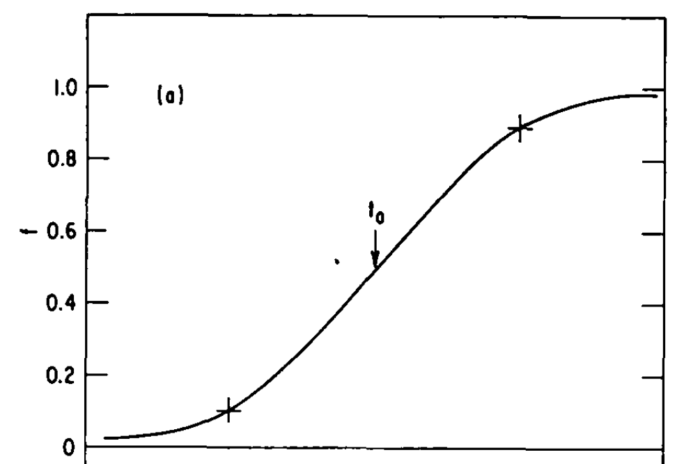

In truth, the field stands to become far more important - and far more ripe for design-level breakthroughs - in the next 65 years than it was in its first 65. 

Why? To date, the primary manifestation of our semiconductor-based information age is the enablement of software to "eat" countless fields of endeavor. Over the course of the 20th century, silicon and CMOS proved the ideal forum for building general-purpose computation machines. Their general-purpose-ness was their true killer app: it enabled a conceptually new layer, shortly thereafter named _software_, by which they could be redirected to a seemingly endless variety of tasks. 

Moreover, these machines kept getting better, year after year. In 1965's _Cramming More Components onto Integrated Circuits_ [@moore1998cramming], Gordon Moore introduced the now-famous "law" setting the field on an exponential rate of progress for the foreseeable future. But the phrase _Moore’s Law_ has always been off. The inclusion of the term _law_, coupled with the fact that it concerns a complicated scientific-seeming topic, leads people to believe it is some law of nature, like Newton’s laws of motion or the second law of thermodynamics. Or perhaps more like Ahmdal’s law, which sets a theoretical limit on a category of abstract quantities (computer programs). 

What Gordon Moore made in truth was a prediction, and one about people. Particularly the intellectual progress of a group of people driving semiconductor design and fabrication. He predicted an exponential rate of progress in this field, extending indefinitely into the future. Most incredibly, he proved right, for decades on end. Countless inventions and person-years were required; the "law" became a sort of self-fulfilling prophecy as the north-star goal for the field. Later, predicting the _end_ of Moore's Law became a popular prognostication game. Strangely for many, including some of the leaders of our field, the notion of it having an _end_ failed to dispel the idea of its inevitability. No one expects gravity or entropy to end, much less any time soon. But many accept chip-progress as a fact of nature, somehow confined to the late 20th century.

\setkeys{Gin}{width=\linewidth}
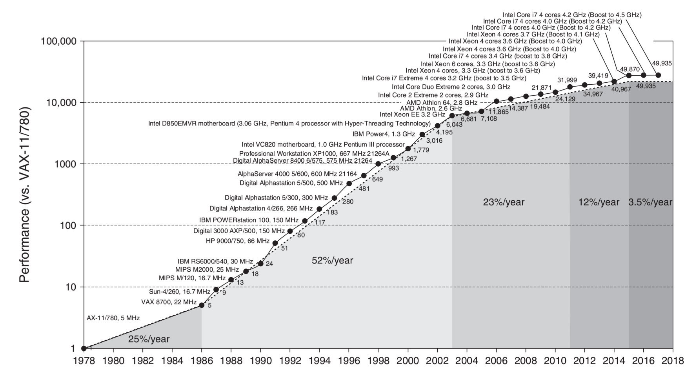

Herbert Stein made a more ironclad eponymous "law" a few decades later: _if something cannot go on forever, it will stop_. So it is with Moore's great prediction. There is no definitive accounting for when it ended, but at the time of this writing, the "Moore Era" is over. Countless accounts of its wind-down have been offered, including figure~\ref{fig:patterson_moore}, excerpted from Patterson \& Hennessy's seminal computer architecture text. 

The end of the Moore Era coincided with large swaths of human activity just catching on to just how useful all this computation could be. And perhaps more impactfully, other swathes realized that incredibly computation-intensive methods (i.e. those of machine learning) proved a ways more suitable to a variety of tasks than prior, "expert" programmed methods. The combination means one thing: there will be much more need for much more specialized, task-centric hardware. Where software "ate" the last era, hardware will eat the next one. And there is no more free lunch to be dined-out on from a rapidly ever-improving set of process technologies. 

While not especially widespread, this outlook is also not novel. The same Patterson \& Hennessy responsible for cataloging the wind-down shown in figure~\ref{fig:patterson_moore} went so far as to deem the combination of developments the dawn of a "new golden age"  [@hennessy2019new]. Whether we view this as a challenge or opportunity, the world of the coming decades will need far more customized electronic hardware than that of decades past. Integrated circuits will continue to be at their core. ICs are also among the most laborious, most capital intensive, most challenging parts to design - and especially to get right. We will need a lot - perhaps 10x or 100x - more of them. 


## The IC Design Process

Integrated circuits are "integrated" in the sense that more than one - and often in current practice, more than ten orders of magnitude more than one - circuit component is integrated in a single silicon die.

The most detailed representation of these circuits, and the sole representation sufficiently detailed for fabrication, is commonly called _layout_. IC layout is a chip's physical blueprint. The nature of silicon manufacturing allows for representing these blueprints in "2.5D" terms. Each silicon wafer is extremely uniform in one of its three axes. This axis extends into and out of the plane of the die surface, and is commonly referred to as the z-axis. This z-axis is typically split into a discrete number of _layers_. These layers refer to a variety of physical features, such as metal connections, insulators there-between, ion injections which form transistor junctions, etc. The IC "x" and "y" dimensions, in contrast, span the surface of the die, and are much more free-form to be specified by the IC designer. These two axes typically allow for nearly free-form closed 2D polygons. An IC blueprint is therefore conceptually comprised of a list of such polygons, each affixed with a z-axis layer annotation. Figure~\ref{fig:layout2d} depicts a typical IC layout visualization.

Figure~\ref{fig:layout3d} expands this view to the three-dimensional structure that it represents.

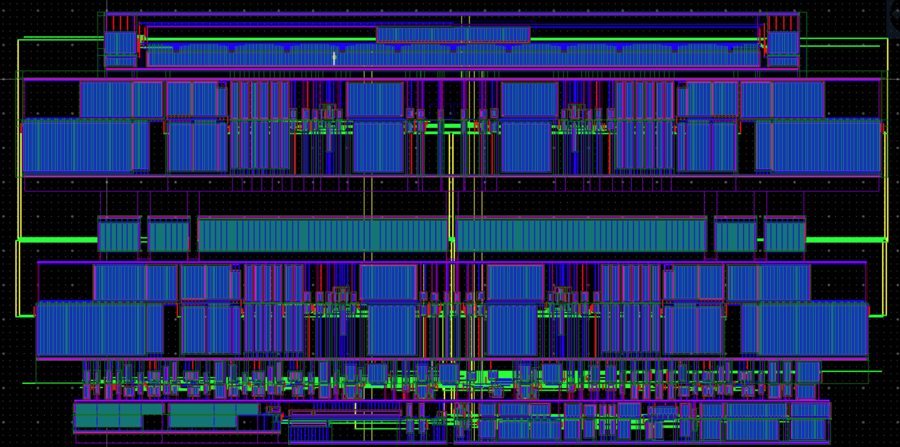

\setkeys{Gin}{width=.5\linewidth}
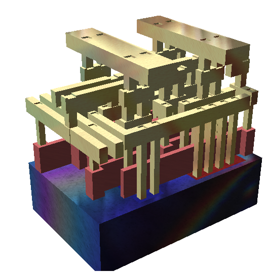

While layout is the sole language comprehensible for IC fabrication, it is generally far too detailed for much of IC design. The silicon design and closely related electronic design automation (EDA) software fields have, over time, produced a substantial stack of software, concepts, and practices which allow for IC-design at far more abstract levels than that of physical layout. Different subsets of the IC field have proven more and less amenable to these improvements.

This stack's second-lowest layer is often called the _circuit_ level. In circuit terms, chips are made of combinations of primitive components such as MOS transistors and resistors, and connections between them. 

Each circuit component (or *element*) generally has a short-form conceptual and mathematical description (such as "V = IR"). Their realizations are technology and implementation specific, often requiring elaborate combinations of the 2.5D layout geometry. For example MOS transistors include their core conceptual terminal diffusions and gate material, but often also include countless performance and yield-enhancing features, especially at advanced geometries. Linear resistors might similarly be built of any of a number of materials. It is the inclusion of more than one of these conceptual components that makes silicon circuits "integrated"; their "integration" refers to a prior era, in which each circuit component would need be a separate element on a circuit board. 

In a loose analogy to software, layout is akin to machine code. It is the sole format understood by the underlying implementation technology (in software, the processor; in silicon, the fab). Circuits are then analogous to the assembly language. Each circuit (and assembly) is specific to its underlying implementation technology. 

## The Analog Bottleneck

For decades both software and hardware design have searched for more productive, higher levels of abstraction. These efforts have proven more and less successful in different sub-stripes of IC design. The next key layer, popularized in the 1980s, maps roughly to "C-level" languages popular for low-level and "systems" software. Popular hardware description languages (HDLs) introduced around this time include Verilog and VHDL. Each allow for technology-independent descriptions of digital circuits. This paradigm also introduces the _logical_ (rather than the circuit) level as the primary one of simulation and verification. Discrete-event simulation further enhances the efficiency of this verification paradigm. 

In addition to enhancing the efficacy of verification, the digital HDLs provided a dramatic improvement in workflow to produce layout. In the typical _digital back-end flow_, HDL code is transformed into layout by way of an optimizing "layout compiler". Designers provide a combination of register-transfer level (RTL) HDL code, plus a set of physical constraints and/or goals. These two primary inputs are fed to a compilation pipeline, generally comprising a combination of _logic synthesis_ which translates RTL to gate-level netlists, and "place and route" (PnR) layout compilation. 

Notably, the benefits afforded by the 80s-era HDLs accrue to digital circuits, but largely fail to aid analog ones. Analog circuits escape the logical verification paradigm, and instead rely on the circuit-level concepts such as the solutions to Kirchoff's laws for verification. Moreover, analog circuits have escaped the productivity gains of the automatic layout-compilation pipeline, for reasons covered in detail in later sections of this manuscript. 

Analog and custom circuits have accordingly long been acknowledged as a bottleneck in the IC design process. In the author's anecdotal experience, analog efforts tend to produce (notably crude) designer productivity metrics (e.g. transistor-count per designer-month) on the order of 100-1000x lower than their digital peers. This may be, and in the author's opinion is likely to be, the bottleneck to the post-Moore era. Many other research efforts, including many substantial sources of inspiration here, endeavor to further raise the productivity and abstraction-level of the digital flow. This work focuses on analog and custom circuits. 


## The Likely Role of Open Source

The period during which this work was completed (2020-23) corresponded to something of a renaissance in open source activity in the silicon field. Ironically IC EDA (and particularly its outpost here at Berkeley) were pioneers in open-source distribution, particularly that for industrial-grade applications. SPICE [@vladimirescu1980simulation] serves as a prime example. The many branches of SPICE's family tree have since largely been absorbed into various commercial and in-house products dotting the IC industry. Open-source then slowly disappeared from the IC field's common set of practices. 

We note that three related, relevant quantities can in principle be distributed in open-source form: 

#. Open-source _design content_, i.e. HDL code, circuits, and/or layouts, possibly coherently arranged into instantiable silicon Intellectual Property (IP),
#. Open-source _EDA software_, the programs required to produce these circuits,
#. Open-source _process technology_, i.e. the underlying fabrication steps, or the designer "API" to these technologies, commonly called a Process Design Kit (PDK).

The three are separable in principle, but tightly tied in practice.

The relationship between (2) EDA and (3) fab is particularly tangled. Particularly, most process-portable EDA software requires an elaborate "technology setup" set of input - the details of the technology required by the tool. For digital PnR this often comes in the form of a technology-LEF, for physical verification (Layout vs Schematic (LVS), Design Rule Checks (DRC)) it includes countless design rules and detailed specifications of the process. More important, this fab input is (a) highly laborious (and crucial) to get right, (b) generally tightly tied to the EDA tool it feeds, and (c) often authored in a language or format which is _proprietary to each tool_. While fabs author their "EDA input", they are often not at liberty to publish it. Fabricators understandably focus on the most popular such tools (buoyed by relationships with the most popular EDA software providers). Supporting a new suite of EDA software is no small ask. 

Design content is, in principle, the easiest of the three to open-source. Digital design in HDL (or modern HDLs such as Chisel) are especially amenable. Many research processor designs - and even a few industrial ones - are accordingly available in open-source distribution. Analog circuits are much more dependent on their implementation technologies, and accordingly have seen much less success in open source. 

Open source EDA, especially that for digital design, is the subject of a great deal of academic research. But in every category known to the author, available academic/ open-source EDA lags commercial offerings, often substantially and in metrics directly relevant to designers (quality of results, execution time, etc.). More importantly, technology-dependent open-source EDA suffers from the problems of _access_ to process technologies described a few paragraphs back. 

The tight tying of fab and EDA would seem to drive a desire for open-source process technology. Such efforts, particularly those of [@ansell2020missing], have helped to produce open-source process design kits from SkyWater Technologies, GlobalFoundries, and IHP Microlectronics. These efforts have generally been led by third parties and/or communities rather than the fabs themselves. Paired (and often free) multi-project shuttles have enabled a wide variety of projects which would not otherwise have been possible. 

Despite these laudable efforts, I do not hold much hope for open-source distribution of silicon process technologies, or even of "just" their PDKs. Before the open-source release of SkyWater's 130nm technology, open-source was clearly highly counter-cultural to the entire fab space. The other fabs have clearly seen the efforts of the early open-sourcers, especially SkyWater. And they have hopefully noticed the amount of additional attention driven to a few roughly two-decades-old technologies. But they have simultaneously observed a more concerning shift: one in world public policy. A number of nations, notably including the US and China, have made semiconductor technologies a central focus of new policy initiatives. The primary impact on the distribution of technology information has been to make it more constrained. Open-source is essentially the _least_ constrained form of such distribution. Even if it has not been explicitly banned or prohibited, I expect most fabs have gotten a message, they are far better off staying away.

I do believe that open-source process technologies will have a helpful role in IC _education_. Berkeley's curriculum includes an unusually great deal of  exposure to realistic, modern implementation technologies, culminating in the "tape-out course" series detailed in [@burnett2018] and [@guo2023osci]. These experiences have proven much more difficult for many peer institutions to provide. Access to these technologies is tightly guarded and costly to maintain. The emergence of (at least a few) open-source technologies allows for a broader suite of educational opportunities in realistic implementation technologies, as described in [@alam2022].


## The Roadmap

I believe that our field is far more important than most to the world's next several decades. And I think we can - and need to - do it a ways better.

This thesis doesn't have all the answers. ^[I have been accused of believing the opposite. But I don't! It says so, right here in the front!] It catalogues what I believe are valuable contributions to the technology of producing circuits, particularly custom and analog ones, including their physical layouts. And it attempts to point out a number of what I believe have been dead ends. 

One sub-thesis: many such projects suffer from insisting on attempting to reinvent the entirety of our industry, each and every time over. I fear this work has not entirely avoided this trap. One virtue (as defined by its author) is the underlying work's modularity. While I am deeply grateful for all of this work's collaborators both inside and outside of UC Berkeley, the sheer effort involved pales in comparison to the 65 year history of the IC and EDA industries, or even their analog sub-fields. This modularity goal has proven valuable for the several research, corporate, and start-up users who bravely enjoined their fate to this work, often while it was still on the runway. Many have picked up this effort's pieces; to my knowledge, no two have adopted the same set.

A further sub-thesis: making the next rounds of progress will require taking a few steps back. Particularly, several long-worn ideas need a rethink. We will cover:

- The core data model used to represent IC design content, commonly referred to as the _design database_, and a cloud-era substitute. 
- The primary design-entry mechanisms for custom and analog circuits. For most of their history these have been pictures. This thesis argues for, and introduces methods to, make them better with code instead.
- A re-do of those graphical pictures, for the (smaller number of) cases where we agree they provide value. Emphasis is placed on _portability_ and _sharing_.
- A survey of both historical research attempts to, and first-person software attempts to, rethink the custom layout process. Several are tried, to varying effect. My primary answer to what works best remains "it depends".
- An introduction to "Machine Learning (ML) for X", where "X" becomes circuits. What does it require for ML techniques to make real contributions to the production of circuits, layouts, or the software that aids them?


# IC Design Databases
~\label{chap:vlsir}

## "Databases" (Ahem) 101

IC design data is commonly represented in "design databases". These systems are inspired by relational database management systems (RDBMS), ubiquitously used throughout modern server-side applications. IC databases generally look much like the low layers of an RDBMS. They include a binary format for storing and packing records, and a API for querying and writing those records. The typical low layers of such an RDBMS are illustrated in Figure~\ref{fig:rdbms} from our department's own introductory [database systems course](https://cs186berkeley.net/).

\setkeys{Gin}{width=.75\linewidth}
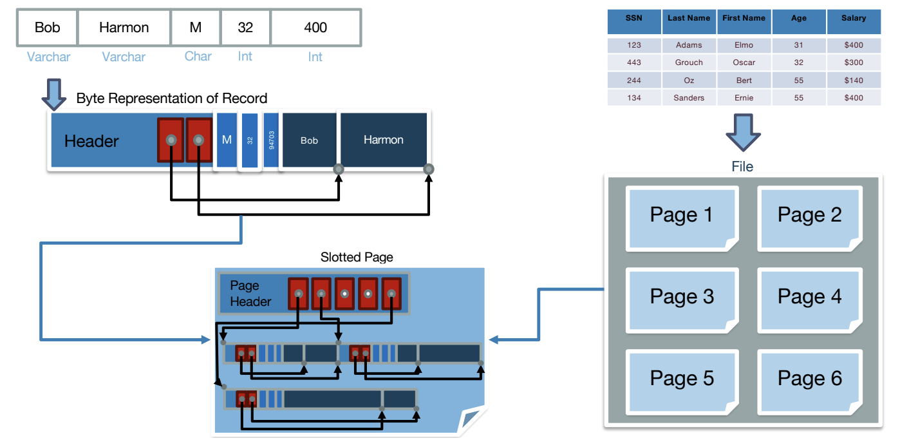

Instead of a dedicated query _language_ (e.g. SQL) and accompanying compiler and query-optimizer, IC databases are typically embedded in a host programming language, and expose an API to manipulate design data in that language. Perhaps the most prominent commercial example is OpenAccess [@guiney2006oa], originally authored by Cadence Design Systems. Perhaps the most prominent freely available database is OpenDB [@spyrou2019opendb], notable for its centrality to the OpenROAD project [@kahng2021openroad].

These databases are optimized to enable efficient offloading of design data between memory and disk, especially for designs too large to reasonably fit into the former. This goal is near entirely driven by one application: digital place-and-route layout compilation. For common digital circuits including millions of gates and associated metadata, the optimization makes sense. Optimal PnR, and even "good enough" PnR, includes several NP-complete sub-problems, and commonly requires industrial-scale resources and days of runtime. Without such optimizations, large compilations often fail to complete.

Analog circuits differ in several respects. First and perhaps most importantly: they are much smaller. Rarely if ever do they contain millions of elements, and infrequently even thousands.

Second, analog circuits demand to be designed and laid out hierarchically for another reason: their verification is hierarchical. Their necessary mode of evaluation - the SPICE-class simulation - is far too slow, and scales far too poorly, to evaluate compound circuits in useful runtimes. Compound analog circuits such as Radio Frequency (RF) transceivers, wireline Serializer/Deserializer transceivers (SERDES), data converters, and Phase-Locked Loops (PLLs) are commonly comprised of subsystems whose simulation-based verification is far more tractable than that of the complete system.

## ProtoBuf 101

The 21$^{st}$ century advent of widespread cloud computing and accompanying "hyper-scalar" cloud-service providers generated something of a renaissance in markup-style "data languages", and in demand for network-serializable data more generally.

Their demands are entirety practical: projects of their scale require hundreds of server-side programs cooperating and exchanging data. These programs are commonly designed by hundreds of disparate, largely independent teams, comprising thousands (or tens of thousands) of individual engineers. They have no chance at aligning a tall stack of libraries, versions, operating system requirements, and other dependencies which would be required to run on a single machine, in a single program.

Moreover, many of these "datacenter-scale programs" subsystems have vastly different resources needs, and different prospects for _scaling_ across usage. Some require specialty compute resources such as machine learning acceleration, either via graphics processors or special-purpose silicon. Others, e.g. for data caching, benefit from little compute but greatly from unusually large memory systems. Others "scale-out", requiring little compute, memory, or other resources per task, but requiring tremendous numbers of copies of that task, benefitting from near-perfect scaling via hardware parallelism. These subcomponents are then broken into sub-programs, each of which executes on appropriate hardware, and in tailored execution environments. Communication between these components occurs via the datacenter network.

Protocol buffers (ProtoBuf) [@Varda2008] were introduced first internally to Google and then as open-source software to meet these needs of communication between diverse programs exchanging rich structured data. The ProtoBuf system principally includes three components:

- An efficient binary wire format,
- A data schema description language (SDL), and
- A paired binding code compiler

Several similar, generally related follow-on projects including [Cap'n Proto](https://capnproto.org/), [FlatBuffers](https://flatbuffers.dev/), and [FlexBuffers](https://flatbuffers.dev/flexbuffers.html) each take similar high-level approaches. Each includes the three core protobuf components (binary format, schema language, and compiler), differing in a variety of trade-offs in schema feature-set and format design. Such projects have proliferated sufficiently to motivate comparative research [@raghavan2021breakfast] into their relative performance strengths and weaknesses, across a variety of data content.

Meta-programs using protobuf begin by "programming" datatypes in its SDL. This operates much like a programming language in which only struct-definitions are allowed. The core protobuf structure-type `message` indicates its intended usage in communication. The protobuf compiler then accepts this SDL as input, and transforms it into typed "bindings" in a diverse set of programming languages, notably including Python, C++, Rust, JavaScript, and most other popular alternatives. An example protobuf SDL `message` definition:

```protobuf
syntax = "proto3";

message SearchRequest {
  string query = 1;
  int32 page_number = 2;
  int32 results_per_page = 3;
}
```

Protocol Buffer messages and its SDL are both strongly typed. Messages include a variety of built-in primitive types, similar to those of most programming languages. These include integer and floating-point numeric types, booleans, strings, byte arrays, and user-defined enumerations. Message types can be nested, holding attributes valued by other messages. Several common container-types such as sequences (`repeated`), union types (`oneof`), and  key-value mappings (`map`) are also built in. Examples of more of these constructs: 

```protobuf
message SearchResponse {
  repeated Result results = 1;
}

message Result {
  string url = 1;
  string title = 2;
  repeated string snippets = 3;
}

message SampleMessage {
  oneof test_oneof {
    string name = 4;
    SubMessage sub_message = 9;
  }
}
```

## The `VLSIR` Design Database Schema

_VLSIR_ is the name of this work's central design database, and of the broader software system which operates on it. VLSIR is designed in ProtoBuf. [Its design database schema](https://github.com/vlsir/vlsir) is authored in the ProtoBuf SDL. A simplified excerpt from the VLSIR schema, defining the `layout.Instance` type, is included below.

```protobuf
// # Layout Instance
message Instance {
  string name = 1;     // Instance Name
  Ref cell = 3;        // Cell Reference

  Point origin = 4;    // Origin location
  bool reflect = 6;    // Reflection
  int32 rotation = 7;  // Rotation (deg)
}
```

The VLSIR schema defines such types for circuits, layout, spice-class simulation input and output, and process technology. The schema format serves as a core exchange medium for a variety of programs and libraries written in a variety of languages, with varying trade-offs between designer productivity, performance, and ease of compatibility with related libraries.


## Design of the `VLSIR` Software System

\setkeys{Gin}{width=\linewidth}
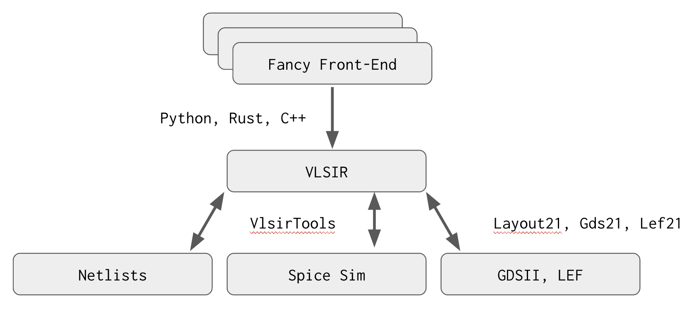

The broader VLSIR system, schematically depicted in Figure~\ref{fig:vlsir-system}, is heavily inspired by the LLVM [@lattner2004] compiler platform, and by the FIRRTL system ([@izraelevitz2017], [@li2016]) developed shortly beforehand by colleagues here at UC Berkeley. Like LLVM and FIRRTL, VLSIR defines a central design interchange format. Both LLVM and FIRRTL name this layer their Intermediate Representation (IR). The name _VLSIR_ is in fact a portmanteau of two acronyms: the (quite dated) Very Large Scale Integration (VLSI) and intermediate representation. Where LLVM and FIRRTL's IRs are defined through the constructs of their respective implementation languages, VLSIR's  is defined in the protocol buffer SDL. All three projects build this central data layer for the purposes of decoupling and reusing diverse _front and back ends_.

The roles of front-ends and back-ends differ somewhat between the three. In LLVM, a front-end is (more or less) a programming language. The compilers for Rust and C++, for example, differ principally in the front-end, which translates user-authored code into LLVM's core intermediate representations. A back-end is (again, more or less) a target compiler platform. Examples generally include combinations of the target instruction set (x86, ARM, RISC-V, etc), and potentially the target OS. FIRRTL has a similar concept of a front-end, whereas its back-ends are hardware "elaboration targets", which might be ASIC synthesis, FPGAs, or cloud-scale distributed processing environments.

VLSIR's front-ends are also user-facing programming tools. Generally we have eschewed designing altogether new languages (or "DSL"s) and focused on providing libraries in existing, popular languages. These front ends include libraries for circuit design (\autoref{chap:hdl21}), layout design (\autoref{chap:layout}), and several dedicated libraries targeting specific circuit families. VLSIR's back-ends are generally its interface to existing EDA software and data formats. For example, a widely used back end focuses on executing SPICE-class simulation, parsing and providing its results in schema-defined data structures.

The choice of ProtoBuf affords for a rich diversity of front and back ends, implemented in a diversity of programming languages and featuring diverse needs for performance, portability, and designer productivity. Protobuf's efficient binary format is especially invaluable for VLSIR's most information-rich set of data: that of IC layout. While [@raghavan2021breakfast] finds that alternative serialization systems can outperform protobuf in space-efficiency and in (de)serialization runtime, the differences are, on VLSIR's scale of demands, fairly immaterial. More important to VLSIR, the protobuf ecosystem and surrounding tools are materially more developed than the peer systems compared. At the scale of VLSIR's needs, the shared high-level approach is what dictates the bulk of performance; relative differences inject second-order effects. 

### VLSIR Circuits 

To illustrate the design of the VLSIR schema, we highlight one of its core subcomponents: circuit descriptions. VLSIR's database schema includes a `circuit` subcomponent which defines its circuit-level data model. The VLSIR circuit model is intentionally low-level, similar to that of structural Verilog. The `vlsir.circuit` components are a core interchange vessel for most programs using Hdl21, covered in \autoref{chap:hdl21}. 

As in Hdl21 and Verilog, VLSIR's principal element of hardware reuse is called its `Module`. `vlsir.circuit.Module`s consist of:

- Instances of other `Module`s, or of "headers" to externally-defined `ExternalModule`s 
- Signals, each of potentially non-unity `width`. Each `vlsir.circuit.Signal` is therefore similar to the bus or vector of many popular HDLs, or more specifically to the _packed array_ of Verilog. A subset of `Signal`s are annotated with `Port` attributes which indicate their availability for external connections.
- Connections there-between. Since `Signal`s, including those used as `Port`s, have non-unit bus widths, combinations to comprise their connections include sub-bus `Slice`s as well as series `Concatenation`s. This is the principal difference between VLSIR's model and that of lower-level models such as common in SPICE languages; signals and ports are all buses, and therefore can be combined in this variety of ways.

The principal collection of hardware content, `vlsir.circuit.Package`, is a collection of `Module` definitions which may instantiate each other. The VLSIR `Package` might commonly be named a "library" in similar models. Each `Package` includes a dependency-ordered list of `Module`s, as well as the headers to any `ExternalModule`s it requires.

A simplified excerpt of the `vlsir.circuit` data schema:

```protobuf
//!
//! # vlsir Circuit Schema
//!

syntax = "proto3";
package vlsir.circuit;
import "utils.proto";

// # Package
// A Collection of Modules and ExternalModules
message Package {
  // Domain Name
  string domain = 1;
  // `Module` Definitions
  repeated Module modules = 2;
  // `ExternalModule` Headers
  repeated ExternalModule ext_modules = 3;
  // Description
  string desc = 10;
}

// # Port
// An externally-visible `Signal` with a `Direction`.
message Port {
  enum Direction {
    INPUT = 0;
    OUTPUT = 1;
    INOUT = 2;
    NONE = 3;
  }
  string signal = 1;        // Reference to `Signal` by name
  Direction direction = 2;  // Port direction
}

// # Signal
// A named connection element, potentially with non-unit `width`.
message Signal {
  // Signal Name
  string name = 1;
  // Bus Width
  int64 width = 2;
}

// # Signal Slice
// Reference to a subset of bits of `signal`.
// Indices `top` and `bot` are both inclusive,
// similar to popular HDLs.
message Slice {
  // Parent Signal Name
  string signal = 1;
  // Top Index
  int64 top = 2;
  // Bottom Index
  int64 bot = 3;
}

// Signal Concatenation
message Concat {
  repeated ConnectionTarget parts = 1;
}

// # ConnectionTarget Union
// Enumerates all types that can be
// (a) Connected to Ports, and
// (b) Concatenated
message ConnectionTarget {
  oneof stype {
    string sig = 1;     // Reference to `Signal` (name) `sig`
    Slice slice = 2;    // Slice into signals
    Concat concat = 3;  // Concatenation of signals
  }
}

// # Port Connection
// Pairing between an Instance port (name)
// and a parent-module ConnectionTarget.
message Connection {
  string portname = 1;
  ConnectionTarget target = 2;
}

// Module Instance
message Instance {
  // Instance Name
  string name = 1;
  // Reference to Module instantiated
  vlsir.utils.Reference module = 2;
  // Parameter Values
  repeated vlsir.utils.Param parameters = 3;
  // Port `Connection`s
  repeated Connection connections = 4;
}

// Module - the primary unit of hardware re-use
message Module {
  // Module Name
  string name = 1;
  // Port List, referring to elements of `signals` by name
  // Ordered as they will be in order-sensitive formats,
  // such as typical SPICE netlist dialects.
  repeated Port ports = 2;
  // Signal Definitions, including externally-facing `Port`s
  repeated Signal signals = 3;
  // Module Instances
  repeated Instance instances = 4;
  // Parameters
  repeated vlsir.utils.Param parameters = 5;
  // Literal Contents, e.g. in downstream EDA formats
  repeated string literals = 6;
}

// Spice Type, used to identify what a component is in spice
enum SpiceType {
  // The default value is implicitly SUBCKT
  SUBCKT = 0;
  RESISTOR = 1;
  CAPACITOR = 2;
  INDUCTOR = 3;
  MOS = 4;
  DIODE = 5;
  BIPOLAR = 6;
  VSOURCE = 7;
  ISOURCE = 8;
  VCVS = 9;
  VCCS = 10;
  CCCS = 11;
  CCVS = 12;
  TLINE = 13;
}

// # Externally Defined Module
message ExternalModule {

  // Qualified External Module Name
  vlsir.utils.QualifiedName name = 1;
  // Description
  string desc = 2;
  // Port Definitions
  // Ordered as they will be in order-sensitive formats,
  // such as typical SPICE netlist dialects.
  repeated Port ports = 3;
  // Signal Definitions
  repeated Signal signals = 4;
  // Params
  repeated vlsir.utils.Param parameters = 5;
  // Spice Type, SUBCKT by default
  SpiceType spicetype = 6;
}
```

References (or "pointers") between HDL objects are excessively common. Each `Instance` in a `Module` needs some form of reference to whatever it should instantiate. Each `Slice` above requires some indication as to which parent-Signal it is slicing. Markup-style languages tend to lack native such reference capabilities. ProtoBuf is no exception. Unlike a typical executable programming language model, rich with memory-address-values "pointers" between objects, markup languages lack such an implicit address space. Schema-authors are generally required to design such mechanisms for themselves. VLSIR is no different. Most such references in VLSIR are string-based. For example the `signal` (parent) field of each `Slice` is not a memory address, or a `Signal` message itself, but a string-valued "reference" to its name. 

The core `Instance`-`Module` reference-referent pair has a slightly more elaborate form. Modules may instantiate modules defined outside their parent `Package`. These "global" references use a domain-qualified name. Each `Package` includes a (within any given program) necessarily unique `domain` name-string. References to modules within the same package do not require such a domain-qualifier; their parent domain is essentially the implicit default. References to other packages use a `QualifiedName`-based combination of domain and module-name. 

```protobuf
// # Domain-Qualified Name
// Refers to an object outside its own namespace,
// at the global domain `domain`.
message QualifiedName {
  string domain = 1;
  string name = 2;
}

// # Reference
// Pointer to another message,
// either defined in its own namespace (`local`)
// or another (`external`).
message Reference {
  oneof to {
    // Local string-valued reference.
    // Typically the `name` or similar field of the referent.
    string local = 1;
    // Domain-qualified external reference
    QualifiedName external = 2;
  }
}
```

We envision the VLSIR reference system extending in a few more directions, e.g. to referents value with web URLs or database primary keys. The flexibility of the union-type based `Reference` system makes such expansions straightforward. 


# Analog HDL
~\label{chap:hdl21}

The primary high-productivity interface to producing VLSIR circuits and simulations is the [Hdl21](https://github.com/dan-fritchman/Hdl21) hardware description library. Hdl21 is a Python library, targeted and optimized for analog and custom integrated circuits, and for maximum productivity with minimum fancy-programming skill. Hdl21 exposes the root-level concepts that circuit designers know and think in terms of, in the most accessible programming context available. It is principally designed as a replacement for the _lingua franca_ of analog and custom circuits - the graphical schematic.

## A (Somewhat) Brief Intro to Hdl21

### Modules

Hdl21's primary unit of hardware reuse is the `Module`. It intentionally shares this name with Verilog's `module` and Chisel's `Module`, and also bears a strong resemblance to VHDL's `entity` and SPICE's `subckt`. Hdl21 `Modules` are "chunks" of reusable, instantiable hardware. Inside they are containers of a handful of hardware types, including:

- Instances of other `Modules`
- Connections between them, defined by `Signals` and `Ports`
- Fancy combinations thereof

An example `Module`:

```python
import hdl21 as h

m = h.Module(name="MyModule")
m.i = h.Input()
m.o = h.Output(width=8)
m.s = h.Signal()
m.a = AnotherModule()
```

In addition to the procedural syntax shown above, `Modules` can also be defined through a `class` based syntax by applying the `hdl21.module` decorator to a class-definition.

```python
import hdl21 as h

@h.module
class MyModule:
    i = h.Input()
    o = h.Output(width=8)
    s = h.Signal()
    a = AnotherModule()
```

The two `Module` definitions above produce identical results. The declarative style can be much more natural and expressive in many contexts, especially for designers familiar with popular HDLs. This class-based syntax is a pattern in Hdl21 usage. The `Bundle` and `Sim` objects covered in subsequent sections also make use of it. 

### Signals

Hdl21's primary connection type is its `Signal`. Hdl21 signals are similar to Verilog's `wire`. Each `Signal` has an integer-valued bus `width` field and serves as a multi-bit "bus". The content of Hdl21 signals is not typed; each single-bit slice of a `Signal` essentially represents an electrical wire.

A subset of `Signals` are exposed outside their parent `Module`. These externally-connectable signals are referred to as `Ports`. Hdl21 provides four port directions: `Input`, `Output`, `Inout`, and `None`. The last creates a directionless (or direction unspecified) port akin to those of common spice-level languages.

Creation of `Module` signal-attributes is generally performed by the built-in `Signal`, `Port`, `Input`, and `Output` "constructor functions". All of these produce the same `Signal` type as output. Signals have additional metadata that indicates their port visibility, direction, and usage intent. The "alternate constructors" serve as convenient shorthands for dictating this metadata, again often more comfortable for designers coming from popular HDLs.

```python
import hdl21 as h

@h.module
class MyModule:
    a, b = 2 * h.Input()
    c, d, e = h.Outputs(3, width=16)
    z, y, x, w = 4 * h.Signal()
```

### Connection Semantics

Popular HDLs generally feature one of two forms of connection semantics. Verilog, VHDL, and most dedicated HDLs use "connect by call" semantics, in which signal-objects are first declared, then passed as function-call-style arguments to instances of other modules.

```verilog
module my_module();
  logic a, b, c;                              // Declare signals
  another_module i1 (a, b, c);                // Create an instance
  another_module i2 (.a(a), .b(b), .c(c));    // Connected by name
endmodule
```

Chisel, in contrast, uses "connection by assignment" - more literally using the walrus `:=` operator. Instances of child modules are created first, and their ports are directly walrus-connected to one another. No local-signal objects ever need be declared in the instantiating parent module.

```scala
class MyModule extends Module {
  // Create Module Instances
  val i1 = Module(new AnotherModule)
  val i2 = Module(new AnotherModule)
  // Wire them directly to one another
  i1.io.a := i2.io.a
  i1.io.b := i2.io.b
  i1.io.c := i2.io.c
}
```

Each can be more concise and expressive depending on context. Hdl21 `Modules` support both connect-by-call and connect-by-assignment forms.

Connections by assignment are performed by assigning either a `Signal` or another instance's `Port` to an attribute of a Module-Instance.

```python
# Create a module
m = h.Module()
# Create its internal Signals
m.a, m.b, m.c = h.Signals(3)
# Create an Instance
m.i1 = AnotherModule()
# And wire them up
m.i1.a = m.a
m.i1.b = m.b
m.i1.c = m.c
```

Instances of Hdl21 Modules provide by-name dot-access to their port objects. This allows for connect-by-assignment without creating parent-module `Signals`:

```python
# Create a module
m = h.Module()
# Create the Instances
m.i1 = AnotherModule()
m.i2 = AnotherModule()
# And wire them up
m.i1.a = m.i2.a
m.i1.b = m.i2.b
m.i1.c = m.i2.c
```

As in Verilog and VHDL, the semantics of _calling_ an Hdl21 module-instance are to provide it with connections.

```python
# Create a module
m = h.Module()
# Create the Instances
m.i1 = AnotherModule()
m.i2 = AnotherModule()
# Call one to connect them
m.i1(a=m.i2.a, b=m.i2.b, c=m.i2.c)
```

These connection-calls can also be performed inline, as the instances are being created.

```python
# Create a module
m = h.Module()
# Create the Instance `i1`
m.i1 = AnotherModule()
# Create another Instance `i2`, and connect to `i1`
m.i2 = AnotherModule(a=m.i1.a, b=m.i1.b, c=m.i1.c)
```

Unlike in many dedicated HDLs, connection-calls can be made "in pieces", and can be "overridden" by further connection-calls.

```python
# Same as above
m = h.Module()
m.i1 = AnotherModule()
# Now only connect part of `i2`
m.i2 = AnotherModule(a=m.i1.a)
# Connect some more
m.i2(b=m.i1.b, c=m.i1.c)
# And change our mind about one
m.i2(c=m.i1.a)
```

### How `Module` Works

Many or most Hdl21 `Module`s are written such that they look like class definitions. They are not. In truth all modules share the same (Python) type - `Module` itself. `Module` is a "final" type; it is defined to explicitly disallow sub-typing: 

```python
class Module:
    # A simplified excerpt from `h.Module`
    def __init_subclass__(cls, *_, **__):
        raise RuntimeError("Sub-Typing `Module` is not supported")
```

Aside: as a design philosophy, Hdl21 generally eschews object-oriented practices in its user-facing interfaces. Several of its central types including `Module` and `Bundle` make this ban explicit. Hdl21 does make use of OOP techniques _internally_, and some at the "power user" (e.g. PDK package developer) level, primarily for defining its many hierarchy-traversing data model visitors. 

Instead Hdl21 makes heavy use of the decorator pattern, particularly applying decorators to class definitions of related objects. The `module` (lower-case) decorator function applied to so many `class` bodies does something like: 

```python
def module(cls: type) -> Module:
    # Create the `Module` object
    module = Module(name=cls.__name__)

    # Take a lap through the class body,
    # add everything to the `Module`
    for item in cls:
        module.add(item)

    # And return the Module
    return module
```

Note the input `cls` is a `type`. Python classes are runtime objects which can be manipulated like any other. E.g. they can serve as the argument to functions (as in `module`) and can serve as the return value from functions (as done by many `Generator`s). The `module` function takes one, trolls through all of its contents, and passes them along to `Module.add`. Type checking and schema organization, covered in upcoming sections, and implemented by `add`. When used as a class decorator, the type `cls` only exists during the execution of the `module` function body, and is then quickly dropped. 

The Python language class-definition semantics have a number of helpful properties in defining typical hardware content, particularly linked modular sets of data we generally refer to as "modules". The language defines the class body to be an execution namespace which runs from top to bottom. Assignments in this class-level namespace are immediately available both as raw identifiers, and in a "class dictionary", a string to value mapping of all the class-object's attributes. For example:

```python
class C:
  a = 1
  b = a + 2

print(C.__dict__)
# {'a': 1, 'b': 3, ...}
```

This capacity to refer to attributes once they are defined proves particularly handy. Hardware modules are comprised of a linked, named set of hardware attributes. It is common to conceptualize this set as a graph, or as various kinds of graphs depending on context. In both Python's language-level class body definitions and in Hdl21 modules, the edges between these graph nodes are the language's native "pointers" (references). 

It is possible, and even commonplace in comparable pieces of software, to define these edges otherwise. Common tactics including using name-based string references, paired with a central repository mapping all available names to their referents. This removes much of the fluidity of programs using the referents (notably, one must always have a reference available to the central repository!). And it erodes much of the value provided by the language's (somewhat) recently adopted gradual typing, generally borne of IDE aids, linters, and similar type-system-based programmer aids. 

The class-body is a convenient mechanism for defining what `Module` is at bottom: a structured collection of these hardware attributes. Each `Module`'s core data is a nested namespace of name-value mappings, one per each primary child HDL type, plus one overall namespace including their intersection. Conceptually `Module` is:

```python
@dataclass
class Module:
    ports: Dict[str, Signal] 
    signals: Dict[str, Signal] 
    instances: Dict[str, Instance] 
    instarrays: Dict[str, InstanceArray] 
    instbundles: Dict[str, InstanceBundle] 
    bundles: Dict[str, BundleInstance] 
    namespace: Dict[str, ModuleAttr]   # Combination of all these
```

Where each `Dict[str, X]` is a mapping from a string `name` which is also an attribute of `X`. As such, `Module` doesn't really _do_ all that much. (I.e. it doesn't have many methods, and is *almost* "plain old data".) `Module` includes only two API methods: `add` and `get`. Both operate on its namespace of HDL attributes. Addition places attributes into their associated type-based container, after checking them for valid types and naming. `Module.get` simply retrieves them by name. This structured arrangement of `Module` is nonetheless a central facet of the Hdl21 data model. Most code which processes it lies elsewhere, in hierarchical traversals performed by Hdl21's elaborators, PDK compilers, and other visitors. 

`Module` has one more central feature, directly attributable to its host language's capability: its by-name dot-access assignments and references. Python allows types to define override methods for setting and getting attributes (`__setattr__` and `__getattr__`) which Hdl21 uses extensively. These by and large route to `Module.add` and `Module.get` respectively. Their inclusion is nonetheless a central facet of what makes Hdl21 feel like a native, dedicated language. Designers accustomed to dedicated HDLs are generally familiar with making dot-access references, e.g. to hierarchical design objects. Hdl21 makes this a central part of the process of designing and constructing them. This is also a central motivation for why the `Module` API is so minimal. The intent is that module dot-accesses usually refer to *HDL objects*, i.e. they are named references to the signals, ports, instances, etc. that the module-designer has already added. 

```python
m = h.Module()
m.inp = h.Input() # __setattr__
m.add(h.Output(name="out")) # `m.add` is a method
print(m.get("inp").width) # As is `m.get`
print(m.out.width) # Most other `m.x`'s refer to its HDL objects 
```


### Generators

Hdl21 `Module`s are (almost) "plain old data". The power of embedding `Module`s in a general-purpose programming language lies in allowing code to create and manipulate them. Hdl21's `Generators` are functions which produce `Modules`, and have a number of built-in features to aid embedding in a hierarchical hardware tree.

In other words:

- `Modules` are "structs". `Generator`s are _functions_ which return them.
- `Generators` are code. `Modules` are data.

Generators are python functions, or more specifically wrappers around Python functions which:

- Accept a single argument, by convention named `params`, which is an Hdl21 `paramclass` (covered in the next section). And,
- Return an Hdl21 `Module`

```python
@h.generator
def MyFirstGenerator(params: MyParams) -> h.Module:
    return h.Module()
```

Generator function bodies execute arbitrary Python code, and are free to do whatever they like: perform complex optimizations, make requests to HTTP servers, query process-technology parameters, and the like. Generators may define `Module`s either procedurally, via the class-style syntax, or with any combination of the two.

```python
@h.generator
def MySecondGenerator(params: MyParams) -> h.Module:
    @h.module
    class MySecondGen:
        i = h.Input(width=params.width)
    return MySecondGen

@h.generator
def MyThirdGenerator(params: MyParams) -> h.Module:
    # Create an internal Module
    @h.module
    class Inner:
        i = h.Input(width=params.width)

    # Manipulate it a bit
    Inner.o = h.Output(width=2 * Inner.i.width)

    # Instantiate that in another Module
    @h.module
    class Outer:
        inner = Inner()

    # And manipulate that some more too
    Outer.inp = h.Input(width=params.width)
    return Outer
```

### Parameters

`Generators` must take a single argument, by convention named `params`, which is a collection of `hdl21.Param` objects. Each `Param` includes a datatype field which is type-checked at runtime. Each also requires string description `desc`, forcing a home for designer intent as to the purpose of the parameter. Optional parameters include a default-value, which must be an instance of `dtype`, or a `default_factory` function, which must accept no arguments and return a value of type `dtype`.

```python
npar = h.Param(dtype=int, desc="Number of parallel fingers", default=1)
```

The collections of these parameters used by `Generators` are called param-classes, and are typically formed by applying the `hdl21.paramclass` decorator to a class-body-full of `hdl21.Params`:

```python
import hdl21 as h

@h.paramclass
class MyParams:
    # Required
    width = h.Param(dtype=int, desc="Width. Required")
    # Optional - including a default value
    height = h.Param(dtype=int, desc="Height. Optional", default=11)
```

Each param-class is defined similarly to the Python standard-library's `dataclass`. The `paramclass` decorator converts these class-definitions into type-checked `dataclasses`, with fields using the `dtype` of each parameter.

```python
p = MyParams(width=8, text="Your Favorite Module")
assert p.width == 8  # Passes. Note this is an `int`, not a `Param`
assert p.text == "Your Favorite Module"  # Also passes
```

### A Note on Parameterization

Hdl21 `Generators` have parameters. `Modules` do not.

This is a deliberate decision, which in this sense makes `hdl21.Module` less feature-rich than the analogous `module` concepts in existing HDLs (Verilog, VHDL, and even SPICE). These languages support what might be called "static parameters" - relatively simple relationships between parent and child-module parameterization. Setting, for example, the width of a signal or number of instances in an array is straightforward. But more elaborate parameterization-cases are either highly cumbersome or altogether impossible to create. Hdl21, in contrast, exposes all parameterization to the full Python-power of its generators.

### Just what does `h.generator`... do?

One may wonder: just what is the difference between these two functions:

```python
@h.generator
def IsGenerator(params: MyParams) -> h.Module:
    m = h.Module()
    # ... Add stuff to `m`
    return m

# Same thing, without the `@h.generator` decorator
def NotGenerator(params: MyParams) -> h.Module:
    m = h.Module()
    # ... Add the same stuff to `m`
    return m
```

In short, these are identical function definitions, one of which is decorated by `h.generator` and therefore wrapped in an `h.Generator` object. In truth, both can work just fine. Advanced usage in fact tends to mix and match the two, based on the typically (but not always) helpful aids provided by `h.generator`. The function `IsGenerator` is run as-is, without modification, by the `h.Generator` wrapper. The generator machinery adds a few facilities, with the general intent of embedding calls to `IsGenerator` in a hierarchical hardware tree.

First and foremost are two related tasks: naming and caching. In many use-cases Hdl21 ultimately expects to produce code in legacy EDA formats (Verilog, SPICE, etc) which lack the _namespacing_ feature of popular modern programming languages. Moreover these formats tend to reject input in which a module is "multiply defined", even if with identical contents. This might, absent the `h.generator`'s naming and caching facilities, generate problems for programs like so:

```python
def G(params: Params) -> h.Module:
  m = h.Module()
  m.inp = h.Input(width=params.width)
  return m

@h.module
class Top:
  g1 = G(Params(width=1))
  g4 = G(Params(width=4))
```

Here a function `G` which creates and returns a parametric `Module` is called twice to produce two parametrically different instances. A naive translation to SPICE-level netlist code might produce something like:

```spice
.subckt Top
  xg1 g
  xg4 g
.ends

.subckt g inp
.ends

* This is the problem case: two identically *named* modules
.subckt g inp_3 inp_2 inp_1 inp_0
.ends
```

Hdl21 generators provide a built-in naming facility for managing these conflicts. Generated modules are named by a few rules:

- If the returned module is anonymous, indicated by a `None` value for its `name` field, it is initially given the name of the generator function. This would be the case for a generator-version of the function `G` above.
- If the generator has a non-zero number of parameters, a string representation of the value of those parameters is then appended to the module name.

The process of uniquely naming each `paramclass` value similarly has a few rules:

- A small set of built-in Python types are denoted as "scalars". These include strings, built-in numeric types, and options (`None`-ables) thereof.
- If a parameter class is comprised entirely of scalars, naming attempts to produce a readable name of the form `field1=val1 field2=val2`, where each `val` is the string representation of the scalar value.
- If either (a) the parameter class includes non-scalar parameters, or (b) attempts to produce a readable name generate strings of greater than a maximum length, naming is instead done based on a hash of the parameter values. Keeping the unique name to a reasonable maximum length is again a constraint of the desire to export into legacy EDA formats, many of which feature fairly short maximum name lengths.
- Hash-based naming begins by taking a JSON-encoded serialization of the parameter values. This is then hashed using the MD5 hashing algorithm, with random seeding (generally used for security) disabled to enable deterministic naming across processes and runs. The 32 character hex digest is then used as the unique parameter-value name. Note the JSON serialization step cannot natively be performed by many possible parameter types, particularly compound objects. These include many Hdl21 objects which are often valuable as parameters - e.g. `Module`s and `Generator`s themselves. Hdl21 includes built-in "naming only" serialization for these objects, which is used in the hash-based naming process. This serialization is not intended to be used for any other purpose. It generally hashes (something like) the definition path of the object in question, with no regard for its contents. It therefore cannot be used for serializing those contents.

Examples of the unique naming process:

```python
@h.paramclass
class Inner:
    i = h.Param(dtype=int, desc="Inner int-field")

@h.paramclass
class Outer:
    inner = h.Param(dtype=Inner, desc="Inner fields")
    f = h.Param(dtype=float, desc="A float", default=3.14159)

i = Inner(11)
print(h.params._unique_name(i))
# "i=11"

o = Outer(inner=Inner(11))
print(h.params._unique_name(o))
# "3dcc309796996b3a8a61db66631c5a93"
```

`Generator`'s second task, tightly related to unique-naming, is caching. Caching is most commonly used as a performance tactic, to avoid re-calculating lengthy and repeated computations. It serves this purpose for Hdl21 generators, especially complex ones. But its primary goal is elsewhere, again rooted in the desire to export legacy EDA formats with their lack of namespacing. Consider editing our prior example to make two _identical_ calls to `G`:


```python
def G(params: Params) -> h.Module:
  m = h.Module(name="G")
  m.inp = h.Input(width=params.width)
  return m

@h.module
class Top:
  g1a = G(Params(width=1))
  g1b = G(Params(width=1))
```

Here the function `G` is called twice, and produces two modules each with identical internal content. The naive translation to SPICE-level netlist code might produce something like:

```spice
.subckt Top
  xg1a g
  xg2a g
.ends

.subckt g inp
.ends

* Same problem: two identically *named* modules
.subckt g inp
.ends
```

Note that while the modules returned by successive calls to `G` have identical _content_, they are nonetheless distinct objects in memory. Exporting both - particularly, the identical _names_ of both - to legacy EDA formats would generally produce redefinition errors. Wherever possible, Hdl21 avoids producing identical modules in the first place. Each call to a `Generator` is logged and cached. Successive calls to the same function with identical parameter values return the same object. This ensures each generator-parameters pair produces the same module on each call. 

Note the use of such caching places a constraint on generator parameters: they must be hashable to serve as cache keys. Most of Hdl21's built-in types, e.g. `Module`, `Generator`, and `Signal`, are built to support such hashing, generally on an "object identity" basis. This is of course not the case for all possible parameter values, including many common types such as the built-in `list`. Generators with such unhashable parameters can opt out of the caching behavior via a boolean flag to the `generator` decorator-function. These generators then take on responsibility for ensuring that each module produced has a unique name. 

`Generator`s third and final task is _enforcement_. (This may be a feature or a bug per individual perspective.) Hdl21 was designed in the wake of a number of other academic analog-design libraries, and had the opportunity to observe their usage. One take-away: circuit designers are often not experienced programmers, and are accordingly unacquainted with countless practices that tend to make code more debuggable and understandable, both by others and by their future selves. Hdl21, and particularly its generator facility, attempts to enforce a few of these practices. These include:

- Generator parameters must be organized into a type
- Each parameter has a required "docstring" description
- Each parameter has a required datatype
- Parameter values are type-checked at runtime
- Generator return values (and their annotations) are similarly type-enforced at runtime

The latter practices regarding runtime type-strictness are pervasive throughout Hdl21. Generator parameters extend these practices to its most prominent user-facing interface.

### `Prefixed` Numeric Parameters

Hdl21 provides an [SI prefixed](https://www.nist.gov/pml/owm/metric-si-prefixes) numeric type `Prefixed`, which is especially common for physical generator parameters. Each `Prefixed` value is a combination of the Python standard library's `Decimal` and an enumerated SI `Prefix`:

```python
@dataclass
class Prefixed:
    number: Decimal  # Numeric Portion
    prefix: Prefix   # Enumerated SI Prefix
```

Most of Hdl21's built-in `Generators` and `Primitives` use `Prefixed` extensively, for a key reason: floating-point rounding. It is commonplace for physical parameter values - e.g. the physical width of a transistor - to have _allowed_ and _disallowed_ values. And those values do not necessarily land on IEEE floating-point values! Hdl21 generators are often used to produce legacy-HDL netlists and other code, which must convert these values to strings. `Prefixed` ensures a way to do this at arbitrary scale without the possibility of rounding error.

`Prefixed` values rarely need to be instantiated directly. Instead Hdl21 exposes a set of common prefixes via their typical single-character names:

```python
f = FEMTO = Prefix.FEMTO
p = PICO = Prefix.PICO
n = NANO = Prefix.NANO
µ = MICRO = Prefix.MICRO
m = MILLI = Prefix.MILLI
K = KILO = Prefix.KILO
M = MEGA = Prefix.MEGA
G = GIGA = Prefix.GIGA
T = TERA = Prefix.TERA
P = PETA = Prefix.PETA
UNIT = Prefix.UNIT
```

Multiplying by these values produces a `Prefixed` value.

```python
from hdl21.prefix import µ, n, f

# Create a few parameter values using them
Mos.Params(
    w=1 * µ,
    l=20 * n,
)
Capacitor.Params(
    c=1 * f,
)
```

These multiplications are the most common way to create `Prefixed` parameter values. `hdl21.prefix` also exposes an `e()` function, which produces a prefix from an integer exponent value:

```python
from hdl21.prefix import e, µ

11 * e(-6) == 11 * µ  # True
```

These `e()` values are also most common in multiplication expressions,
to create `Prefixed` values in "floating point" style such as `11 * e(-9)`.

### VLSIR Import \& Export

Hdl21's hardware data model is designed to be serialized to and deserialized from the VLSIR `circuit` and `spice` schemas. Exporting to industry-standard netlist formats is a particularly common operation. Hdl21 wraps and exposes all of VLSIR's supported netlist features and formats.

```python
import sys
import hdl21 as h

@h.module
class Rlc:
    p, n = h.Ports(2)

    res = h.Res(r=1 * e(3))(p=p, n=n)
    cap = h.Cap(c=1 * e(-6))(p=p, n=n)
    ind = h.Ind(l=1 * e(-9))(p=p, n=n)

# Write a spice-format netlist to stdout
h.netlist(Rlc, sys.stdout, fmt="spice")
```

### Spice-Class Simulation

Hdl21 includes drivers for popular spice-class simulation engines commonly used to evaluate analog circuits.
The `hdl21.sim` package includes a wide variety of spice-class simulation constructs, including:

- DC, AC, Transient, Operating-Point, Noise, Monte-Carlo, Parameter-Sweep and Custom (per netlist language) Analyses
- Control elements for saving signals (`Save`), simulation options (`Options`), including external files and contents (`Include`, `Lib`), measurements (`Meas`), simulation parameters (`Param`), and literal netlist commands (`Literal`)

The entrypoint to Hdl21-driven simulation is the simulation-input type `hdl21.sim.Sim`. Each `Sim` includes:

- A testbench Module `tb`, and
- A list of unordered simulation attributes (`attrs`), including any and all of the analyses, controls, and related elements listed above.

Example:

```python
import hdl21 as h
from hdl21.sim import *

@h.module
class MyModulesTestbench:
    # ... Testbench content ...

# Create simulation input
s = Sim(
    tb=MyModulesTestbench,
    attrs=[
        Param(name="x", val=5),
        Dc(var="x", sweep=PointSweep([1]), name="mydc"),
        Ac(sweep=LogSweep(1e1, 1e10, 10), name="myac"),
        Tran(tstop=11 * h.prefix.p, name="mytran"),
        SweepAnalysis(
            inner=[Tran(tstop=1, name="swptran")],
            var="x",
            sweep=LinearSweep(0, 1, 2),
            name="mysweep",
        ),
        MonteCarlo(
            inner=[Dc(var="y", sweep=PointSweep([1]), name="swpdc")],
            npts=11,
            name="mymc",
        ),
        Save(SaveMode.ALL),
        Meas(analysis="mytr", name="a_delay", expr="trig_targ_something"),
        Include("/home/models"),
        Lib(path="/home/models", section="fast"),
        Options(reltol=1e-9),
    ],
)

# And run it!
s.run()
```

`Sim` also includes a class-based syntax similar to `Module` and `Bundle`, in which simulation attributes are named based on their class attribute name:

```python
import hdl21 as h
from hdl21.sim import *

@sim
class MySim:
    tb = MyModulesTestbench

    x = Param(5)
    y = Param(6)
    mydc = Dc(var=x, sweep=PointSweep([1]))
    myac = Ac(sweep=LogSweep(1e1, 1e10, 10))
    mytran = Tran(tstop=11 * h.prefix.PICO)
    mysweep = SweepAnalysis(
        inner=[mytran],
        var=x,
        sweep=LinearSweep(0, 1, 2),
    )
    mymc = MonteCarlo(
        inner=[Dc(var="y", sweep=PointSweep([1]), name="swpdc")], npts=11
    )
    delay = Meas(analysis=mytran, expr="trig_targ_something")
    opts = Options(reltol=1e-9)

    save_all = Save(SaveMode.ALL)
    a_path = "/home/models"
    include_that_path = Include(a_path)
    fast_lib = Lib(path=a_path, section="fast")

MySim.run()
```

Note that in these class-based definitions, attributes whose names don't really matter such as `save_all` above can be _named_ anything, but must be _assigned_ into the class, not just constructed.

Class-based `Sim` definitions retain all class members which are `SimAttr`s and drop all others. Non-`SimAttr`-valued fields can nonetheless be handy for defining intermediate values upon which the ultimate SimAttrs depend, such as the `a_path` field in the example above.

Classes decorated by `sim` have a single special required field: a `tb` attribute which sets the simulation testbench. A handful of names are disallowed in `sim` class-definitions, generally corresponding to the names of the `Sim` class's fields and methods such as `attrs` and `run`.

Each `sim` also includes a set of methods to add simulation attributes from their keyword constructor arguments. These methods use the same names as the simulation attributes (`Dc`, `Meas`, etc.) but incorporating the python language convention that functions and methods be lowercase (`dc`, `meas`, etc.). Example:

```python
# Create a `Sim`
s = Sim(tb=MyTb)

# Add all the same attributes as above
p = s.param(name="x", val=5)
dc = s.dc(var=p, sweep=PointSweep([1]), name="mydc")
ac = s.ac(sweep=LogSweep(1e1, 1e10, 10), name="myac")
tr = s.tran(tstop=11 * h.prefix.p, name="mytran")
noise = s.noise(
    output=MyTb.p,
    input_source=MyTb.v,
    sweep=LogSweep(1e1, 1e10, 10),
    name="mynoise",
)
sw = s.sweepanalysis(
    inner=[tr], var=p, sweep=LinearSweep(0, 1, 2), name="mysweep"
)
mc = s.montecarlo(
    inner=[Dc(var="y", sweep=PointSweep([1]), name="swpdc"),],
    npts=11, name="mymc",
)
s.save(SaveMode.ALL)
s.meas(analysis=tr, name="a_delay", expr="trig_targ_something")
s.include("/home/models")
s.lib(path="/home/models", section="fast")
s.options(reltol=1e-9)

# And run it!
s.run()
```

### Primitives and External Modules

The leaf-nodes of each hierarchical Hdl21 circuit are generally defined in one of two places:

- Generic `Primitive` elements, defined by Hdl21. These include transistors, resistors, capacitors, and other irreducible components. 
- `ExternalModules`, defined _outside_ Hdl21. Such "module wrappers", which might alternately be called "black boxes", are common for including circuits from other HDLs.

### `Primitives`

Drawing an analogy to general-purpose programming languages, Hdl21's `Primitives` are its "built-in types". Figure~\ref{fig:hdl21-primitives} illustrates this comparison. In every typed programming language (or "system"), programmers define a data hierarchy of their target domain. Layers in this hierarchy are often called "structs" or "classes", and ideally map onto the reusable entities in the problem domain (e.g. Figure~\ref{fig:hdl21-primitives}' s' `League` and `Player`). The system must ultimately supply the lowest-level types which fill these hierarchies. Numeric types, strings, and pointers are common examples. Hdl21's analogous hierarchy is of `Module` definitions, each of which is a "struct" of hardware content. It similarly must provide the lowest-level atomic types. 

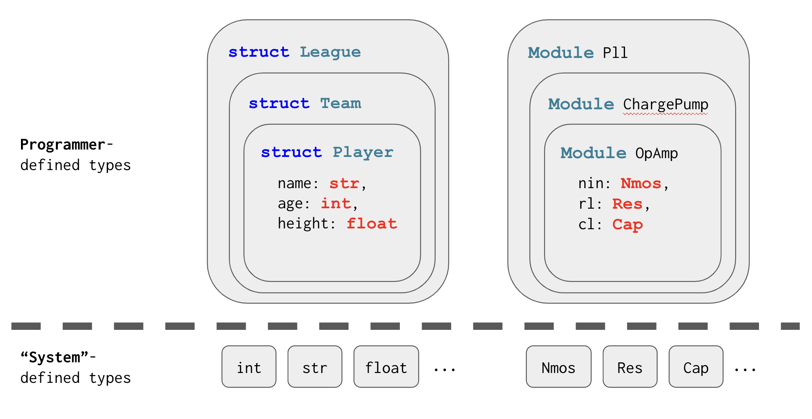

These atomic elements are Hdl21's `Primitive`s, provided in its `primitives` library. The content of the Hdl21 primitives library strongly resembles that of a typical SPICE simulation program - MOS and bipolar transistors, passives, ideal sources, and the like. Simulation-level behavior of these elements is typically defined by the internals of simulation tools and other EDA software. 

Hdl21 primitives come in _ideal_ and _physical_ flavors. The difference is most frequently relevant for passive elements, which can for example represent either (a) technology-specific passives, e.g. a MIM or MOS capacitor, or (b) an _ideal_ capacitor. Some element-types have solely physical implementations, some are solely ideal, and others include both.

The `hdl21.primitives` library content is summarized in table 3.1.

| Name                           | Description                       | Type     | 
| ------------------------------ | --------------------------------- | -------- | 
| Mos                            | Mos Transistor                    | PHYSICAL | 
| IdealResistor                  | Ideal Resistor                    | IDEAL    | 
| PhysicalResistor               | Physical Resistor                 | PHYSICAL | 
| ThreeTerminalResistor          | Three Terminal Resistor           | PHYSICAL | 
| IdealCapacitor                 | Ideal Capacitor                   | IDEAL    | 
| PhysicalCapacitor              | Physical Capacitor                | PHYSICAL | 
| ThreeTerminalCapacitor         | Three Terminal Capacitor          | PHYSICAL | 
| IdealInductor                  | Ideal Inductor                    | IDEAL    | 
| PhysicalInductor               | Physical Inductor                 | PHYSICAL | 
| ThreeTerminalInductor          | Three Terminal Inductor           | PHYSICAL | 
| PhysicalShort                  | Short-Circuit/ Net-Tie            | PHYSICAL | 
| DcVoltageSource                | DC Voltage Source                 | IDEAL    | 
| PulseVoltageSource             | Pulse Voltage Source              | IDEAL    | 
| CurrentSource                  | Ideal DC Current Source           | IDEAL    | 
| VoltageControlledVoltageSource | Voltage Controlled Voltage Source | IDEAL    | 
| CurrentControlledVoltageSource | Current Controlled Voltage Source | IDEAL    | 
| VoltageControlledCurrentSource | Voltage Controlled Current Source | IDEAL    | 
| CurrentControlledCurrentSource | Current Controlled Current Source | IDEAL    | 
| Bipolar                        | Bipolar Transistor                | PHYSICAL | 
| Diode                          | Diode                             | PHYSICAL | 

  : Hdl21 Primitives Library

Most primitives have fairly verbose names (e.g. `VoltageControlledCurrentSource`, `IdealResistor`), but also expose short-form aliases, both in the `hdl21` and `hdl21.primitives` namespaces. The `IdealResistor` primitive, for example, is also exported as each of `R`, `Res`, `Resistor`, `IdealR`, and `IdealRes`.

### `ExternalModules`

Alternately Hdl21 includes an `ExternalModule` which defines the interface to a module-implementation outside Hdl21. These external definitions are common for instantiating technology-specific modules and libraries. Other popular modern HDLs refer to these as module _black boxes_. An example `ExternalModule`:

```python
import hdl21 as h
from hdl21.prefix import µ
from hdl21.primitives import Diode

@h.paramclass
class BandGapParams:
    ratio = h.Param(
        dtype=int,
        desc="Bipolar Ratio",
        default=8,
    )

BandGap = h.ExternalModule(
    name="BandGap",
    desc="Example ExternalModule, defined outside Hdl21",
    port_list=[h.Port(name="vref"), h.Port(name="enable")],
    paramtype=BandGapParams,
)
```

Both `Primitives` and `ExternalModules` have names, ordered `Ports`, and a few other pieces of metadata, but no internal implementation: no internal signals, and no instances of other modules. Unlike `Modules`, both _do_ have parameters. `Primitives` each have an associated `paramclass`, while `ExternalModules` can optionally declare one via their `paramtype` attribute. Their parameter-types are limited to a small subset of those possible for `Generators`, primarily limited by the need to need to provide them to legacy HDLs.

`Primitives` and `ExternalModules` can be instantiated and connected in all the same styles as `Modules`:

```python
# Continuing from the snippet above:
params = BandGapParams(ratio=15)

@h.module
class BandGapPlus:
    vref, enable = h.Signals(2)
    # Instantiate the `ExternalModule` defined above
    bg = BandGap(params)(vref=vref, enable=enable)
    # ...Anything else...
```

### Process Technologies

Designing for a specific implementation technology (or "process development kit", or PDK) with Hdl21 can use any of (or a combination of) a few routes:

- Instantiate `ExternalModules` corresponding to the target technology. These would commonly include its process-specific transistor and passive modules, and potentially larger cells, for example from a cell library. Such external modules are frequently defined as part of a PDK (python) package, but can also be defined anywhere else, including inline among Hdl21 generator code.
- Use `hdl21.Primitives`, each of which is designed to be a technology-independent representation of a primitive component. Moving to a particular technology then generally requires passing the design through an `hdl21.pdk` converter.
- Use module-valued parameters to provide the PDK devices as generator arguments. This tactic is commonly called _control inversion_, and more specifically _control inversion parameters_ here. 

Hdl21 PDKs are Python packages which generally include two primary elements:

- (a) A library of `ExternalModules` describing the technology's cells, and
- (b) A `compile` conversion-method which transforms a hierarchical Hdl21 tree, mapping generic `hdl21.Primitives` into the tech-specific `ExternalModules`.

Hdl21's source repository includes the PDK packages for several popular open-source PDKs, including the academic predictive [ASAP7](https://pypi.org/project/asap7-hdl21/) technology, and the fabricatable [SkyWater 130nm](https://pypi.org/project/sky130-hdl21/) technology.

```python
import hdl21 as h
import sky130_hdl21

nfet = sky130_hdl21.modules.sky130_fd_pr__nfet_01v8
pfet = sky130_hdl21.modules.sky130_fd_pr__pfet_01v8

@h.module
class SkyInv:
    """ An inverter, demonstrating the use of PDK modules """

    # Create some IO
    i, o, VDD, VSS = 4 * h.Port()

    # And create some transistors!
    p = pfet(w=1, l=1)(d=o, g=i, s=VDD, b=VDD)
    n = nfet(w=1, l=1)(d=o, g=i, s=VSS, b=VSS)
```

Process-portable modules can instead use Hdl21 `Primitives`, which can be compiled to a target technology:

```python
from hdl21.primitives import Nmos, Pmos, MosVth

@h.module
class Inv:
    i, o, VDD, VSS = 4 * h.Port() # Same IO

    # And now create some generic transistors!
    p = Pmos(w=1*µ, l=1*µ, vth=MosVth.STD)(d=o, g=i, s=VDD, b=VDD)
    n = Nmos(w=1*µ, l=1*µ, vth=MosVth.STD)(d=o, g=i, s=VSS, b=VSS)
```

Compiling the generic devices to a target PDK then just requires a pass through the PDK's `compile()` method:

```python
import hdl21 as h
import sky130_hdl21

sky130_hdl21.compile(Inv) # Produces the same content as `SkyInv` above
```

Hdl21 `Generator`s may alternately choose to accept their `Module`s, `ExternalModule`s, or `Primitive`s _as parameters_. For example: 

```python
@h.paramclass
class InvParams:
    nmos = h.Param(
        dtype=h.Instantiable,
        desc="Nmos Module",
        default_factory=h.primitives.Nmos,
    )
    pmos = h.Param(
        dtype=h.Instantiable,
        desc="Pmos Module",
        default_factory=h.primitives.Pmos,
    )
    
@h.generator
def Inv(params: InvParams) -> h.Module:
    @h.module
    class Inv:
        i, o, VDD, VSS = 4 * h.Port() # Same IO

        # And now create some (parameterized) transistors!
        p = params.pmos(d=o, g=i, s=VDD, b=VDD)
        n = params.nmos(d=o, g=i, s=VSS, b=VSS)

    return Inv
```

Here the transistors to be instantiated in `Inv` are provided as parameters. This is an excessively handy knock-on effect of `Module`s, external wrappers thereof, and PDKs all being rich Python objects: they're all just more variables in the program. This "control inversion parameters" style extends to any target technology, and to the built-in generic primitives. 

```python
import sky130_hdl21

# Create a tech-specific, Sky130 version of that `Inv`
SkyInv = Inv(
    # Note these dimensions are still microns!
    pmos=sky130_hdl21.modules.sky130_fd_pr__pfet_01v8(w=1, l=1),
    nmos=sky130_hdl21.modules.sky130_fd_pr__nfet_01v8(w=1, l=1),
)
```

Higher-level generators can alternately create `Inv` with the default built-in generics, later passing them through a PDK compiler function. Here `Inv` uses the built-in generic `Nmos` and `Pmos` as default arguments, which can be overridden by each `Inv` instance. 

```python
# Create a version of that inverter with generic transistors,
# but with a non-default threshold voltage
UlvtInv = Inv(
    pmos=h.primitives.Pmos(vth=h.MosVth.HIGH),
    nmos=h.primitives.Nmos(vth=h.MosVth.HIGH),
)
sky130_hdl21.compile(Inv)
```

It is common to want such parameters to be any of (a) a `Module`, (b) an `ExternalModule`, with parameter values applied, or (c) a built-in `Primitive`, again with parameter-values set. Hdl21 includes a built-in `Instantiable` union-type which is exactly this: 

```python
Instantiable = Union[Module, ExternalModuleCall, PrimitiveCall]
```

Each of the `Call` suffixes to `ExternalModuleCall` and `PrimitiveCall` indicate the addition of the parameter values. The "call" name is a reference to how those parameters are typically applied. Most generators with such control inversion parameters then use `Instantiable` as their datatype. 


### PDK Corners

The `hdl21.pdk` package includes a three-valued `Corner` enumerated type and related classes for describing common process-corner variations. 

```text
Corner = TYP | SLOW | FAST
```

Typical technologies includes several quantities which undergo such variations. Values of the `Corner` enum can mean either the variations in a particular quantity, e.g. the "slow" versus "fast" variations of a poly resistor, or can just as often refer to a set of such variations within a given technology. In the latter case `Corner` values are often expanded by PDK-level code to include each constituent device variation. For example `my.pdk.corner(Corner.FAST)` may expand to definitions of "fast" Cmos transistors, resistors, and capacitors.

Quantities which can be varied are often keyed by a `CornerType`. 

```text
CornerType = MOS | CMOS | RES | CAP | ...
```

A particularly common such use case pairs NMOS and PMOS transistors into a "corner pair". CMOS circuits are then commonly evaluated at its four extremes, plus their typical case. These five conditions are enumerated in the `CmosCorner` type:

```python
@dataclass
class CmosCornerPair:
    nmos: Corner
    pmos: Corner
```

```text
CmosCorner = TT | FF | SS | SF | FS
```

Hdl21 exposes each of these corner-types as Python enumerations and combinations thereof. Each PDK package then defines its mapping from these `Corner` types to the content they include, typically in the form of external files.

#### PDK Installations and Sites

Much of the content of a typical process technology - even the subset that Hdl21 cares about - is not defined in Python. Transistor models and SPICE "library" files are common examples pertinent to Hdl21. Tech-files, layout libraries, and the like are similarly necessary for related pieces of EDA software. These PDK contents are commonly stored in a technology-specific arrangement of interdependent files. Hdl21 PDK packages structure this external content as a `PdkInstallation` type.

Each `PdkInstallation` is a runtime type-checked `dataclass` which extends the base `hdl21.pdk.PdkInstallation` type. Installations are free to define arbitrary fields and methods, which will be type-validated for each `Install` instance. Example:

```python
""" A sample PDK package with an `Install` type """
from pydantic.dataclasses import dataclass
from hdl21.pdk import PdkInstallation

@dataclass
class Install(PdkInstallation):
    """Sample Pdk Installation Data"""
    model_lib: Path  # Filesystem `Path` to transistor models
```

The name of each PDK's installation-type is by convention `Install` with a capital I. PDK packages which include an installation-type also conventionally include an `Install` instance named `install`, with a lower-case i. Code using the PDK package can then refer to the PDK's `install` attribute. Extending the example above:

```python
""" A sample PDK package with an `Install` type """
@dataclass
class Install(PdkInstallation):
    model_lib: Path  # Filesystem `Path` to transistor models

install: Optional[Install] = None  # The active installation, if any
```

The content of this installation data varies from site to site. To enable "site-portable" code to use the PDK installation, Hdl21 PDK users conventionally define a "site-specific" module or package which:

- Imports the target PDK module
- Creates an instance of its `PdkInstallation` subtype
- Affixes that instance to the PDK package's `install` attribute

For example:

```python
# In "sitepdks.py" or similar
import mypdk

mypdk.install = mypdk.Install(
    models = "/path/to/models",
    path2 = "/path/2",
    # etc.
)
```

These "site packages" are named `sitepdks` by convention. They can often be shared among several PDKs on a given filesystem. Hdl21 includes one built-in example such site-package which demonstrates setting up both built-in PDKs, Sky130 and ASAP7:

```python
# The built-in sample `sitepdks` package
from pathlib import Path

import sky130
sky130.install = sky130.Install(
    model_lib=Path("/pdks/sky130") / ... / "sky130.lib.spice"
)

import asap7
asap7.install = asap7.Install(
    model_lib=Path("/pdks/asap7" / ... / "TT.pm"
)
```

"Site-portable" code requiring external PDK content can then refer to the PDK package's `install`, without being directly aware of its contents.
An example simulation using `mypdk`'s models with the `sitepdks` defined above:

```python
# sim_my_pdk.py
import hdl21 as h
import hdl21.sim as hs
import sitepdks as _ # <= This sets up `mypdk.install`
import mypdk

@hs.sim
class SimMyPdk:
    # A set of simulation input using `mypdk`'s installation
    tb = MyTestBench()
    models = hs.Lib(
        path=mypdk.install.models, # <- Here
        section="ss"
    )

# And run it!
SimMyPdk.run()
```

Note that `sim_my_pdk.py` need not necessarily import or directly depend upon `sitepdks` itself. So long as `sitepdks` is imported and configures the PDK installation anywhere in the Python program, further code will be able to refer to the PDK's `install` fields.


### Bundles

Hdl21 `Bundle`s are _structured connection types_ which can include `Signal`s and instances of other `Bundle`s.
They can largely be thought of as "connection structs". Similar ideas are implemented by Chisel's `Bundle`s and SystemVerilog's `interface`s. An example (nested) `Bundle` definition: 

```python
@h.bundle
class Diff:
    p = h.Signal()
    n = h.Signal()

@h.bundle
class Quadrature:
    i = Diff()
    q = Diff()
```

Like `Module`s, `Bundle`s can be defined either procedurally or as a class decorated by the `hdl21.bundle` function.

```python
# This creates the same stuff as the class-based definitions above:
Diff = h.Bundle(name="Diff")
Diff.add(h.Signal(name="p"))
Diff.add(h.Signal(name="n"))

Quadrature = h.Bundle(name="Quadrature")
Quadrature.add(Diff(name="i"))
Quadrature.add(Diff(name="q"))
```

Calling a `Bundle` as in the calls to `Diff()` and `Diff(name="q")` creates an instance of that `Bundle`.

### Bundle Ports

Bundles are commonly most valuable for shipping collections of related `Signal`s between `Module`s.
Modules can accordingly have Bundle-valued ports. To create a Bundle-port, set the `port` argument to either the boolean `True`
or the `hdl21.Visibility.PORT` value.

```python
@h.module
class HasDiffs:
    d1 = Diff(port=True)
    d2 = Diff(port=h.Visbility.PORT)
```

Port directions on bundle-ports can be set by either of two methods. The first is to set the directions directly on the Bundle's constituent `Signal`s. A `flipped` instance-constructor and corresponding `hdl21.flipped` function produce a complementary bundle-instance in which all directions are swapped, relative to the definition's directions.

```python
@h.bundle
class Inner:
    i = h.Input()
    o = h.Output()

@h.bundle
class Outer:
    b1 = Inner()
    b2 = h.flipped(Inner())
    b3 = Inner(flipped=True)
```

Here:

- An `Inner` bundle defines an `Input` and an `Output`
- An `Outer` bundle instantiates three of them
  - Instance `b1` is not flipped; its `i` is an input, and its `o` is an output
  - Instance `b2` is flipped; its `i` is an _output_, and its `o` is an _input_
  - Instance `b3` is also flipped, via its constructor argument

These "flipping based" bundles require that all constituent signals, including nested ones, have port-visibility.
The rules for flipping port directions are:

- `Input`s become `Output`s
- `Output`s become `Input`s
- `Inout`s and undirected ports (`direction=NONE`) retain their directions

```python
@h.bundle
class B:
    clk = h.Output()
    data = h.Input()

@h.module
class X: # Module with a `clk` output and `data` input
    b = B(port=True)

@h.module
class Y: # Module with a `clk` input and `data` output
    b = B(flipped=True, port=True)

@h.module
class Z:
    b = B() # Internal instance of the `B` bundle
    x = X(b=b)
    y = Y(b=b)
```

The second method for setting bundle-port directions is with `Role`s.
Each Hdl21 bundle either explicitly or implicitly defines a set of `Role`s, which might alternately be called "endpoints".
These are the expected "end users" of the Bundle.
Signal directions are then defined on each signal's `src` (source) and `dest` (destination) arguments, which can be set to any of the bundle's roles.

```python
@h.roles
class HostDevice(Enum):
    HOST = auto()
    DEVICE = auto()

@h.bundle
class Jtag:
    roles = HostDevice # Set the bundle's roles
    # Note each signal sets one of the roles as `src` and another as `dest`
    tck, tdi, tms = h.Signals(3, src=roles.HOST, dest=roles.DEVICE)
    tdo = h.Signal(src=roles.DEVICE, dest=roles.HOST)
```

Bundle-valued ports are then assigned a role and associated signal-port directions via their `role` constructor argument.

```python
@h.module
class Widget: # with a Jtag Device port
    jtag = Jtag(port=True, role=Jtag.roles.DEVICE)

@h.module
class Debugger: # with a Jtag Host port
    jtag = Jtag(port=True, role=Jtag.roles.HOST)

@h.module
class System: # combining the two
    widget = Widget()
    debugger = Debugger(jtag=widget.jtag)
```

The rules for port-directions of role-based bundles are:

- If the bundle's role is the signal's source, the signal is an `Output`
- If the bundle's role is the signal's destination, the signal is an `Input`
- Otherwise the signal is assigned no direction, i.e. `direction=NONE`


## Why Use Python? Why _Not_ Use `{{X}}`?

Custom IC design is a complicated field. Its practitioners have to know a lot of stuff, independent of any programming background. Many have little or no programming experience at all. 

Python is renowned for its accessibility to new programmers, largely attributable to its concise syntax, prototyping-friendly execution model, and thriving community. Moreover, Python has also become a hotbed for many of the tasks hardware designers otherwise learn programming for: numerical analysis, data visualization, machine learning, and the like.

Hdl21 exposes the ideas they're used to - `Modules`, `Ports`, `Signals` - via as simple of a Python interface as it can. `Generators` are just functions. For many, this fact alone is enough to create powerfully reusable hardware.

Hdl21's high-level goal is making analog IC designers more productive, through a combination of (a) improving their design process in the first place, and (b) improving their ability to share the output of that process. 

Alternative modes abound, including: 

### Schematics

Graphical schematics are the _lingua franca_ of the custom-circuit field. Most practitioners are most comfortable in this graphical form. (For plenty of circuits, so are Hdl21's authors, as detailed in \autoref{chap:schematics}.) We think schematics have their place. But we also find that the overwhelming majority are worth less than zero, and would be dramatically better off as code. Their most obvious limitation is the difficulty of conveying all sorts of structured, compound data in their GUI format. Parameterization is a prime example. Structured connections such as Hdl21 and Chisel's `Bundle` types are another. 

### Netlists (Spice et al)

Each SPICE-class simulator, LVS-checker, and most other EDA tools requiring circuit-level content have their own notion of a "netlist language". There are many similarities: modular combinations of hardware, usually called "subcircuits" (`subckt`), "cards" for simulation options or controls, etc. These are generally under-expressive, under-specified, ill-formed "programming languages". Their primary redeeming quality is that existing EDA CAD tools take them as direct input. Hdl21 (in concert with VLSIR) exports the most popular formats of netlists instead.

### (System)Verilog, VHDL, other Existing Dedicated HDLs

The industry's primary, 80s-born digital HDLs Verilog and VHDL have more of the good stuff we want here - notably an open, text-based format, and a more reasonable level of parameterization. And they have the desirable trait of being primary input to the EDA industry's core tools. They nonetheless lack the levels of programmability we desire. And they generally require one of those EDA tools to execute and do, well, much of anything. Parsing and manipulating them is well-renowned for requiring a high pain tolerance. Again Hdl21 sees these as export formats. Verilog is supported as a first-class target by the VLSIR export pipeline. 

### Chisel

Explicitly designed for digital-circuit generators at the same home as Hdl21 (UC Berkeley), [Chisel](https://www.chisel-lang.org/) [@chisel12] encodes RTL-level hardware in Scala-language classes. It's the closest of the alternatives in spirit to Hdl21. And it's a ways more mature. If you want big, custom, RTL-level circuits - processors, full SoCs, and the like - you should probably turn to Chisel instead. Chisel makes a number of decisions that make it less desirable for custom circuits.

The Chisel library's primary goal is producing a compiler-style intermediate representation (FIRRTL) to be manipulated by a series of compiler-style passes. We like the compiler-style IR, as evidenced by the content of Chapter 2. But custom circuits really don't want that compiler. The point of designing custom circuits is dictating exactly what comes out - the compiler _output_. The compiler is, at best, in the way.

Next, Chisel targets _RTL-level_ hardware. This includes lots of things that would need something like a logic-synthesis tool to resolve to the structural circuits targeted by Hdl21. For example in Chisel (as well as Verilog and VHDL), it's semantically valid to perform an operation like `Signal + Signal`. In custom circuits, it's much harder to say what that addition-operator would mean. Should it infer a digital adder? Short two currents together? Stick two capacitors in series?

Many custom-circuit primitives such as individual transistors actively fight the signal-flow/RTL modeling style assumed by the Chisel semantics and compiler. Again, it's in the way. Perhaps more important, many of Chisel's abstractions actively hide much of the detail custom circuits are designed to explicitly create. Implicit clock and reset signals serve as prominent examples.

Above all - Chisel is embedded in Scala. It's niche, it's complicated, it's subtle, it requires dragging around a JVM. It's not a language anyone would recommend to expert-designer/ novice-programmers for any reason other than using Chisel. For Hdl21's goals, Scala itself is Chisel's biggest burden.

### Other Fancy Modern HDLs

Many recent hardware-description projects have taken (and in many cases, helped inspire) Hdl21's big-picture approach - embedding hardware idioms as a library in a modern programming language. Most focus on logical and/or RTL-level descriptions, unlike Hdl21's structural, custom, and analog focus. Like Chisel, they are likely better choices for other (large) classes of circuits. These libraries include:

- [SpinalHDL](https://github.com/SpinalHDL/SpinalHDL)
- [MyHDL](http://www.myhdl.org/)
- [Migen](https://github.com/m-labs/migen)
- [nMigen](https://github.com/m-labs/nmigen)
- Magma [@truong2019golden]
- PyMtl [@lockhart2014pymtl]
- PyMtl3 [@jiang2020pymtl3]
- Clash [@baaij2010]

## How Hdl21 Works

Hdl21's primary goal is to provide the root-level concepts that circuit designers know and think in terms of, in the most accessible programming context available. This principally manifests as a user-facing _hdl data model_, comprised of the core hardware elements - `Module`, `Signal`, `Instance`, `Bundle`, and the like - plus their behaviors and interactions. Many programs will benefit from operating directly on Hdl21's data model. A prominent example will be highlighted in \autoref{chap:analogpnr}. 

However Hdl21 does not endeavor to reproduce the entirety of the EDA software field in terms of its data model. Many elements are more recent inventions, borrowed from other high-level hardware programming libraries, or invented anew in Hdl21 itself. Nor does Hdl21 have access to the internals of many invaluable EDA programs, most of which are commercial and closed-source, to translate its content into their own. To be useful, Hdl21's designer-centric data model must therefore be transformable into existing data formats supported by existing EDA tools.

These transformations occur in nested layers of several steps. A key component is the VLSIR data model and its surrounding software suite. The `vlsir.circuit` schema-package covered in \autoref{chap:vlsir} defines VLSIR's circuit data model. VLSIR's model is intentionally low-level, similar to that of structural Verilog. Hdl21's transformation from its own data model to legacy EDA formats is, in an important sense, divided in two steps:

#. Transform Hdl21 data into VLSIR
#. Hand off to the VLSIR libraries for conversion into EDA content

This division, particularly the definition of the intermediate data model, allows the latter to be reused across a variety of VLSIR-system programs and libraries beyond Hdl21. The former step - transforming HDL data into VLSIR - is Hdl21's primary "behind the scenes" job. It similarly divides in two:

#. An elaboration step, in which the more complex facets of the Hdl21 data model are "compiled out". These include `Bundle`s, instance arrays, and a variety of compound hierarchical references.
#. An export step, in which the elaborated Hdl21 data is translated into VLSIR's protobuf-defined content. This step is fairly mechanical as the elaborated Hdl21 model is designed to closely mirror that of VLSIR, excepting the native differences between a serializable data language such as protobuf versus an executable model such as in Python. (Particularly: only the latter has real pointers.)

### Elaboration

Hdl21 elaboration is inspired by popular compiler designs and by Chisel's elaboration process. During elaboration a user-design `Module` or set of `Module`s are compiled into a simplified version of the Hdl21 data model suitable for export. Programs using Hdl21 therefore divide into two conceptual regions:

#. _Generation time_, which might alternately be called "user time". This is when user-level code runs, constructing hardware content. This informally describes essentially all Hdl21-user-code, including all this document's preceding examples.
#. _Elaboration time_. That hierarchical hardware tree is handed off to Hdl21's internally-defined elaboration process. This is where Hdl21 does most of its heavy lifting.

Elaboration consists of an ordered set of _elaboration passes_. Each elaboration pass is implemented as a Python class. Many core functions such as common data-model traversal operations are implemented in a shared base class. Each elaboration pass performs a targeted, highly specific task, over a design hierarchy at a time. Examples include resolving undefined references, flattening `Bundle` definitions, and checking for valid port connections. Elaboration is performed by an `Elaborator`, which is principally comprised of an ordered list of such elaboration-pass classes. This enables customization of the elaboration process by downstream (advanced) usage, e.g. to add custom transformations or extract custom metrics at arbitrary points in the process.

### Elaboration Pass Example

Hdl21's simplest built-in elaboration pass combats one of the central downsides of building an HDL-like library in a general-purpose programming language. Particularly, the latter has many more degrees of freedom in arranging objects and references between them, many of which produce valid runtime programs but invalid HDL content. To combat many of these cases, Hdl21 adopts a loose notion of _ownership_, principally as defined by the Rust language's execution semantics, and by popular programming practice which preceded its design.

To illustrate the problem - the following is a perfectly valid (Python) program:

```python
m1 = h.Module(name='m1')
m1.s = h.Signal() # Signal `s` is now "parented" by `m1`

m2 = h.Module(name='m2')
m2.y = m1.s # Now `s` has been "orphaned" (or perhaps "cradle-robbed") 
```

Consider attempting to recreate this in Verilog. Module `m1` has a signal `s`, which because of the host language's reference semantics, can also be assigned into the content of module `m2`. A dedicated HDL would generally combat this at the syntax layer. Something like so would generally fail to parse:

```verilog
module m1();
  logic s; // Declare signal `s`
endmodule

module m2();
  assign something = m1.s; // Fail right here: invalid
endmodule
```

Notably, it remains valid for Hdl21-programs to take _other_ references to HDL objects. For example:

```python
m1 = h.Module(name='m1')
m1.s = h.Signal() # Signal `s` is now "parented" by `m1`

my_favorite_signals = { "from_m1" : m1.s }
```

The dictionary `my_favorite_signals` includes a reference to the `Signal` `m1.s`. This might commonly be used as external metadata, e.g. for simulation results tracking, or for guiding a later layout-design program. We can imagine that if _all_ references such as `m1.s` were to be produced by Hdl21, it could require their validity at creation time. This is not the reality of Hdl21's design. Instead Hdl objects are generally created first, and subsequently added to owning containers. Slightly reorganizing `m1` highlights this:

```python
s = h.Signal(name="s") # Create `s` first
m1 = h.Module(name='m1')
m1.add(s) # Add it to `m1`

my_favorite_signals = { "from_m1" : s }
```

Hdl21's rules of ownership are such that:

- `Module`s are the primary owners of Hdl content
  - `Instance`s are owned by `Module`s
  - Each instance connection-target `Connectable` must be owned by the same `Module` as the `Instance`
- `Bundle` definitions own their `Signal`s and sub-bundle instances
  - Notably these signal-objects are never instantiated elsewhere; they serve as templates for `Connectable`s added into a `Module` by the elaboration process.

Long story short: that slight impedance-mismatch in semantics can lead to very confusing difficulties when attempting to compile and export a module. Hdl21's built-in answer is its simplest elaboration pass: `Orphanage`. Its orphan-test is very simple: each Module-attribute is annotated with a `_parent_module` member upon insertion into the Module namespace. Orphan-testing simply requires that for each attribute, this member is identical to the parent `Module`. If not, the module is rejected as invalid.

Simplified source code for the orphan-testing elaboration pass:

```python
class Orphanage(ElabPass):
    """# A simplified version of the orphan-checking `ElabPass`.""""

    def elaborate_module(self, module: Module) -> Module:
        """Elaborate a Module"""

        # Check each attribute in the module namespace for orphanage.
        for attr in module.attrs():
            if attr._parent_module is not module:
                self.fail()
```

Here `Orphanage` is responsible for a single task: checking the parent status of each Hdl object. The abstract base `ElabPass` class performs data model traversal, caching, and other key background tasks, and presents a set of overridable methods such as `elaborate_module` for its concrete children to implement. The `Orphanage` pass is run as the first step in each elaboration process, to check all user-defined HDL objects. It is then run a second time at the end of the elaboration process, in essence for the elaborator to double-check its own work.

Most of Hdl21's built-in elaborators are a ways more complicated. Inline flattening of class-defined and anonymous `Bundle`s serves as a particularly elaborate example. The built-in elaboration passes include:

- `Orphanage`, described above
- `InstanceBundles`, which expands the "bundle of instances" constructs, principally the built-in differential `Pair`
- `ResolvePortRefs`, which transforms implicit connections between instances (such as `inst1.port1 = inst2.port2`) into explicit signals
- `ConnTypes`, which checks for validity of each instance connection, including signal and bundle types
- The aforementioned `BundleFlattener`, which transforms (potentially nested) bundle definitions into a flattened set of resolved signals
- `ArrayFlattener`, which performs a similar task on instance arrays
- `SliceResolver`, which resolves nested slices and concatenations into their root signals and dependencies
- Repeat passes through `Orphanage` and `ConnTypes`, the latter of which checks validity of all newly-generated signals and connections, so that it need not be done inline
- A final `MarkModules` gives each module a reference to its elaborated result

Customizing the elaboration process generally involves (a) defining new `ElabPass` classes, and (b) producing a similar such ordered list of overall passes. A prominent example of such a customized elaboration will be covered in Chapter 7.


# Web-Native Schematics
\label{chap:schematics}

## OK, not _all_ of those schematics are bad

I call this a dinner party test. The setup: you're at a dinner party. The other people there are smart - but not _your kind_ of smart. They might be from different fields or backgrounds. The test: given some artifact of your field, how well can you explain it to them? Better yet, how well can you explain it to, say, your mom? 

Ultimately this is a test of _your own_ understanding, much in the way Richard Feynman might have evaluated it. 

An example such test: 

```python
print("Hello World!")
print("Hello Again")

if something:
   print("Something is true")

a_number = 5
while a_number > 3:
   print(a_number)
   a_number = get_a_random_number()
```

My own explanation: this is a sequence of instructions for your computer to run. Like a recipe or a novel, it generally flows from top to bottom, executing in order. There are a few execeptional cases like the `if` and `while` clauses which alter _control flow_ - i.e. which part of the program runs next. They work more like a "choose your adventure" book, in which the values of variables in the program determine whether it jumps to, say, page 53 or page 87 next.

\\newpage
A second example:

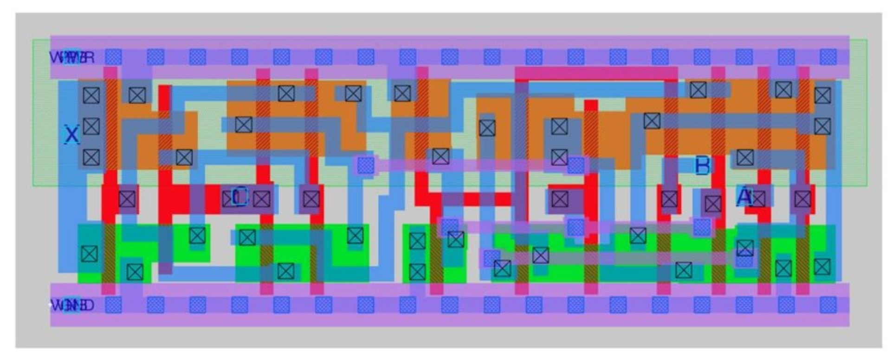

This is several things on several different levels: a flip-flop, a standard logic cell, a layout, a piece of the open-source SkyWater PDK. The dinner-party version should be clear to readers of Chapter 1: this is a blueprint. It's a set of instructions for what to build on a silicon die. The x and y axes are dimensions across the die surface. The colors represent different z-axis "layers", which can be various layers of metal, places to shoot ion doping infusions, polysilicon, and a handful of other pieces of the transistor-making stack. This coupled with some annotations for which color/ layer means what are the necessary instructions for a fabricator to build this circuit. 

\\newpage
Now, a third, much harder example: 

\setkeys{Gin}{width=.5\linewidth}
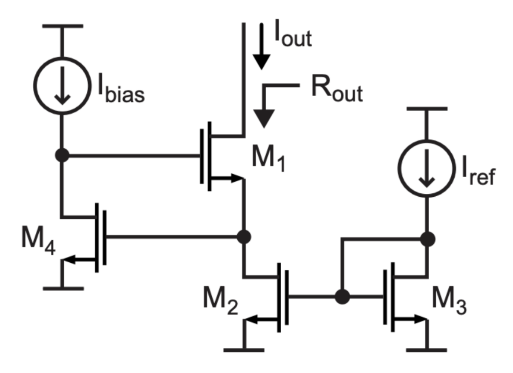

If you're reading this, you almost certainly know this is a schematic. I certainly do. Much of my adult life has been spent making such pictures. But counterintuitively, on some deep level I really do not know what they are. Why do we find such value in this picture? Why do _I_? How did we decide on those little squiggles of lines which represent the elements? Why do they also seem to have such intuitive power? What makes it such a clear representation of the underlying circuit it represents, as compared to so many others - like, say, code?  It's on some level mysterious, at least to me; it just works. 

Hdl21 is largely designed to replace graphical schematics. A central thesis is that most schematics would be better as code. Based on personal experience as a researcher and industry practitioner, designing systems and integrated circuits, my experience is that most schematics are worth less than zero. Not that they shouldn't exist; most of the bad ones don't have much of a choice. But that the limitations of their form do net harm to the underlying design-task they exist to support. 

But there's still some magic in the good ones. 

## What's a schematic really?

Schematics are, at bottom, graphical representations of circuits. They include both the circuit-stuff required to populate a netlist or HDL code, as well as visual information about how the circuit should be rendered. In short: a schematic is two things -

#. A Circuit
#. A Picture

The "picture part" generally consists of a set of two dimensional shapes and paths, generally annotated by purposes such as "part of an instance", "defines a wire", "annotation only", and the like. In this sense the content of schematics mirrors that of IC layout. Unlike layout, schematics lack physical meaning of the third ("2.5th") dimension. Popular schematic data-formats make use of exactly the very same data structures and models used for layout, with the z-axis layer annotations repurposed to denote those schematic-centric purposes. Hierarchy is represented through instances of _schematic symbols_, which serve as references to other schematics or of primitive devices.

Typical software manifestations operate by designing a circuit-picture data format, which includes a combination of HDL-style circuit info with graphical visualization content. This generally requires at least one associated program, dedicated to (a) rendering the schematics as pictures, and often to (b) directly editing them in an interactive GUI. 


## SVG 101

[Scalable Vector Graphics (SVG)](https://www.w3.org/TR/SVG) [@svg2002] is the World Wide Web Consortium ([W3C](https://www.w3.org)) standard for two dimensional vector graphics. Along with HTML, CSS, JavaScript, and WebAssembly, it is one of the five primary internet standards. SVG is an XML-based markup language which [all modern browsers](https://caniuse.com/svg) natively support, and includes the capacity for semi-custom content structure and metadata.

An SVG document is an XML document with a root `svg` element representing the entirety of an image. SVG makes use of XML namespaces (`xmlns`) to introduce element types. Once the `svg` namespace has been enabled, documents have access to elements which represent core two-dimensional graphical elements such as `rect`, `circle`, `path`, and `text`. [Example SVG content](https://developer.mozilla.org/en-US/docs/Web/SVG/Tutorial/Getting_Started):

```xml
<svg version="1.1"
     width="300" height="200"
     xmlns="http://www.w3.org/2000/svg">
  <rect width="100%" height="100%" fill="red" />
  <circle cx="150" cy="100" r="80" fill="green" />
  <text x="150" y="125" font-size="60" text-anchor="middle" fill="white">
    SVG Text
  </text>
</svg>
```

Each graphical element includes a variety of positioning, styling, and customization data, such as the `cx` and `cy` (center) attributes of `circle`, the `width` and `height` attributes of `rect`, and the `font-size` attribute of the `text` element highlighted above.

SVG documents are hierarchical. Hierarchy is primary enabled through _groups_. The `g` element defines a group of sub-elements. Each group includes a similar set of transformation and styling attributes which are applied hierarchically to its children.

```xml
<svg width="30" height="10">
  <g fill="red">
    <rect x="0" y="0" width="10" height="10" />
    <rect x="20" y="0" width="10" height="10" />
  </g>
</svg>
```

Nodes and groups each include a rich set of transformation capabilities, setting position, rotation, reflection, skew, and the like. A general-purpose `matrix` operator allows for the combination of all of the above in a single statement and operation. These transformations nest across hierarchical groups. The net transformation of a leaf-level node in a hierarchical group is the product of the (matrix) transforms of its parents, applied top-down.

```xml
<svg xmlns="http://www.w3.org/2000/svg">
    <g transform="rotate(-10 50 100)
        translate(-36 45.5)
        skewX(40)
        scale(1 0.5)" >
        <g  x="10" y="10" width="30" height="20" fill="red"
            transform="matrix(3 1 -1 3 30 40)" >
            <rect   x="5" y="5" width="40" height="40" fill="yellow"
                    transform="translate(50 50)" />
        </g>
    </g>
</svg>
```

## Hdl21 Schematics

That combination of observations drives the primary goals for Hdl21's paired schematic system:

- Get into and out of code as quickly and seamlessly as possible.
- Make making the good schematics easy, and make making the bad schematics hard. 
- Make _reading_ schematics as easy as possible.

### Schematics are SVG Images

Each Hdl21 schematic is an SVG image, and is commonly stored in a `.svg` suffix file. Example schematics are pictured in Figure~\ref{fig:schematic-dvbe} and Figure~\ref{fig:schematic-inverter}

\setkeys{Gin}{width=.75\linewidth}
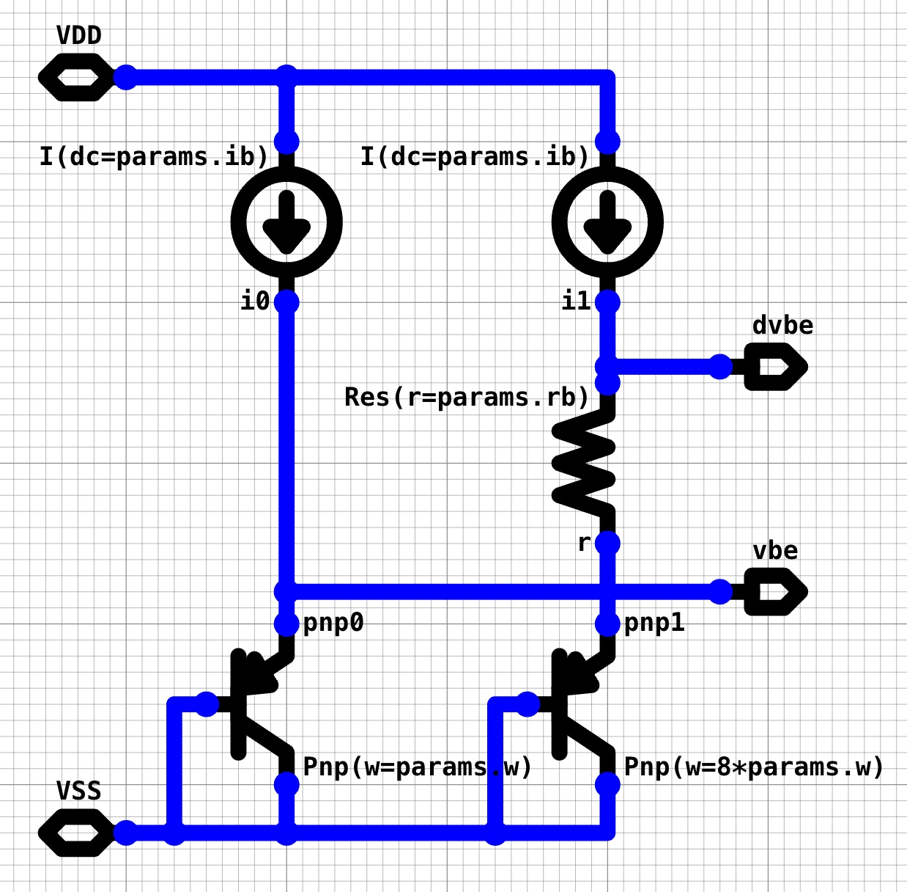

SVG's capacity for semi-custom structure and metadata allows for a natural place to embed each schematic's circuit content. Perhaps more important, embedding within a widely supported general-purpose image format means that schematics are readable (as pictures) by essentially any modern web browser or operating system. Popular sharing and development platforms such as GitHub and GitLab render SVG natively, and therefore display Hdl21 schematics natively in their web interfaces.

\setkeys{Gin}{width=\linewidth}
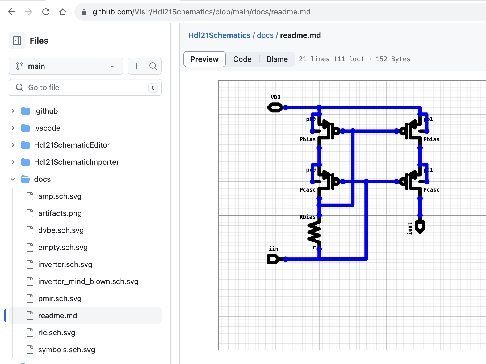

Embedding in SVG also allows for rich, arbitrary annotations and metadata, such as:

- Any other custom vector-graphics, e.g. block diagrams
- Layout intent, e.g. how to position and/or route elements
- Links to external content, e.g. testbenches, related schematics, etc.

In other words, Hdl21 schematics reverse the order of what a schematic is, to be:

#. A Picture
#. A Circuit

The schematic-schema of structure and metadata, detailed later in this document, is what makes an SVG a schematic.


### Schematics are Graphical Python Modules

Each Hdl21 schematic is specified in its entirety by a single `.svg` file, and requires no external dependencies to be read. A paired `hdl21schematicimporter` Python package is designed to seamlessly integrate them into Hdl21-based programs as "graphical modules".


Hdl21 schematics capitalize on the extension capabilities of Hdl21's embedded language, Python, which include custom expansion of its module-importing mechanisms, to include schematics solely with the language's built-in `import` keyword.

Given a collocated schematic file named `schematic.sch.svg`, the module `uses_schematic` below will import the schematic as a Python module, and make its content available as the `schematic` variable.

```python
# Let's call this code `uses_schematic.py`
# Import the importer-module to activate its magic
import hdl21schematicimporter

# Given a schematic file `schematic.sch.svg`, this "just works":
from . import schematic # <= This is the schematic
```

Linking with implementation technologies then occurs in code, upon execution of the schematic as an Hdl21 generator. 


### The Associated Editor Stack

_Reading_ schematics (as pictures) requires any old computer. _Writing_ them can in principal be done with general-purpose image editing software (e.g. Inkscape), or even as raw text. But maintaining their structural validity as schematics, and making them nicer to interact with _as circuits_ is generally done best in a dedicated editor application. 

The Hdl21 schematic system accordingly includes a web-stack graphical editor. It runs in three primary contexts:

1. As a standalone desktop application, 
2. As an extension to the popular IDE VsCode, and 
3. As a web application. 

Figure~\ref{fig:schematic-system} outlines the overall system. The IDE platform is pictured in Figure~\ref{fig:schematic-vscode}.

\setkeys{Gin}{width=\linewidth}
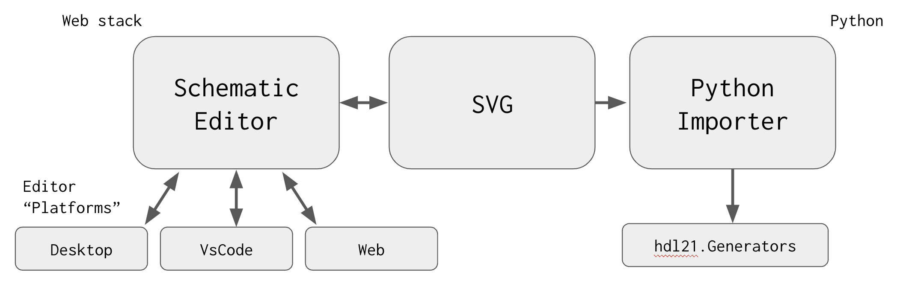
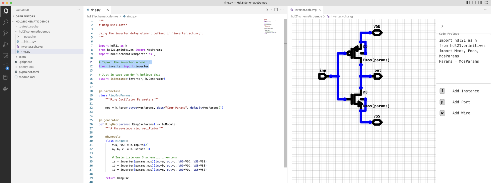

Some schematic programs are "visualization-centric" - i.e. those which primarily aid in debug of post-synthesis or post-layout netlists. A related task is _schematic inference_ - the process of determining the most descriptive picture for a given circuit. While this is worthwhile for such debugging tasks, Hdl21 schematics focuses on primary design entry of schematics. We think that schematics are good when drawn, and tend to be bad, or at least afterthoughts, when inferred. 


## The Element Library

Schematics consist of:

- Instances of circuit elements,
- Ports, and
- Wire connections there-between

The element-library holds similar content to that of SPICE: transistors, resistors, capacitors, voltage sources, and the like. It is designed in concert with Hdl21's primitive element library.

The complete element library is shown in Figure~\ref{fig:schematic-symbols}. 

(Figure~\ref{fig:schematic-symbols} is itself also a valid SVG schematic, rendered by popular authoring platform overleaf.com's Latex compilation pipeline.)

\begin{figure}
  \centering
  \includesvg[width=180pt]{./fig/schematic-symbols.sch.svg}
  \caption{The SVG Schematic Element Library}
  \label{fig:schematic-symbols}
\end{figure}


Symbols are technology agnostic. They do not correspond to a particular device from a particular PDK. Nor to a particular device name in an eventual netlist. Symbols solely dictate:

- How the element looks in the "schematic picture"
- Its port list

Each instance includes two string-valued fields: `name` and `of`.

The `name` string sets the instance name. This is a per-instance unique identifier, directly analogous to those in Verilog, SPICE, Virtuoso, and most other hardware description formats. It must be of nonzero length, and for successful Python import it must be a valid Python-language identifier.

The `of` string determines the type of device. This is essentially the sole parameter for each `Element`. It is of type `string`, or more specifically "python code". The `of` field is executed directly in when the schematic is interpreted as an Hdl21 generator. It will often contain parameter values and expressions thereof.

Examples of valid `of`-strings for the NMOS symbol:

```python
# In the code prelude:
from hdl21.prefix import µ, n
from hdl21.primitives import Nmos
# Of-string:
Nmos(w=1*µ, l=20*n)

# In the code prelude:
from asap7 import nmos as my_asap7_nmos
# Of-string:
my_asap7_nmos(l=7 * n, w=1 * µ)
```

Hdl21 schematics include no backing "database" and no "links" to out-of-source libraries. The types of all devices are dictated by code-strings, interpreted by programs which execute the schematic as code.

For a schematic to produce a valid Hdl21 generator, the result of evaluating each instance's `of` field must be:

- An Hdl21 `Instantiable`, and
- Include the same ports as the symbol


\begin{figure}
  \centering
  \includesvg[width=400pt]{./fig/schematic-inverter.sch.svg}
  \caption{Example SVG Schematic}
  \label{fig:schematic-inverter}
\end{figure}

The inverter pictured above roughly translates to the following Python code:

```python
# A code-prelude, covered shortly, executes here.
@h.generator
def inverter(params: Params) -> h.Module:
  inverter = h.Module()
  inverter.n0 = Nmos(params)(...)
  inverter.p0 = Pmos(params)(...)
  return inverter
# Both "..."s are where connections, not covered yet, will go.
```

### Code Prelude

Each schematic includes a _code prelude_: a text section which precedes the schematic content. Typically this code-block imports anything the schematic is to use. The prelude is stored in text form as a (non-rendered) SVG element.

An example prelude:

```python
# An example code-prelude
from hdl21.primitives import Nmos, Pmos
```

This minimal prelude imports the `Nmos` and `Pmos` devices from the Hdl21 primitive-element library.

Schematic code-preludes are executed as Python code. All of the language's semantics are available, and any module-imports available in the executing environment are available.

### Naming Conventions

The call signature for an Hdl21 generator function is: 

```python
def {{ name }}(params: Params) -> h.Module:
```

To link their code-sections and picture-sections together, Hdl21 schematics require special treatment for each of this signature's identifiers: `name`, `params`, `Params`, and `h`.

- The argument type is named `Params` with a capital `P`.
  - If the identifier `Params` is not defined in the code prelude, the generator will default to having no parameters.
  - `Params` must be an Hdl21 `paramclass`, or will generate an import-time `TypeError`.
- The argument value is named `params` with a lower-case `p`.
- If a string-valued `name` attribute is defined in the code-prelude, the generator function's name is set to this string.
  - If not, the generator function's name is set to that of the schematic SVG file.
  - Defining a `name` which is not a string or is not a valid Python identifier will generate an import-time `Exception`.
- The identifier `h` must refer to the Hdl21 package.
  - Think of a "pre-prelude" as running `import hdl21 as h` before the schematic's own code-prelude.
  - Overwriting the `h` identifier will produce an import-time Python error.
  - Re-importing `hdl21 as h` is fine, as is importing `hdl21` by any additional names.

An example code-prelude with a custom `Params` type:

```python
# An example code-prelude, using devices from PDK-package `mypdk`
import hdl21 as h
from mypdk import Nmos, Pmos

@h.paramclass
class Params:
  w = h.Param(dtype=int, desc="Width")
  l = h.Param(dtype=int, desc="Length")
```

### Importing 

Schematics with `.sch.svg` file extensions can be `import`ed like any other Python module. The `hdl21schematicimporter` package uses Python's [importlib override machinery](https://docs.python.org/3/library/importlib.html) to load their content.

An example use-case, given a schematic named `inverter.sch.svg`:

```python
# Example of using a schematic
import hdl21 as h
from .inverter import inverter # <= This is the schematic

@h.module
class Ring:
  a, b, c, VDD, VSS = h.Signals(5)
  ia = inverter()(inp=a, out=b, VDD=VDD, VSS=VSS)
  ib = inverter()(inp=b, out=c, VDD=VDD, VSS=VSS)
  ic = inverter()(inp=c, out=a, VDD=VDD, VSS=VSS)
```

For schematic files with extensions other than `.sch.svg`, or those outside the Python source tree, or if (for whatever reason) the `import`-override method seems too spooky, `hdl21schematicimporter.import_schematic()` performs the same activity, with a filesystem `Path` to the schematic as its sole argument:

```python
def import_schematic(path: Path) -> SimpleNamespace
```

Both `import_schematic` and the `import` keyword override return a standard-library `SimpleNamespace` representing the "schematic module". A central attribute of this module is the generator function, which often has the same name as the schematic file. The `Params` type and all other identifiers defined or imported by the schematic's code-prelude are also available as attributes in this namespace.


## The SVG Schematic Schema

SVG schematics are commonly interpreted by two categories of programs:

1. General-purpose image viewer/ editors such as Google Chrome, Firefox, and InkScape, which comprehend schematics _as pictures_.
2. Special-purpose programs which comprehend schematics _as circuits_. This category notably includes the primary `hdl21schematicimporter` Python importer.

Note the graphical schematic _editor_ is a special case which combines _both_ use-cases. It simultaneously renders schematics as pictures while being drawn and dictates their content as circuits. The graphical editor holds a number of additional pieces of non-schema information about schematics and how they are intended to be rendered as pictures, including their style attributes, design of the element symbols, and locations of text annotations. This information _is not_ part of the schematic schema. Any valid SVG value for these attributes is to be treated as valid by schematic importers.

This section describes the schematic-schema as interpreted for use case (2), as a circuit. 

### `Schematic` SVG Root Element

Each `Schematic` is represented by an SVG element beginning with `<svg>` and ending with `</svg>`, commonly stored in a file with the `.sch.svg` extension.

Many popular SVG renderers expect `?xml` prelude definitions and `xmlns` (XML namespace) attributes to properly render SVG. SVG schematics therefore begin and end with:

```xml
<?xml version="1.0" encoding="utf-8"?>
<svg width="1600" height="800" xmlns="http://www.w3.org/2000/svg">
  <!-- Content -->
</svg>
```

These XML preludes _are not_ part of the schematic schema, but _are_ included by the graphical editor.

#### Size

Schematics are always rectangular. Each schematic's size is dictated by its `svg` element's `width` and `height` attributes. If either the width or height are not provided or invalid, the schematic is interpreted as having the default size of 1600x800 pixels.

#### Schematic and Non-Schematic SVG Elements

SVG schematics allow for inclusion of arbitrary _non-schematic_ SVG elements. These might include annotations describing design intent, links to related documents, logos and other graphical documentation, or any other vector graphics content.

These elements _are not_ part of the schematic content. Circuit importers are required to 

- (a) categorize each element as being either schematic or not, and 
- (b) ignore all elements which are non-schematic content

#### Header Content

SVG schematics include a number of header elements which aid in their rendering as pictures. These elements _are not_ part of the schematic schema, and are to be ignored by schematic importers. They include:

- An SVG definitions (`<defs>`) element with the id `hdl21-schematic-defs`
  - These definitions include the code-prelude, extracted circuit, and other metadata elements.
- An SVG style (`<style>`) with the id `hdl21-schematic-style`
- An SVG rectangle (`<rect>`), of the same size as the root SVG element, with the id `hdl21-schematic-background`. This element supplies the background grid and color.

#### Coordinates

SVG schematics use the SVG and web standards for their coordinate system. The origin is at the top-left corner of the schematic, with the x-axis increasing to the right and the y-axis increasing downward.

All schematic coordinates are stored in SVG pixel values. Schematics elements are placed on a coarse grid of 10x10 pixels. All locations of each element within a schematic must be placed on this grid. Any element placed off-grid violates the schema.

#### Orientation

All schematic elements operate on a "Manhattan style" orthogonal grid. Orient-able elements such as `Instance`s and `Port`s are allowed rotation solely in 90 degree increments. Such elements may thus be oriented in a total of _eight_ distinct orientations: four 90 degree rotations, with an optional vertical reflection. Reflection and rotation of these elements are both applied about their origin locations. Note rotation and reflection are not commutative. If both a reflection and a nonzero rotation are applied to an element, the reflection is applied first.

These orientations are translated to and from SVG `transform` attributes. SVG schematics use the `matrix` transform to capture the combination of orientation and location. SVG `matrix` transforms are [specified in six values](https://developer.mozilla.org/en-US/docs/Web/SVG/Attribute/transform) defining a 3x3 matrix. Transforming by `matrix(a,b,c,d,e,f)` is equivalent to multiplying a vector `(x, y, 1)` by the matrix:

```text
a c e
b d f
0 0 1
```

Note that this is also equivalent to a multiplication and addition of the vector two-dimensional vector `(x,y)`:

```text
| a c | | x | + | e |
| b d | | y |   | f |
```

In the schematic Manhattan coordinate system, the vector-location `(e,f)` may be any grid-valid point. The 2x2 matrix `(a,b,c,d)`, however, is highly constrained, to eight possible values which correspond to the eight possible orientations. These eight values are:

| a   | b   | c   | d   | Rotation | Reflection |
| --- | --- | --- | --- | -------- | ---------- |
| 1   | 0   | 0   | 1   | 0°       | No         |
| 0   | 1   | -1  | 0   | 90°      | No         |
| -1  | 0   | 0   | -1  | 180°     | No         |
| 0   | -1  | 1   | 0   | 270°     | No         |
| 1   | 0   | 0   | -1  | 0°       | Yes        |
| 0   | 1   | 1   | 0   | 90°      | Yes        |
| -1  | 0   | 0   | 1   | 180°     | Yes        |
| 0   | -1  | -1  | 0   | 270°     | Yes        |

Any schematic element with an SVG `matrix` with `(a,b,c,d)` values from outside this set is invalid.

#### Schematic Content

Each `Schematic` is comprised of collections of four types of elements:

- `Instance`s of circuit elements
- `Wire`s connecting them
- `Port` annotations
- `Dot`s indicating located connections

These collections are not ordered or keyed. No element refers to any other by any means, e.g. name, ID, or other "pointer".

### `Instance`

Each `Instance` includes:

- A string instance `name`
- A string `of`, which dictates the type of element to be instantiated
- A `kind` value from the enumerated `Elements` list, which serves as pointer to the `Element` dictating its pictorial symbol and port list.
- A `location` dictating the position of its origin in schematic coordinates.
- An `orientation` dictating its reflection and rotation.

In SVG, each instance is represented by a group (`<g>`) element. Instance groups are identified by their use of the `hdl21-instance` SVG class. The location and orientation of each instance is stored in its instance-group's `transform` attribute.

Each instance-group holds three ordered child elements:

- Another group (`<g>`) holding the instance's pictorial symbol.
  - The SVG `class` of this symbol-group serves as indication of the `kind` of the instance.
  - The _content_ of the symbol-group is not part of the schematic schema. Any valid SVG content is allowed. The schema dictates only that the `class` attribute indicate the `kind` of the instance.
- A `<text>` element with class `hdl21-instance-name` holding the instance's name.
- A `<text>` element with class `hdl21-instance-of` holding the instance's `of` string.

An example `Instance`:

```xml
<g class="hdl21-instance" transform="matrix(1 0 0 1 X Y)">
    <g class="hdl21-elements-nmos">
        <!-- Content of the symbol-picture -->
    </g>
    <text x="10" y="0" class="hdl21-instance-name">inst_name</text>
    <text x="10" y="80" class="hdl21-instance-of">inst_of</text>
</g>
```

The three child elements are required to be stored in the order (symbol, name, of). The lack of valid values for any of the three child elements renders the instance invalid. The presence of any additional children also renders the instance invalid.

### Circuit Elements

SVG schematics instantiate circuit elements from a library of pre-defined symbols. Any paired schematic importer must be aware of this library's contents, as it dictates much of the schematic's connectivity.

The `kind` field of each `Instance` serves as a reference to its `Element`. Each `Element` consists of:

- The symbol "picture", and
- A list of named, located ports

An example `Element`, defined in JavaScript syntax:

```js
Element({
  kind: ElementKind.Nmos, // The enumerated `kind`
  ports: [
    // Its ordered, located port list
    new Port({ name: "d", loc: point(0, 0) }),
    new Port({ name: "g", loc: point(70, 40) }),
    new Port({ name: "s", loc: point(0, 80) }),
    new Port({ name: "b", loc: point(-20, 40) }),
  ],
});
```

Notably each element _does not_ dictate what device appears in an ultimate circuit or netlist. The `of` string of each `Instance` dictates these choices. The element solely dictates its two fields: the pictorial symbol and the port list.

The complete list of elements is defined in the circuit element library documentation. The content of the element library - particularly the kinds of elements and their port lists - _is_ part of the schematic schema, and must be adhered to by any schematic importer.

### `Wire`

Schematic wires consist of orthogonal Manhattan paths. They are represented by SVG group (`<g>`) elements, principally including an internal `<path>` element. Wire groups are indicated by their use of the `hdl21-wire` SVG class. Each wire group has two child elements:

- The `path` element dictating the wire's shape.
- A `text` element dictating its wire/ net name.

An example `Wire`:

```xml
<g class="hdl21-wire">
    <path class="hdl21-wire" d="M 100 150 L 100 350 L 200 350" />
    <text class="hdl21-wire-name">net1</text>
</g>
```

Wire vertices are dictated by the SVG `path`'s `d` attributes. Each wire vertex must be located on the schematic's 10x10 pixel grid. Each wire segment must use a "Manhattan" orthogonal routing style, i.e. each point must have either an x or y coordinate equal to that of the previous point. Wire paths are _open_ in the SVG sense; there is no implicit segment from the final point back to the first.

Wire-names serve as the mechanism for schematic "connections by name". Any two wires with the same name are be considered connected. There is one special `wire-name` value: the empty string, which implies that (a) the wire's is not explicitly set, and (b) importers are to assign it a net-name consistent with any other connected element, e.g. a `Port` or another `Wire`.

### `Port`

Schematic `Port`s appear similar to `Instance`s in both pictorial representation and in SVG content. Unlike instances they do not add hardware to the circuit represented by the schematic, but annotate particular `Wire`s as being exposed externally.

Each `Port` has the following fields:

- A string `name`
- A `kind` value from the enumerated `PortKind` list
- A `location` dictating the position of its origin in schematic coordinates.
- An `orientation` dictating its reflection and rotation.

Note these fields are identical to those of `Instance`, but for the removal of the `of` string-field. The semantic content of a schematic `Port` is dictated fully by its `Kind` field, which also dictates its pictorial representation.

In SVG, each `Port` is represented by a group (`<g>`) element. Port groups are identified by their use of the `hdl21-port` SVG class. The location and orientation of each instance is stored in its port-group's `transform` attribute.

Each port-group holds two ordered child elements:

- Another group (`<g>`) holding the port's pictorial symbol.
  - The SVG `class` of this symbol-group serves as indication of the `kind` of the port.
  - The _content_ of the symbol-group is not part of the schematic schema. Any valid SVG content is allowed. The schema dictates only that the `class` attribute indicate the `kind` of the port.
- A `<text>` element with class `hdl21-port-name` holding the port's name.

An example `Port`:

```xml
<g class="hdl21-port" transform="matrix(1 0 0 1 X Y)">
    <g class="hdl21-ports-input">
        <!-- Content of the symbol -->
    </g>
    <text x="10" y="-15" class="hdl21-port-name">portname</text>
</g>
```

Valid port names must be non-zero length. All wires connected to a port are assigned a net-name equal to the port's name. Any connected wire with a conflicting net-name renders the schematic invalid. Any wire or connected combination of wires which are connected to more than one port - even if the ports are identically named - also renders the schematic invalid.

### Connection `Dot`

Schematic dots indicate connectivity between wires and ports where connections might otherwise be ambiguous. The inclusion of a `Dot` at any location in a schematic implies that all `Wire`s passing through that point are connected. The lack of a `Dot` at an intersection between wires conversely implies that the two _are not_ connected, and instead "fly" over one another.

`Dot`s are represented in SVG by `<circle>` elements centered at the dot location. Dot centers must land on the 10x10 pixel schematic grid. Dot-circles are identified by their use of the `hdl21-dot` SVG class.

An example `Dot`:

```xml
<circle cx="-20" cy="40" class="hdl21-dot" />
```

The center location dictating `cx` and `cy` attributes are the sole schema-relevant attributes of a dot-circle. All other attributes such as the radius `r` are not part of the schema, and may be any valid SVG value.

While powerful visual aids and a notional part of the schematic-schema, `Dot`s _do not_ have semantic meaning in schematics. They are entirely a visual aid. Any valid schematic with any combination of `Dot`s yields an identical circuit with _any other_ combination of `Dot`s.

The primary editor application infers `Dot`s at load time, and uses those stored in SVG as a check. This process includes:

- Running "dot inference" from the schematic's wires, instances, and ports
- Comparing the inferred dot locations with those stored in the SVG
- If the two differ, reporting a warning to the user

Differences between the inferred and stored dot locations are logged and reported. The inferred locations are used whether they match or differ. 


## Possible Directions

\label{section:schematic-directions}

The "right" way to draw schematics is a popular topic among practitioners. (Engineers also love to argue about "right ways" to write software, draw layout, eat ice cream, etc; this one is no different.) Hdl21 schematics have an opinionated author whose opinions are, to some extent, embedded in their design. Some of those opinions are more popular than others. 

The schematic system's central premise - designing schematics into a general-purpose image format, renderable on platforms such as GitHub - has proven uncontroversial. Other design decisions have generated more contention. 

The first is the system's level of pairing with Hdl21. (This extends all the way to their name.) The goal of making schematics "graphical code modules", designed to be easily imported into an otherwise code-forward design flow, is not necessarily limited to Hdl21. Obvious alternatives would include connectivity to popular HDLs such as Verilog, or to more mature modern HDLs such as Chisel. 

Both are future possibilities. For the case of Verilog, or any other HDL that lacks a dedicated execution environment, some other program would need to translate SVG schematic content into something comprehensible by consumers of the HDL-schematic combination. Among other tasks, this program would require that all schematic parameters be representable in Verilog's (more limited) set of types. 

Complications arise in that the desirable forms of this output likely differ between use-cases. Use cases for a "code forward" analog design environment - i.e. one in which all but the lowest level circuits are authored in Verilog, and those instantiating primitives may be drawn in schematics - would likely desire the schematic contents. Others in mixed-signal design, where much of the Verilog-driven design components are intended to be fed through logic synthesis, likely desire only the schematic-based circuit's external interfaces.

Interfaces to modern HDLs such as Chisel are generally a cleaner fit. These libraries are embedded in general-purpose programming languages which feature a paired execution environment, suited to interpreting schematic-content as part of a larger program. Whether they could be quite as streamlined as the Python override-driven "just say `import`" semantics remains to be seen. Interfaces only slightly heavier-weight certainly would work. 

The second (and more contentious) topic of contention is Hdl21 schematics' refusal to allow externally-defined symbols. All elements instantiated in Hdl21 schematics are defined in its built-in element library. Hierarchy is instead the domain of Hdl21 (code). 

This was an intentional choice, in furtherance of the goal to "make making the good schematics easy, and make making the bad schematics hard". Schematics tend to be worth more than the paper they're printed on when typical practitioners (other than their authors) understand their contents. A necessary condition is recognizing the symbols. There are relatively few elements which have both (a) pictorial symbols widely understood by the field, and (b) an uncontroversial set of ports. They are the elements of the Hdl21 schematic library. A wider set of elements - op-amps, oscillators, flip-flops, and the like - meet criteria (a), but have a wide diversity of IO interfaces. In Hdl21 schematics (as in all other schematic-systems of which we are aware), symbols dictate instance port-lists. 

Disallowing symbol-based hierarchy has a side benefit: it's much more straightforward to confine a schematic to a single SVG file. This single-file property is a large part of what makes schematics renderable by existing platforms such as GitHub. But we _could_ make it work, I guess. Each schematic would be required to include the symbol-picture of every symbol that it instantiates, as they currently do for any primitive elements they instantiate. And the graphical editor would need to be, or at least desirably would be, updated to comprehend the links between schematics and symbols representing the same circuits. Just where this linkage would lie - within SVG content, or as separate "database metadata" - would remain to be seen. Comprehending schematics as circuits, as by importer programs, would desirably find this structure as straightforwardly as possible. ^[The SVG specification includes a paired definitions (`<defs>`) section and `<use>` element, intended for instantiation of repeated content. In principle this would be a desirable place to hold Hdl21 schematics' element symbol definitions. Doing so would save space in the hypertext content. Sadly we (very quickly) found that the `<defs>` and `<use>` elements are not supported by popular platforms which shall not be named, such as GitHub.]


# Programming Models for IC Layout
\label{chap:layout}

\setkeys{Gin}{width=\linewidth}
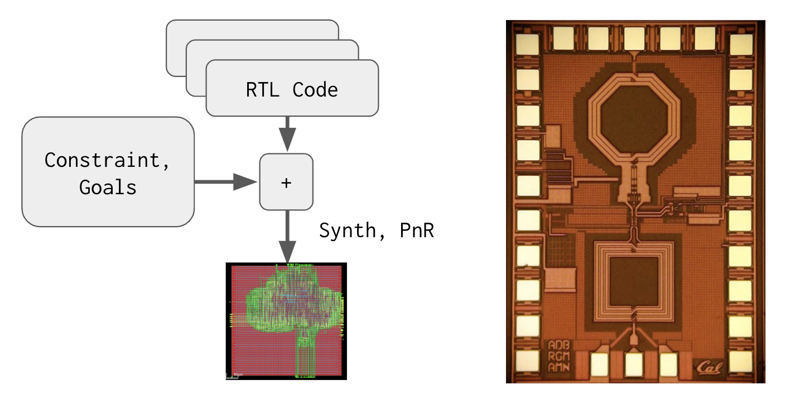

In 2018 the Computer History Museum [estimated](https://computerhistory.org/blog/13-sextillion-counting-the-long-winding-road-to-the-most-frequently-manufactured-human-artifact-in-history) that in the IC industry's roughly 65 year history, it has shipped over 13 sextillion (1.3 x 10$^{22}$) total transistors. (That total has risen dramatically in the few years since.) Essentially all of them have been designed by one of two methods:

#. "The digital way", using a combination of HDL code, logic synthesis, and automatically placed and routed layout.
#. "The analog way", using a graphical interface to produce essentially free-form layout shapes.

## The Digital Way

Layout of digital circuits has proven amenable to automatic generation in countless ways that analog layout has not. Nearly the entirety of the IC industry's gains in productivity and scale, all of the enablement of chips with millions or billions of transistors, is owed to a stack of software in which designers can:

- Write hardware in C-like HDL code
- Compile an RTL-level subset of this code to logic gates, in a process typically called _logic synthesis_
- _Place and route_ a gate-level circuit netlist into physical layout

The combination of logic synthesis and PnR layout serves as a powerful "hardware compiler" from portable HDL code to target silicon technologies. Analogous attempts at the compilation of analog circuits have generally failed, or at least failed to achieve substantial adoption. Despite its comparative simplicity (compared to analog), digital "back end" design remains a laborious process, often requiring professional teams of hundreds for large designs.

## The Analog Way

The analog way, in contrast, shares little between circuits. No "compiler" is invoked to produce layout from a more abstract description. Instead designers are free to produce essentially any combination of 2.5 dimensional shapes in a custom graphical environment. Only an infinitesimally small fraction of possible combinations will conform to a given technology's design rules. This is a major part of the effort. Designers are free to produce device sizing, placement, and routing essentially as they see fit - at the primary cost of needing to produce it.

Notably, code remains a material part of the analog method; it merely occupies a very different place in the design hierarchy. Figure~\ref{fig:layout-quadrants} shows the relationship between code-based and graphically-based methods in the digital and analog flows. Perhaps counterintuitively, the two are used in diametrically opposite portions of the design hierarchy. The digital flow uses code - the combination of a PnR "layout solver" and designer-dictated constraints - to produce the upper, "module" levels of a design hierarchy. Its low levels, principally comprised of "standard cell" logic gates, are conversely designed with graphical methods highly similar to the analog flow. Said analog flow, in contrast, uses these graphical methods for its "module layers" (e.g. amplifiers, data converters), while relying on code-based _parametric cells_ (commonly called "p-cells") for its lowest levels (e.g. single transistors or passive elements).

Why? In short: in modern technologies, the lowest levels are the hardest - both to optimize, and to meet design-rule correctness in the first place. The digital flow uses hand-crafted standard logic cells which can be highly tuned and co-designed with the underlying technology, recognizing that their design effort will be amortized billions of times over. Producing analog layout is a lower-volume proposition. It is much more difficult to amortize the manual production of each low-level transistor polygon. This is generally saved for the most performance-critical devices, e.g. those in high-speed RF transceivers. Code based "p-cells" instead produce these polygons from a set of input parameters similar to those provided to schematic designers. In addition to schematic-level parameters principally including device sizing, these programs often add layout-specific parameters such as requirements for segmentation ("multi-fingering"), overlap, abutment, or proximity of contacts. The placement of and interconnect between these p-cells is then performed in the custom graphical flow.

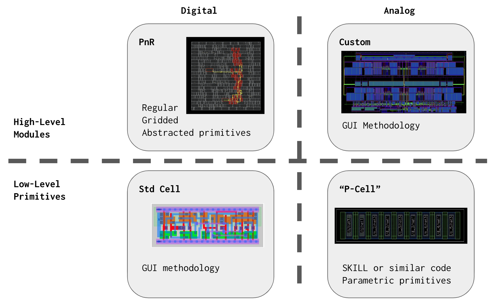


## The Two Most Tried (and Mostly Failed) Models

Analog and custom circuits have long been identified as a bottleneck in the IC design process. Research has accordingly long attempted to improve "the analog way" of producing layout. Approaches have included:

- Circuit-level synthesis from high-level specifications ([@laygenii], [@aida])
- Libraries for codifying high-level design procedures ([@chang2018bag2], [@werblun2019], [@schweikardt2022edp])
- Dedicated domain-specific languages for high-level layout ([@unutulmaz2011lds])
- Sizing optimizers, parametric across circuit families ([@habal2011])
- "Silicon compilers" ([@man1986cathedral], [@johannsen1979]) and other circuit-specific compilers, e.g. for datapaths ([@pang1989datapath]), SRAMs ([@guthaus2016openram]), amplifiers ([@koh1990opasyn])
- Automated place-and-route layout generation, from unannotated analog circuit netlists ([@chen2020magical] [@kunal2019align])
- Novel attempts to make use of the digital place and route pipeline ([@weimurmann2021], [@openfasoc])

Surveys and summaries of these techniques such as [@spence89] have now appeared for more than three decades. Figure~\ref{fig:fraunhofer-history}, originally published in [@laygenii] and later extended by Fraunhofer IIS, catalogs these efforts across time and several axes of their approach.

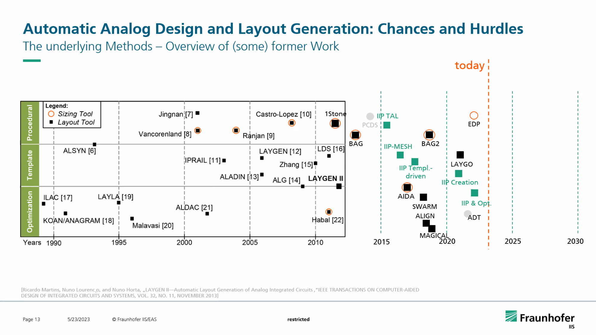

These research efforts largely fall into one of two large families:

- The first, which we name the _programmed custom_ style, conceptually replaces the layout GUI with an elaborate layout API. Designers then manipulate the content of layout through writing programs against this interface. The programmed custom style is covered in depth in \autoref{chap:progcustom}.
- The second conceptually attempts to map "the digital way" onto analog circuits. Centrally, automatic place-and-route is used to produce layout content from netlists or similar circuit-level content. Rather than directly manipulate layout content, designers author circuit-level content (e.g. HDL code, schematics) and a set of constraints and goals for the analog PnR solver. Such methods are detailed in \autoref{chap:analogpnr}.

While all have made novel research contributions, none have broken through to widespread adoption. The remainder of this thesis largely attempts to distill the core of each of the approaches, and introduces two new pieces of software, one pursuing each approach.


# Programmed Custom Layout
\label{chap:progcustom}

The dominant paradigm for producing analog and custom layout has been "the analog way" - drawing essentially free-form shapes in a graphical environment - more or less since such GUIs have been available. Plenty of systems, primarily from research, have nonetheless recognized the utility of producing these layouts through code instead. These systems can be thought of as conceptually replacing the GUI with an elaborate layout API. Each prospective action or change to be made by clicking or dragging is replaced with an API call. An "add rectangle" selection-box might directly translate into an `addRectangle()` method. 

Such systems, particularly those in which designers write programs which manipulate _layout content itself_, we refer to as "programmed custom". (In \autoref{chap:analogpnr} we will cover systems which differ in injecting an intervening _layout solver_, the input to which is the principal object of designer-programs.) 

Being based in code has advantages in and of itself. Text-based code has proven immeasurably more effective for sharing, distribution, review and feedback than the typical binary/ graphical layout data that it replaces. Parameterization in the graphical environment is particularly challenging. Few (if any) environments provide a rich graphical programming mechanism to turn parameters into parametric layout content. Often if they do, it's by escaping into code form.

Code has also proven vastly more amenable to conceptual layering. Frameworks and libraries can write and expose layers of functions and abstractions, enabling an array of trade-offs across levels of detail and control. Programs using those libraries can then readily jump between these abstraction layers, deploying the most detailed and verbose where warranted, and the most efficient everywhere else. Such layering is also common in programming abstractions for layout. The lowest such layer generally manipulates 2.5D geometry directly, creating and manipulating common shapes (rectangles, polygons, fixed-width paths) annotated with z-axis "layer" designations. E.g.:

```python
layout = create_a_layout()
layout.add_a_rect((1, 2), (3, 4), layer=5)
layout.add_a_polygon([(5, 6), (7, 8), (9, 10),], layer=11)
layout.add_a_path(
  [(11, 12), (13, 14), (15, 16),],
  width=30,
  layer=12)
layout.add_an_instance(
  of=some_other_layout,
  loc=(11, 12),
)
```

This simple example includes the next most likely and most common abstraction: hierarchy. Layout "modules" - which, for whatever reason, have failed to find a culturally consistent name - are relocatable sets of theses shapes, and instances of other layouts. Each can then be replicated at varying locations in a larger-scale layout. Many such systems include capabilities for layout instances to mirror and/ or rotate, either in coarse or fine increments. 

```python
inst = layout.add_an_instance(
  of=some_other_layout,
  # Transformation properties from `some_other_layout`, to this instance
  loc=[11, 12],
  reflect=False,
  rotation=90,
)
```

From here, concepts can stack up in a variety of directions. *Arrays* of repeated elements, whether instances, shapes, or combinations thereof, are a common addition. GDSII includes such two-dimensional arrays in the lowest-level, most popular format for design data. 

A popular abstraction for higher-level layout injects the notions of _tracks_ and an underlying _grid_. These techniques resemble the conceptual layout-space used by digital PnR. All connections are driven onto a regular set of available wiring tracks. Typically each connection layer runs in a single direction, and often these directions are systemically demanded to alternate layer-by-layer. E.g. if metal layer 5 runs horizontally, this implies that metal layers 4 and 6 (or whatever the adjacent ones are called) run vertically. 

This grid concept can be highly valuable for streamlining the connection-programming process. Especially so for layout-programs which desire _portability_, whether between widely divergent parameters, or most impactfully, across implementation technologies. With grids, connections no longer need to be programmed in "raw" geometric coordinates. They instead refer to indices or other keys into the grid to make reference to desired metal locations.

Several popular programming libraries and frameworks epitomize the programmed-custom model. Open source libraries such as _[gdstk](https://github.com/heitzmann/gdstk)_ and its predecessor _[gdspy](https://github.com/heitzmann/gdspy)_ are canonical examples. While both place some emphasis on the GDSII data and file format (even in their names), both expose Python APIs to add, manipulate, and query the content of custom layouts. _[Gdsfactory](https://gdsfactory.github.io/)_ and PHIDL [@McCaughan2021PHIDL] expose similar low-level APIs, with higher-level functionality and emphasis tailored to _photonic_ chips and circuits. (Photonics may be a domain more amenable to the programmed-custom model overall than highly integrated CMOS, as indicated by the survey in [@dikshit2023].)

The most relevant here at UC Berkeley is the Berkeley Analog Generator, BAG ([@chang2018bag2], [@werblun2019]), and related projects such as LAYGO [@laygo]. BAG means different things to different people. One (perhaps founding) view was that BAG codifies the _design process_ which designers tend to very loosely keep collected in memory. This (at least conceptually) includes selecting circuit architectures, applying sizing decisions, and ultimately producing layout. In practice, a ways more time, energy, and attention has been dedicated to its efforts to program custom layout. BAG endeavors to enable process-portable layout-programs in which a _circuit_ is codified in a program, and its underlying implementation technology is essentially a _parameter_. That technology parameter is quite complex, generally expressed as a large pile of YAML markup. The portability goals are central to BAG's usage of such a gridded layout abstraction. 

We also note that "the analog way" makes its own use of programmed-custom layout. As illustrated in Figure~\ref{fig:layout-quadrants}, most GUI-drawn custom layout does include programmed-custom components, for its lowest-level primitives. These low-level layouts are commonly called _parametric cells_ or _p-cells_ for short. Typical instances produce a single transistor or passive element, parameterized by its physical dimensions, segmentation, and potentially by more elaborate criteria such as demands for redundant contacts. These low-level p-cells perform the highly invaluable task of producing DRC-compliant designs for the lowest, often most detailed and complicated layers of a technology-stack.


## Programmed Custom Success Stories (Mostly SRAM Compilers)

The most successful deployments of programmed-custom layout have generally been _circuit family_ specific. E.g. while a layout-program at minimum produces a single circuit, these best-use-cases find families of similar circuits over which to find a set of meta-parameters, enabling the production of a small family. SRAM arrays have probably been the most successful example. SRAM serves as the primary high-density memory solution for nearly all of the digital flow, comprising most cache, register files, and configuration of most large digital SOCs. SRAM is therefore extremely area-sensitive, especially at its lowest and most detailed design layers. A common workflow uses the custom graphical methods to produce these "bit-cells" and similarly detailed layers, while using "SRAM compiler" programs to aggregate bits into usable IP blocks. An SRAM compiler is a programmed-custom layout program. It leverages the fact that large swathes of popular SRAM usage has a consistent set of parameters: size in bits, word width, numbers of read and write ports, and the like. The compiler (or what we might call "generator") programs generalize over this space and produce a family of memory IPs.

\setkeys{Gin}{width=.75\linewidth}

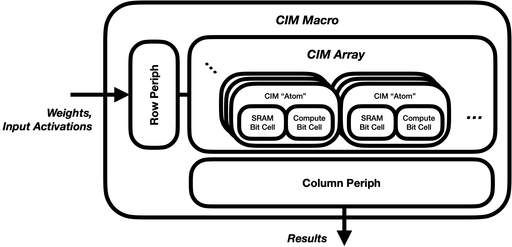
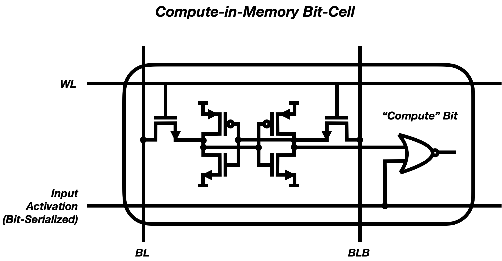
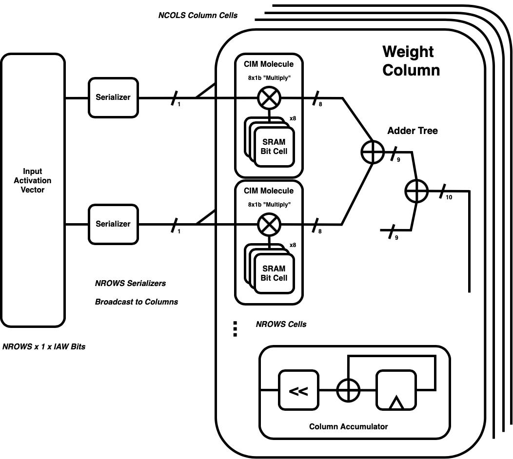
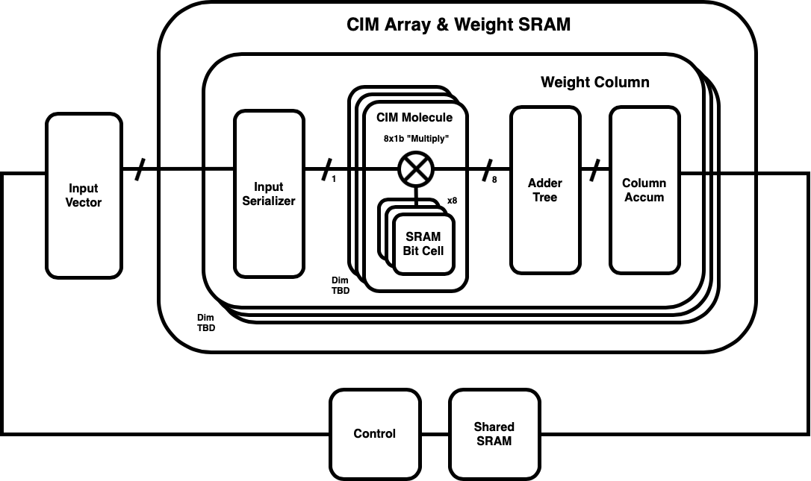

The genesis of the `layout21` library detailed in \autoref{section:layout21} was in fact to produce a similar set of circuits: "compute in memory" (CIM, or "processing in memory", PIM) circuits for machine learning acceleration. These circuits attempt to break the typical memory-bandwidth constraint on machine learning processing, by first breaking the traditional Von Neumann split between processing and memory. Instead, circuits are arranged in atomic combinations of processing and memory, e.g. a single storage bit coupled with a single-bit multiplier. Many research systems have implemented this marriage with analog signal processing, typically performing multiplication via a physical device characteristic, e.g. transistor voltage-current transfer [@chen2021], or that of an advanced memory cell such as RRAM [@yoon2021] or ReRAM [@xue2021]. Addition and accumulation are most commonly performed either on charge or current, the two analog quantities which tend to sum most straightforwardly. 

Reference [@fritchmancim2021] details many of the difficulties in using such analog signal processing techniques. Particularly, while the analog-domain mathematical operations can often be performed highly effectively, they ultimately must produce digital data to participate in broader digital systems. These data conversion steps can serve as bottlenecks to both power and area. Reference [@rekhi2019] provided a lower bound on this "conversion cost", based on applying observed state of the art data converter metrics. But these bounds are likely far too permissive. Such machine learning acceleration systems rarely feature the trade-offs required for state of the art data conversion, which often requires highly complex calibration and area unto itself.

It instead proposes an all digital compute in memory macro, in which each "atom" is comprised of a _write only_ SRAM bit cell, plus a single bit "multiplier" implemented with a minimum-sized NOR2 gate. Figure~\ref{fig:cim-concept} depicts the compute in memory macro's atomic bit-cell and critical building blocks.

Notably, the conclusions of [@fritchmancim2021] were that programmed-custom layout did not provide a sufficient benefit to the compute in memory circuit to justify its use over the more common digital PnR flow. This largely boiled down to a mismatch in layout area between its two primary functions, _compute_ and _memory_. Bit for bit, compute is much larger, and hence mitigates the benefit of tightly coupling its layout in memory. This example from [@fritchmancim2021] generalizes across much of the historic usage of the programmed-custom layout model. Programmed-custom tends to work well for circuits that are highly structured, repetitive, and parametric. Contemporary work including [@kumar2023] further extended `layout21` to produce such an SRAM compiler framework in SkyWater's 130nm open-source technology.

## `Layout21`'s Layered Design
\label{section:layout21}

This work's primary tool for programmed custom layout design is the [layout21](https://github.com/dan-fritchman/layout21) library. Layout21 is designed to be layered and modular, and to support a modular and diverse set of layout programming applications. Each conceptual layer general is comprised of (a) an associated layout data model, and (b) code for manipulating its contents. Its lowest "raw" layer directly manipulates geometric layout content in a programming model similar to that of `gdstk` or `gdsfactory`.

```rust
// Simplified `layout21::raw` Data Model

pub struct Layout {
    /// Cell Name
    pub name: String,
    /// Instances
    pub insts: Vec<Instance>,
    /// Primitive/ Geometric Elements
    pub elems: Vec<Element>,
}
pub struct Instance {
    /// Instance Name
    pub name: String,
    /// Cell Definition Reference
    pub cell: Ptr<Cell>,
    /// Transform: location, reflection, and rotation
    pub xform: Xform,
}
pub struct Element {
    pub net: Option<NetRef>,
    pub layer: LayerRef,
    pub purpose: LayerPurpose,
    pub shape: Shape,
}
pub enum Shape {
    Rect{ p0: Point, p1: Point },
    Polygon{ points: Vec<Point> },
    Path({ points: Vec<Point>, width: usize, style: PathStyle }),
}
```

In the `layout21::raw` model, a layout is comprised of two kinds of entities: layered geometric elements, and located, oriented instances of other layouts. This "geometry plus hierarchy" model largely tracks that of GDSII and of VLSIR's layout schema. Layout21's in-memory format is designed to be straightforwardly translatable to `vlsir.layout`, and therefore straightforwardly exchangeable between programs and languages.

Layout21's design incorporates a second, seemingly easy to miss fact about layout (even custom layout): it gets big, fast. Perhaps most significant among its principal design decisions, Layout21 is implemented in the Rust [@matsakis2014] language. Rust is a "systems programming" language, designed for applications commonly implemented in C or C++. It compiles to native machine code via an LLVM [@lattner2004] based pipeline similar to that used by the popular Clang C compiler. It endeavors to further enable parallel applications via the inclusion of its _ownership and borrowing_ system, which, among other benefits, produces multi-threaded code which is provably race-free at compile time. Layout21 does not, as of this writing, capitalize on these parallelism opportunities. But many aspects of its design, notably including the implementation language from which it begins, are compatible with readily doing so. More impactfully on Layout21's usefulness, its host language's provable _memory safety_ removes large categories of (often fatal) program errors, generally resulting in program-killing segmentation faults.

Rust's safety guarantees are nice, and Layout21 benefits (some) from them. But they are not why Layout21 uses Rust. More so because it has the combination of two attributes unavailable elsewhere: (1) its speed, and (2) its suite of modern development niceties. Package management, documentation, unit testing, sharing, and the like - all the semi-technical facets that actually _get code shared_ - come built in. It also helps that Rust features high "embedability", into both low-level languages such as C, and "slow languages" such as Python and JavaScript. 

There seems to be a time-honored tradition of layout libraries which goes something like: 

- Start in a scripting languages. Python, Perl, whatever.
- Designers love it. It's what they know, and now the can use it for layout. 
- Productivity maxes out.
- Then, slowly at first, and quickly later, layouts get bigger. Programs get slower.
- Then much slower.
- Then useless.
- Then the low-level "extension languages" - generally C or C++ - come in.

This story played out both in the history of `BAG`, and of `gdspy` (renamed `gdstk` to commemorate the change). Layout21 incorporated this lesson upfront.

Layout21's approach differs from comparable libraries in a few material respects. Perhaps most significantly, layout21 treats _layout abstracts_ as first class concepts. Abstracts serve an analogous role to layout _implementations_ that _header definitions_ serve to implementations, in programming languages which explicitly separate the two (e.g. C, C++). A programming function abstract (header) generally specifies:

- (a) An identifier by which to get a handle to the function, generally a name;
- (b) Specifications for the functions arguments. This may include ordering, naming, and/ or type constraints depending on the language.
- (c) Information about what the function will return. This primarily takes the form of a type, in languages with typing annotations.
- (d) Any "special behaviors". E.g. the possibility of throwing an exception, or a promise to never do so. 

Most vitally: these abstract views are all that _callers_, i.e. users, of the function ever need. The remaining implementation - i.e. all the lines of code that do the actual work - instead serve as its inner implementation. 

Layouts and their abstracts have analogous roles. System-level designers, i.e. those combining packaged chips and PCBs into systems, are deeply familiar with one form of abstract layout: the _datasheet_. Each IC datasheet includes 

- (a) A descriptive port list, indicating each IC pin's function. E.g. "analog supply", "reference clock", or "primary output".
- (b) A physical diagram, indicating the shape and size of each pin, such as that shown in figure~\ref{fig:datasheet-abstract-layout}. 

\setkeys{Gin}{width=.75\linewidth}
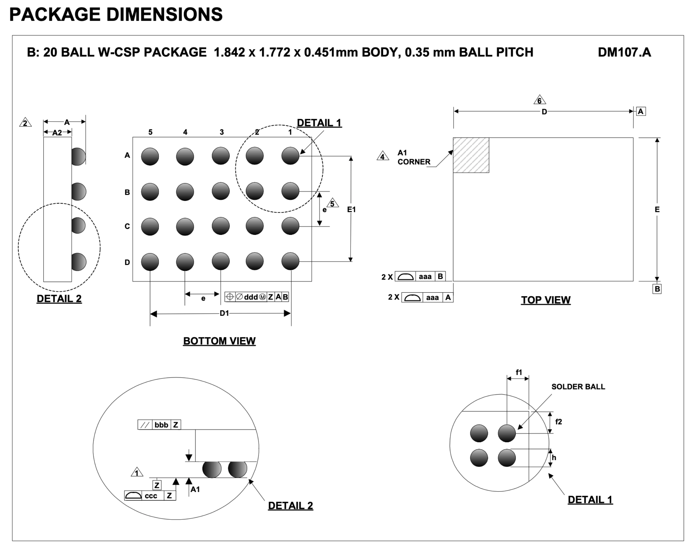

The abstract view of IC layouts is most popularly expressed in Library Exchange Format (LEF). LEF is a text-based format which specifies a combination of layout-abstract libraries, and technology parameters which support them. (The latter subset is often denoted "tech-LEF".) LEF calls its layout-abstract the `MACRO`. Each `MACRO` includes: 

- An identifier for the macro/ module
- Its physical outline
- A list of (logical) pins and (physical) ports. Each pin may have one or more physical ports, which are presumed "strongly" connected within. Each port is specified with a list of 2.5D shapes similar to those used in layout implementations (rectangles, polygons, etc.).
- A list of obstructions. This is formed as another list of 2.5D shapes which are annotated as "implementation space". LEF intent is that higher-level users of the layout abstract will not interfere with or contact these areas. 
- A variety of metadata about the macro (e.g. its usage intent), as well as each pin (e.g. its direction and intended usage).

Example LEF format content: 

```text
MACRO MyCircuit # MACRO (module)
 CLASS BLOCK ;
 ORIGIN 0 0 ;
 SIZE 123.936 BY 125.536 ;
 PIN clock
   DIRECTION OUTPUT ;
   USE SIGNAL ;
   PORT
     LAYER M4 ;
       RECT 122 0.384 123 0.768 ;
   END
 END clock
# ...
# ...
 OBS # obs(tructions), or blockages
   LAYER M1 ;
     RECT 1.2 0.0 122.736 121.536 ;
   LAYER M2 ;
     RECT 1.2 0.0 122.736 121.536 ;
   LAYER M3 ;
     RECT 1.2 0.0 122.736 121.536 ;
 END
END MyCircuit
END LIBRARY
```

Layout21's "raw" data model includes a set of types to define layout `Abstract`. Each is similar to the analogous concepts in LEF, and to the more general conceptual task of defining "layout headers". Simplified versions of the `Abstract` data model, which uses several core types from previous excerpts:

```rust
pub struct Abstract {
    /// Cell Name
    pub name: String,
    /// Outline
    pub outline: Polygon,
    /// Ports
    pub ports: Vec<AbstractPort>,
    /// Blockages
    pub blockages: HashMap<Layer, Vec<Shape>>,
}
pub struct AbstractPort {
    /// Net Name
    pub net: String,
    /// Shapes, with paired [Layer] keys
    pub shapes: HashMap<Layer, Vec<Shape>>,
}
```

Notably layout21's _instances_ are not of either layout implementations or their abstracts, but of an association between the two named `Cell`. Each `Cell` is a paired set of representations (or "views") of the same underlying physical circuit. 

In an unfortunately common practice, layout implementations tend to _precede_ their abstracts. This understandable in a bottom-up design flow, in which layouts are initially built at primitive device levels, followed by successively higher levels of design hierarchy. In such practice, one generally does not know where the pins, ports, or blockages will be - much less where they _should_ desirably be for adjacent circuits - until those circuits are complete. Which, by definition, is not until roughly when their peers are complete. Plus, specifying layout abstracts is tedious. Certainly much more so than our analogy to function headers in programming languages. Layouts (a) tend to have an order or two of magnitude more IO (e.g. 10s to 100s of pins, as compared to 1s to 10s of function arguments), and (b) specifying it can be tedious, requiring exact physical coordinates. 

So in the bottom-up design flow, abstracts are (a) a huge pain to produce, and (b) not especially helpful. Understandably, they aren't often generated. Common practice is instead to produce layout implementations first, and let "abstract generation" programs essentially summarize the implementation. 

The fault here is not with the utility of the abstract view _per se_, but with its clashes against the bottom-up flow. A central downside of the bottom-up flow is that there is no practical way to parallelize design effort across hierarchical layers. Layer N of hierarchy can only reasonably begin when layers (N-1) and down are complete. Parallelization at _the same_ level of hierarchy is of course possible, presuming independence between peer-blocks. But more importantly, in a large design team and project, there are only so many equal-layered sub-designs to parallelize. Moreover the skillsets, background, and interests of designers varies widely across layers of hierarchy. There is sub-specialization even within custom layout, especially where it reaches its common boundaries with automatically placed-and-routed digital layout. 

The abstract is the tool that enables parallelizing effort across these hierarchical layers. Software projects often refer to this practice as _interface first_ or _interface-driven_ development. In this style, key system blocks and (notably) their _interactions_ are identified first. In the case of a web-scale system this might include the roles of and data exchanged between client, server, and any other independent executing entities. In the case of custom layout, these interfaces are physical abstracts. Notably in contrast to "bottom-up", this design flow might errantly be called "top-down". It is not. Its entire point is parallelizing effort (and synchronizing expectations) _across_ levels of hierarchy. Layers both above and below the initially-defined abstracts then proceed in parallel. 

Layout21's emphasis on abstract layout does not include a generation mechanism from layout implementations. (I have been asked many times, and kindly declined.) As of this writing, it also lacks a much more desirable component: an _abstract versus implementation_ verification tool. In comparison to the ubiquitous layout versus schematic (LVS) comparison, such a check might be called _layout versus abstract_ (LVA). This would accept the combination of a layout abstract and implementation (or `Cell` linking the two) as input, and produce a boolean result indicating: does the implementation actually implement the abstract? E.g.

- Are the outlines equal?
- Are all pins and ports included?
- Does all port geometry align?
- Does all pin metadata align?
- Are all implementation shapes constrained to be within blockage/ obstruction areas?

Such a tool, potentially in concert with more efficient abstract-specification methods, would greatly enhance the (rare, but we think better) abstract-driven design flow. 

## `Tetris` Layer

Layout21's more abstract "tetris" layer operates on rectilinear blocks in regular grid. Placement is performed through a relative-locations API, while routing is performed through the assignment of circuit nets to intersections between routing tracks on adjacent layers. Underlying "tetris blocks" are designed through conventional graphical means, similar to the design process commonly deployed for digital standard cells. Figure~\ref{fig:tetris_routing} schematically illustrates the tetris concept, including its rectilinear, edge-connected blocks, and track-based connectivity semantics.

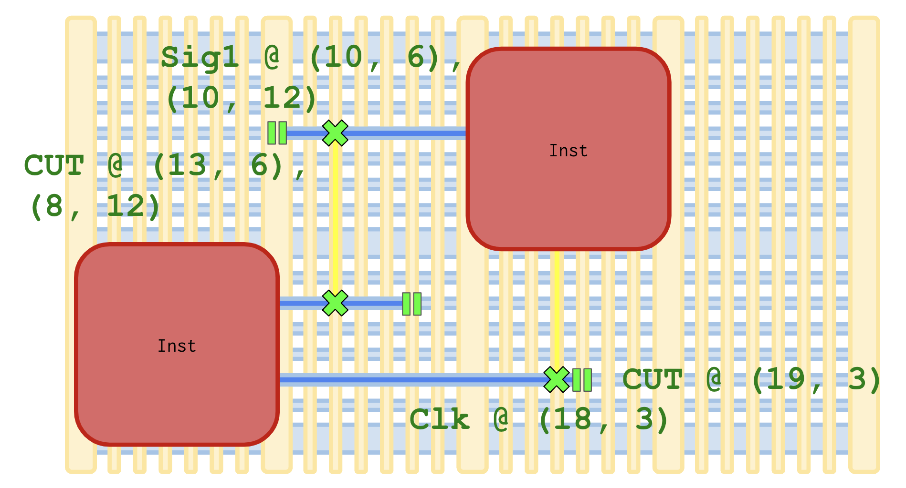

### `Tetris` Blocks

"Tetris" blocks are named as such because they can be built of a limited set of shapes and sizes. These include a set of rectilinear shapes similar (but not equal) to the set of convex rectilinear polygons. Shapes with "holes" are disallowed, as are those with concave "inlets". Figure~\ref{fig:tetris-shapes} shows example valid and invalid tetris block shapes. 


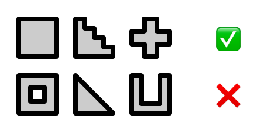

These allowable block-shapes are designed in concert with Tetris's connection model and semantics. Ports are placed on an integer-indexed track grid, on one of four edges (top, bottom, left, right). The rules for allowable block shapes ensure that the combination of an edge and an (in-range) track index always resolve to a unique and identifiable port location on the boundary of the cell.

In addition to being of constrained rectilinear shapes, each Tetris layout includes implicit "blockage" throughout its x-y outline area, and from its topmost z-axis layer down. Each block therefore owns the entirety of its internal volume; no "route-through" is permitted.

These rules reduce the space of allowable block-level shapes and outlines, to the benefit of a substantially streamlined connection model and set of semantics. Tetris layouts are built atop a background z-axis `Stack`, conceptually analogous to that of popular digital PnR tools, or to the content of popular technology-LEF data. Each `Stack` principally defines a set of routing and via layers and rules there-between. Routing is always unidirectional per layer; all layers are annotated as either horizontal or vertical. Adjacent routing layers are always of orthogonal routing direction.

The combination allows for each Tetris connection to be specified as a small set of integer values. Tetris blocks have three allowable categories of locations for ports:

- On the edge of an internal layer, specified by its layer index, a track index, and an enumerated `Side` (top, bottom, left, or right)
- On the edge of their z-axis top-layer. These ports include a track index, but also an indication (in terms of tracks) as to how far into the body of the block the port extends.
- Inside the x-y outline of the block, on its z-axis top layer. These ports are specified as a series of (x, y) track-valued tuples.

A simplified version of the union-type which defines each Tetris port:

```rust
pub enum PortKind {
    /// Ports which connect on x/y outline edges
    Edge {
        layer: usize,
        track: usize,
        side: Side,
    },
    /// Ports accessible from bot top *and* top-layer edges
    /// Note their `layer` field is implicitly defined as the cell's `metals`.
    ZTopEdge {
        /// Track Index
        track: usize,
        /// Side
        side: Side,
        /// Location into which the pin extends inward
        into: (usize, RelZ),
    },
    /// Ports which are internal to the cell outline,
    /// but connect from above in the z-stack.
    /// These can be assigned at several locations across their track,
    /// and are presumed to be internally-connected between such locations.
    ZTopInner {
        /// Locations
        locs: Vec<TopLoc>,
    },
}
```

Figure~\ref{fig:tetris-port-locs} schematically captures the valid locations, for a block with a vertical layer N and horizontal top layer N+1.

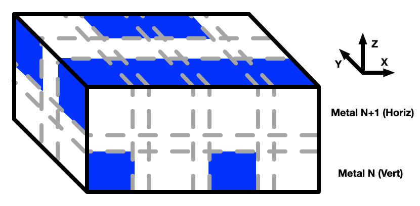

Tetris routing is similarly performed through the specification of a series of integer track indices. Tetris layout implementations principally consist of:

- Instances of other `Placeable` objects. These include `Instance`s of other layout-abstracts, two-dimensional `Array`s thereof, and named, located `Group`s of instances
- `Assignment`s affixing net labels to track-crossings
- `Cut`s to the track grid

Simplified `tetris::Layout`:

```rust
pub struct Layout {
    /// Cell Name
    pub name: String,
    /// Number of Metal Layers Used
    pub metals: usize,
    /// Outline shape, counted in x and y pitches of `stack`
    pub outline: Outline,

    /// Placeable objects, primarily instances
    pub places: Vec<Placeable>,
    /// Net-to-track assignments
    pub assignments: Vec<Assign>,
    /// Track cuts
    pub cuts: Vec<TrackCross>,
}
```

A compilation step transforms these comparatively terse tetris-block objects into the discrete geometric shapes of layout21's `raw` data model.

### Tetris Placement

Each relative placement consists of:

- A `to`-attribute, the referent `Placeable` object to which the relative placement is made. This can be an `Instance`, `Array`, `Group`, or similar.
- The `Side` at which it is placed, relative to `to`. Sides are enumerated values including top, bottom, left, and right.
- Alignment, which can be any of (a) any of the values of `Side`, (b) center, or (c) a pair of port names. The latter is particularly valuable for streamlined routing of high-value signals.
- Separation in each of three dimensions. The x and y dimensions are specified in terms of either (a) a number of primitive pitches in the dimension, (b) a physical distance, specified in the stack's units, or (c) the size of another cell. (Z dimension separation is used for routing, and is specified in terms of a number of layers.)

A simplified version of tetris's relative placements:

```rust
pub struct RelativePlace {
    /// Placement is relative `to` this
    pub to: Placeable,
    /// Placed on this `side` of `to`
    pub side: Side,
    /// Aligned to this aspect of `to`
    pub align: Align,
    /// Separation between the placement and the `to`
    pub sep: Separation,
}

pub struct Separation {
    pub x: Option<SepBy>,
    pub y: Option<SepBy>,
    pub z: Option<isize>,
}

pub enum SepBy {
    /// Separated by distance in x and y, and by layers in z
    Dist(Dist),
    /// Separated by the size of another Cell
    SizeOf(Ptr<Cell>),
}

pub enum Align {
    /// Side-to-side alignment
    Side(Side),
    /// Center-aligned
    Center,
    /// Port-to-port alignment
    Ports(String, String),
}
```

Each `RelativePlace` depends upon one of more other `Placeable` objects via its `to` field. Each `Placeable` may be placed either relative to another (via a `RelativePlace`) or in absolute coordinates, in terms of the primitive pitch grid (via an `AbsolutePlace`). The tetris placement resolver takes as input a series of `Placeable` objects and transforms each `RelativePlace` into a resolved `AbsolutePlace`. Its first step is ordering a dependency graph between `Placeable`s. This graph must be acyclic for placement to be valid. It must include at least one `AbsolutePlace` to serve as a "root" or "anchor" element. The resolver does not produce fully-relative placements, e.g. by assigning an arbitrary location (such as the origin) to one. Designer input must include at least one absolute placement.

### Tetris-Mos Gate Array Circuit Style

In a co-designed circuit style, all unit MOS devices are of a single geometry. Parameterization consists of two integer parameters: (a) the number of unit devices stacked in series, and (b) the number of such stacks arrayed in parallel. The core stacked-MOS cells are physically designed similar to digital standard cells, including both the active device stack and a complementary dummy device. This enables placement alongside and directly adjacent to core logic cells, and makes each analog layout amenable to PnR-style automation. Figure~\ref{fig:tetris_stack} shows the tetris-MOS layout style in the SkyWater 130 open-source technology. 

Figure~\ref{fig:tetris_circuit} depicts its use in a simple amplifier design.  

\setkeys{Gin}{width=.5\linewidth}

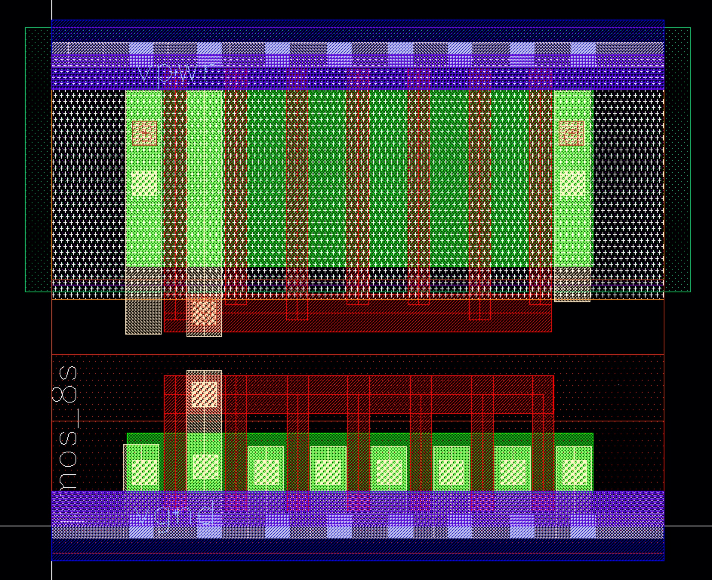


This style of MOS circuit design has often been called the _gate array_ style, in reference to its regular pattern of identical devices. The style is much more common and popular in digital circuits than in analog ones, in which device lengths are commonly varied as a tactic to enhance analog performance metrics, e.g. intrinsic gain. 

The gate array style is however of great value to programmed layout contexts. Allowances for arbitrary primitive-level device geometry can be incorporated in principle, but tend to push an even greater burden onto user-level programs to manage physical device dimensions. This also heavily constrains user-programs capacity for process portability. Many libraries in the space, Tetris included, instead use an approach dictated by regular grids and regular primitive-device sizes. Commonly the gate-dimension grid is set to the minimum gate pitch, or a similar pitch as used by digital circuits. 

Regaining the key analog performance metrics of longer-channel MOS devices is then achieved through _gate stacking_. This approach recognizes the deep similarities between MOS transistors of, for example, length L, versus a series combination of ten transistors of length L/10. In most classical MOS models, especially at analog-domain current-densities (i.e. far less than the saturation current), the two are functionally identical. Modern device-engineering techniques make them less identical, but in many cases the series-stack no less good. (And in many cases, better.)

The combination of regular gate-array device sizes and gate stacking is central to Tetris's programmed-custom model. It is also central to the analog layout-compilation methods detailed in \autoref{chap:analogpnr}.

\setkeys{Gin}{width=.75\linewidth}


# Compiled (Analog) Layout
\label{chap:analogpnr}

Attempts to compile analog and otherwise "custom" circuit layout are far from new. Research and commercial efforts have included both analog circuit _synthesis_, e.g. from high-level specs or other terse descriptions, as well as netlist to layout compilation. Here we focus on the latter. And we note the popular "digital way" of producing layout has (a) the same form as the analog-layout compilation problem: from an input circuit netlist and technology info, produce a layout implementation, and (b) has ubiquitously succeeded. To make digital IC layout is essentially synonymous with using automatic PnR. 

The vast gulf in success between digital and analog layout automation begs a core question: why does PnR work for digital, but fail for analog?


## Why does PnR work for digital, but fail for analog?

First, PnR compilers typically target _synchronous_ digital circuits, in which a fixed-frequency clock "heartbeat" synchronizes all activity. This circuit style is sufficiently ubiquitous to often be rolled into the common usage of the term "digital circuits". Synchronous circuits offer a simple set of criteria for the circuits' success or failure: each of its _synchronous timing constraints_ must be met. Such timing constraints come in two primary flavors:

- _Setup time constraints_ dictate that each combinational logic path complete propagation within the clock period. This generally manifests as a _maximum_ propagation delay through any combinational path.
- _Hold time constraints_ demand that each path completes outside of the state elements' "blind windows", during which they are subject to errant sampling. This generally manifests as a _minimum_ propagation delay through any combinational path.

In an important sense for the optimization required in PnR, each and every digital circuit boils down to something like Figure~\ref{fig:static-timing}. Signal trajectories, commonly called _arcs_, include an initial "launch" state element (shown here as a flip-flop), a combinational logic path, and a final "capture" state element (which also generally serves as the launch element for a further path). 

\setkeys{Gin}{width=.75\linewidth}
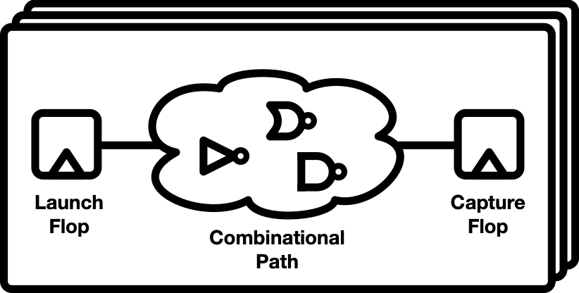

This _timing closure_ problem is parameterized by a small set of numbers - principally the clock period and a few parameters which dictate logic-cell delays (power-supply voltage, process "corner", etc.). Several other parameters, such as skews throughout the clock network, inject second-order effects.

Second, timing closure has been proven to be efficiently computable, particularly via _static timing analysis_ (STA). While transistor-level simulation scales incredibly poorly to million-transistor circuits, the combination of synchronous digital logic and STA avoids it altogether. In the STA methodology, the largest circuit which needs direct transistor-level simulation is the largest standard logic cell. Generally this is on the order of the size of a flip-flop, or a few dozen transistors. Each element of the logic-cell library is characterized offline for delay, setup and hold time, and any other relevant timing metrics. These results are summarized in (typically tabular) _static timing models_ which capture their dependence on key variables such as capacitive loading or incoming transition times.

With these timing model libraries in tow, STA's evaluation of timing constraints boils down to:

- A graph-analysis stage, determining the set of paths between all state elements, and
- Simple arithmetic for totaling up each of their delays.

Both have proven scalable to large circuits.

Third, these delays have easily computable surrogates. In a common example, layout placers often use total wire length - i.e. the sum of distances between connected elements - as a quality metric for placements. Other such layout-driven quantities such as specific paths' lengths, metal layer selections, and driver sizes have direct, well-understood effects on delays, and can be optimized for in a layout-compiler.

In summary:

#. Synchronous logic offers a very straightforward set of pass/ fail measures;
#. Static timing analysis offers an efficient means of computing those measures;
#. Readily available surrogates for STA quantities offer _even more_ efficient means of estimating those quantities
#. All of those same methods apply to _all synchronous digital circuits_.

Contrast this with analog circuits:

#. Virtually no two circuits have the same set of success and failure metrics;
#. Transistor-level simulation is the sole means of evaluating those metrics;
#. Even the production of simulation collateral and metric extraction is highly circuit and context-specific

In short: fail across the board. Analog circuits have no "analog" (ahem) to STA which applies universally and establishes a common success criteria. Each circuit must instead be evaluated against its own, generally circuit-specific, set of criteria. The success or failure of a comparator, an LC oscillator, and a voltage regulator each depends on wholly different criteria. 

These criteria also generally lack any efficient surrogates. Their success can generally only be evaluated through transistor-level simulation. Such simulations scale poorly with the number of circuit elements, quickly requiring hours to complete on feasible contemporary hardware. Moreover their efficiency is dramatically reduced by the inclusion of _parasitic elements_, the very layout information that a PnR solver is attempting to optimize. Including a sufficiently high-fidelity simulation model for making productive layout decisions generally means requiring extensive runtimes. Embedding such evaluations in an iterative layout-optimizer has proven too costly to ever be deployed widely. Machine learning based optimizers such as BagNET [@bagnet] use a combination of wholesale removal of layout elements (i.e. "schematic level" simulations) and lower-cost surrogate simulations (e.g. a DC operating point standing in for a high-frequency response) to evaluate design candidates.


## Ramifications for Analog PnR

Lacking such a global and universal optimization goal has one central ramification: successful analog PnR must be fed with more targeted and instrumental goals as replacements. Goals of symmetry across desirably matched devices are a common example. Targets for specific wire resistances or RC time constants can be another. Needing to break the solver's targets into constituent sub-problems requires two related processes to succeed: 

- First, someone or something must make this breakdown. Some amount of automation is possible. The ALIGN [@kunal2019align] and MAGICAL [@chen2020magical] projects particularly focus on netlist graph analysis to infer suitable goals for device matching and differential-ness of signals and instances. Automatic inference of signal priority - e.g. the often orders-of-magnitude difference in importance between the highest and lowest priority signals in an analog circuit - is more difficult. Typically this must instead be delegated as a task for the designer. 
- Second, the solver must be able to simultaneously solve all of these constituent subproblems. In many cases they will be highly negatively correlated. Contention for routing resources, e.g. to reduce resistance or RC time constant, is an obvious example. 

Several knock-on problems then follow. It is difficult to confidently produce a set of constraints for part (1) which assures a design of meeting its parametric goals. (*Provably* doing so, with real devices and technologies, is nearly hopeless.) The solver may, perhaps frequently, find solution-corners in which the sub-problems are solved, but their constituent goal is not. Much of the process of designing these sub-problems is then likely taken offline. Instead of specifying "wire X must have a resistance of less than 10 ohms", a designer might perform some offline analysis of her own and specify "please route wire X on the highest metal layer available". 

Notably the majority of the constraint and goal languages of popular digital PnR flows are much more like the latter statement. Except for the central optimization goal and parameter - closing timing at the specified clock rate - constraints tend to be much more procedural. "Place clock buffer A at location (X,Y)" is far more common than, for example, "place clock buffer A at a point which equalizes its input and output wire delays". Popular digital PnR supports thousands of such distinct constraints. Seemingly all would or could also be relevant for analog circuits. Plus analog circuits have a large space of constraints and goals of their own, often concerning goals for matching or symmetry. 


## Semi-Related: PnR of Digital Logic "Standard Cells"

Analog PnR has a semi-analogous sister problem: creation of the _cell libraries_ used by the digital PnR flow. The digital flow relies on the availability of a library of logic gates which can execute the core combinational logic functions (e.g. NAND, NOR, INV), sequential data storage (e.g. flip-flops and latches), and often more elaborate combinations thereof (e.g. and-or-invert operations or multi-bit storage cells). Common practice is to design these circuits, or at least their layouts, "the analog way", in graphical, polygon-by-polygon mode.

These cells are highly performance, power, and area constrained, and accordingly provide highly challenging design-rule optimization problems in designing their layouts. This effort is highly leveraged. Like the bit-cells of widely used SRAM, the most core standard logic cells are reused billions, sometimes trillions of times over.

Modern standard cell libraries are large, often comprising thousands of cells. Modern designs also commonly require a variety of such libraries (or at least one even larger library) to make trade-offs between power, area, and performance. One set of cells may consistently choose a higher-performance, higher-power, higher-area design style, while another makes the opposite trade-off on all three. Mixing and matching of these library level trade-offs often cannot be done within a single design macro, or the output of a single PnR layout generation, as libraries making varying trade-offs often feature mutually-incompatible physical designs, e.g. different cell-height "pitches". The aforementioned low-area library may be designed to a regular pitch of X, while the high-performance library to a pitch of Y, where X / Y is not a rational number (or at least not a convenient value of one). There has therefore been a longstanding desire to produce standard cell layouts more automatically, i.e. leveraging PnR-like techniques.

This problem has many analogies to the analog PnR problem. Standard cells are principally comprised of individual transistors, which often feature a diverse set of complex design rules, highly difficult to _a priori_ encode into a solver. The two problems also differ in important respects, particularly those of incentives and intent. The desire for maximal area and power efficiency of standard cells drives a highly optimized design style. This is generally paired with a similarly stringent optimization criteria for producing their layouts. Techniques such as (mixed) integer linear programming ((M)ILP) are often deployed, e.g. in [@ryzhenko2012] and [@bonncell], to produce layouts which provably optimize goals such as minimum area or maximum transistor-diffusion sharing. The downside is, this scales poorly with circuit size, and is not especially fast even for small circuits. As noted in [@gupta98ilp], ILP based placement "implicitly explores all possible transistor placements". Recently research including [@nvcell] has proposed machine learning techniques to aid in searching these spaces.

Analog layouts also have several key differences. Perhaps most importantly, each analog circuit layout tends to be "more custom", less amortized over vast numbers of instances created by the PnR flow. Each is often custom tuned to its environment, e.g. an op-amp that is in some sense general-purpose but whose parametric design is highly tuned to its specific use case.

Moreover, these circuits often lack such clear optimality goals. Perhaps more important, even if they do have such a goal - e.g. that for "perfect" symmetry - solutions which achieve these optima are often fairly evident to designers knowledgeable of the circuit. In other words, the effort of the optimizer - which tends to be _slow_, for all but the smallest circuits - tends to go to waste. Where a standard-cell placer can, or at least is more likely to, find counterintuitive solutions that can be proven superior, analog PnR is much less likely to do so. Even when it does, it generally must meet another, highly inscrutable optimality constraint: the opinion of its analog designer.


## `ALIGN`

Analog PnR has been a subject of several recent research efforts, many spurred by DARPA's [CRAFT](https://www.darpa.mil/program/circuit-realization-at-faster-timescales) initiative. The MAGICAL [@chen2020magical] and ALIGN [@kunal2019align]) projects have been among the most prominent examples. [ALIGN](https://github.com/ALIGN-analoglayout/ALIGN-public) is an open-source analog PnR engine, authored by researchers at Intel Labs, the University of Minnesota, and Texas A\&M University. It expressly targets the automation of four broad classes of circuits: low-frequency classical analog, wireline transceivers, wireless transceiver components, and power delivery components. It is implemented in a combination of Python and modern C++. 

Like MAGICAL, ALIGN began with the goal of producing layout from existing, un-annotated circuit netlists. This goal was in part aimed for porting between technologies. It quickly developed a JSON-format constraint schema to aid in this process, offering a second designer-input to inform layout generation. ALIGN's constraint schema includes facilities to: 

- Create virtual hierarchy, referred to as `Group`s. Instances within each group are placed with near each other with increased priority. Matched or differential forms use popular placement styles such as common-centroid. 
- Dictate placement `Symmetry` between instances, which may include instances of virtual-hierarchy `Group`s
- Set relative placement between instances, via constraints to `Order` their locations, `Align` (ahem) them on a particular edge, or combining several such constraints into a `Floorplan`
- Request particular metal layers for routing of a given signal
- Request that a given signal be routed on more than one of ALIGN's routing tracks, reducing its resistance and RC time constants

And many more. 

In addition to PnR, ALIGN performs two related tasks inline: 

- First, a set of PnR constraints is inferred from graph analysis of the circuit netlist. Inferred constraints primarily include those for matching and symmetry between devices. 
- Second, primitive device layouts are generated inline. Each ALIGN PDK provides a set of Python-language parametric layout generators for each primitive device (e.g. transistor) it supports. These primitive-generators are invoked inline during PnR. Each uses the programmed-custom layout style to produce a detailed (hopefully) DRC-compliant layout from a terse set of device parameters. This is similar to the approach deployed by BAG, which similarly executes Python-based primitive-level layout generators inline with broader user "generation" code. It differs from the approach of Layout21 and digital PnR, both of which require primitive-level layouts be pre-produced before PnR is to begin. 

Our own research team has long had a valuable partnership with Intel. Recent BWRC research has included IC designs for computer architecture, SERDES, wireless transceivers, and more implemented in Intel's process technologies, primarily the popular 16nm FinFET. The same technology was used for the 2022 and 2023 editions of the educational chips described in [@burnett2018] and [@guo2023osci]. This partnership was largely how this work came to consider analog PnR, and particularly PnR through ALIGN. The 16nm FinFET ALIGN "PDK" developed by the Intel team serves as a central ingredient. 


## `AlignHdl21`

Perhaps in part through realizing many of the difficulties in analog PnR, Berkeley-based efforts in custom layout automation have largely used the programmed-custom style. The BAG project serves as a primary example. A combination of user-level adoption of BAG and firsthand design of layout21 made the challenges of this style clear. Foremost, programmed-custom layout is extremely complex and verbose, especially to produce routing. 

Motivated in part by those challenges, we decided to give analog PnR a fresh look. Rather than attempting to begin a new PnR engine from scratch, it pairs with and layers atop ALIGN. Having an analog HDL embedded in a modern programming language serves as an ideal place to integrate HDL content with the layout-related metadata required to drive PnR. Figure~\ref{fig:hdl21-pnr} schematically illustrates `AlignHdl21`'s operation. 

\setkeys{Gin}{width=\linewidth}
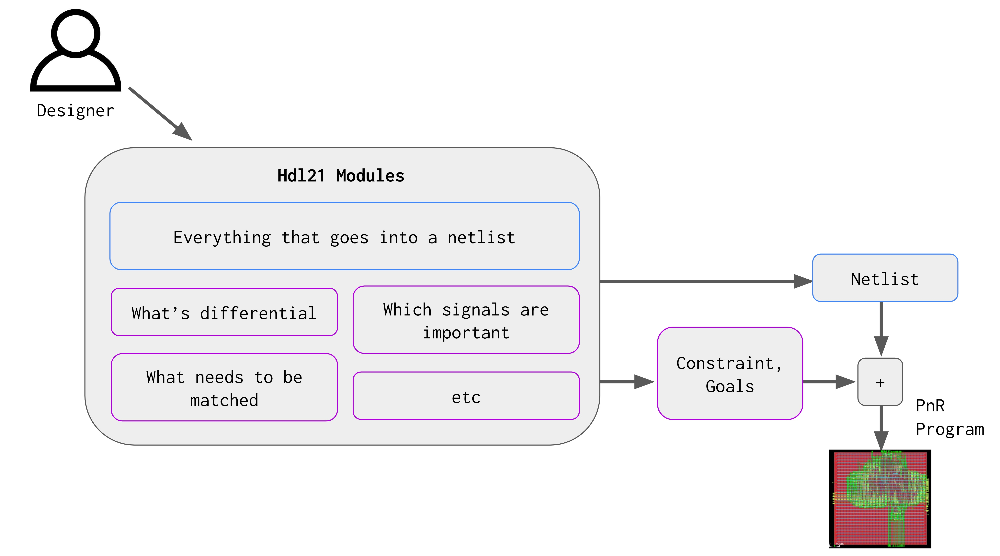

The core input to `AlignHdl21`-driven PnR is (creatively) named `PnrInput`. Each includes:

- An Hdl21 `Module`,
- An optional, associated `Placement`, covered in the next section, and 
- An optional list of `Constraint`s. Each is essentially a Python-native version of ALIGN's JSON-native constraints. 

Figure~\ref{fig:alignhdl21-strongarm} and its associated code excerpt shows an example `Module`, `Placement`, and `PnrInput` designed to produce layout for the popular StrongArm comparator circuit. 

```python
@h.module
class StrongArm:
  VDD, VSS = h.PowerGround()
  inp, out = 2 * h.Diff()
  clk = h.Input()

  pclk = params.pclk(g=clk, s=VDD, b=VDD)
  pinp = h.Pair(params.pinp)(...)
  plat = h.Pair(params.plat)(...)
  nlat = h.Pair(params.nlat)(...)
  nrst = h.Pair(params.nrst)(g=clk, d=cross)
  nout = h.Pair(params.nout)(g=cross, d=out)
  pout = h.Pair(params.pout)(g=cross, d=out)

placement = ah.Placement(
  ah.Column(
    rows=[
      StrongArm.pclk,
      StrongArm.pinp,
      StrongArm.plat,
      StrongArm.nlat,
      StrongArm.nrst,
      StrongArm.nout,
      StrongArm.pout,
    ],
  )
)

ah.PnrInput(
    module=StrongArm,
    placement=placement,
    constraints=[ah.ConfigureCompiler()],
)
```

\setkeys{Gin}{width=0.3\linewidth}
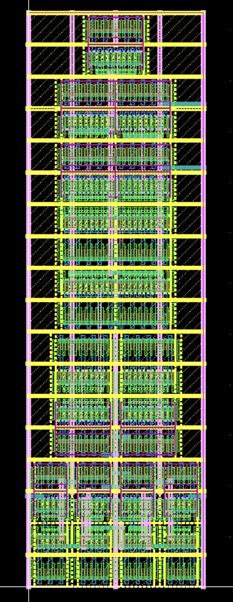


### Placement

AlignHdl21's `Placement` dictates relative instance placements in a format similar to popular GUI programming frameworks. Each placement is a nested series of rows and columns. The root element of each placement is either a single row or single column. Within each row (column), each entry can be: 

- Any of the target module's instances. This includes scalar `hdl21.Instance`s as well as its `InstanceArray`s and `InstanceBundle`s, most prominently the differential `Pair`, or
- A name-based reference to any of these, or to any of the elements of the virtual hierarchy which can be constructed through ALIGN's `Group` functionality, or 
- A nested column (row)

Figure~\ref{fig:alignhdl21-placement1} schematically illustrate the placement scheme. Each of the leaf-level elements are Hdl21 instances which map to ALIGN primitive "generators" ^[Adding an N+1th definition for the term] or instances of other child modules. 

Figure~\ref{fig:alignhdl21-placement2} shows a column-based such placement. 

Figure~\ref{fig:alignhdl21-placement3} further highlights the capacity for nesting among placement entities. Each row consists of a set of entities which may themselves be nested columns, which may in turn include nested rows. The leaf-level nodes in this graph are Hdl21 instances, or name-based references to instances.

\setkeys{Gin}{width=0.5\linewidth}
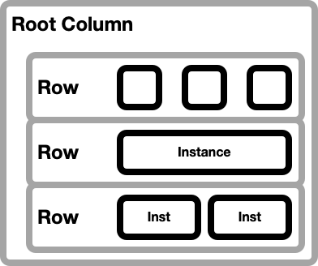

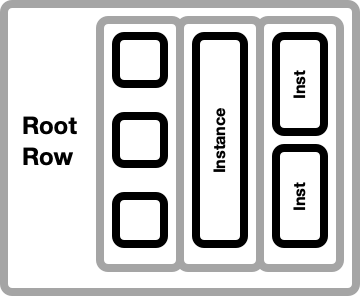 

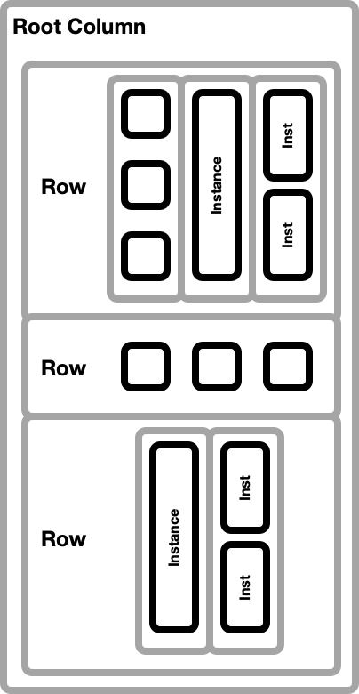

While ALIGN provides both automatic placement and routing, most AlignHdl21 modules tend to explicitly dictate placement and rely solely on its routing facilities. This is for two primary reasons. First, transistor-level analog circuits aren't all that hard to place. Designers tend to have a reasonable ideas of what placements suit their circuit and application. This is especially true when placement can be stated concisely and intuitively, such as by AlignHdl21's `Placement` constructs. Often circuits are designed with particular pitches in mind, or with desired sides and locations in mind for module ports. 

Second, for all but quite small circuits, the ILP-based placement strategy used by ALIGN can be pretty slow. This time feels particularly poorly spent on circuits for which the designer has a reasonably placement in mind. Attempts at making use of an alternate analytical placer proved unsuccessful. Such a strategy, which more closely mirrors common tactics used by digital PnR, would seem more amenable to larger analog circuits than ILP. 


### Elaboration

ALIGN performs PnR hierarchically. Parent circuits may instantiate sub-circuits which are themselves outputs of the same PnR process. These child circuits require the same set of PnR constraints and guidance as any other, including their parents. 

AlignHdl21 transforms a single `Module` into this hierarchical input via two of Hdl21's "pro-mode" features: custom elaboration, and `Properties`. Hdl21 `Modules`, `Instances`, and most other compound HDL objects support a form of schema-expansion via a `Property` system. Each property is a mapping from a string-valued key to a value, which may be any valid object. Hdl21's internals do not inspect, type-check, arrange, or in any way constrain what can be stored in `Properties`. These decisions are left to the application (or higher-library-level) using Hdl21. Properties are not exported in any form, not to netlists, or to simulations, or to VLSIR. They are generally intended to be application-specific additions to the HDL data model; each is confined to use within its application.

Properties are accessed through a `get`/ `set` API, or through the native Python `dict` style square-bracket indexing. Properties are not namespaced or in any other way reserved between user-libraries. Their names must be globally unique, or they risk collisions. Convention dictates that each library setting properties uses keys of the form `{{libname}}.{{propname}}`, where `libname` is the library name, and `propname` is the unqualified name of the property. 

AlignHdl21 uses this property system to affix each `PnrInput` to its target `Module`. 

```python
class PropNames:
    # Names of `h.Module` properties 
    pnr_input: ClassVar[str] = "alignhdl21.pnr_input"
    constraints: ClassVar[str] = "alignhdl21.constraints"

@dataclass
class PnrInput:
    module: h.Module
    placement: Optional[Placement] = None
    constraints: Optional[List[data.Constraint]] = None

    def __post_init__(self):
        # (This runs after each instance is created,
        # like a custom constructor.) 
        # Give our `Module` a reference to us as a `Property`.
        if PropNames.pnr_input in self.module.props:
            raise ValueError(...)
        self.module.props.set(PropNames.pnr_input, self)
```

Hierarchical `PnrInput` is then extracted from each `Module` by recursively and hierarchically traversing its instances, looking for `PnrInput` on each. This utilizes both the `Properties` extension system and the hierarchy-walking data model traversals common for Hdl21 PDK compilers. 

```python
class PnrWalker(h.HierarchyWalker):

    def __init__(self):
        self.pnr_inputs: List[PnrInput] = []
        self.done: Set[h.Module] = set()

    def visit_module(self, module: h.Module) -> h.Module:
        if module in self.done:
            return module  # Already done

        # Collect its `PnrInput` if it has one
        pnr_input = module.props.get(PropNames.pnr_input)
        if pnr_input is not None:
            self.pnr_inputs.append(pnr_input)

        # And continue with the data model traversal.
        for inst in module.everything_instance_like:
            self.visit_module(inst.of)

        self.done.add(module)
        return module
```

Here `PnrWalker` recursively collects a dependency-ordered list of `PnrInput`. The first element of this list is, by definition, the initial "root" `Module`. 

Extraction of PnR constraints from natively-annotated `Modules` is slightly more complicated. Some of the HDL objects which produce constraints do not exist at the beginning of Hdl21 elaboration - e.g. the signals expanded from nested `Bundle` definitions. Other HDL objects exist at the beginning of elaboration, but not by its end - e.g. those `Bundle` instances themselves. AlignHdl21 operates on both, by defining a custom `Elaborator` and two elaboration-passes - one intended to be run at the beginning of each elaboration, and another designed to be run at its end. 

```python
class EarlyPass(ElabPass):

    def elaborate_module(self, module: h.Module) -> h.Module:
        # Check for a `PnrInput` property. If lacking one, we're done.
        pnr_input = module.props.get(PropNames.pnr_input)
        if pnr_input is None:
            return module

        # Collect its `PnrInput` into a list of `Constraint`s.
        constraints: List[data.Constraint] = []
        
        for ib in module.instbundles.values():
            if isinstance(ib, h.Pair):
                # Transform each differential `Pair`
                # into `Group` and `Symmetric` constraints

        if pnr_input.placement is not None:
            # Transform `placement` into a further list of constraints
            elaborate_placement(pnr_input.placement, constraints, ...)

        # ...

        # Add the constraint-list as a new property
        module.props.set(PropNames.constraints, constraints)

        # And send it back
        return module
```

The `Early` elaboration pass operates on Hdl21's user-facing data model, including bundles of signals and instances. It accordingly is responsible for producing most constraints related to symmetry and grouping. It also translates the potentially nested `Placement`, which frequently refers to these compound HDL objects, into a series of corresponding placement constraints. 

The `Late` elaboration pass receives near-fully elaborated HDL data, in which most compound objects have been compiled out. It is primarily responsible for attributes affixed to each `Signal` - e.g. routing requirements, pin locations, and "usage" intents for power, ground, and clock signals. Many of these objects do not exist at the time the `Early` pass executes, particularly those produced from bundles and from implicit connections. 

Hdl21 elaboration is frequently invoked by other internal processes, outside direct user control. Invoking SPICE simulation and exporting VLSIR are common examples. It supports custom elaboration in these contexts by exposing a global, module-scope elaborator, which user-level code may override. AlignHdl21 does so to enable its constraint-extraction elaboration.

```python
# Set up our custom hdl21 elaboration.
# Designed to be run at import-time. 
# Order of passes: 
# - Our `EarlyPass`
# - Most other default elaboration
# - Our `LatePass`
# - The final default step
#
default_passes = Elaborator.default().passes
passes = [EarlyPass] + default_passes[:-1] + [LatePass] + [default_passes[-1]]

# Create our elaborator, and set it as the global default
set_elaborator(Elaborator(passes))
```

This highlights a limitation of Hdl21's custom elaboration model: custom elaborators don't generally work together. A single `Elaborator` processes a design hierarchy at a time. One global such elaborator is used by default, and by most embedded elaboration-calls not directly invoked by users. A theoretical library incorporating both AlignHdl21 and some other custom elaboration activity would need to integrate the two itself. To date, no such combination has been designed. 

### Compilation to Simulation and Physical Verification 

For FinFET technologies including Intel 16nm, ALIGN uses a combination of gate-array layout style and gate-stacking similar to that described in \autoref{chap:progcustom}. Each "unit" FinFET is of identical length. Schematic and netlist-level transistors then layer a "stack spec" parameter combination, in which an integer number of copies of the unit FinFET can be arrayed in either parallel or series. Devices use the common nomenclature for parallel unit-transistors, "number of fingers" or `nf`. Series connected devices use a (less common) `stack` parameter. 


```python
@h.paramclass
class AlignFinFetParams:
    nfin = h.Param(dtype=int, desc="Number of Fins", default=4)
    m = h.Param(dtype=Optional[int], desc="Multiplier", default=None)

    # "Stack spec". At most one can be specified.
    # If neither are specified, defaults to `nf=1`.
    nf = h.Param(dtype=Optional[int], desc="Parallel fingers", default=None)
    stack = h.Param(dtype=Optional[int], desc="Series stacks", default=None)
```

These are the devices and parameter-spaces against which most AlignHdl21 generators are written. But they, and particularly their `stack` series-connections parameter, lacks compatibility with several key verification programs: notably SPICE simulation and LVS. 

Here Hdl21's notion of compiling into target PDKs comes in handy. Modules for simulation and LVS are produced by a PDK compiler which adds an enumerated `Context` target. Valid contexts include ALIGN PnR, spice simulation, and LVS. (The latter two also have subtle differences in their understanding of the PDK devices.)

```text
Context = ALIGN | LVS | SIM
```

A dedicated PDK compiler then translates ALIGN-compatible modules into either of the other two contexts. 

```python
class Walker(h.HierarchyWalker):

    def visit_external_module_call(
        self, call: h.ExternalModuleCall,
    ) -> h.Instantiable:
        """ Visit an `ExternalModule`, potentially replacing it. """
        if call.module not in the_align_modules or context == Context.Align:
            return call  # Unchanged
        return self.replace_mos(call) # Replace it
        
    def replace_mos(self, call: h.Instantiable) -> h.Instantiable:
        """ Replace a PnR compatible transistor
        with one compatible with `context` """
        # (Here excerpting only the portion for LVS.)

        if params.stack is None:
            # Parallel Case.
            # Return the unit `ExternalModule` with an `nf` parameter.
            # Make a few other parameter-space conversions first
            params = intel16_hdl21.MosParams.convert(call.params)
            # Get the right (external) module
            module = lvs_modules(call.module)
            # And return the combination
            return module(params)

        # Series Stack Case
        # Call our `Stack` generator to array those out.
        unit_params = intel16_hdl21.MosParams.convert(call.params)
        stack = Stack(unit=lvs_modules(call.module), nser=params.stack)
        # `Stack` also uses stuff that needs to be elaborated out. 
        h.elaborate(stack)
        return stack
```

A paired `Stack` generator produces a series-stack of `nser` identical unit transistors. `Stack` accepts its unit transistor module as a parameter (i.e. it uses a control inversion parameter) to allow MOS stacks of any technology or PDK. Notably these include the simulation and LVS-compatible versions of the target technology. 

```python
@h.paramclass
class StackParams:
    unit = h.Param(dtype=h.Instantiable, desc="Unit Transistor Device")
    nser = h.Param(dtype=int, desc="Number series stacked")

@h.generator
def Stack(p: StackParams) -> h.Module:
    """# Stack Generator
    Create a series-stack of `nser` identical `unit` devices."""

    # Create the result module, with a Mos-set of ports
    m = h.Module()
    m.d, m.g, m.s, m.b = deepcopy(h.MosPorts)

    # Create the internal source-drain signals
    m.i = h.Signal(width=p.nser - 1)

    # Create an instance array of `unit` devices
    m.units = p.nser * p.unit(
        # Primary "stacking action" goes down right here
        s=h.Concat(m.s, m.i),
        d=h.Concat(m.i, m.d),
        # Parallel connections
        g=m.g,
        b=m.b,
    )

    # And return the result
    return m

```

Hdl21's embedding of hardware generation-code among its background compilation processes allows for the creation of modules such as `Stack` inline. The AlignHdl21 PDK compiler does so for each instance of an ALIGN-compatible series-stacked FinFET which it must convert into an LVS or simulation-compatible replacement. 

This sort of re-use across compilation targets was a central goal of the Chisel and FIRRTL projects. In their case, output targets tend to be digital implementation platforms: FPGAs, ASIC back-end flows, or RTL simulation models. In Hdl21 they are process technologies, or as in this case, subsets of models within a process technology targeting different verification tasks.


# Applications

## Neural Sensor ADC in Intel 16nm FinFET

Among its first real-world uses, the combination of Hdl21 and ALIGN were deployed in the design of a ring oscillator (RO) based ADC intended for neural sensing applications, designed in Intel's 16nm FinFET technology. 

Ring oscillator based converters operate based on the voltage or current frequency-dependence of a tunable oscillator. The ADC's primary input is directed to the RO control terminal, modulating its frequency. The oscillator output is then sampled and its frequency is measured, generally by an all-digital frequency detector. RO-ADCs have previously been used for low-area, low-cost sensors, such as for intra-SoC voltage, temperature, and device aging measurements. Their footprints are often substantially smaller than most alternate architectures. They are also highly digital integration friendly, often being made solely of the same standard-cell-style logic transistors as the SoC's digital logic. 

Like many biological sensors, neural sensors are designed to be implanted in a human body. They are accordingly stringently power-constrained. A ring oscillator is therefore not necessarily an obvious fit (at least to me). However contemporary and forthcoming research has shown they have particular utility when designed in concert with dynamic digital back-ends, which rely on their analog front-end's capacity to rapidly change power-performance trade-offs, including entering extremely low-power states. (This work is, in a sense, a part of its design process.) ROs cleanly and straightforwardly enable these transitions. While ring oscillators are generally highly non-linear, a variety of techniques have proven sufficient to produce ADC resolutions in excess of 10b, sufficient for the neural application. 

Figure~\ref{fig:ro-adc-block} schematically depicts the ADC. It is comprised of a pseudo-differential pair of sub-ADCs, each of which includes the RO, a phase-sampling comparator array, and a input resistor network through which the input modulates the RO's control terminal. Careful selection of the input resistor network was shown in [@nguyen2018adc] to provide cancellation of second-order oscillator non-linearity, a vital performance enhancement. Each of the ADC components is designed to operate at extremely low voltage. Its digital core operates at a nominal 500mV, while the analog front-end and oscillator itself runs at 300mV.

\setkeys{Gin}{width=.75\linewidth}
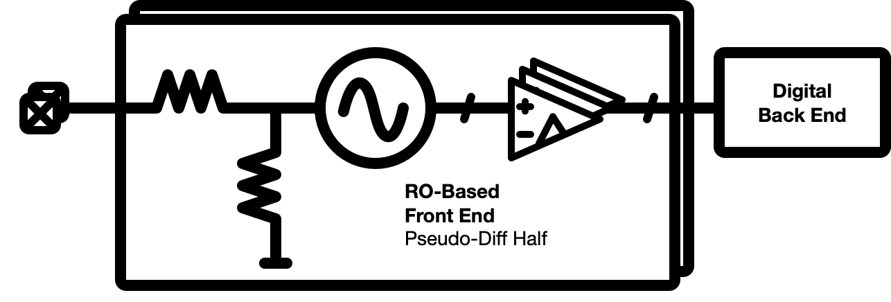

Figure~\ref{fig:adc-chip-layout} shows the test chip layout. It includes:

* Three single-ended sub-ADCs (at left, nearer top) with varying configurations of ring oscillator
* A VCO break-out section with bias current DAC (at left, nearer bottom)
* A prototype digital back end (at right)

\setkeys{Gin}{width=\linewidth}
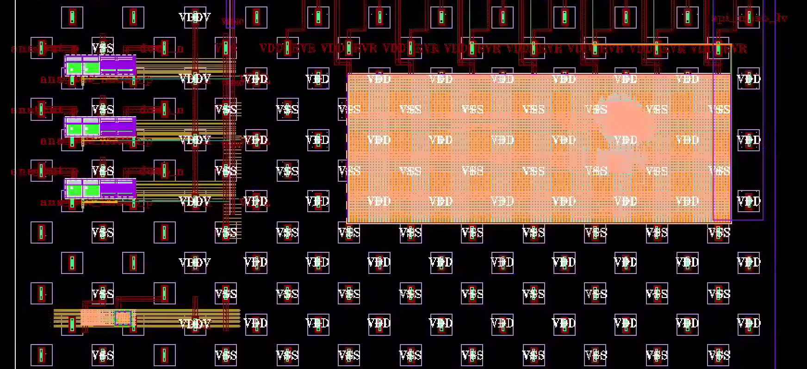

Figure~\ref{fig:adc-vco1-layout} shows the VCO breakout section, including the core ring oscillator (at bottom left), bias current DAC (at top left), output level shifters and drivers (at left), and associated ESD protection (at right). 

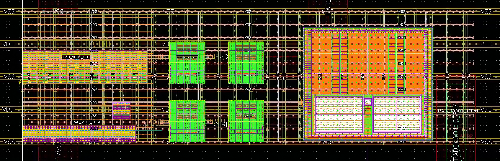

Each of the test chip's key circuits are generated from the combination of Hdl21 and ALIGN. Top-level assembly is done "the analog way", via a popular graphical custom layout editor. 

### Excerpted ADC Circuits

Each oscillator is comprised of a ring-connected set of pseudo-differential delay stages. Stages use a common, weighted combination of CMOS inverters in forward propagation and positive feedback configurations to ensure differential operation. 

```python
@h.paramclass
class RoStageParams:
    uinv = h.Param(dtype=h.Instantiable, desc="Unit Inverter")
    ratio = h.Param(dtype=int, desc="Fwd/Cross Ratio", default=4)

@h.generator
def RoStage(params: RoStageParams) -> h.Module:
    """# Pseudo-Diff Ring Oscillator Stage """

    @h.module
    class RoStage:
        # IO
        TOP, BOT = h.PowerGround()
        NWELL, PSUB = h.PowerGround()
        inp = h.Diff(port=True, role=h.Diff.Roles.SINK)
        out = h.Diff(port=True, role=h.Diff.Roles.SOURCE)

        # Internal Implementation
        ## Cross-Coupled Output Inverters
        cross = h.Pair(params.uinv)(i=out, o=h.inverse(out), ...)
        ## Forward Inverters
        fwd_p = params.ratio * params.uinv(i=inp.p, o=out.p, ...)
        fwd_n = params.ratio * params.uinv(i=inp.n, o=out.n, ...)

    # Create PnR placement
    placement = ah.Placement(root=ah.Row(cols=[
        RoStage.fwd_p, RoStage.cross, RoStage.fwd_n
    ]))
    ah.PnrInput(module=RoStage, placement=placement, ...)
    return RoStage
```

Like most of the ADC's circuits, the RO stages are designed to be process portable through the use of control inversion parameters. A separate technology-specific invocation program applies PDK-compatible devices as parameters to these generators. 

The `RoStage`  unit inverter module `uinv` is arrayed twice in positive feedback and two times a parametric coupling `ratio` in the forward configuration. In each oscillator the value of this `ratio` is set four.

ADC sampling is performed by an array of dual-tail comparators (or "sense amps", or DTSAs). 

```python
@h.generator
def Dtsa(params: Params) -> h.Module:
    """# Dual Tail Sense Amp"""

    @h.module
    class Dtsa:
        # IO
        inp = h.Diff(port=True, role=h.Diff.Roles.SINK)
        clk = h.Diff(port=True, role=h.Diff.Roles.SINK)
        out = h.Diff(port=True, role=h.Diff.Roles.SOURCE)
        VDD, VSS = h.PowerGround()

        # Implementation
        mid = h.Diff()
        ntail, ptail = 2 * h.Signal()

        # Input Stage
        tailn = params.tailn(d=ntail, g=clk.n, ...)
        ninp = h.Pair(params.ninp)(d=h.inverse(mid), g=inp, s=ntail, ...)
        pload = h.Pair(params.pload)(d=h.inverse(mid), g=clk.n, ...)

        # Output/ Latch Stage
        tailp = params.tailp(d=ptail, g=clk.p, s=VDD, b=VDD)
        plat = h.Pair(params.plat)(d=h.inverse(out), g=out, s=ptail, ...)
        nlat = h.Pair(params.nlat)(d=h.inverse(out), g=out, ...)

        # Forwarding between the two
        nfwd = h.Pair(params.nfwd)(d=h.inverse(out), g=mid, ...)
    
    return Dtsa
```

A complete comparator (or "slicer", in more serial-link terms) combines such a sense amp with an SR latch. 

```python
@h.paramclass
class SlicerParams:
    sa = h.Param(dtype=h.Instantiable, default_factory=Dtsa)
    sr = h.Param(dtype=h.Instantiable, default_factory=SrLatch)

@h.generator
def Slicer(params: SlicerParams) -> h.Module:
    """# Slicer"""

    @h.module
    class Slicer:
        # IO
        VDD, VSS = h.PowerGround()
        inp = h.Diff(port=True, role=h.Diff.Roles.SINK)
        out = h.Diff(port=True, role=h.Diff.Roles.SOURCE)
        clk = h.Diff(port=True, role=h.Diff.Roles.SINK)

        # Internal Implementation
        ## Slicer
        sa = params.sa(inp=inp, clk=clk, VDD=VDD, VSS=VSS)
        ## SR Latch
        sr = params.sr(inp=sa.out, out=out, VDD=VDD, VSS=VSS)

    # Create some PnR input
    ah.PnrInput(
        module=Slicer,
        placement=ah.Placement(root=ah.Column(rows=[Slicer.sa, Slicer.sr])),
        constraints=[ah.ConfigureCompiler()],
    )
    return Slicer
```

The overall ADC is built of a pseudo-differential pair of instances of half-ADCs. Each single-ended half-ADC is in turn comprised of a ring of oscillator delay stages, each coupled with a phase-sampling comparator, plus an input bias resistor divider which drives the ring's control terminal.

```python
@h.generator
def RoAdcHalf(params: RoAdcParams) -> h.Module:
    """# RO ADC Half
    One side of the pseudo-differential RO ADC."""

    @h.module
    class RoAdcHalf:
        # IO
        VDD, VSS = h.PowerGround()
        inp = h.Input()
        clk = h.Input(desc="Sampling Clock")
        samp = h.Output(width=params.nstg, desc="Sampled Output")

        # Implementation
        res = params.input_res(inp=inp, VSS=VSS)
        # This `Ring` is a little different from the one above;
        # it has both the delay stages and comparators inside.
        ring = Ring(params)(
            clk=clk, ctrl=res.out, VDD=VDD, VSS=VSS, samp=samp
        )

    ah.PnrInput(
        module=RoAdcHalf,
        placement=ah.Placement(
            ah.Column(rows=[RoAdcHalf.res, RoAdcHalf.ring])
        ),
    )
    return RoAdcHalf


@h.generator
def RoAdc(params: RoAdcParams) -> h.Module:
    """
    # RO-Based ADC
    The top-level pseudo-differential combination of two `RoAdcHalf`s.
    """

    @h.module
    class RoAdc:
        # IO
        VDD, VSS = h.PowerGround()
        inp = h.Diff(port=True, role=h.Diff.Roles.SINK)
        clk = h.Input(desc="Sampling Clock")
        samp_p, samp_n = 2 * h.Output(width=params.nstg)

        # Implementation
        halves = h.Pair(RoAdcHalf(params))(
            inp=inp, clk=clk, samp=h.bundlize(p=samp_p, n=samp_n), ...
        )

    ah.PnrInput(
        module=RoAdc,
        placement=ah.Placement(
            root=ah.Column(rows=[RoAdc.halves.p, RoAdc.halves.n])
        ),
    )
    return RoAdc
```


## Machine Learners Learning Circuits 101

Recent research and commercial EDA has begun to deploy machine learning techniques throughout the IC design process. Perhaps the most prominent such example is [@mirhoseini2021graph]. ^[Although a combination of follow up research [@cheng2023assessment], prominent [news reporting](https://www.nytimes.com/2022/05/02/technology/google-fires-ai-researchers.html) and [industry publications](https://spectrum.ieee.org/chip-design-controversy) cast doubt upon some of its claims. I for one find the _[Stronger Baselines](http://47.190.89.225/pub/education/MLcontra.pdf)_ rebuttal article, which remains only pseudo-published for... reasons... quite compelling.] These techniques are also a prominent research frontier for circuit optimization. Prominent work has demonstrated reinforcement learning for optimizing transistor-level circuits ([@autockt]), and translation between both simple and detailed simulations, and between simple versus detailed circuit details (e.g. schematics versus layout) ([@bagnet]). 

A central challenge throughout these courses of research has been assembling teams of collaborators with the requisite combination of skills and interests in two somewhat disparate fields - circuits and machine learning. Each has a fairly deep silo and set of domain-specific knowledge and practice. Figure~\ref{fig:cktgym-motivation} schematically depicts these two silos. 

\setkeys{Gin}{width=\linewidth}
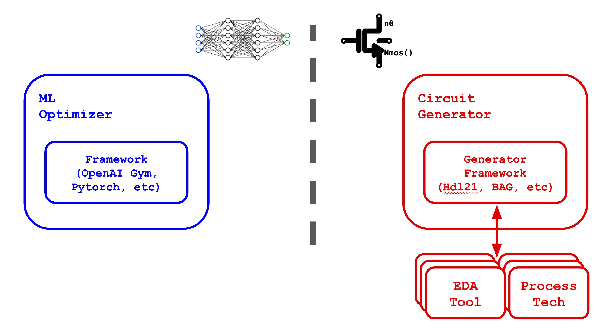

The frontiers of machine learning research have expanded at a rapid pace, both enabling and enabled by a proliferation of high productivity open-source frameworks such as PyTorch [@pytorch] and TensorFlow [@abadi2016tensorflow]. ML has also been demonstrated to be of great utility across a wide range of domains. Image recognition, text recognition, and large language model based natural language actors serve as prime examples. Machine learning researchers accordingly have a broad menu of domains towards which to direct their efforts. 

Circuits are not the easiest such domain. Much of the requisite knowledge is confined to a comparatively small number of people. Perhaps more impactfully, IC research is both highly laborious to set up (complex toolchains with tons of specialty jargon), and worse still, highly access-controlled. Advanced process technology is the most tightly guarded ingredient. Recent years have increasingly made silicon PDKs (and lack of sharing them) a topic of worldwide public policy. Fabs have acted accordingly. 

This combination of challenges, plus the opportunities afforded by VLSIR, motivated the design of the  [`CktGym`](https://github.com/BWRC-AMS-ML-Discovery/BwrcAmsMlDiscovery) distributed framework. CktGym and its core `Discovery` gateway libraries are schematically depicted in Figure~\ref{fig:cktgym}. CktGym breaks the circuits-ML research infrastructure into three distinct components: 

- A _circuit server_, which defines a set of circuit generator program endpoints, and exposes them via HTTP, 
- One or more _ML client_ programs. Each performs optimization on one or more of the circuit-server's generator endpoints. 
- The intervening gateway library, used by both client and server, is provided by `Discovery`. Centrally this defines a remote procedure call (RPC) style interface between client and server.

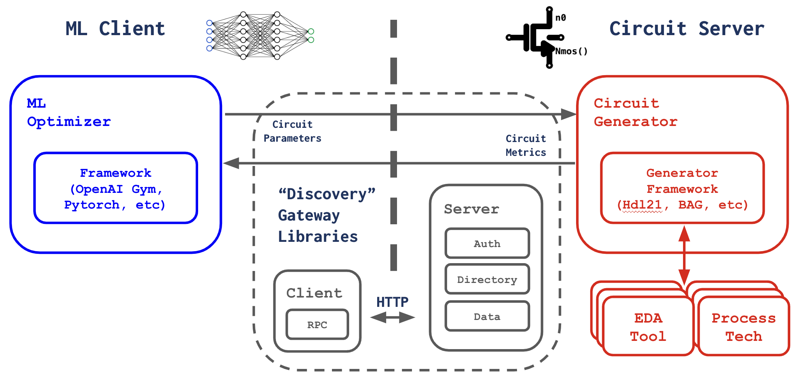

Each is designed as a Python library, easing integration with most (really, all) popular ML frameworks, and with circuit frameworks including VLSIR and BAG. 

On one level, CktGym's motivations mirror those of ProtoBuf and similar markup language projects. Circuits-ML programs are "too big", less in an overall complexity sense, and more in that of having two disparate sub-programs. CktGym decouples and distributes the two, defining an interface in serializable form via JSON and/ or ProtoBuf over HTTP. 

Each use-case of `CktGym` generally breaks down in three: 

- One long-running program implements the server. This uses the `Discovery` libraries to service HTTP requests and translate them into native Python objects. Instance-specific code then translates them into circuit generation problems, and passes them along to the generator frameworks. These server libraries generally run on machines with access to the requisite silicon process technologies and EDA software, or on machines which can directly access others which do. 
- A library enables client-side ML optimization. This uses `Discovery`'s RPC via HTTP client for querying the circuit-server. It also commonly integrates its machine learning (or other optimization model) framework of choice. 
- A shared package commonly defines the interactions between the two. This is generally a fairly small set of information, including the names and addresses of the server endpoints, and schema for the argument and return values of each endpoint. 

Like HTTP, the `CktGym` interface is stateless. Each server request is provided with a set of circuit-parameters, and returns a corresponding set of results or metrics. Commonly the former serves as the parameters to a circuit-generator program, i.e. specifying device sizes, and the latter indicates simulation-based metrics, i.e. summaries of SPICE simulation results. No other imposition is made upon the circuit-server endpoints, e.g. the level of detail of circuit they analyze (schematic vs layout based), the underlying tools they use, the underlying process technology, or anything else. 

As of this writing, two such `CktGym` instances are in operation on UC Berkeley's research infrastructure. One is designed to be fully open-source, making use of the freely available NGSPICE (a continuation of the Berkeley SPICE project). This instance primarily recreates the reinforcement learning based methods of [@autockt], deploying them to a new and wider array of circuit optimizations. It uses an unfabricatable (fake) "PDK" similar to that used by the open-source version of AutoCkt. The second instance makes use of `AlignHdl21` to produce, extract, and simulate layout on-demand, in Intel's 16nm FinFET technology. 


### Example Power of Circuit "Expert Knowledge"

A common premise in ML-for-circuits research has been optimization of circuit _parameter vectors_, which commonly map directly onto the device parameters of a typical circuit netlist. Figure~\ref{fig:folded_opamp} shows an example such transistor-level circuit. This folded-cascode, "rail to rail" dual input op-amp consists of 26 transistors. A common approach would be to optimize this as a 26N variable problem, in which N parameters of each transistor are elements in the vector. In a common implementation N is equal to one, the width of each transistor, while all other device parameters are fixed. An ML-based optimizer operating directly on its device widths therefore needs to jointly optimize these 26 variables. Operating on more complex device sizes (e.g. including length or segmentation in addition to unit width) further multiplies this space.

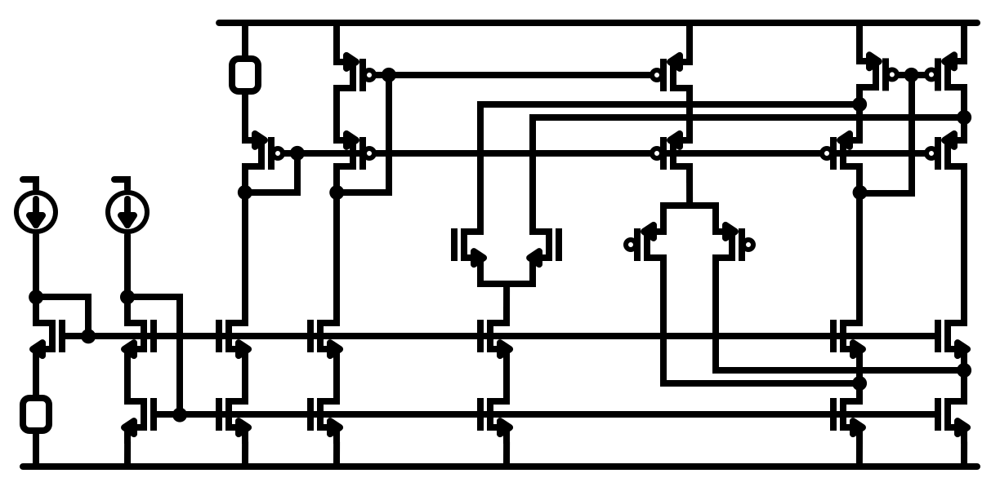

A common and valuable view of this circuit for sake of understanding and learning its operation breaks it into descriptive, functional sub-sections. Figure~\ref{fig:folded-opamp-sections} illustrates a common such breakdown into four sections: one each for the two input stages, one for the output stage, and a peripheral, biasing stage. 

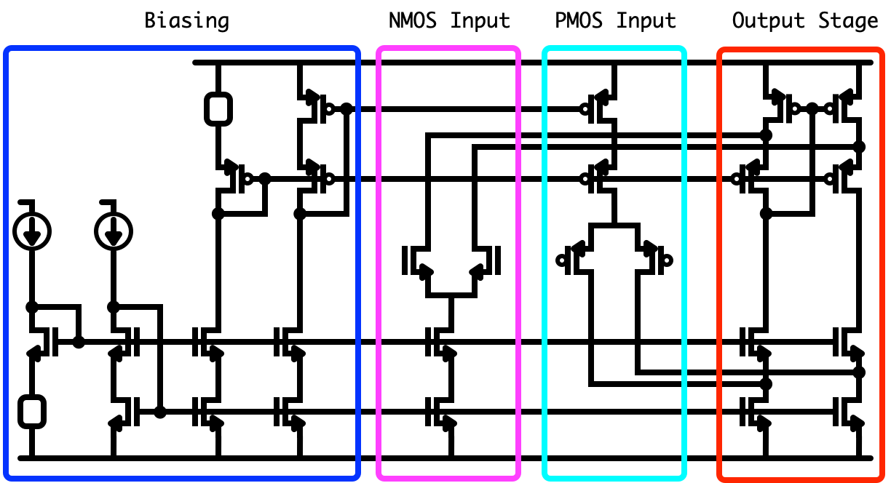


While the view of figure~\ref{fig:folded-opamp-sections} is powerful for understanding, it is not as valuable for design. Veteran designers of such circuits recognize they are (a) not making 26 independent device sizing decisions, and (b) not designing four independent sub-sections. 

This latter distinction largely hinges on the qualifier _independent_. This circuit and most others in the classical analog genre operate based on device matching between pairs and groups of ostensibly identical transistors. This tactic pairs with both signaling schemes - primarily the prominence of differential signals in on-die contexts - and with surrounding needs such as replica-current biasing. Figure~\ref{fig:folded-opamp-better} groups the op-amp's devices into these matched sub-groups.

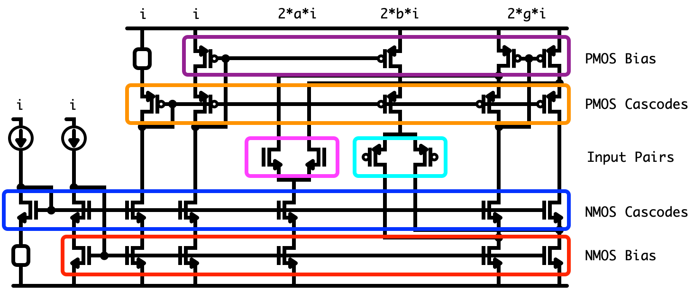

In total, the rail to rail op-amp in fact includes only six unique unit devices:

- The input pair,
- The bias current sources, and
- The cascodes
- Each in NMOS and PMOS flavors

These devices are then scaled by integer current ratios, for each input pair (herein referred to as `alpha` and `beta` respectively), and to the output stage (`gamma`). Across each current branch, current _density_ across each group of devices is fixed; a branch with Nx the current also has Nx wider transistors. Several bias-current branches which do not directly dictate the circuit performance are fixed to the input unit current `ibias`. The two input current sources are also fixed to identical current values equal to `ibias`.

These relationships are relevant for both human and ML designers. Embedding this "expert knowledge" reduces the parameter space from 26 (the number of devices) to 9: six to set unit device sizes, plus the three current ratios. If more detailed parameterization of the unit devices is desired (e.g. to set their length as well as width), this advantage grows similarly.

```python
@h.paramclass
class FcascParams:
    # Unit device sizes
    nbias = h.Param(dtype=int, desc="Bias Nmos Unit Width", default=2)
    pbias = h.Param(dtype=int, desc="Bias Pmos Unit Width", default=4)
    ncasc = h.Param(dtype=int, desc="Cascode Nmos Unit Width", default=2)
    pcasc = h.Param(dtype=int, desc="Cascode Pmos Unit Width", default=4)
    ninp = h.Param(dtype=int, desc="Input Nmos Unit Width", default=2)
    pinp = h.Param(dtype=int, desc="Input Pmos Unit Width", default=4)

    # Current Ratios
    alpha = h.Param(dtype=int, desc="Pmos Input Current Ratio", default=2)
    beta = h.Param(dtype=int, desc="Nmos Input Current Ratio", default=2)
    gamma = h.Param(dtype=int, desc="Output Current Ratio", default=2)
```

```python
@h.generator
def Fcasc(params: FcascParams) -> h.Module:

    # Multiplier functions of the parametric devices
    nbias = lambda x: nmos(m=params.nbias * x)
    ncasc = lambda x: nmos(m=params.ncasc * x)
    ninp = lambda x: nmos(m=params.ninp * x)
    pbias = lambda x: pmos(m=params.pbias * x)
    pcasc = lambda x: pmos(m=params.pcasc * x)
    pinp = lambda x: pmos(m=params.pinp * x)

    # Give these some shorter-hands
    alpha, beta, gamma = params.alpha, params.beta, params.gamma

    @h.module
    class Fcasc:
        # ...

        ## Output Stack
        pbo = h.Pair(pbias(x=gamma + beta))(...)
        pco = h.Pair(pcasc(x=gamma))(...)
        nco = h.Pair(ncasc(x=gamma))(...)
        nbo = h.Pair(nbias(x=gamma + alpha))(...)

        ## Input Pairs
        ## Nmos Input Pair
        nin_bias = nbias(x=2 * alpha)(...)
        nin_casc = ncasc(x=2 * alpha)(...)
        nin = h.Pair(ninp(x=alpha))(...)
        ## Pmos Input Pair
        pin_bias = pbias(x=2 * beta)(...)
        pin_casc = pbias(x=2 * beta)(...)
        pin = h.Pair(pinp(x=beta))(...)

    return Fcasc
```

It is possible, and in fact likely, that given sufficient effort machine learning agents will "learn" this domain knowledge for themselves. There are many such hard-won insights - the entire concept of differential signaling and matched devices; how these devices are identified by connection; the fact that each input pair should probably be of identical size. How much learning effort this will take, remains to be seen. 

# Future Work
\label{chap:future}

All of the software presented in this manuscript is publicly available in open-source form under the permissive Berkeley BSD license. ^[Save for the parts with proprietary third-party dependencies, e.g. silicon process technologies.] ^[AlignHdl21 is, as of this writing, entangled in such a dependency. This will be unwound, and it will be freely available, soon, at https://github.com/dan-fritchman/AlignHdl21.] Handfuls of like-minded researchers and practitioners have adopted its various pieces, often while they remained work in progress. These real-world use-cases, and particularly those of our own research designs, motivated countless invaluable improvements and changes of direction over time. 

As open-source projects they are living artifacts. Hdl21 and VLSIR are the most mature, and operate as the most "real" open-source projects of the bunch, with tactical [issue tracking](https://github.com/dan-fritchman/Hdl21/issues), consistent test pipelines, automatic test-coverage reviews, and many other common tools of popular open-source projects. Most importantly they have attracted a subset of user-contributors outside their original authors who have volunteered their time, thoughts, and code-contributions. These updates will continue. This manuscript will serve as a snapshot in time of these projects' state as they inevitably mature away from it. Potential future directions for the Hdl21 schematics system are discussed in \autoref{section:schematic-directions}. 

Layout remains more open-ended. A central takeaway from this work has been that the best way to do custom layout is "it depends". There has been only one successful model - "the analog way". That may remain the case through the end of the silicon-era roadmap. While this work explored the programmed-custom and analog PnR attempts at its replacement, I suspect there is an even more valuable combination of the two to be had. The methods of ALIGN have proven invaluable for transistor and primitive level layouts. Higher-level circuits such as data converters, transceivers, or PLLs demand a more hierarchical design process. This applies both to their physical design and to their verification. Such a combined workflow could include: 

* Layout21's `Tetris` style blocks, with enumerable port locations on the edges of their filled, fully-blocked 3D innards
* Analog PnR designing the innards of each, provided with target specs, outlines, and port locations
* An available combination of automatic and programmatic routing between them
* A fluid combination of code-based and graphical entry means, such as those afforded by Hdl21 and its paired schematic system, for "floorplanning" and divvying up these subproblems
* Feedback including the _difficulty_ of each subproblem. This can include both circuit-level metrics (e.g. what fraction of area allocated was required, did a given signal have enough metal resources to have sufficient bandwidth) and execution-level metrics (e.g. the runtime of the inner-block PnR)

This would require a handful of new components including the graphical floorplanning facilities, and updates to the analog PnR process to allow designer-fixed outlines and port locations. 

Elsewhere in layout, there is a dark art that went little-discussed in our relevant chapters: the crafting of low-level, design-rule-compliant primitive device layouts. BAG calls these its _primitives_, while many other popular environments call them _programmatic cells_ or _p-cells_ for short. I have not seen what I would regard as an easy, or automatic, or good way to create these cells. BAG produces them through a combination of process-portable Python code and highly detailed YAML-format markup describing each technology. ALIGN and most popular custom design environments do so through process-specific code. In ALIGN these "generators" are Python modules. Layout21's Tetris takes an approach more akin to that of digital PnR. It is agnostic as to the source of low-level primitive cells, and even to their contents. It solely operates on their abstract views, manipulating them essentially as outlines and located ports. The low-level implementations are commonly either designed "the analog way" (via GUI) or in programmed-custom style, e.g. using Layout21's `raw` layer. 

This effort to produce technology-specific low-level layouts is reasonably well amortized, across all of the devices created in the combination of technology and framework. Nonetheless it remains a significant burden to _starting_ to use a new framework in a new technology. It was only for our research partnership with Intel, and for their authoring the initial 16nm ALIGN primitives, that we took a serious interest in ALIGN-based PnR. 

Creation of such cells is therefore a desirable facet of a process-portable framework. Ideally each could be crafted from as little bespoke content (markup, code, countless iterations through design-rule-checking programs) as possible, and instead leverage the existing PDK collateral for either digital or analog design. The popular analog design environments supported by popular commercial PDKs are an unlikely source. Their implementations are generally within proprietary, tied-in programming languages. More important, these implementations are often encrypted and unavailable to any but the source fab and target EDA platform. The digital flow's collateral may prove more useful. The primary design-rule input to digital PnR is a simplified set of DRC rules, often encoded in LEF format. ^[While we have discussed LEF for abstract-layout libraries, it is _also_ the most popular format for these streamlined design rules. The latter subset is often referred to as _tech-LEF_.] This may serve as more valuable guidance, at least to a certain level of details (e.g. determining suitable transistor pitches from those of the lowest-layer metals). The [BFG](https://github.com/growly/bfg) FGPA generator project, a founding and motivating use-case of the VLSIR framework, attempts to make similar streamlined design rules in VLSIR's protobuf schema. Automatic generation of such rules remains a future, valuable task. Doing so may prove a relevant space for ML-based exploration. 

The "cloud-era-ness" of VLSIR and its ProtoBuf-based underpinnings make the prospects of VLSIR-based web services a readily available possibility. The `CktGym` machine learning project serves as an initial example. Further candidates include prospective services for routing and physical verification (LVS, DRC). Perhaps the most mature such example is VLSIR's handling of SPICE simulation. VLSIR-driven SPICE simulation is designed through ProtoBuf's native `service` and `rpc` definitions, which define procedures callable on a (potentially) remote machine. This `Sim` RPC takes a single `SimInput` message - conceptually the content of a SPICE "deck" as input - and returns a `SimResult` message comprised of waveforms, measurements, and other simulation results. To date all invocations of the `Spice` service have been local, as function-calls within a VLSIR-based Python program. The structure of its design nonetheless affords a straightforward method to accept simulation requests from arbitrary programs and machines.

```protobuf
// # The SPICE Service
service Spice {
  rpc Sim(SimInput) returns (SimResult);
}

// # Simulation Input 
message SimInput {
  // # Circuit Input 
  // The DUT circuit-package under test 
  vlsir.circuit.Package pkg = 1;
  // Top-level module (name)
  string top = 2;
  // # Simulation Configuration Input 
  // List of simulator options
  repeated SimOptions opts = 10;
  // List of circuit analyses
  repeated Analysis an = 11;
  // Control elements. 
  repeated Control ctrls = 12;
}
// # Simulation Result 
// A list of results per analysis 
message SimResult {
  repeated AnalysisResult an = 1;
}
```

Our work in machine learning for circuit design, and the application of the framework presented here towards those ends, is among our least mature contributions. The space to be explored here is vast, as are its possibilities for improvements. A promising future direction is detailed in \autoref{section:ml-designers}.

## ML Designers
\label{section:ml-designers}

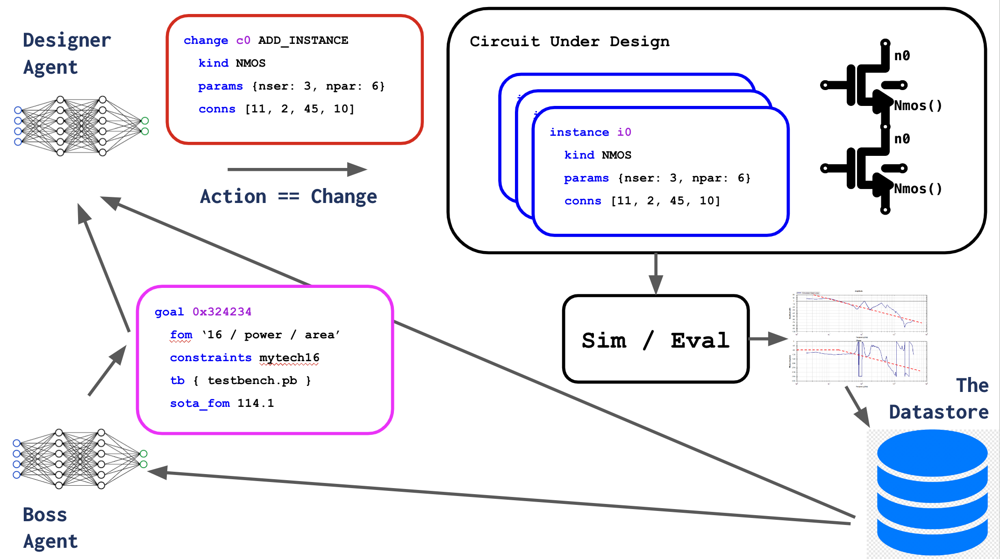

The combination of VLSIR and CktGym further motivate several new, early-stage directions in circuits-for-ML research. 

We begin by noting that in many works in this nascent area,  problem formulations are of the form: given a fixed circuit topology and fixed figure of merit, find optimum sizes for each device in the circuit. Moving a new circuit topology or new FOM generally requires an altogether new agent, each of which requires a training process many-times the length of its actual task. Attempts at transferring the learning derived from each circuit, where attempted, are generally limited to highly-correlated cases, such as the differences between schematic-based and layout-parasitic-annotated versions of the same circuit.

This is far from how human designers approach the task on several fronts.

- Human designers clearly learn to infer more complex circuits from simpler ones. Core analog building-blocks such as current mirrors form the basis of larger circuits of various shapes and sizes.
- Designers are commonly faced with similar design-tasks featuring similar goals, metrics, constraints, and/or technologies, and quickly learn to extrapolate between them. "Porting" of a circuit from one process-technology to another similar technology is a common example. Designers quickly come to recognize which technologies are "most similar", even if only dimly aware of any specific criteria for similarity. They similarly learn to extrapolate between metrics, i.e. trading off power for bandwidth, and other constraints such as area.
- Real design-efforts look less like optimizations. Each generally has constrained resources such as design-time and expertise. Their goals are not of the form "thou must find the optimal solution", but of "thou must find a solution better than X (and the more the merrier)".

In some respects the circuit framing is also forced onto the traditional machine-learning paradigm. The separation between "training" and "inference" is particularly strained. The notion of a discrete "training stage" is valuable in several machine-learning contexts:

- (a) Instances of supervised learning, in which a system is foreground-trained, then subsequently not updated while performing (hopefully many) much lower-cost inference-steps, and
- (b) Instances of transfer learning, for example of a neural-network-based robotics system trained in a physics simulator, then transferred into a physical robot.

Analogizing to human agents, these trained ML systems are like Olympic athletes. Their performance only matters a (sometimes quite small) subset of the time, i.e. on "game days". Once every four years they face a particularly high-leverage competition. The rest of their time is spent preparing for those big moments. Nothing tracks or cares about their performance on intermediate "training days", except inasmuch as it ultimately effects their game-day performance. Game-playing reinforcement-learning agents such as AlphaZero have similar constraints, again due to the dichotomy between "training time" versus "game time".

Most human jobs do not work like this. Janitors, for example, don't have "game days". They do janitor-ing every day. This work is in part premised on the circuit designer's task being more like the janitor than the Olympic athlete. There is no game-day for either; their contributions at any point in time count the same.

### Goals

We endeavor to produce an ML circuit designer which: 

- (a) Does not just provide device sizing for human-provided circuits, but designs circuits of its own.
- (b) Does so while inferring from related circuits, goals, and constraints.
- (c) Continuously improves upon state-of-the-art designs.
- (d) Accepts new goals and constraints from its human designers.

It includes:

- Programmable circuit goals, each of which includes a test suite, a scalar figure of merit, and a set of constraints, including both performance requirements (e.g. "max power 1mW") and availability constraints, e.g. the device-set available in a particular implementation technology.
- A comprehensive database of past goals, attempts, and their results.
- A designer-agent which edits and evaluates circuits through a discrete action-space.
- An overseeing "boss" which provides the designer-agent with a stream of circuit-goals

The designer-agent's performance is rewarded against a single metric: performance relative to the best existing figure-of-merit for the given goal. The designer-agent is therefore perennially incentivized to create "state of the art" circuits for each goal.

Separable notions of "training" and "inference" break down in this mold. Like the human-designer, the designer-agent sees no "game-day" to prepare for. Its circuit-inventions made on "training days" are just as valuable as any other. Both the designer-agent and boss (which may or may not be implemented as an RL agent) run online, indefinitely. Additional goals can be injected at any time, with priority dictated by the ultimate (human) boss.

The combination is designed to allow the designer-agent to learn along several axes:

- From simple circuits, e.g. current mirror
- From similar test suites, i.e. those for similar circuits
- From same test-benches, similar FOMs
- From similar technologies/ constraints

### The Designer-Agent and Her Environment

The designer-agent has a discrete action-space highly similar to that available to a human designer. It consists of four discrete actions:

- Add a device
- Change a port-connection, on a single device
- Change a parameter-value, again on a single device
- Evaluate the circuit, i.e. run simulations and determine its FOM

Each (but the last) has a small parameter-space:

- Adding a device is parameterized by a device-type, represented as an integer "device type ID".
- Each constraint-set, generally via an underlying implementation-technology component, includes a valid set of devices. Selecting an invalid device-type incurs the minimum reward, and does not modify the circuit.
- Changing a port-connection is parameterized by three integer values: (a) an instance reference, denoted as an index in the circuit component-list, (b) a port-reference, again represented as an integer, and (c) the net to be connected, again denoted as an integer, as common in SPICE-netlist-style representations. An invalid port-reference incurs the minimum reward, and does not modify the circuit.
- Changing a parameter-value has essentially the same three parameters: (instance, param (index), new value). Note this implies that all instance-parameters are integer-valued. An invalid parameter-index again incurs the minimum reward, and does not modify the circuit.
- The "evaluate" action has no parameters.

Using Rust-style algebraic-enum syntax, the designer's action-space then looks something like:

```rust
/// Type Alias for each Index-type
type Index = u8;

/// Designer-Agent's Action Space
enum Action {
 AddDevice(Index),
 Connect {
   instance: Index,
   port: Index,
   node: u8,
},
 SetParam {
   instance: Index,
   param: Index,
   value: u8,
},
 Evaluate
}
```

Actions are encoded similarly to how compilers commonly lay out tagged unions. An initial integer-value indicates the action-type, while remaining fields dictate their data. The designer action-space is therefore encodable as a four-integer tuple: one for the discriminant, and three for the parameters of the largest actions (`Connect` and `SetParam`). Actions with invalid discriminant-values incur the minimum reward, and do not modify the circuit.


### The Environment

The designer-agent's sole reward function is its circuit's performance relative to the state of the art for its task. Like the human designer, it has a wide variety of information to bring to bear in seeking this reward, and much more information it is either dimly aware of or altogether unaware of. The entirety of this universe, or _environment_ in RL terms, includes both the boss-agent and the comprehensive results database, covered in later sections. The designer-agent's directly observable subset of the environment includes:

- Its currently-designed circuit, as produced by its prior actions
- Simulation results for its most-recently simulated circuit
- A detailed representation of its current goal, including a circuit representations of the goal's testbenches, serialized representations of its constraints, generally in the form of mathematical inequalities, the serialized figure-of-merit evaluation routine, represented as an evaluation tree, and the state of the art circuit for its current goal.

Much more of the environment-information would be of use to the designer-agent, and may be worth adding to its observation-space. High-utility information may include:

- State of the art circuits for similar goals, i.e. those with near-identical constraints or figures of merit
- Results of its other past circuit evaluations

Expansion of the designer-agent's observable space is only constrained by its efficiency in making its own updates. Note that many more tangential relationships, such as "technology A is more similar to technology B than technology C", can in principle be learned into its network coefficients.

### The "Design Manager", or Boss-Agent

The designer-agent has a single objective: create the best circuit it can for a given goal. _Selecting_ these goals is outside her purview, and is the primary task of the "boss-agent". In our human-designer analogy the boss-agent serves as the "design manager", determining towards which goals designer-time should be dedicated, subject to a number of goals and constraints. 

The relationship between the boss-agent and designer-agent occurs in fixed-length design-attempts, or in RL terms, _episodes_. The boss-agent provides the designer-agent's goal and initial environment, potentially including a suggested circuit, e.g. from similar goals or similar constraints. This often, but not necessarily, is set identical to the state of the art circuit for the goal. The boss-agent then allows the designer a fixed number of actions to improve upon this circuit, then records the final design, its simulated results and figure of merit. These fixed-length "design sprints" pattern a human design environment. Where the human design-manager might assign "produce the best circuit you can in a month", the design-manager-agent assigns "produce the best circuit you can in N actions".

The boss-agent interacts with two long-accumulating datasets: the results database and goals database. Results are updated after sufficiently successful design-attempts, particularly those which near or exceed the prior state of the art. Prioritized goals are injected by the boss-agent's human designers, and eventually potentially by a larger design community.

The boss-agent's goal-selection is influenced by:

- Progress. Goals for which the designer-agent is improving upon the state of the art are prioritized as likely to incur further improvements. Goals for which improvement has stagnated are deemed more likely to have reached more fundamental constraints.
- Priority. The boss-agent interacts with a goal-database which can be updated at any time by its human-designers, or eventually by a larger design-community. Each goal is affixed with (human-dictated) priority-weighting and expectations. Realistically-set goal-expectations, in values of the goal's figure-of-merit, allow for the agents to escape local minima. Typical sources of these expectations would be from human-designed circuits. Priorities may be set in terms of these expectations, for example a fixed maximum priority-level until reaching the expectation, then a linearly-decreasing priority for further performance which exceeds it. An eventual community-driven model of these priority-weights might include expertise-driven (e.g. reputation-based) or market-based (e.g. auction) mechanisms for setting these weights.
- Comprehensiveness. Additional emphasis is placed on goals, figures of merit, and constraint-sets which have been least covered by past design attempts. A prime example is the injection of a new process-technology into the available set, and associated attempts to map each past goal into the technology.

The boss-agent also accepts human-designed circuits. Along with figure-of-merit expectations, such circuit-suggestions are a primary mechanism for the injection of human expertise. Each human-recommended circuit is quickly evaluated against any paired goals, and if improving upon the designer-agent's state of the art, quickly injected into its observed environment for those goals.

Both the designer-agent and boss-agent run continuously in a server-style mode. Their collective task is best interpreted not as one of optimization, but as one of improvement. No matter their perceived optimality of their circuit-designs to date, the boss-agent will continue identifying a highest-priority goal, and the designer-agent will continue to attempt to improve upon it.
